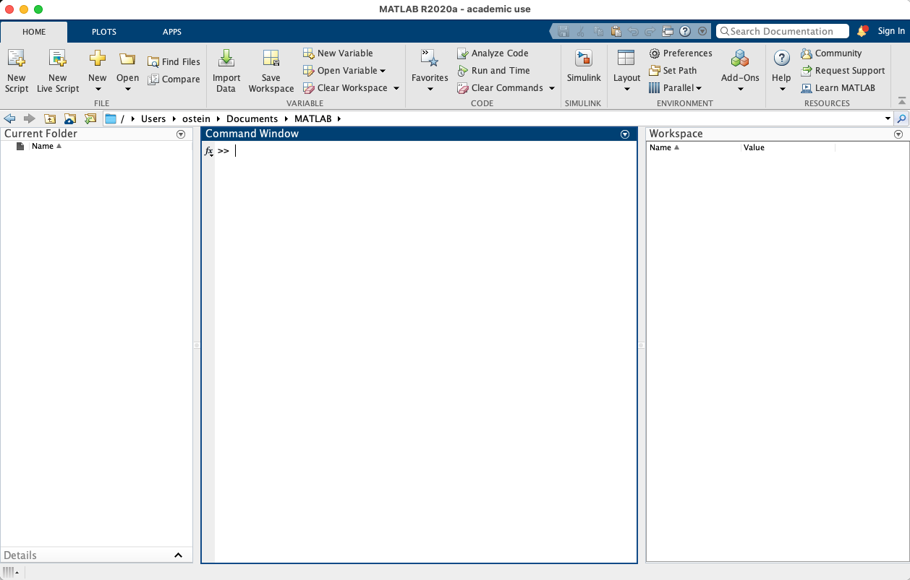
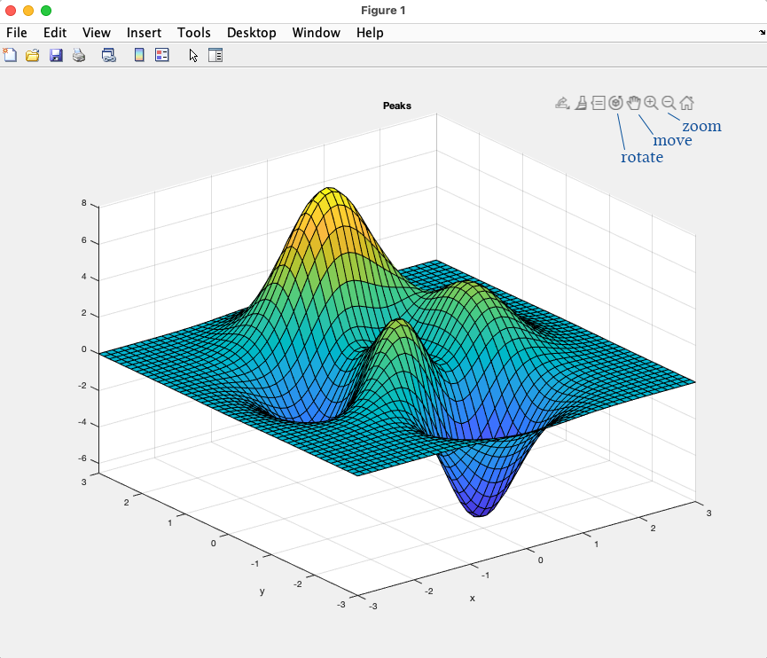

# Welcome to the Geometry Processing in MATLAB tutorial!

In this tutorial you will learn the very basics of geometry processing on
triangle meshes.
The tutorial assumes that you are already familiar with the basics of
calculus, linear algebra, and the very basics of programming.

This tutorial is meant to accompany the first day of
[SGI courses](https://geometryinstitute.mit.edu).
Of course, you can also complete the exercises independently of the course!


# Starting MATLAB and performing a few basic operations

In this very first exercise we will learn how to start MATLAB, and try a few
basic MATLAB commands.
Feel free to completely skip this section and go to
the next exercise if you are already very familiar with MATLAB.


## Starting MATLAB and verify that it runs correctly.

Start your MATLAB now.
You should be greeted by a screen that looks like this:


You can issue commands in MATLAB's interactive shell (which you have before you
now), and you can write functions and scripts as well.
_Throughout this tutorial, monospaced text preceded by `>> ` will usually
refer to commands you interactively enter into your MATLAB console._
We will try all of these now.

First, try some basic arithmetic:
```MATLAB
>> 3+5

ans =

     8

>> -1+1

ans =

     0

>> 1.2 * 0.3

ans =

         0.36

```
You could have different numbers such as 0.3600, or 0.360 based on your settings. 

If that works, let's see whether the graphics work correctly.
Try to display the iconic MATLAB surface `peaks`:
```MATLAB
>> peaks
```

You should be seeing a window pop up with a surface plot.
Try moving around and zooming with the provided navigation tools!


You can assign any value to a variable using the `=` sign, as follows:
```MATLAB
a = 1
```

The result of the last calculation is always available in the variable `ans`.


## MATLAB scripts and functions

The two main ways with which we can abstract code in MATLAB are _scripts_ and
_functions_.
Both are implemented as files with the file name `NAME.m`.

Scripts are simple collections of commands.
Running a script is equivalent to simply executing each line of the script as
a command in the interactive shell.
All the commands in the script will use the variables that are already defined
in the current workspace, and all variables written by the script will be
available after that script's execution.
If you want to clear the variables in your workspace before or after running a
script, call `clear all`.

Enter the folder `exercise` and create a script called `basic_commands.m`.
When executed (by typing `basic_commands`), it should perform the three basic
arithmetic commands we tried earlier, and plot the peaks surface.
You should see the following output, as well as a plot of the peaks surface:
```MATLAB
ans =

     8


ans =

     0


ans =

         0.36

 
z =  3*(1-x).^2.*exp(-(x.^2) - (y+1).^2) ... 
   - 10*(x/5 - x.^3 - y.^5).*exp(-x.^2-y.^2) ... 
   - 1/3*exp(-(x+1).^2 - y.^2) 
```
(If you want to suppress the output of a statement, so it does not output
`ans = X` whenever you run it, terminate the statement with a semicolon.)

Functions are created by naming a file `function_name.m`, and then employing the
following syntax in the newly created file:
```MATLAB
function [outputArg1,outputArg2] = function_name(inputArg1,inputArg2)
%FUNCTION_NAME Summary of this function goes here
%   Detailed explanation goes here
outputArg1 = inputArg1;
outputArg2 = inputArg2;
end
```
This basic skeleton is created for you whenever you create a function file via
the MATLAB UI.
The statement `function ... end` delineates the function block.
The lines preceded by `%` are comments, and it is customary to document your
function right after its defined.
Everything else in between `function` and `end` is the function body -- the
MATLAB statements that will be executed when the function is run.

Unlike scripts, functions in MATLAB create their own context and do not use the
variables from your workspace.
They only have access to variables you provide as input, and, once they have
terminated, the user can only access the output variables provided as output.
You can specify any number of input and output variables, and you can give them
any name you like.
They are called using the syntax
```MATLAB
[o1, o2] = function_name(i1, i2);
```

Let's try to create a function that adds two numbers, and then multiplies them
by a third number.
Fill in the skeleton in `exercises/add_then_multiply.m` so that it has one
output variable called `result` and three input variables `a1`, `a2`, `m`.
The function should add the numbers provided in the input variables `a1` and
`a2`, and then multiply the result of that calculation with `m`.
Store the result in `result`.
Finally, document what your new function does.

Try out your function in the interactive shell!
```MATLAB
>> add_then_multiply(2,3,5)

ans =

    25
```

You will find the solutions to each exercise in the subfolder `solution/`.


## Vectors and matrices

MATLAB is a great tool for working with vectors and matrices.

There is a lot of convenient syntax for dealing with vectors and matrices.
You can create a matrix by specifying entries in row-major format, separating
entries of each row by commas, and separating rows by semicolons.
```MATLAB
>> mat = [1,2,3; 4,5,6; 7,8,9]

mat =

     1     2     3
     4     5     6
     7     8     9
```

Column vectors are simply matrices with one column, and row vectors are matrices
with one row (in fact, scalars are matrices with one row and one column).
Row vectors can be created using the convenience syntax `a:b` (which creates
a vector with entries `a, a+1, a+2, ..., b`), and `a:k:b` (which creates a
vector with entries `a, a+k, a+2*k, ..., b`).
```MATLAB
>> 1:10

ans =

     1     2     3     4     5     6     7     8     9    10

>> 1:3:10

ans =

     1     4     7    10
```

The identity matrix of dimension `d` is constructed using `eye(d)`.
```MATLAB
>> eye(4)

ans =

     1     0     0     0
     0     1     0     0
     0     0     1     0
     0     0     0     1
```

You can perform matrix operations such as addition (`+`), subtraction (`-`),
multiplication (`*`) and exponentiation (`^`) on two matrices, or a matrix and
a scalar.
```MATLAB
>> A = [1,1; 0,2]; B = [2,3; 1,-1];
>> A+B

ans =

     3     4
     1     1

>> A*B

ans =

     3     2
     2    -2

>> 3*A

ans =

     3     3
     0     6
```

_Componentwise_ operations in MATLAB are preceded by a dot.
They are multiplication (`.*`), division (`./`), and exponentiation (`.^`).
```MATLAB
>> A = [1,1; 0,2]; B = [2,3; 1,-1];
>> A*B

ans =

     3     2
     2    -2

>> A.*B

ans =

     2     3
     0    -2
```

While you can compute the inverse of a matrix with `inv(A)`, this is often not
desirable, as matrix inversion suffers from numerical cancellation, and can be
very expensive.
Instead, MATLAB has the backslash (`\`) operator.
It can be used, in place of the matrix inverse, to solve a linear system.
```MATLAB
>> A = [1,1; 0,2]; b = [6;7];
>> inv(A)*b

ans =

          2.5
          3.5

>> A\b

ans =

          2.5
          3.5
```

Matrices in MATLAB are transposed with the `'` operator.
This operator also conjugates the complex entries of the matrix.
```MATLAB
>> A = [1,1; 0,2]

A =

     1     1
     0     2

>> A'

ans =

     1     0
     1     2

>> A = [1,1; 4+2i,2]

A =

            1 +          0i            1 +          0i
            4 +          2i            2 +          0i

>> A'

ans =

            1 +          0i            4 -          2i
            1 +          0i            2 +          0i
```

The last thing we will cover in this intro is how to access matrix elements.
MATLAB uses bracket access for vector elements.
Bracket access with a single element will select the `i`-th element of a vector,
and the `i`-th element of a matrix, counting in column-major format.
```MATLAB
>> a = [1;2;4]

a =

     1
     2
     4

>> a(3)

ans =

     4

>> A = [3,7; 1,2]

A =

     3     7
     1     2

>> A(3)

ans =

     7

```

Multiple elements of a vector or matrix can be selected at the same time by
indexing the bracket operator with yet another vector.
```MATLAB
>> a = [1;2;4]

a =

     1
     2
     4

>> a([1;3])

ans =

     1
     4
```

Elements of a matrix can be accessed using two arguments in the bracket
notation, where the row comes first and the column second.
`:` is a placeholder for the entire column/row.
`end` is always set to the number of rows or columns.
```MATLAB
>> A = [3,7,1; 1,2,8; -2,4,-6]

A =

     3     7     1
     1     2     8
    -2     4    -6

>> A(1,2)

ans =

     7

>> A(1:2, 2:3)

ans =

     7     1
     2     8

>> A(1,:)

ans =

     3     7     1

>> A(2,end)

ans =

     8
```

These are the very basics of vector and matrix operations in MATLAB.
There are many more, but this should be enough to get us started!


## if, while, for

We will now quickly go through the basic programming control statements and how
they are implemented in MATLAB.
This section assumes that you already know the programming concepts behind
`if`, `while`, and `for`, and will only quickly explain how to use these.

An `if` block in MATLAB has the form
```MATLAB
if CONDITION
    statement
end
```
The `if` block executes if the condition is true.
The `CONDITION` is any MATLAB statement that can evaluate into `true` (`1`) or
`false` (`0`).
You can employ the usual logical operators and (`&&`), or (`||`), not (`~`).

A `while` block has the form
```MATLAB
while CONDITION
    statement
end
```
The `while` block loops until `CONDITION` is false.
It can be exited at any time with the `break` statement.

The `for` block in MATLAB is slightly different than `for` in other languages.
It has the form
```MATLAB
for i = vec
    statement
end
```
where `vec` is a vector.
The statements inside the block will be run for every element in `vec`, where
`i` will advance to the next element in `vec` for each iteration of the loop.
```MATLAB
>> for i=[1,2,6]
i
end

i =

     1


i =

     2


i =

     6
```

To get more of the usual for loop experience which loops from `a` to `b`,
inclusively, we can use the colon syntax from earlier.
```MATLAB
>> for i=0:6
i
end

i =

     0


i =

     1


i =

     2


i =

     3


i =

     4


i =

     5


i =

     6
```

## This is where the fun begins!

You have now verified that your MATLAB installation works correctly, and have
learned the most basic elements of the MATLAB programming language.
You are ready to play around a bit.

There are many more MATLAB functions that you will need to actually use
MATLAB for linear algebra.
This tutorial will hint at functions you should use.
Whenever you see a hint, look up the function name using MATLAB's help function,
`help function_name`.
The documentation, together with what you have learned in this tutorial, will
help you to use the function `function_name`.

Try writing the following functions:
* `top_left_corner`, which selects the top left corner of each input matrix
* `det2x2`, which computes the determinant of a 2x2 matrix
* `shuffle_by_1`, which shuffles the columns of a matrix to the right by 1.

The skeletons for these functions, ready for you to fill in, can be found in
`exercise/`.
