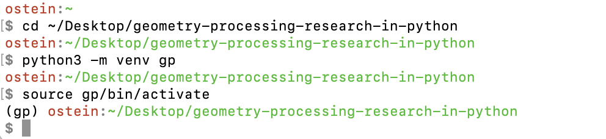

# Welcome to the Geometry Processing in Python tutorial!

In this tutorial you will learn the very basics of geometry processing on
triangle meshes.
The tutorial assumes that you are already familiar with the basics of
calculus, linear algebra, and the very basics of programming.

This tutorial is meant to accompany the first day of
[SGI courses](https://sgi.mit.edu).
Of course, you can also complete the exercises independently of the course!


# Starting Python and installing some packages

In this very first exercise we will learn how to start Python, and try a few
basic Python commands.
Feel free to completely skip this section and go to
the next exercise if you are already very familiar with Python and NumPy.

## Installing Python

If you have a Linux or Mac, Python should already be installed on your
computer.
Make sure it is a new enough version, at least 3.9, by running
`python --version` or `python3 --version` in your terminal.
If you have a Windows, you might need to install Python to have it available
on your system.
This page explains how exactly that works:
[Python](https://www.python.org/about/gettingstarted/)

Please install Python now, if you do not already have it, and make sure you can
run it.

## Setting up a Python virtual environment

Python's great advantage is its extreme ease of use, but if you're not careful,
then the many different versions of Python and its packages installed in your
environment can quickly become a big mess.
Because of this, I like to set up a new Python virtual environment for each
project of mine.

If you already have Python installed, then
- open your Terminal command line
([Mac](https://support.apple.com/guide/terminal/open-or-quit-terminal-apd5265185d-f365-44cb-8b09-71a064a42125/mac)
[Linux](https://ubuntu.com/tutorials/command-line-for-beginners#1-overview)
[Windows](https://learn.microsoft.com/en-us/windows/terminal/command-line-arguments?tabs=windows));
- navigate to the root directory of this tutorial;
- and create a new venv by issuing the following command (your Python executable might have a different name, such as `python`, `python3` or `python3.10`):
```console
python3 -m venv gp
```

Once your venv is created, you can activate it with
```console
source gp/bin/activate
```
on Mac/Linux, or
```console
gp\Scripts\activate
```
on Windows.


_This is what creating and activating a new Python venv looks like on my Mac._

## Installing packages

In this course, we will use the packages
[_Gpytoolbox_](https://gpytoolbox.org),
[_Polyscope_](https://polyscope.run/py/), [_NumPy_](https://numpy.org),
and [_SciPy_](https://scipy.org).

You can install them into your venv using the console command
```console
python -m pip install numpy==1.26.4 scipy==1.13.1 gpytoolbox==0.2.0 polyscope
```

## Starting Python and verifying that it runs correctly.

Let's now start Python to see whether all packages installed correctly.

You can either save your Python commands in a file `myfile.py` and then
run it with
```console
python myfile.py
```
or you can boot up python in interactive mode with
```console
python
```
and issue all commands line-by-line (end your session with `quit()` or CTRL+D).
*If you follow along this tutorial and want to use interactive mode, please
quit Python and enter a fresh Python session before pasting in a new set of
commands.*

Personally, if I have to run fewer than 3 commands, I will go into interactive
mode, otherwise I find it easier to just have a working script `script.py`
that I repeatedly call with `python script.py`.

So, whether in interactive mode or in your own file, import all our installed
packages and try to run a few basic commands:
```python
import gpytoolbox as gpy
print(gpy.__version__)
import polyscope as ps
print(ps.np.__version__)
import numpy as np
print(np.__version__)
import scipy as sp
print(sp.__version__)
```

You should be seeing the output:
```
0.2.0
1.26.4
1.26.4
1.13.1
```

If this is what you get, then congratulations!
All packages have been installed correctly.

