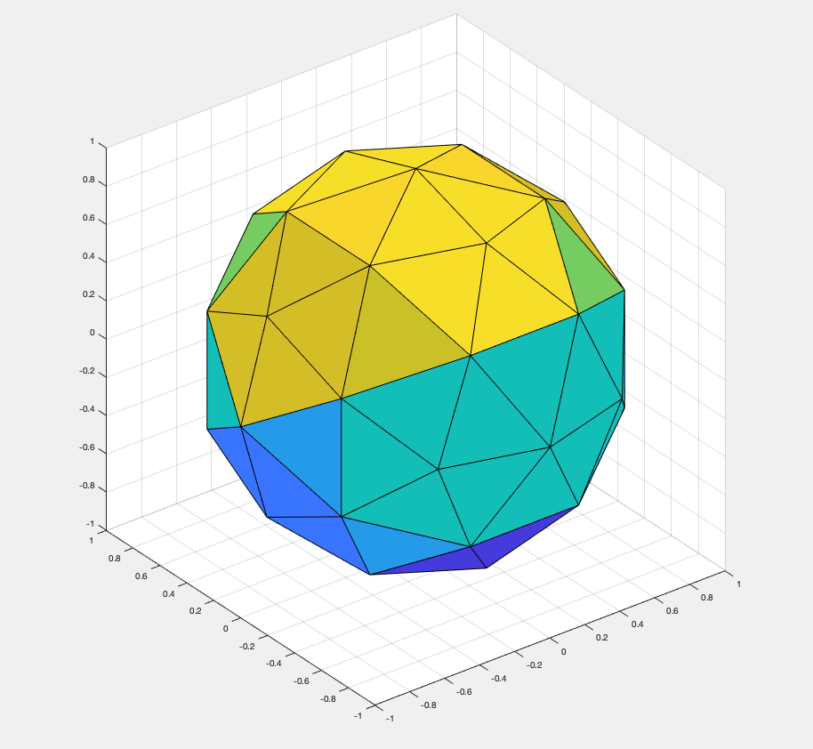
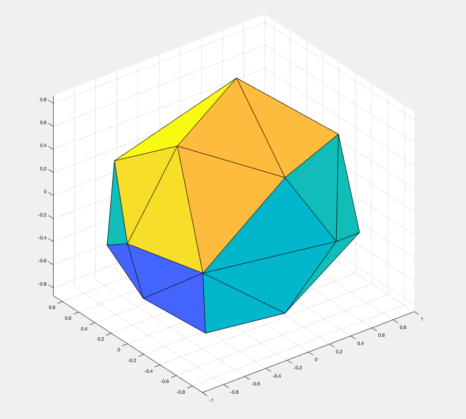

# Installing gptoolbox

In this part of the tutorial we will install the gptoolbox library and make
sure that it runs correctly.
There are no exercises in this part of the tutorial.


## Downloading gptoolbox and adding it to the search path

Download gptoolbox version X.X from its
[github repository](https://github.com/alecjacobson/gptoolbox), and put it
at a persistent path in your operating system.
We'll call this path `GPTOOLBOX_PATH`.

On the surface level, gptoolbox is simply a collection of MATLAB files.
The only thing that is needed to install the gptoolbox library is to add all
of its folders to the search path of your MATLAB installation.
This is done with the following three commands:
```MATLAB
>> gp_subdirs = split(genpath('GPTOOLBOX_PATH'),':');
>> addpath(strjoin(gp_subdirs(~contains(gp_subdirs,'.git')),':'));
>> savepath;
```
Make sure to replace `GPTOOLBOX_PATH` with the location where you downloaded
gptoolbox.
I installed it in `~/lib/gptoolbox`, so my first command is
```MATLAB
>> gp_subdirs = split(genpath('~/lib/gptoolbox'),':');
```

Restart your MATLAB.
We will now check whether gptoolbox was installed correctly.
Try issuing the following commands:
```MATLAB
>> [V,F] = subdivided_sphere(1);
>> tsurf(F,V); axis equal;
```

If everything worked correctly, you should be greeted with the plot of an
_icosphere_ (a sphere that is a subdivided
[icosahedron](https://en.wikipedia.org/wiki/Icosahedron)).


Congratulations!
You have installed gptoolbox and it is working.
If any of this did not work correctly, please contact the course organizer now.
It will be difficult to continue the course without making sure this basic step
works.


## Compiling the MEX functions (Optional)

gptoolbox contains certain functions that are _MEX functions_, consisting of
`C++` code that has to be compiled into code that can then be used as a normal
function in MATLAB.
This is done for multiple reasons, such as improved performance, and
availability of some algorithms as a `C++` implementation.
Compiling these functions is optional.
This course does not require the use of any of these functions.
If you want to take advantage of all of gptoolbox's capabilities, however, you
might want to install these MEX functions.
A detailed guide for the installation of gptoolbox's MEX components is
available [here](https://github.com/alecjacobson/gptoolbox/tree/master/mex).
This document contains a very brief overview.

As a first step, you have to make sure that both the
[Boost libraries](https://www.boost.org) as well as [CMake](https://cmake.org)
are available on your operating system.
* Many Linux distributions contain these in their public file repositories.
* On macOS, these can be downloaded using [homebrew](https://brew.sh).
* On Windows, dedicated installers are available on the respective websites
for Boost and CMake.

In addition to that, you need to install a `C++` compiler.
* Many Linux distributions provide [gcc](https://gcc.gnu.org) or
[clang](https://clang.llvm.org) in their public file repositories.
Both of these options will work.
* On macOS you have to use the clang compiler.
It can be installed by opening a terminal window and running the command
`xcode-select --install` and following the installation wizard that this starts.
* On Windows, a `C++` compiler can be obtained from Microsoft:
[Visual C++ Community Edition](https://visualstudio.microsoft.com/vs/features/cplusplus/).

Once you have installed all required components, you are ready to compile the
MEX libraries by performing the following steps:
* Open the command line.
* Enter the directory `GPTOOLBOX_PATH/mex` (or, on Windows,
`GPTOOLBOX_PATH\mex`).
* Create a subfolder called `build`, and navigate to it.
* Issue the commands
```
cmake ..
make
```
This should download all required code and compile it.
Do not worry if this takes a long time, this is normal.
You might have to add the newly compiled MEX files to your MATLAB search path
by issuing the respective commands from above again.

After the MEX files have been compiled, try issuing the following command:
```MATLAB
>> [V,F] = subdivided_sphere(1);
>> [V,F] = decimate_libigl(V,F,0.5);
>> tsurf(F,V); axis equal;
```
If everything worked correctly, you should be greeted by a decimated
icosphere.


If these steps did not work, please refer to
[this page](https://github.com/alecjacobson/gptoolbox/tree/master/mex)
for further troubleshooting.

