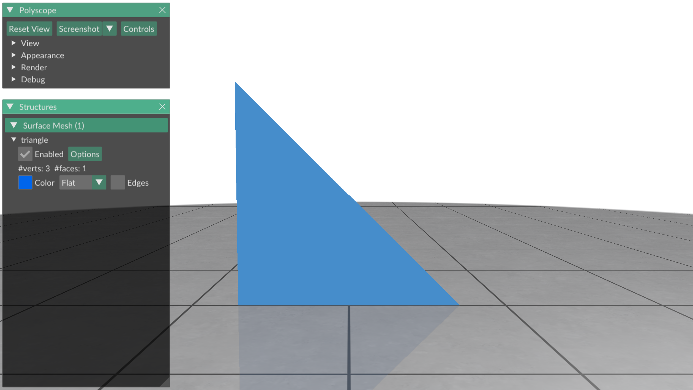
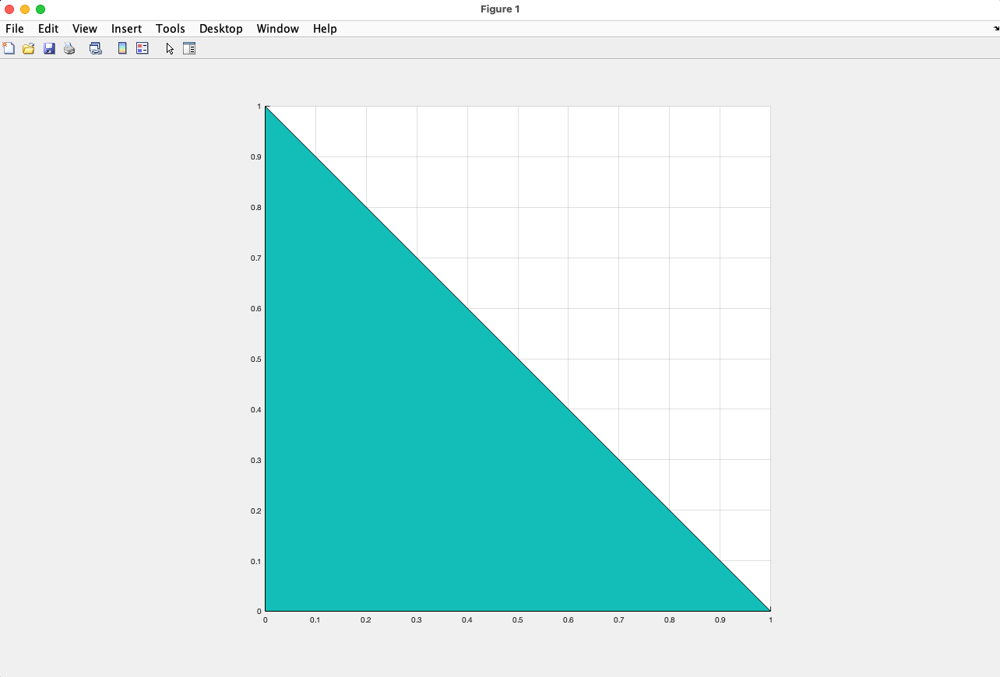
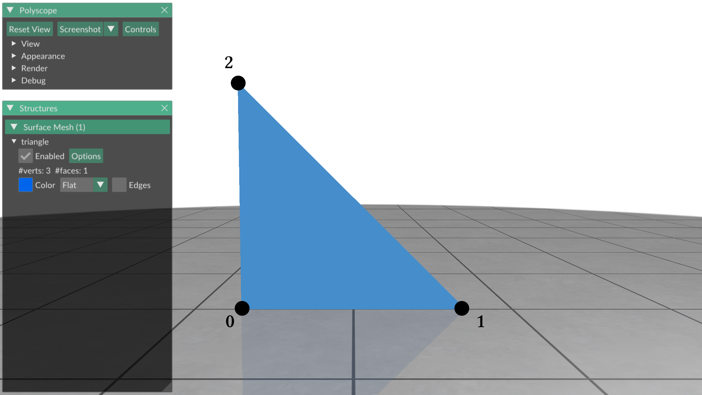
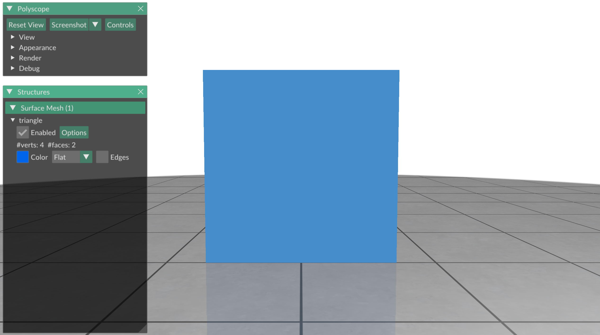
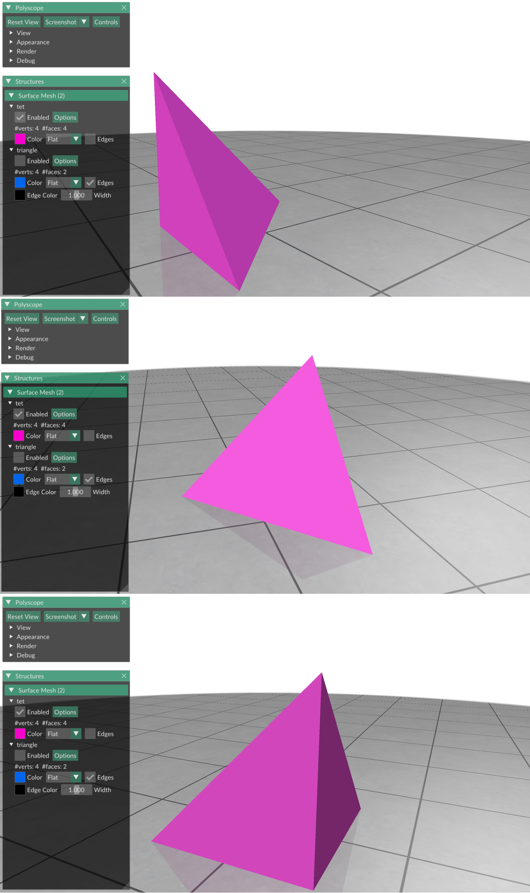

# A triangle mesh

In this exercise we will learn about triangle meshes (discrete surfaces made
from piecewise triangles called "faces") stored as triangle soups, and how to
plot them.


## Triangle soups

The most prominent triangle mesh format used by gptoolbox is the
_triangle soup_.
In a triangle soup, the triangle mesh is represented by two matrices,
* a _vertex list_ `V`, where every row represents a vertex in 2D or 3D space
with `x`,`y`, and `z` coordinates; and
* a _face list_ `F`, where every row represents a triangle and consists of
indices into the vertex list `V`.

I.e., the vertex list `V` consists of real numbers and has dimensions
`n x 2` or `n x 3`, where `n` is the number of vertices in the mesh.
The face list `F` consists of positive integers and has dimensions `m x 3`,
where `m` is the number of triangle faces in the mesh.

Let's look at a very simple triangle mesh:
a mesh that consists of only one triangle.
This triangle has the vertices `(0,0), (1,0), (0,1)`:
```MATLAB
>> V = [0, 0; 1, 0; 0, 1]

V =

     0     0
     1     0
     0     1
```
Now we need to specify the triangle list.
We only have one triangle which indexes the vertices in `V` in counter-clockwise
order:
```MATLAB
>> F = [1, 2, 3]

F =

     1     2     3
```

`V,F` is now a triangle mesh consisting of only one triangle.
Let's look at it!
In gptoolbox, triangle meshes are visualized with the `tsurf` command, which
takes as its argument the face list and then the vertex list.
```MATLAB
>> tsurf(F,V);
```

Notice that the aspect ratio in this figure is distorted.
By default, MATLAB scales the axes of every plot to fill the screen.
This is often undesirable for graphics, and can be turned off with
`axis equal`:
```MATLAB
>> tsurf(F,V); axis equal;
```


Here is the same plot of our triangle, this time with each vertex labeled by
its index.

We can see that the indices for the triangle list each vertex in order, going
around the triangle counter-clockwise.
This counter-clockwise direction is important for the correct orientation of
the triangle.
If the indices of the triangle are going in the counter-clockwise direction, we
are looking at the front of the triangle (it's _positively oriented_), otherwise
we're looking at the back of the triangle (it's _negatively oriented_).

Let's add a second triangle to our triangle mesh, `(1,0), (1,1), (0,1)`.
Since we already have the vertices `(1,0), (0,1)` in our vertex list, we only
have to add one new vertex:
```MATLAB
>> V = [0, 0; 1, 0; 0, 1; 1, 1]

V =

     0     0
     1     0
     0     1
     1     1
```
(if we were to add the vertices `(1,0), (0,1)` a second time we would have two
disconnected triangles, and not one coherent triangle mesh.)

We add the second triangle to our triangle list by re-using the indices that
we used for the first triangle, always making sure that the triangles are
oriented counter-clockwise.
```MATLAB
>> F = [1, 2, 3; 2, 4, 3]

F =

     1     2     3
     2     4     3
```

Plotting this new triangle mesh we now have a square made from two triangles.



## Constructing a triangle mesh

We now try to construct a slightly more complex surface: a tetrahedron.
Unlike our previous square, the tetrahedron's vertices are in 3D.
This means that the vertex list `V` has three columns.

Let's specify all the vertices we need for our tetrahedron:
```MATLAB
>> V = [0, 0, 0; 1, 0, 0; 0, 1, 0; 0, 0, 1]

V =

     0     0     0
     1     0     0
     0     1     0
     0     0     1
```

We now add the four triangle faces which connect the vertices of the
tetrahedron.
We make sure that the triangles are oriented counterclockwise for an observer
that looks onto the tetrahedron from the outside (so we are looking at the
_front_ of the triangles).
```MATLAB
>> F = [2, 1, 3; 1, 2, 4; 2, 3, 4; 3, 1, 4]

F =

     2     1     3
     1     2     4
     2     3     4
     3     1     4
```

It's that easy to construct a tetrahedron!
After plotting it, you should be greeted by the following shape:



## Make your own meshes

Now it's time to try and create your own triangle meshes.

Try writing the following functions:
* `simple_cube`, which returns the triangle soup `V,F` corresponding to a
simple cube made of triangles with 8 vertices
* `my_very_own_mesh`, which returns the triangle soup `V,F` for a mesh of your
very own creation.

As usual, the skeletons for these functions, ready for you to fill in, can be
found in `exercise/`.