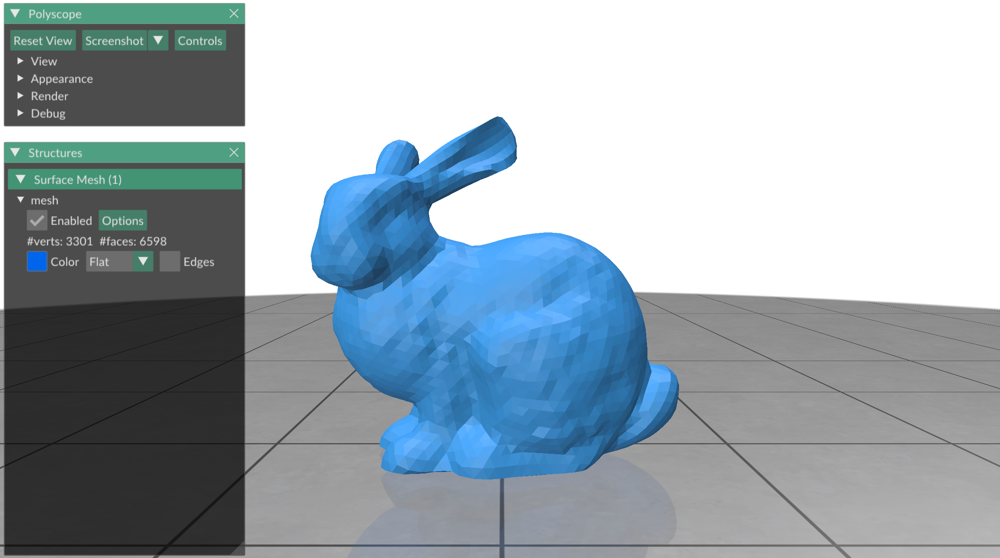

# Reading and writing a mesh

In this exercise we will learn how to read and write meshes to and from popular
file formats.


## Reading a mesh

Most triangle meshes are not created by hand or by using a function, but read
from an input file.
gptoolbox can read a number of mesh formats.
Here, we will take a look at the OBJ format.

To read an OBJ mesh, use the command
```MATLAB
>> [V,F] = readOBJ('data/bunny.obj');
>> tsurf(F,V);
```
The resulting variables `V,F` will contain the vertex and face lists.
In this case, we read the Stanford bunny, which looks like this:


The OBJ file format also supports supplying texture coordinates (using 2D vertex
list `UV` and index list `TF`, where each row of `TF` corresponds to a row of
`F`) as well as normal coordinates (using 3D normal coordinates `N` and index
list `NF`, where each row of `NF` corresponds to a row of `F`), for applications
that need it.
```MATLAB
>> [V,F,UV,TF,N,NF] = readOBJ('data/bunny.obj');
```

## Writing a mesh

When you want to save a generated mesh, or the result of a geometry processing
calculation, you can use gptoolbox to _save_ it to an OBJ file.
This works with the command
```MATLAB
>> writeOBJ('data/bunny.obj', V,F);
```

The same command can also be used to save texture data and normal data.
```MATLAB
>> writeOBJ('data/bunny.obj', V,F,UV,TF,N,NF);
```


## Other file formats

gptoolbox supports a variety of other mesh formats that are read using a
similar syntax.
They are:
* STL (`readSTL`)
* OFF (`readOFF`)
* PLY (`readPLY`)
* 3DS (`read3DS`)
* LOG (`readLOG`)

gptoolbox also supports some tetrahedral mesh formats:
* MESH (`readMESH`)
* MSH (but only for writing, in `writeMSH`)


## Try writing your own mesh

Try writing the following function:
* `write_polyhedron`, which writes the simple tetrahedron from 003 to a file.

As usual, the skeleton for this function, ready for you to fill in, can be
found in `exercise/`.
