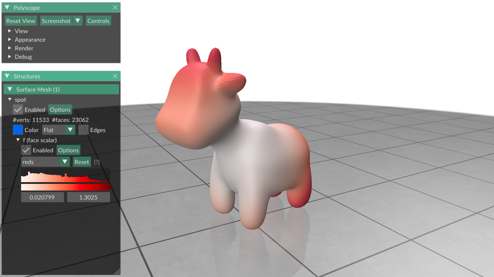
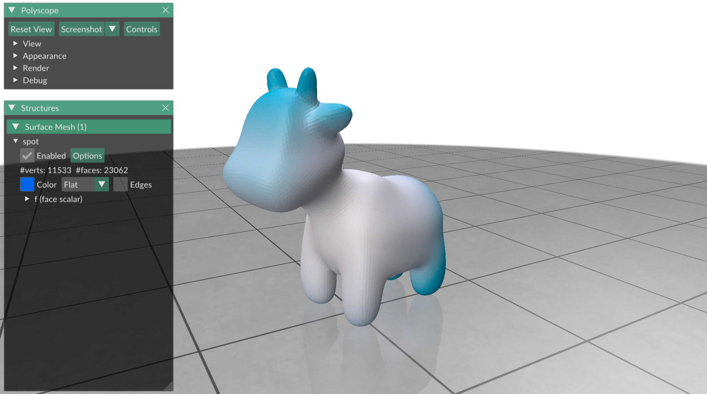

# Plotting a function

In this exercise we will learn how to plot functions on meshes.


## Functions

One of the basic objects of geometry processing is the function, often a
function from the mesh into the real numbers.
One example of such a function is the squared norm:


Polyscope offers a very easy way to plot functions, either per-vertex
or per-face.
This is done using colormaps, where each part of a mesh is colored according to
the function value.

To plot a per-vertex function, define a vector of length `n`, where `n` is
the number of vertices that holds the function value for each vertex:
```python
>>> f = V[:,0]**2 + V[:,1]**2 + V[:,2]**2
```

_NOTE: `**` in NumPy is a componentwise exponentiation.
So, the function above computes x^2 + y^2 + z^2._

We plot this function using Polyscope with a `register_surface_mesh` as before,
and additionally issue `add_scalar_quantity` to plot a function
("scalar" is a math term that refers to a function that only returns a real
number, and not something like a vector).
```python
>>> V,F = gpy.read_mesh("data/spot.obj")
>>> f = V[:,0]**2 + V[:,1]**2 + V[:,2]**2
>>> ps.init()
>>> ps_spot = ps.register_surface_mesh("spot", V, F)
>>> ps_spot.add_scalar_quantity("f", f, enabled=True)
>>> ps.show()
```


_NOTE: Remember to always set `enabled=True`, otherwise your function will not
show up in Polyscope!_

To plot a per-face function, define a vector of length `m`, where `m` is the
number of faces that holds the function value for each face:
```python
>>> centers = (V[F[:,0],:] + V[F[:,1],:] + V[F[:,2],:]) / 3.
>>> f = centers[:,0]**2 + centers[:,1]**2 + centers[:,2]**2
```

We plot this function with the same command as before, but now add
`defined_on="faces"` to tell Polyscope that this is a per-face function and not
a per-vertex function:
```python
>>> ps.init()
>>> ps_spot = ps.register_surface_mesh("spot", V, F)
>>> ps_spot.add_scalar_quantity("f", f, defined_on="faces", enabled=True)
>>> ps.show()
```


## Colormaps

Spot the cow from the last two plots plotted the function using a _colormap_ -
a method to assign a color to each number in an interval.
But what colormap is it using?

By default, Polyscope uses the [viridis](https://matplotlib.org/stable/users/explain/colors/colormaps.html) colormap:


We can easily use a different colormap in Polyscope by using the `cmap` argument
of the `add_scalar_quantity` function.
For example, to use the `reds` color map:
```python
>>> ps.init()
>>> ps_spot = ps.register_surface_mesh("spot", V, F)
>>> ps_spot.add_scalar_quantity("f", f,
    defined_on="faces", cmap="reds", enabled=True)
>>> ps.show()
```



[Cynthia Brewer's colorbrewer colormaps](https://colorbrewer2.org) are a
particularly great resource for varied, colorful and easily legible colormaps.
To use them (or any other) custom color map in Polyscope, you need an image of
the color map going from the left to the right side of the screen.
Here is ColorBrewer's `PuBu` color map:


Then this image can be used as a custom color map using Polyscope's
`load_color_map` function:

```python
>>> ps.init()
>>> ps_spot = ps.register_surface_mesh("spot", V, F)
>>> ps.load_color_map("PuBu", "assets/PuBu.png")
>>> ps_spot.add_scalar_quantity("f", f,
    defined_on="faces", cmap="PuBu", enabled=True)
>>> ps.show()
```

This plots:




## Try plotting a function of your own

Try writing the following function:
* `plot_z_coord`, which plots the `z` coordinate of any mesh. Try it out on
the spot mesh in the directory `data`!

As usual, the skeleton for this function, ready for you to fill in, can be
found in `exercise/`.
