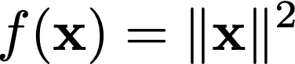
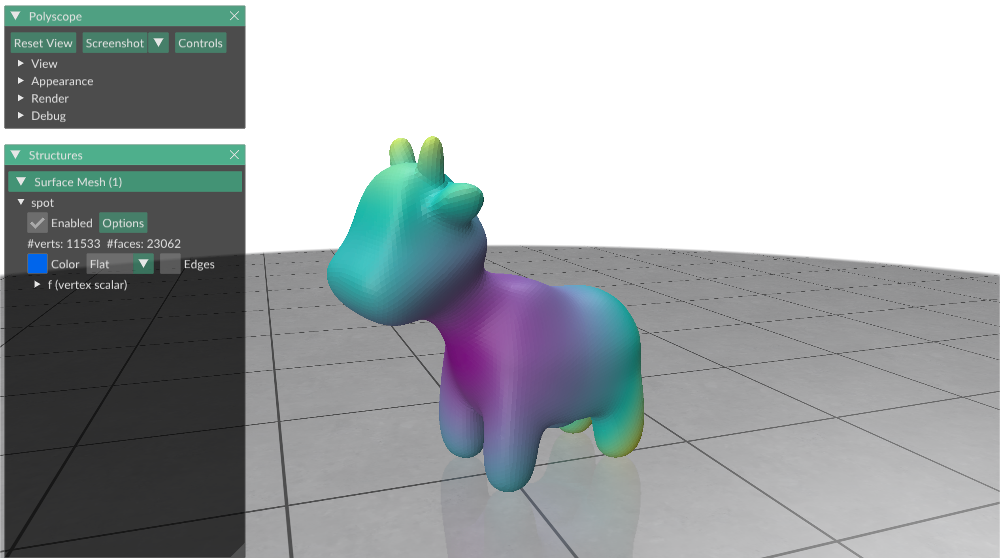
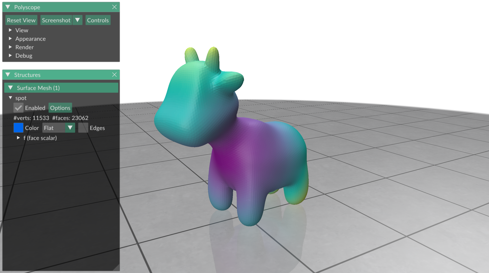
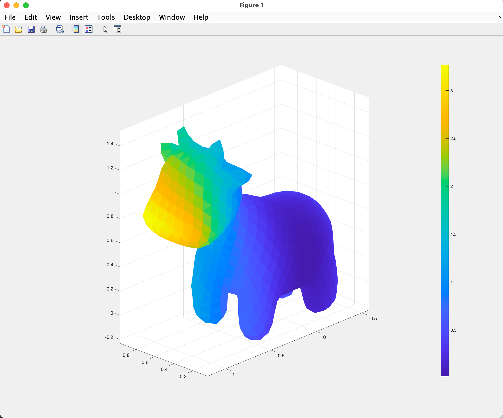
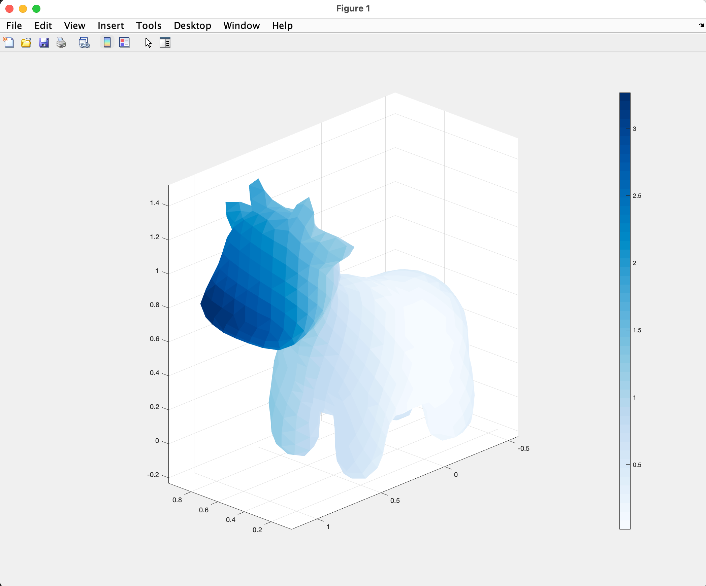

# Plotting a function

In this exercise we will learn how to plot functions on meshes.


## Functions

One of the basic objects of geometry processing is the function, often a
function from the mesh into the real numbers.
One example of such a function is the squared norm:



MATLAB and gptoolbox offer a very easy way to plot functions, either per-vertex
or per-face.
This is done using colormaps, where each part of a mesh is colored according to
the function value.

To plot a per-vertex function, define a vector of length `n`, where `n` is
the number of vertices that holds the function value for each vertex:
```MATLAB
>> f = V(:,1).^2 + V(:,2).^2 + V(:,2).^2;

```

We plot this function using the same `tsurf` command as before, but adding an
addition argument `CData`.
We also make sure to plot with `shading interp`, which interpolates per-vertex
data over the entire mesh.
This is almost always the correct way to display per-vertex data:
MATLAB's default display method can be misleading.
```MATLAB
>> tsurf(F,V, 'CData',f); axis equal;
>> shading interp;
```


To plot a per-face function, define a vector of length `m`, where `m` is the
number of faces that holds the function value for each face:
```MATLAB
>> centers = (V(F(:,1),:) + V(F(:,2),:) + V(F(:,3),:)) / 3;
>> f = centers(:,1).^2 + centers(:,2).^2 + centers(:,2).^2;
```

We plot this function with the same command as before.
MATLAB checks automatically if the dimension of `f` corresponds to the number
of vertices or the number of faces, and plots accordingly.
In this example, we turn off the display of mesh edges, but do _not_ set the
shading to interpolated.
Per-face constant colors are almost always the correct way to display per-vertex
data.



## Colorbar

In many plots it can be helpful to know what the colormap is (the method which
assigns function values to a color).
This is achieved by using the `colorbar` command that automatically adds a bar
with units that shows the colormap to the plot:
```MATLAB
>> colorbar;
```



## Colormaps


MATLAB's default colormap is the
[parula colormap](https://www.mathworks.com/help/matlab/ref/parula.html).
You might want to employ different colormaps for a variety of reasons.
This can be easily done by specifying a matrix where each row corresponds to
a different RGB value of a colormap and then invoking the `colormap` commamd.
```MATLAB
>> colormap(CM);
```

[Cynthia Brewer's colorbrewer colormaps](https://colorbrewer2.org) are a
particularly great resource for varied, colorful and easily legible colormaps.
They can be automatically generated in MATLAB with the integrated `cbrewer`
command:

```MATLAB
>> colormap(cbrewer('Blues',50));
```


`50` here specifies the number of discrete color values we want in our color
map.
To plot continuous functions, we usually want a number there that is as large
as possible.
To plot discrete functions with discrete color intervals, you can change the
number appropriately.
gptoolbox also has the ability to add explicit isolines to your plot via the
`isolines` command.

A full list of all available colormaps can be seen by typing `help cbrewer`.
The colormaps correspond to the ones on
[Cynthia Brewer's website](https://colorbrewer2.org) (where they are also visualized).


## Try plotting a function of your own

Try writing the following function:
* `plot_z_coord`, which plots the `z` coordinate of any mesh. Try it out on
the spot mesh in the directory `data`!

As usual, the skeleton for this function, ready for you to fill in, can be
found in `exercise/`.
