# Shading & Perspective

There are many ways to modify a surface plot to make it more appealing.
This exercise goes over a few different ways to shade a plot, and to add
perspective to it.


## Axes on / off

All of our plots so far have had labeled axis and a grid in the background.
While this can be helpful to convey the scale of the plotted objects, when such
scale is irrelevant, it can be distracting.
```MATLAB
>> t = tsurf(F,V);
>> shading interp;
>> axis equal;
```
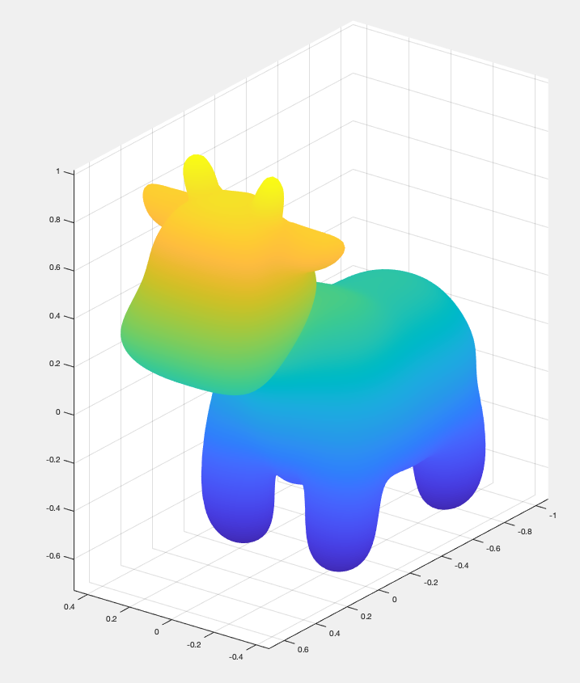

MATLAB offers a simple way to remove the axes and the background grid by issuing
the command `axis off`:
```MATLAB
>> axis off;
```


When saving this image through the MATLAB interface, or through
`saveas(gcf, 'file.png')`, the grey background will appear as transparent.


## Lights

At the moment, our plotted model is not lit at all - every visible point of the
surface contributes to the image equally.
In the real world, however, objects are illuminated by lights, leading to
different points of the surface contributing unequally.
We can do this in MATLAB by adding lights, for example, a light coming
directly from the camera, using `camlight`:
```MATLAB
>> lights = camlight;
```
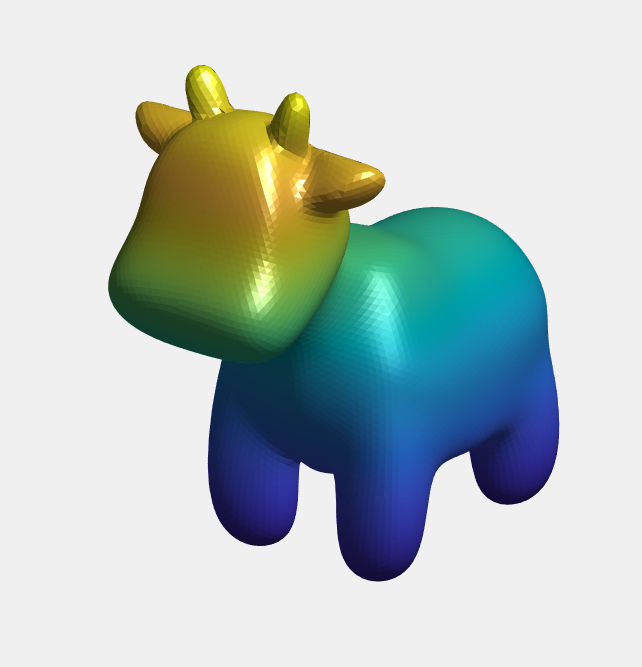

We can add a light at an arbitrary position using the function
`light('Position',POSITION,'Style','local');`, where `POSITION` is the 3d
coordinate of the light source.
```MATLAB
>> light('Position',[-1.5 1 1],'Style','local');
```
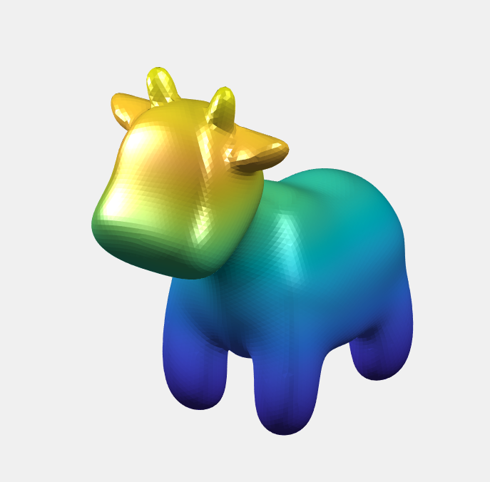

Now, the coloring is continuous due to us using the `shading interp` command
earlier.
The lighting, however, is not continuous. To achieve continuous lighting, we
need to add a variety of parameters to the `tsurf` command:
```MATLAB
>> shadingParams = {'FaceLighting','gouraud', 'FaceColor','interp'};
```
These parameters are added to the _end_ of the tsurf command,
`tsurf([...], shadingParams{:})`.
Alternatively, we can also set them individually on the resulting surface
object,
```MATLAB
>> t = tsurf(F,V);
>> set(t, 'FaceLighting','gouraud');
>> set(t, 'FaceColor','interp');
```

If we do not want the surface do be default colored based on its `z`
coordinate, we have to plot a constant function:
```MATLAB
>> u = ones(size(V,1),1);
```

Combining all lighting commands then gives us
```MATLAB
>> u = ones(size(V,1),1);
>> shadingParams = {'FaceLighting','gouraud', 'FaceColor','interp'};
>> tsurf(F,V, 'CData',u, shadingParams{:});
>> shading interp;
>> axis equal;
>> axis off;
>> light('Position',[-1.5 1 1],'Style','local');
>> lights = camlight;
>> colormap(cbrewer('Blues', 500));
```
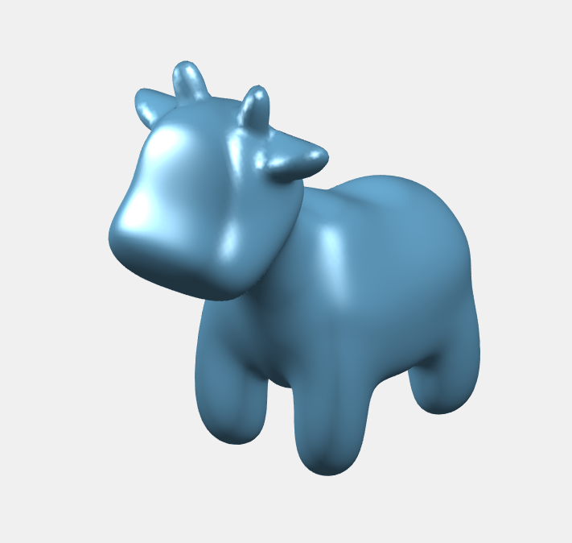

Lights in MATLAB can be either _local_ lights, which are point lights at the
specified position emanating light in all directions (constructed with
parameters `'Style','local'`), or they can be _infinite_ lights, which model
light sources infinitely far away (like the sun) (constructed with
parameters `'Style','infinite'`).

Additionally, lights can have a specific color (similar to colored lightbulbs
in real life) instead of the default white color.
This color can be specified using the parameters `'Style','[R,G,B]'`, where
`R`, `G`, `B` are RBG values between 0 and 1.
gptoolbox's `add_lights` function offers a default lighting scene with
pastel-colored lights.


## Material

Different materials react differently to light.
Look around on your desk - certain materials are shiny, certain materials are
matt, certain materials are reflective, and certain materials are transparent.
The world has an endless variety of different materials.
Which material is our cow?

MATLAB's most basic shading model does not model the richness of the physical
world (modern
[physically based rendering engines](https://en.wikipedia.org/wiki/Physically_based_rendering) attempt to), but it supports a variety of different materials using the basic
[Phong reflection model](https://en.wikipedia.org/wiki/Phong_reflection_model).
In this shading model, every material is defined by its _diffuse color_
(modelling an ideally rough surface), its _specular color_
(modelling an ideally shiny surface), and its _ambient color_
(the color which can always be seen, even in the absence of light).
In MATLAB, we can set the strength of the diffuse, specular, and ambient parts
of the material using the `'SpecularStrength',XXX`, `'DiffuseStrength',XXX`, and
`'AmbientStrength',XXX` parameters in the parameter list of `tsurf`.

For example, here we plot a surface that is almost entirely diffuse:
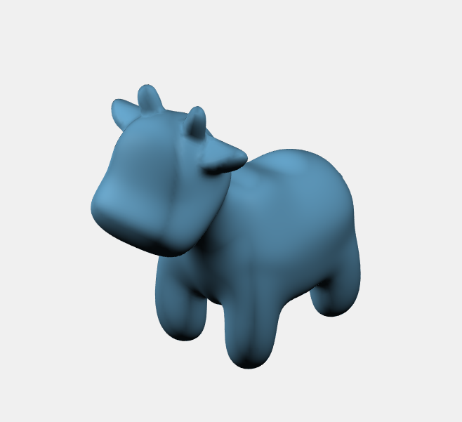

This is an example of a surface that is almost entirely specular:
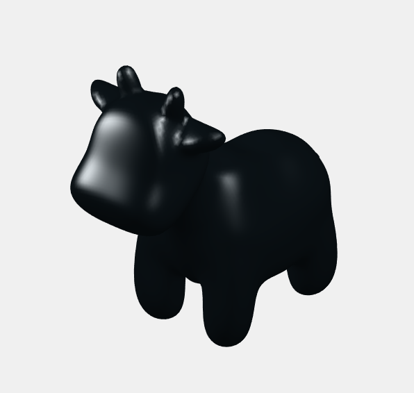

And here is a surface that is almost entirely ambient:
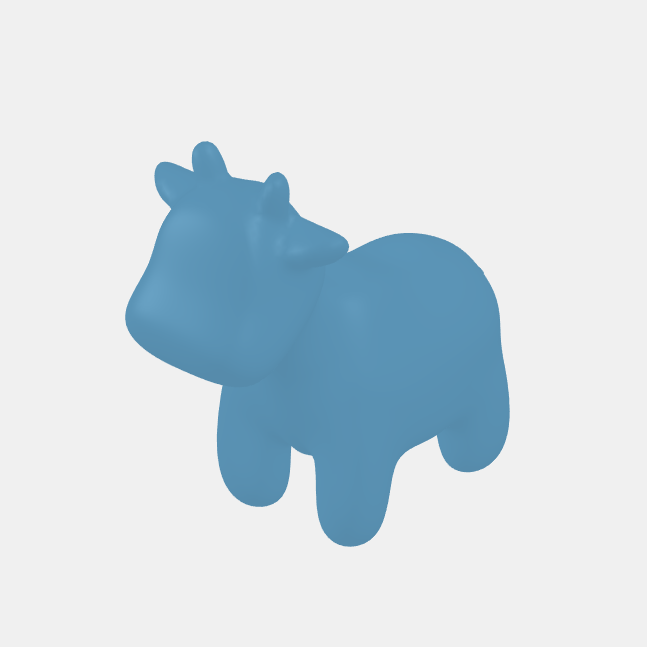

Good default choices for material parameters are, in my opinion,
* `'DiffuseStrength',0.5, 'SpecularStrength',0.2, 'AmbientStrength',0.3`
for a mainly diffuse material, which makes it easy to see the shape of the
surface without making the color map hard to read;

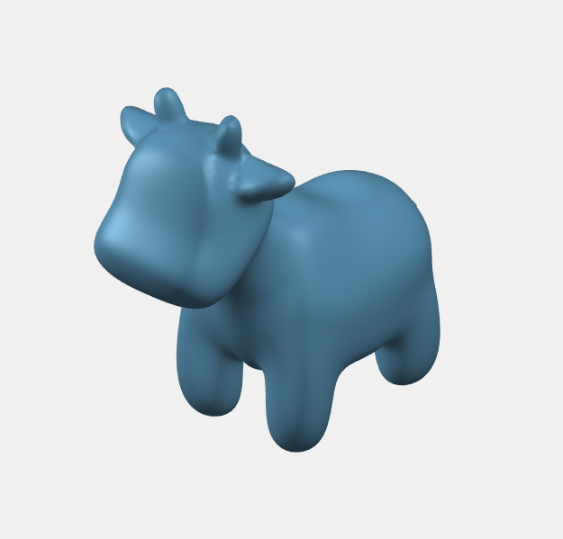

* `'DiffuseStrength',0.4, 'SpecularStrength',0.6, 'AmbientStrength',0.3`
for a strongly specular that accentuates the contours of the shape, which
is good for plotting shapes with constant color (but may make colormaps hard
to read); 

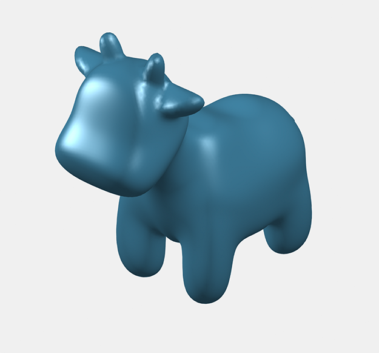

* and `'SpecularStrength',0.2`, `'DiffuseStrength',0.2`, `'AmbientStrength',0.7`
for a soft material effect that feels like there is a lot of light everywhere.

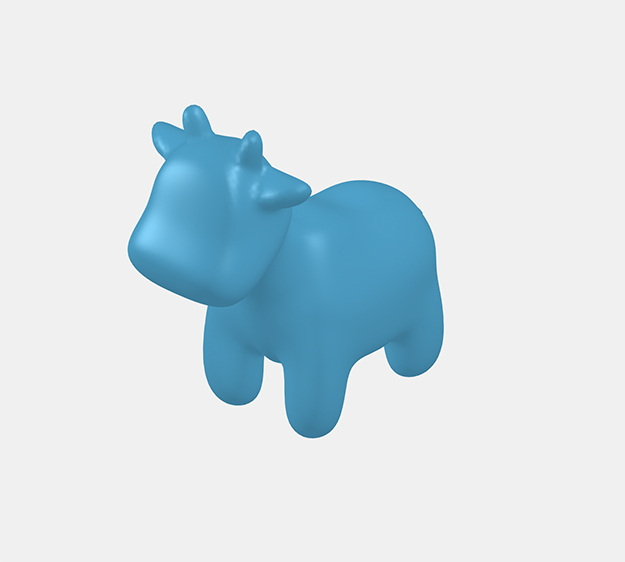

The parameters `SpecularExponent` and `SpecularColorReflectance` further
modify the specular part of the shading, see
[here](https://en.wikipedia.org/wiki/Specular_reflection)
for details on specular shading.


## Perspective

So far, all images we have seen have been computed using an
[orthographic projection](https://en.wikipedia.org/wiki/Orthographic_projection).
An orthographic projection projects objects onto the screen such that the
line from the object to the point it lands on is perpendicular to the screen
itself.
This is not how the human eye or camera lenses work.
Cameras work by using perspective - light rays pass through a lens that focuses
them onto the screen.

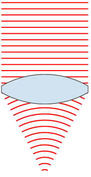
(lens animation by [Oleg Alexandrov](https://en.wikipedia.org/wiki/File:Lens_and_wavefronts.gif))

This behavior can be mimicked in computer rendering using a
[perspective projection](https://en.wikipedia.org/wiki/Perspective_(graphical)).
The perspective projection distorts an image by making objects closer to the
screen appearing larger.
Since this mimicks the behavior of cameras in real life, this can make images
look more realistic.

In MATLAB, a simple version of the perspective projection can be enabled with
the command `camproj('perspective')`:
```MATLAB
>> camproj('perspective')
```


## Shadow

In order to make objects appear more visually pleasing, one can display them
with a shadow.
The gptoolbock command for this is `add_shadow`
```MATLAB
>> add_shadow([t],lights);
```
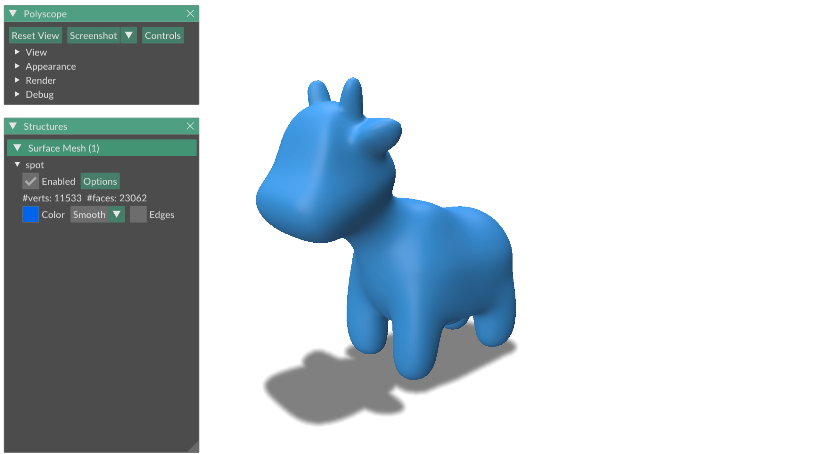

The `add_shadow` command optionally takes as an argument a list of surfaces
for which the shadows are to be displayed, and a list of lights which cast the
shadows.
if no arguments are supplied, shadows will be displayed for all surfaces using
all lights.

Currently, `add_shadow` only works with inifite (and not local) lights.


## Ambient occlusion (ADVANCED)

Ambient occlusion will only work if you compiled the MEX functions that came
with gptoolbox.
If you did not, do not worry:
this part of the exercise is completely optional.

[Ambient occlusion](https://en.wikipedia.org/wiki/Ambient_occlusion)
tries to model the fact that, for any shape, cavities are less well-lit than
exposed surfaces, since there is a smaller number of light rays hitting them
from a light source.
MATLAB's rendering engine does not actually trace rays from light sources to
our shape, but we can simulate something like ambient occlusion using a
specific gptoolbox function on top of MATLAB's rendering engine:
`apply_ambient_occlusion`.
This function takes as argument a list of objects to which ambiend occlusion is
to be applied.
By default, it also adds its own lights and changes the materials, which we can
explicitly turn off.
```MATLAB
>> apply_ambient_occlusion([t],'AddLights',false,'SoftLighting',false);
```

This gives us the following image, with the cavities of the object slighty
darkened.

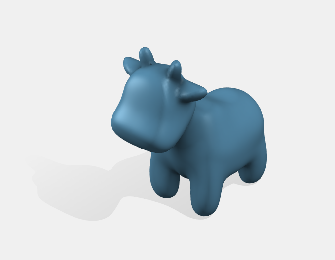

Since ambiend occlusion tends to darken the scene, it can often be desirable to
add additional lights when ambient occlusion is applied.
This also serves to accentuate the contrast between lit and dark regions.


## A summary of all shading & perspective commands

Here is a summary of all shading & perspective commands that were used in this
exercise.
Feel free to collect them in a function for easy access in the future!

```MATLAB
function default_shading(t)
%DEFAULT_SHADING Applies a default shading choice for the surface t plotted
%in the current figure
%
% Inputs:
%  t  surface to be shaded
    shading interp;
    axis equal;
    axis off;
    colormap(cbrewer('Blues', 500));
    light('Position',[-1.5 1 1],'Style','local');
    lights = camlight;
    set(t, 'FaceLighting','gouraud', 'FaceColor','interp');
    set(t, 'DiffuseStrength',0.5, 'SpecularStrength',0.2, 'AmbientStrength',0.3);
    camproj('perspective');
    add_shadow([t],lights);
end
```

You can call this function before you plot a surface to perform all the shading
operations we learned in this exercise:
```MATLAB
>> t = tsurf(F, V, 'CData', u, shadingParams{:});
>> default_shading(t);
```


## TRY

There are no pre-made exercises in this section.
Try out a variety of different lighting and material options for spot, and
begin finding your own style for plots.

