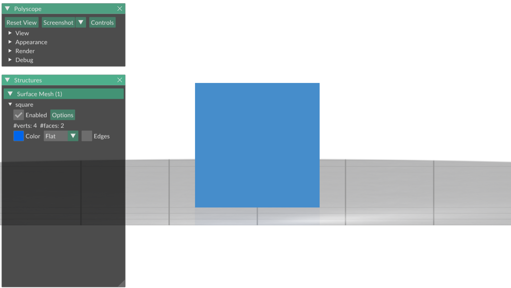
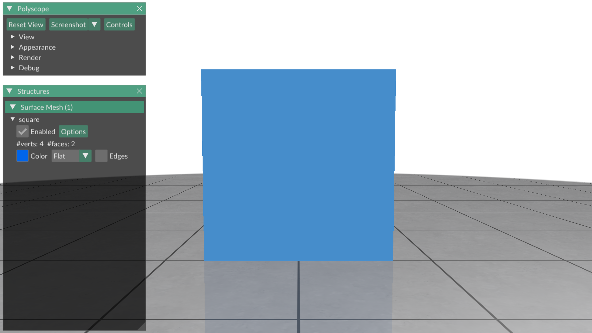
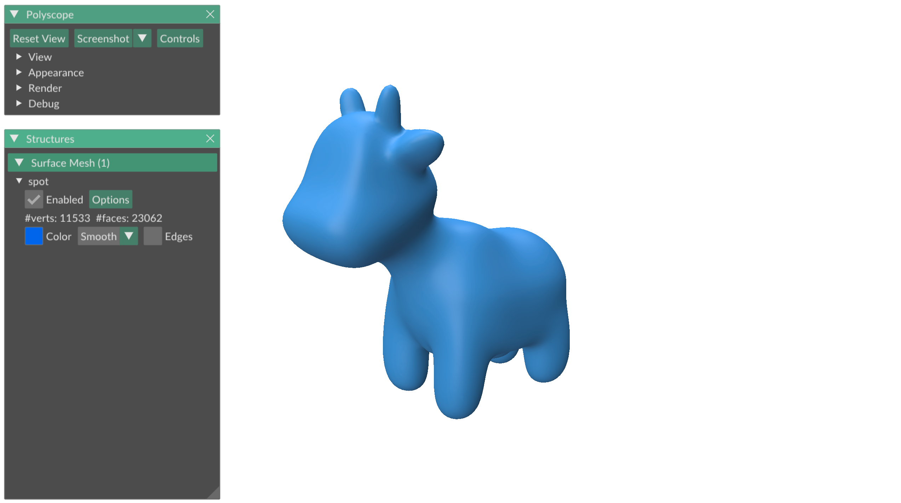

# Shading & Perspective

There are many ways to modify a surface plot to make it more appealing.
This exercise goes over a few different ways to shade a plot, and to add
perspective to it.

## Smooth vs. flat shating
Our plots currently all show the triangles of the objects we plot quite
distinctly.
This is especially apparent for coarse meshes:
```python
>>> V,F = gpy.read_mesh("data/spot_low_resolution.obj")
>>> ps.init()
>>> ps_spot = ps.register_surface_mesh("spot", V, F)
>>> ps.show()
```


This effect stems from the fact that Polyscope uses a variant of the
[Blinn-Phong shading model](https://en.wikipedia.org/wiki/Blinn–Phong_reflection_model)
with _flat shading_:
the shape is literally assumed to be piecewise flat for lighting computations,
and not an approximation of a smooth surface.
If you want a smoother appearance instead, this can be done by enabling
_smooth shading_; either in the GUI or with the `smooth_shade` argument.
If this argument is used, Polyscope will interpolate normals smoothly across the
shape, resulting in smooth reflections that hide the appearance of individual
triangles:
```python
>>> V,F = gpy.read_mesh("data/spot_low_resolution.obj")
>>> ps.init()
>>> ps_spot = ps.register_surface_mesh("spot", V, F, smooth_shade=True)
>>> ps.show()
```


## Material

Different materials react differently to light.
Look around on your desk - certain materials are shiny, certain materials are
matt, certain materials are reflective, and certain materials are transparent.
The world has an endless variety of different materials.
Which material is our cow?

Polyscope's most basic shading model does not model the richness of the physical
world (modern
[physically based rendering engines](https://en.wikipedia.org/wiki/Physically_based_rendering) attempt to), but it supports a variety of different materials using 
[matcaps](https://polyscope.run/py/features/materials/), which can convincingly
approximate a variety of real-world materials.
You can apply them to a surface using the `material` argument.

Here is how you display a mud spot:
```python
>>> ps.init()
>>> ps_spot = ps.register_surface_mesh("spot", V, F, smooth_shade=True, material="mud")
>>> ps.show()
```

This displays:


And here is a ceramic penguin:
```python
>>> ps.init()
>>> ps_spot = ps.register_surface_mesh("spot", V, F, smooth_shade=True, material="ceramic")
>>> ps.show()
```

This displays:


The built-in materials are (where the colorable ones allow you to set a color
on top of the material, or apply a colormap to a plotted function):
- `clay` (colorable)
- `wax` (colorable)
- `candy` (colorable)
- `flat` (colorable)
- `mud` (not colorable)
- `ceramic` (not colorable)
- `jade` (not colorable)
- `normal` (not colorable)

A matcap is a simple image that tells Polyscope what color to render depending
on which angle the surface forms between the camera and the light source.
You can easily create your own matcap images with the `load_static_material`
function - the [Polyscope documentation](https://polyscope.run/py/features/materials/#load_blendable_material)
contains instructions on how to do that.


## Perspective

Have you ever asked yourself how a 3D object gets turned into a 2D object to
plot on screen?
In a computer graphics class you can learn all types of
[3D projections](https://en.wikipedia.org/wiki/3D_projection).
Polyscope supports two of them: _perspective_ and _orthographic_, and you
can switch between them with the `set_view_projection_mode` function.

You should use orthographic projection if you want parallel lines in 3D to also
be parallel in your 2D view, for example because you want to accurately
represent the angles of a square:
```python
>>> V,F = gpy.regular_square_mesh(2)
>>> ps.init()
>>> ps_square = ps.register_surface_mesh("square", V, F)
>>> ps.set_view_projection_mode("orthographic")
>>> ps.show()
```



Our eyes do not perform a perfect orthographic projection in real life, which
is why orthographically projected objects usually look uncanny.
To mimic how our eyes work, use the perspective projection (which is the default
in Polyscope).
The two vertical edges of the square are no longer parallel, but the world
looks more natural:
```python
>>> V,F = gpy.regular_square_mesh(2)
>>> ps.init()
>>> ps_square = ps.register_surface_mesh("square", V, F)
>>> ps.set_view_projection_mode("perspective")
>>> ps.show()
```




## Ground plane & shadow

To make it easier to place your plotted object in its surroundings, Polyscope
displays a ground plane with a reflection on your object right below it.
You can toggle the ground plane on and off by using the "Appearance" option
in the Polyscope GUI, or by using the `set_ground_plane_mode` command:
```python
>>> ps.set_ground_plane_mode("none")
```



Instead of displaying a ground plane with a reflection, you can also choose to
display a shadow instead.
Personally, I prefer this style for professional research paper figures:
```python
>>> ps.set_ground_plane_mode("shadow_only")
>>> ps.set_shadow_darkness(0.8)
```


## TRY

There are no pre-made exercises in this section.
Try out a variety of different lighting and material options for spot, and
begin finding your own style for plots.

