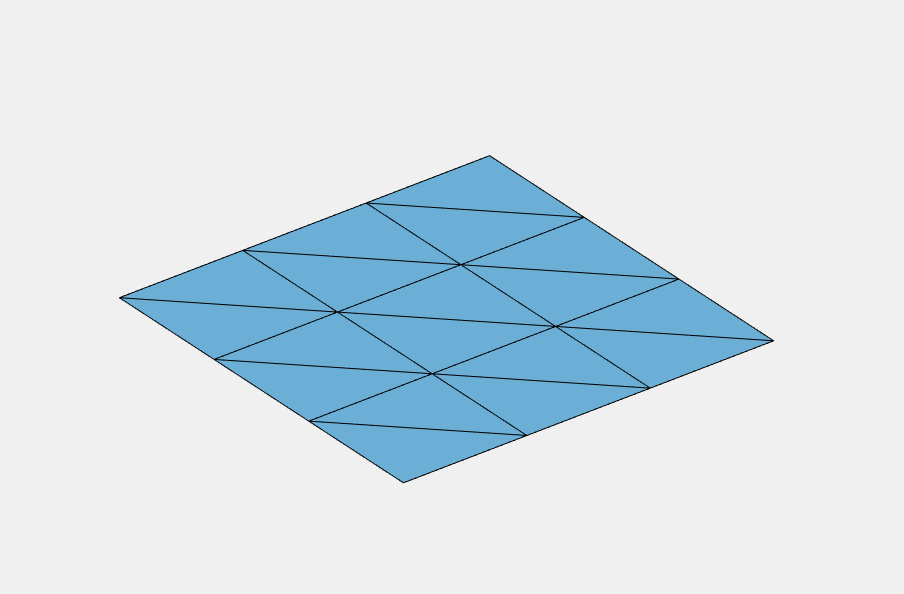
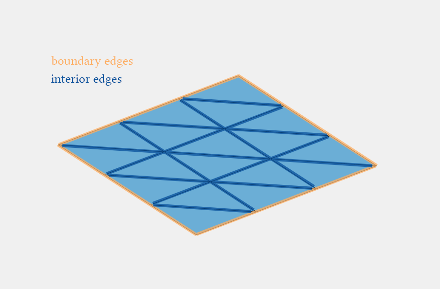
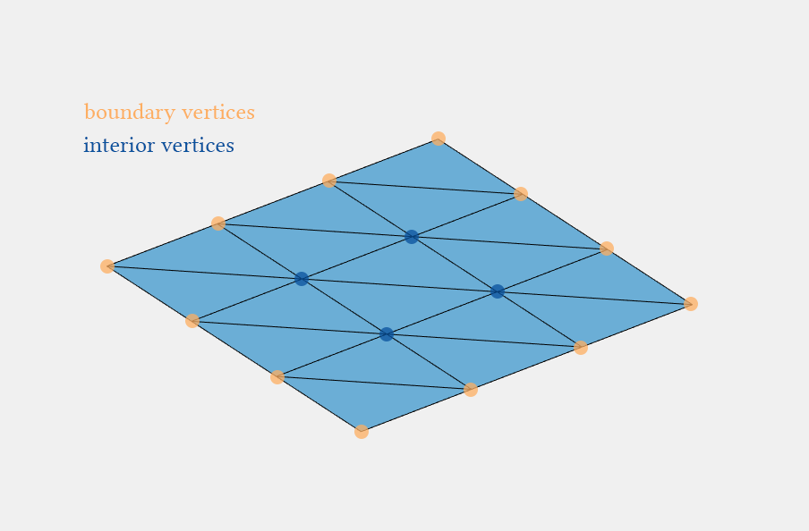
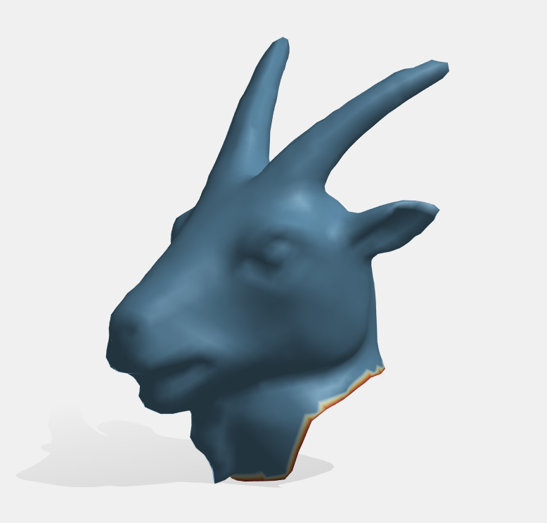
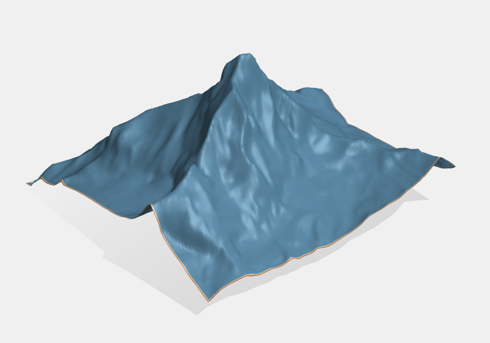
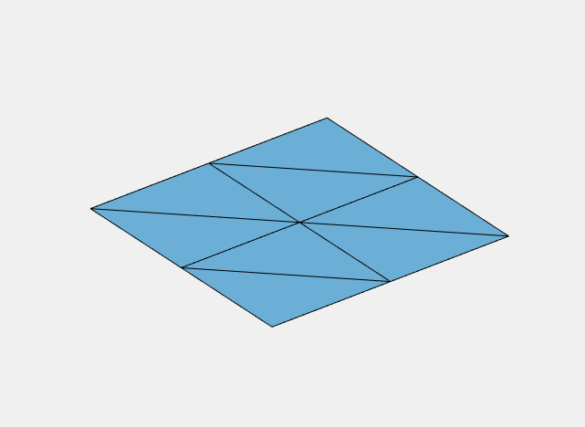

# Boundary

In this exercise we will learn what the boundary of a surface is, and how we can
work with it using gptoolbox.


## The boundary of a surface

You might know intuitively what the boundary of a surface is.
It is the border between where there is a surface and where there is no surface.
Mathematically speaking, the boundary of a manifold surface is not trivial to
define
(see [the Wikipedia article for more details](https://en.wikipedia.org/wiki/Manifold#Manifold_with_boundary))
and involves a fair bit of differential geometry.
For triangle surface meshes, piecewise triangular surfaces, however,
the boundary is the _set of all points on triangle edges that are only part of
one triangle_, as opposed to the points on interior edges, which are always on
two triangles.[^1]

Consider the following simple mesh:



What are its boundaries?
To determine the boundaries, we look at every point on every edge and check
whether this point is a part of only one triangle (and thus a boundary edge),
or whether the point is a part of two triangles (and thus an interior
edge).



Beyond boundary edges, we also have _boundary vertices_.
Boundary vertices are defined via boundary edges:
_A vertex is a boundary vertex if it is contained in a boundary edge_.
Otherwise, it is an _interior vertex_.



Here are two examples of surfaces with their boundary vertices highlighted:





Boundary triangles (or boundary faces) occur less than boundary
verties and boundary edges.
_A boundary triangle is a triangle that contains at least one boundary edge_,
otherwise it is an _interior triangle_.


## Computing the boundary in gptoolbox

The basic tool in gptoolbox to extract the boundary in gptoolbox are the
functions `outline` and `on_boundary`.

`outline` returns a set of ordered boundary edges for every triangle mesh.
Consider the following small mesh of a square:


```MATLAB
>> V =  [0, 0;  0, 0.5; 0, 1; 0.5, 0; 0.5, 0.5; 0.5, 1;  1, 0;  1, 0.5;  1, 1]
V =

            0            0
            0          0.5
            0            1
          0.5            0
          0.5          0.5
          0.5            1
            1            0
            1          0.5
            1            1
>> F = [1, 4, 2; 4, 5, 2; 2, 5, 3; 5, 6, 3; 4, 7, 5; 7, 8, 5; 5, 8, 6; 8, 9, 6]
F =

     1     4     2
     4     5     2
     2     5     3
     5     6     3
     4     7     5
     7     8     5
     5     8     6
     8     9     6
```

Just as the variable `F` gives us the triangles on the mesh as collections of
three indices into `V` for each face, `outline(F)` will return the boundary
edges as collections of two indices into `V` for each boundary edge:
```MATLAB
>> outline(F)

ans =

     2     1
     3     2
     6     3
     1     4
     9     6
     4     7
     7     8
     8     9
```

Each row of `ans` is an edge, a straight line from `V(ans(i,1),:)` to
`V(ans(i,2),:)`.
Together, all the rows of `ans` are the boundary edges of `F`.

Using MATLAB's `unique` function (which returns all one of each element in a
matrix) we can extract the boundary _vertices_ from the return value of
`outline`:
```MATLAB
>> unique(outline(F))

ans =

     1
     2
     3
     4
     6
     7
     8
     9
```

As we can see, the boundary vertices are all the vertices with the exception of
`5`, the vertex in the middle of the square.

The function `on_boundary` can be used to tell which triangle is on the boundary
and which is not.
It takes the triangle list `F` and returns a list of booleans `I` which tells us
whether that respective triangle is a boundary triangle, and it returns a matrix
of booleans `C` (with the same dimensions as `F`) that tells us whether the edge
opposing a vertex is a boundary edge:
```MATLAB
>> [I,C] = on_boundary(F)

I =

  8×1 logical array

   1
   0
   1
   1
   1
   1
   0
   1


C =

  8×3 logical array

   0   1   1
   0   0   0
   0   1   0
   1   0   0
   0   0   1
   0   0   1
   0   0   0
   1   0   1
```

Looking at the return value `I` we can see that all triangles, except for the
second and the seventh, are boundary triangles (and thus contain at least one
boundary edge).
This list of booleans can be transformed into a list of indices with the MATLAB
function `find`.
The return value `C` has the exact same dimensions as `F`, and tells us whether
a vertex at a certain position in `F` (i.e., `C(i,j) == F(i,j)`) is opposite a
boundary edge or not.


## Exercises

If you are learning geometry processing, try writing the following function:
* `my_outline`, which matches the behavior of `gptoolbox`'s `outline` function.

If you already know geometry processing well and are familiar with the concept
of boundaries of triangle meshes (or have already completed above exercise),
try writing the following functions which tests your mastery of the boundary
command:
* `plot_boundary_orange`, which takes a triangle mesh as input, and then plots
it by coloring all boundary vertices in orange, and all interior vertices in
blue.
* `boundary_triangles`, which takes a triangle mesh as input, and returns a list
of all boundary trianges.
* `boundary_length`, which takes a triangle mesh as input, and returns the
length of the boundary (the combined length of all triangle edges).
You can use the function `normrow` that, when input a matrix, returns a vector
with the norms of each row of the matrix.
You can use the `sum` function that sums all elements of a vector.
HINT: the length of an edge is equal to `norm(edgeEnd - edgeStart)`.

As usual, the skeleton for these functions, ready for you to fill in, can be
found in `exercise/`.
Test your functions on `data/goathead.obj` and `data/mountain.obj`.


[^1]: The situation is a little bit more complicated for points on triangle
corners, which is why they are ignored here.
