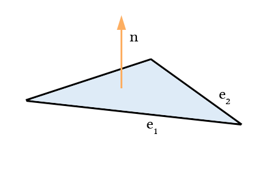
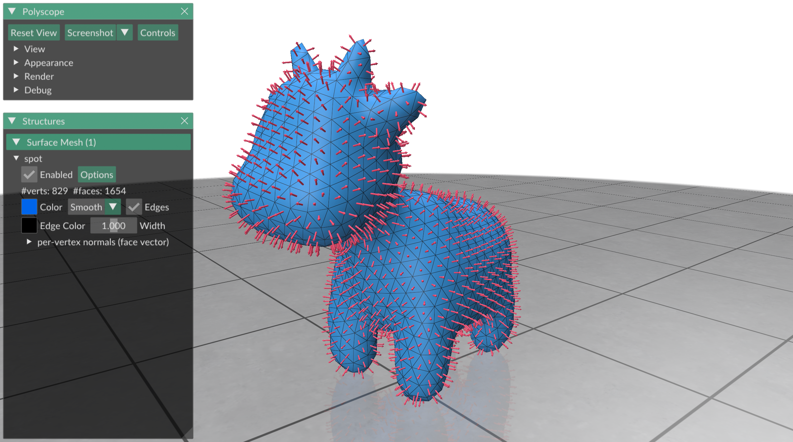
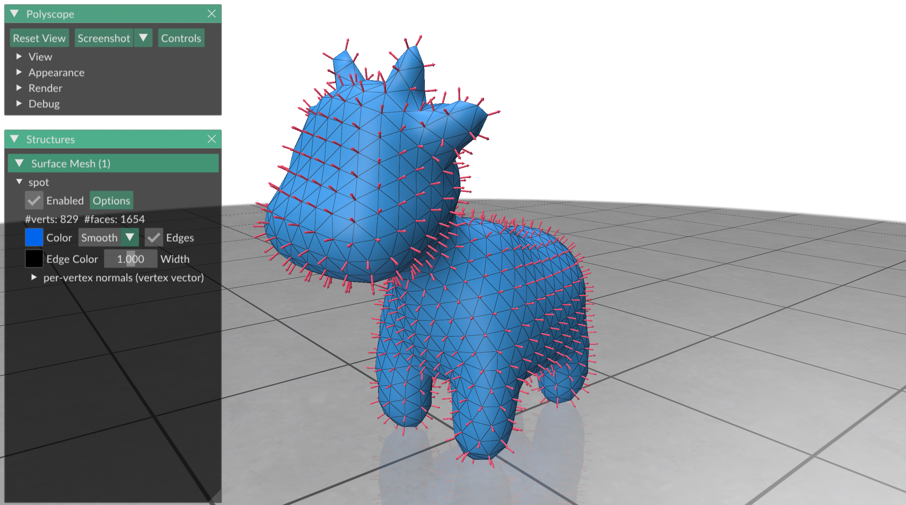

# Normals

In this exercise we will learn what surface normals are, and how to compute
per-face and per-vertex normals in gptoolbox.


## Perpendicular and normal

Two vectors `[x1, y1, z1]` and `[x2, y2, z2]` are perpendicular to each other
(also called _orthogonal_) if
their dot product (or scalar product) is equal to zero:
`[x1, y1, z1]' * [x2, y2, z2] == x1*x2 + y1*y2 + z1*z2 == 0`.

These two vectors are perpendicular:


These two vectors are not perpendicular:


A vector's norm is the square root of its scalar product with itself:
`norm([x y z]) == sqrt(x*x + y*y + z*z)`.
A vector with norm one is also called a _unit vector_.

A vector can be normalized (which means, converted into a parallel vector
of unit norm), unless it has zero length, via the operation
```MATLAB
>> x = x / norm(x)
```

For a collection of vectors in a matrix, where each row of the matrix
corresponds to a vector, one can use gptoolbox's `normrow` function to compute
a vector that contains the norm of each row in the matrix, and then
componentwise divide by it to obtain normalized vectors:
```MATLAB
>> X = X ./ normrow(X)
```

It is possible to project any vector `u1 = [x1, y1, z1]` onto the
_orthogonal complement_ of a second vector `u2 = [x2, y2, z2]` in order to obtain
two perpendicular vectors by performing an orthogonal projection
`u1 - (u1'*u2)*u2/(u2'*u2)`:
```MATLAB
>> u1

u1 = rand(3,1)

     -0.33172
     -0.15407
      0.47622

>> u2 = rand(3,1)

u2 =

      0.95751
      0.96489
      0.15761

>> u1' * u2

ans =

     -0.39123

>> u1 = u1 - (u1'*u2)*u2/(u2'*u2)

u1 =

     -0.13168
     0.047507
      0.50915

>> u1' * u2

ans =

  -2.7756e-17

```

The resulting projected vector, in this case `u1`, is guaranteed to be the closest vector to to the
original `u1` that is orthogonal to `u2` with respect to the norm.


Given non-parallel vectors `u1`, `u2` (which means two vectors that are not
simply rescalings of each other), we can construct a third vector that is
orthogonal to both `u1` and `u2` using the
[cross product](https://en.wikipedia.org/wiki/Cross_product)
`cross(u1, u2) == [u1(2)*u2(3) - u1(3)*u2(2), u1(3)*u2(1) - u1(1)*u2(3), u1(1)*u2(2) - u1(2)*u2(1)]`.
```MATLAB
>> u3 = cross(u1,u2)

u3 =

     -0.48378
      0.50827
     -0.17255

>> u3'*u1

ans =

   1.3878e-17

>> u3'*u2

ans =

     0
```

If you plug matrices `U1`, `U2`, where each row is a 3D-vector into `cross`,
then the function will return a matrix where each row is the cross product
of the corresponding two rows in `U1` and `U2`.

The cross product has many interesting mathematical properties.
We will highlight two important ones here:
* The norm of the cross product vector `cross(u1,u2)` is equal to twice the area
of the triangle whose edges are `u1`, `u2`.
* The cross product is _antisymmetric_, i.e., `cross(u1,u2) == -cross(u2,u1)`.
This means the cross product is oriented, and can be used to tell which side
is _up_ and which side is _down_.
If `u1` points in the direction of the x-axis, and `u2` points in the
direction of the y-axis, then `cross(u1,u2)` will point _up_ in the direction of
the z-axis
(more on that in the next section).


## Per-face normals

Each triangle of a mesh has a _normal vector_: the oriented unit vector that is
perpendicular to the triangle itself (i.e., to each triangle edge).
* The normal vector `n` is perpendicular, which means that for each edge `e`
in the triangle, `n' * e == 0`.
* The normal vector `n` is a unit vector, which means that `norm(n) == 1`.
* The normal vector `n` is oriented so that it points _up_ of the triangle.

The orientation of the normal vector means that, for any two _consecutive_ edges
`e1`, `e2` in the triangle, the normal vector can be computed using
```MATLAB
>> n = cross(e1, e2);
>> n = n / norm(n);
```
The two edges `e1`, `e2` have to be two consecutive edges of the triangle.
The convention is that the triangle edges are visited in a counterclockwise
direction, looking down onto the triangle from above.
If a normal points in the wrong direction, it is called a _flipped normal_.

Here is a picture of a triangle and its normal vector:



In gptoolbox the `normals` command returns the unnormalized normals (so the 
normals are potentially not of length one) of any mesh.
Each of the rows returned 
by `normal` corresponds the unnormalized normalvector of the face with the 
respective index. In order to normalize them, one can divide by `normrow`:
```MATLAB
>> N = normals(V,F);
>> N = N ./ normrow(N);
```

The resulting vectors can be plotted with gptoolbox's `qvr` function, which
takes as its argument first the 3D locations at which vectors are to be
plotted, and then the vector itself (which might need to be scaled in order
to display properly).
In order to plot multiple things at the same time, MATLAB requires us to issue a
`hold on` command before our second plot command:
```MATLAB
>> t = tsurf(F,V);
>> hold on;
>> qvr(barycenter(V,F), N);
```
(the `barycenter` command computes the center of each triangle, which is the
location at which we want to plot each per-face vector)



If all triangles are consistently oriented so that the _up_ side of each
triangle faces _outside_ of the shape, then all normals will point away from
the shape, as can be seen in above image.
Inconsistent orientation of trinagles can easily be detected by looking at the
normals.
Because of that, users will sometimes refere to orientations
that restore triangle orientation as _fixing normals_.


## Per-vertex normals

Smooth surfaces also have normal vectors.
Smooth normal vectors are oriented unit vectors that are perpendicular to a
surface at every point, although the notion of perpendicularity is a bit more
complicated for smooth surfaces (see
[the Wikipedia article](https://en.wikipedia.org/wiki/Tangent_space) for the
definition of a tangent space - smooth normal vectors are perpendicular to the
tangent space of a surface at each point).
Since smooth surfaces have normal vectors at every point, it is natural to want
to compute normal vectors at other parts of our mesh than just at triangle
faces.
For many applications we want _per-vertex normals_, where each vertex of the
mesh is associated with a vector in 3D.
In gptoolbox, such a per-vertex normal can be computed with the function
`per_vertex_normals`.
`per_vertex_normals` takes as an input our mesh as a list of vertices `V` and
faces `F`, and returns matrix of normal vectors `N`, where each row of `N`
corresponds to a normalized normal vector at the vertex with the respective
index.

Since at a vertex there are no edges that a vector can be required to be normal
to, there is no unique definition of a per-vertex normal.
There are a variety of definitions that are used in geometry processing.
Here we will look at three definitions that are based on averaging the
per-face normals:

* *Uniform averaging.*
The normal at each vertex is the average of all the normals of faces
that contain the vertex.
In gptoolbox it is computed using
```MATLAB
>> N = per_vertex_normals(V, F, 'Weighting','uniform');
```

* *Area-weighted averaging*
The normal at each vertex is the average of all the normals of faces 
containing the vertex, where each normal
is weighted by the area of the triangle it corresponds to before averaging
(this is also the default choice if no weighting is specified at all).
In gptoolbox it is computed using
```MATLAB
>> N = per_vertex_normals(V, F, 'Weighting','area');
```

* *Angle-weighted averaging*
The normal at each vertex is the average of all the normals of faces containing
the vertex, where each normal is weighted by the _tip angle_, the angle at the
vertex in the normal's face.
In gptoolbox it is computed using
```MATLAB
>> N = per_vertex_normals(V, F, 'Weighting','angle');
```

Here is an image of spot with area-weighted per-vertex normals.
If you are not sure which weighting to use, area weighted normals are probably
a reasonable choice.

```MATLAB
>> N = per_vertex_normals(V, F, 'Weighting','area');
>> t = tsurf(F,V, 'CData',u);
>> hold on;
>> qvr(barycenter(V,F), N);
```



## Exercises

If you are learning geometry processing, try writing the following functions:
* `my_normals`, which matches the behavior of `gptoolbox`'s `normals` function.
* `my_per_vertex_normals`, which matches the behavior of `gptoolbox`'s
`per_vertex_normals` function.
Use gptoolbox's `doublearea` function, which returns double the area for each
triangle in the mesh.

If you already know geometry processing well and are familiar with the concept
of normals of (or have already completed above exercise),
try writing the following functions which tests your mastery of normals:
* `flipped_normals`, which returns the flipped normals of a triangle mesh.
* `tangents`, which returns two perpendicular, oriented tangent vectors for each
face of a triangle mesh.
HINT: use MATLAB's `dot(U,V,2)` function, which can perform row-wise scalar
products.


As usual, the skeleton for these functions, ready for you to fill in, can be
found in `exercise/`.
Test your functions on `data/spot.obj` and `data/spot_low_resolution.obj`.
