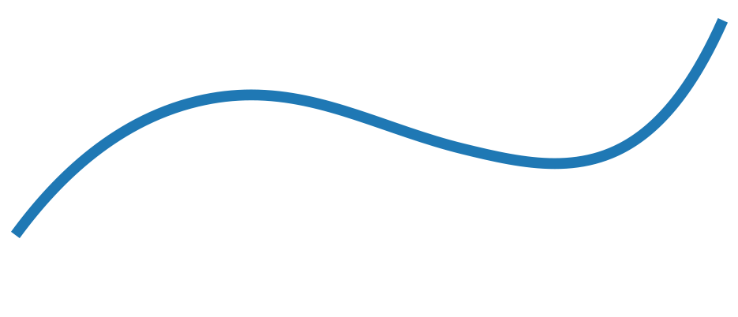
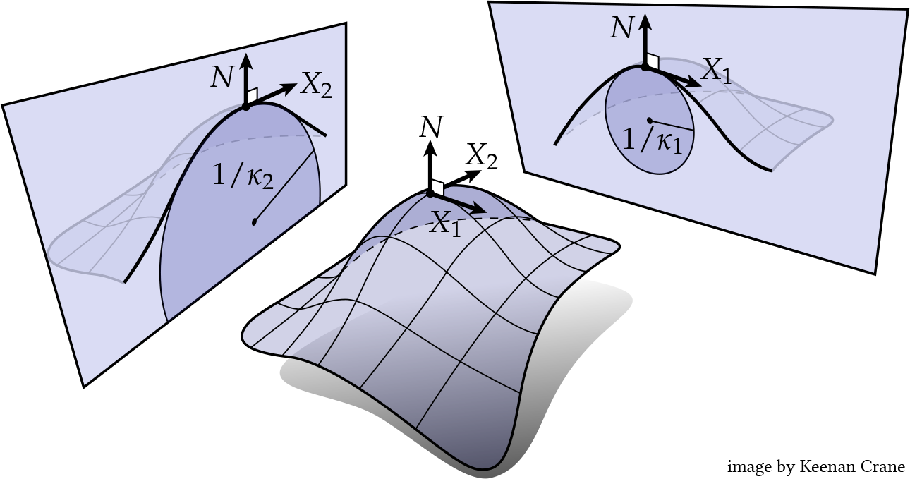

# Curvature

In this exercise we will learn what the curvature of a surface is, how
it is defined, and how it is computed.

This exercise only offers a very rudimentary introduction to curvature.
For a more in-depth introduction, please see
[this geometry processing course](https://github.com/alecjacobson/geometry-processing-curvature)
(after which some of this document is modeled)
or [this introduction to discrete geometry](https://www.cs.cmu.edu/~kmcrane/Projects/DDG/).


## Curvature of a curve

Let's start by looking at the curvature of a simple 1-dimensional line in
the plane.



The [curvature](https://mathworld.wolfram.com/Curvature.html) of this line at
any point can be computed with the aid of its
[osculating circle](https://mathworld.wolfram.com/OsculatingCircle.html):
the circle that snugly fits the curve at the evaluation point.


The _curvature_ of our curve at this point is then, simply, the inverse of the
radius of the osculating circle,
.


If we can fit an infinitely large circle at this point, there is zero curvature
(the curve is straight).
If we can only fit a very small circle at this point, the curvature is very
high.
This coincides with our intuitive understanding of curvature.

If we _orient_ our circle, which means giving it a unique normal vector at
every point (see [exercise 008](../008_normals/008_normals.md) for an
introduction to normal vectors on surfaces), then our curvature also gains
a sign.
Depending on which side of the curve the osculating circle is on, our curvature
has the sign +1 (if normal vector and circle are on different sides) or
-1 (if normal vector and circle are on the same side).
This gives us the updated formula
, where
σ(x) decides whether osculating circle and normal vector are on the same side
or not, as described above.


The actual mathematics of curvature is more complicated than discussed in this
short introduction, and features calculus on smooth curves to come up with
a precise definition.
You are encouraged to consult the courses mentioned at the beginning of this
exercise for a more mathematical introduction to curvature.


## Principal curvatures

On 2-dimensional surfaces there is no unique osculating circle, as there is with
1-dimensional curves.
However, we can still generalize the 1-dimensional notion to surfaces to a
concept called _normal curvature_.

At every point, we can intersect a surface with a plane.
Then the intersection of the plane and the surface forms a 1-dimensional
curve in a 2-dimensional plane, and we can compute the signed curvature κ,
as we have done above.
This curvature is the _normal_ curvature associated with that plane, and as our
surface has a normal vector, it is a signed curvature.


Two of these normal curvatures are special, and they are called principal
curvatures.
* **κ<sub>1</sub>** is the _smallest_ (signed) normal curvature generated by any 
intersecting plane.
Its associated direction (that is, the vector in the plane that is tangent
to the intersection curve) is its _principal curvature direction_
**X<sub>1</sub>**.
* **κ<sub>2</sub>** is the _largest_ (signed) normal curvature generated by any 
intersecting plane.
Its associated direction (that is, the vector in the plane that is tangent
to the intersection curve) is its _principal curvature direction_
**X<sub>2</sub>**.



These principal curvatures are special normal curvatures, and they contain a lot
of curvature information within them without looking at all the other normal
curvatures.
If the two principal curvatures are 0, then the surface is completely flat like
the flat plane.

Principal curvatures are only well-defined on smooth surfaces.
We can however evaluate discretizations of principal curvatures on discrete
surfaces that approximate the principal curvatures on smooth surfaces in some
way.
The integrated values of these principal curvatures (integrated over the
neighborhood of each vertex) can be computed in gptoolbox using
```MATLAB
>> kappa = discrete_curvatures(V,F);
```


## Mean curvature

The first kind of scalar curvature for surfaces that we compute is the _mean
curvature_.
If κ<sub>1</sub> and κ<sub>2</sub> are the small and large principal
curvatures, the mean curvature is defined as their average:

.

What does the mean curvature tell us?
Surfaces with zero mean curvature are minimal surfaces, which means that they
locally minimize their area.
If you modify the surface a little bit, you will always increase the area of
the surface, hence locally minimal.
Zero mean curvature does not tell us that the surface is flat: if
κ<sub>1</sub> = -κ<sub>2</sub>, the mean curvature is zero even if the
individual principal curvatures are not.

Again, since mean curvature is only really well-defined for smooth surfaces,
we have to compute some approximation for discrete surfaces such as triangle
meshes.
The theory behind the computation of the mean curvature for triangle meshes
requires theoretical knowledge that we have not yet obtained in this course.
But we can use gptoolbox's mean curvature command as a black box to look at the
integrated mean curvature of a surface:
```MATLAB
>> H = discrete_mean_curvature(V,F);
>> t = tsurf(F,V, 'CData',H);
>> v = max(abs([min(H), max(H)]));
>> caxis([-v, v]);
```

In the following image you can see the mean curvature displayed on two surfaces,
where red is positive mean curvature, white is zero mean curvature, and blue
is negative mean curvature.


## Gaussian curvature

The second kind of scalar curvature for surfaces that we compute is the
_Gaussian_ (or _Gauss_) curvature.
If κ<sub>1</sub> and κ<sub>2</sub> are the small and large principal
curvatures, the Gaussian curvature is defined as their product:


A very special property of the Gaussian curvature is that it is entirely
_intrinsic_ to the surface.
This means that if we isometrically deform a surface, that is without distorting
the angles between any vectors, and without stretching or compressing any
vectors, the Gauss curvature at any point will remain the same.

For a triangle mesh, an intrinsic deformation means a deformation during which
all edge lengths remain the same.
Thus, all these configurations have the same Gaussian curvature, but they have
different mean curvatures:


The fact that the Gaussian curvature is intrinsic to the surface is the
statement of Gauss's famous
[theorema egregium](https://mathworld.wolfram.com/GausssTheoremaEgregium.html).

The sign of a surface's Gaussian curvature helps us classify it.
* Points with negative Gaussian curvatures are _saddle points_ or _hyperbolic
points_, and surfaces consisting only of hyperbolic points are
_hyperbolic surfaces_.
Saddle points have "too much" area at each point compared to a flat point, so
the surface bunches up around the point like a saddle.
* Points with zero Gaussian curvature are _developable points_, and
surfaces for which every point has zero Gaussian curvature are _developable
surfaces_.
Such surfaces can be deformed isometrically (without distortion) to a flat
plane, and thus, for example, assembled from flat pieces of paper by bending.
* Points with positive Gaussian curvatures are _spherical points_.
Surfaces consisting of entirely spherical points are _spherical surfaces_.
Spherical points have "not enough" area at each point compared to a flat point,
so the surface contracts around the point.


Technically, as before, the Gaussian curvature is only well-defined on smooth
surfaces, and not on discrete surfaces such as triangle meshes.
We can, however, compute a quantity on triangle meshes that behaves very much
like the integral of the actual Gaussian curvature on smooth surfaces, and that
even approximates it when the surface is refined to be more and more detailed.

For a point that is intrinsically flat, that is, it can be transformed into
a flat surface without changing any of the edge lengths, the sum of all
angles in triangles around this point will always sum to 2π:


Thus, we can measure the failure of a point's adjacent angles to sum up to
2π with the quantity known as the _angle defect_:


Notice that the angle defect becomes _negative_ when the angles adjacent to our
point are larger than 2π (i.e., there is too much surface around the point
and it is hyperbolic), it is _zero_ when the angles sum to exactly 2π,
and it is _positive_ when the angles adjacent to our point are less than 2π
(i.e., there is not enough surface around the point and it is spherical).

The angle defect, behaves like a discrete version of the
Gaussian curvature on triangle meshes.
* The angle defect is intrinsic, very much like the Gauss curvature.
* It is zero if a surface can be flattened without changing the triangle edge
lengths
* In the limit of refinement, it will approximate the integrated Gaussian curvature of
a smooth surface approximated by the triangle mesh.

(This whole discussion ignores what happens at the boundary of the mesh.
It is not immediately clear what to do at the boundary with respect to discrete
Gaussian curvature, and there are multiple approaches to address this.)

See [here](https://www.cs.cmu.edu/~kmcrane/Projects/DDG/) for a more detailed
treatment of the angle defect that features a thorough theoretical foundation
for its properties.

In gptoolbox we can compute the integrated Gaussian curvature of a triangle mesh
via the angle defect using the function `discrete_gaussian_curvature`:
```MATLAB
>> k = discrete_gaussian_curvature(V,F);
```

In the following image you can see the Gauss curvature displated on two
surfaces (exaggerated to better show values close to 0).
Red is positive Gauss curvature, white is zero Gauss curvature, and blue
is negative Gauss curvature.


## Applications of curvature

There is a variety applications of curvature beyond the few canonical ones
mentioned above (minimal surfaces for mean curvature, developable surfaces
for Gauss curvature).
For example, one can smooth surfaces by optimizing their curvature
(see [here](http://multires.caltech.edu/pubs/ImplicitFairing.pdf) and
[here](https://www.cs.cmu.edu/~kmcrane/Projects/ConformalWillmoreFlow/)).

A neat little application for principal curvatures is to add a "dirt" effect
to corners and indentations of surfaces when drawing them.
In the real world dust, dirt and grime accumulate in the crevices of objects
where they can get caught, i.e., where it is easier for particles to get in than
out.
This can be faked by coloring places darker where the principal curvatures are
negative, as can be seen in this image:


One of the exercises consists of you trying to generate your own such effect!


## Exercises

If you are learning geometry processing, try writing the following function:
* `my_discrete_gaussian_curvature`, which matches the behavior of `gptoolbox`'s
`discrete_gaussian_curvature` function.

If you already know geometry processing well and are familiar with the concept
of curvature (or have already completed above exercise),
try writing the following function which tests your mastery of curvature:
* `draw_with_grime`, which takes a triangle mesh and plots it in a way that
simulates dirt and grime in the crevices of the object.

As usual, the skeleton for these functions, ready for you to fill in, can be
found in `exercise/`.
Test your functions on `data/spot.obj`, `data/armadillo.obj` and `data/bunny.obj`.
