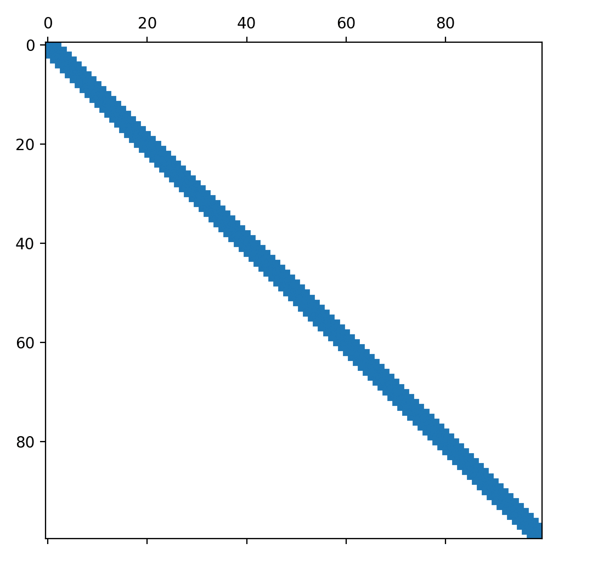
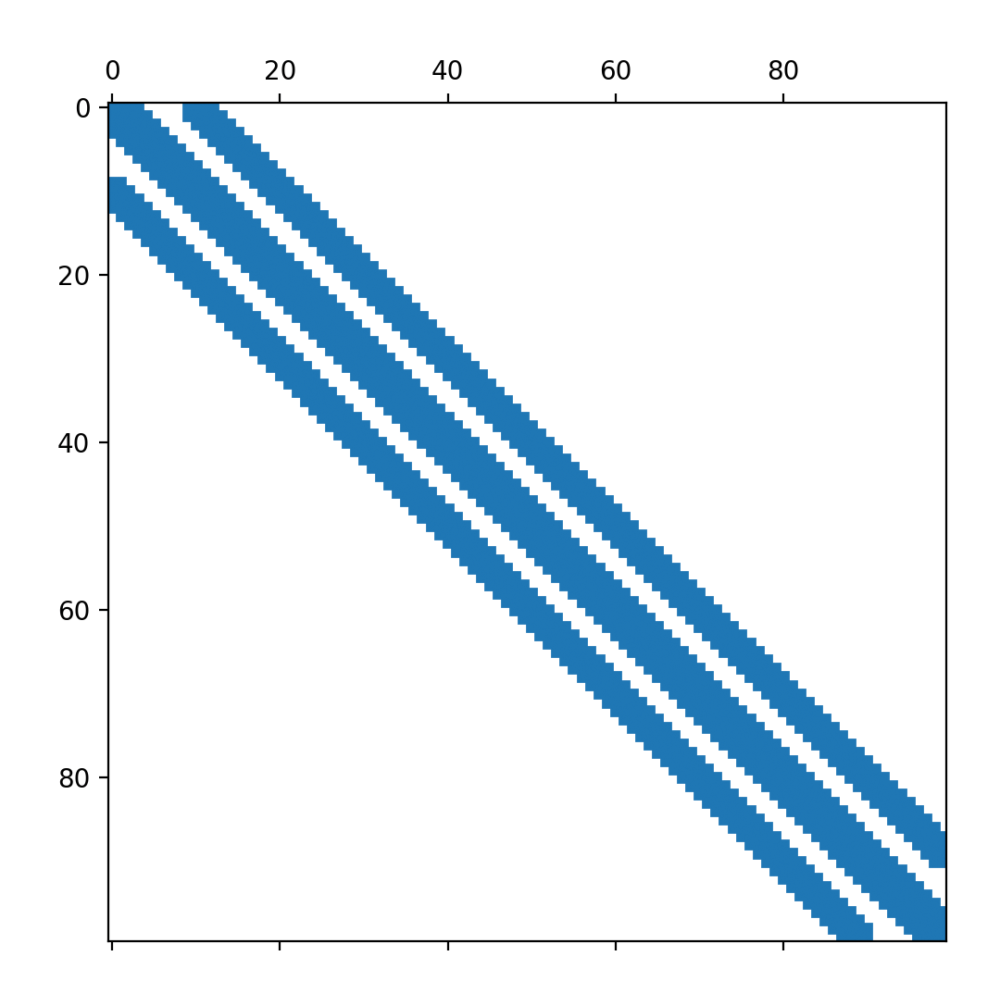

# Sparse matrices
In this exercise we will learn what sparse matrices are, and how to construct
them with MATLAB.
Sparse matrices are an important tool for many linear algebra applications, and
are used by many different geometry processing methods.


## Dense matrices

All matrices that we have used so far in MATLAB, created via the syntax
`A = [1, 2, 3; 4, 5, 6; 7, 8, 9]` have been _dense_ matrices.
What this means is that the computer stores every single value of the matrix:
for a matrix with `n` rows and `m` columns this means that a storage capacity
of `n*m` is required.
This seems reasonable, and also the only way to store a matrix like `A`.
After all, every entry has a different value, so we need to store every entry.

We can see that `A` is a dense matrix by using MATLAB's `issparse` command.
If it returns `false` (a logical `0`), then the matrix is dense:
```MATLAB
>> A = [1,2,3; 4,5,6; 7,8,9];
>> issparse(A)

ans =

  logical

   0
```

But what when the matrix contains entries that are mostly the same, with only
a few one different?
For such matrices it does not make sense to store every single value in memory.
For very large matrix systems, it can even be impossible to store everything in
memory.
For a linear system `A*x = b`, `x` has `n` rows and `A` has `n^2` elements.
Since `n^2` grows much faster than `n`, it can be impossible to fit `A` into
memory if `n` is large.


## Sparse matrices

The solution to the storage problem of matrices is to use _sparse_ matrices.
If most of the entries of a matrix have one value, we can store only the values
that are different from that value.
Without loss of generality, let's pick `0` as the value of most entries.
This is true in practice for many applications, and if it is not, then it is
easy to just add a constant matrix.

There are many ways to store all nonzero values.
One could store the row and column information for all nonzero values like so:
```
(row1, col1, val1)
(row2, col2, val2)
...

(rowk, colk, valk)

```
This format is called
[coordinate list](https://en.wikipedia.org/wiki/Sparse_matrix#Coordinate_list_(COO)).
It is not the format used by MATLAB internally, but it is important, as it is
very easy to construct sparse matrices from this format, and MATLAB displays
sparse matrices as a coordinate list when prompted.

A more popular format is the
[compressed sparse row format](https://en.wikipedia.org/wiki/Sparse_matrix#Compressed_sparse_row_(CSR,_CRS_or_Yale_format)).
In this format one stores, for each row, the number of nonzero entries,
the column for the nonzero entries in each row, and a pointer into a large
vector of values for each nonzero entries.
This format is particularly beneficial for a variety of linear algebra
algorithms.

It is, in most cases, not important to know which sparse matrix format is used
by your application.
Your linear algebra library should correctly handle all sparse matrix
operations.
Asymptotically, all sparse matrix formats are similar:
their most important property is the fact that they only store the nonzero
matrix entries.

How can we construct sparse matrices in MATLAB?
The easiest way is taking a dense matrix and transforming it into a sparse
matrix via the `sparse` command:
```MATLAB
>> A = [0, 0, 1; 0, 1, 0; 0, 2, -1];
>> As = sparse(A)

As =

   (2,2)        1
   (3,2)        2
   (1,3)        1
   (3,3)       -1

>> issparse(As)

ans =

  logical

   1
```

This method is however not practical for constructing large matrices, since it
requires us to construct a dense matrix first, which is exactly what we are
trying to avoid.
To construct a general sparse matrix, we also use the `sparse` command, but
with the syntax `sparse(rows, cols, values, m, n)`.
We provide the `sparse` command with triples in the coordinate list format:
the first value of the triple (which row) in the `rows` vector, the second
value of the triple (which column) in the `cols` vector, and the third
value of the triple (which matrix entry value) in the `values` vector.
`m` and `n` specify the number of rows and columns in the sparse matrix,
respectively.
```MATLAB
>> rows = [2;3;1;3];
>> cols = [2;2;3;3];
>> values = [1;2;1;-1];
>> As = sparse(rows, cols, values, 3, 3)

As =

   (2,2)        1
   (3,2)        2
   (1,3)        1
   (3,3)       -1
```

This method allows us to construct arbitrarily large sparse matrices by only
enumerating nonzero elements, and is the most general way to construct a
sparse matrix in MATLAB.

There are two more specialized ways to construct sparse matrices in MATLAB:
identity matrices and diagonal/banded matrices.
We have already dealt with dense identity matrices.
A sparse identity matrix is the same thing:
a matrix with ones on the diagonal, and zeros elsewhere.
It is constructed in MATLAB via the command `speye(rows,cols)`:
```MATLAB
>> speye(4,4)

ans =

   (1,1)        1
   (2,2)        1
   (3,3)        1
   (4,4)        1
```
With `speye` we can immediately visualize the advantage of sparse matrices.
While it is impossible to construct giant dense identity matrices, it is quick
and easy to do so for giant sparse identity matrices:
```MATLAB
>> n = 100000;
>> eye(n);
Error using eye
Requested 100000x100000 (74.5GB) array exceeds maximum array size preference. Creation of arrays greater than this limit may take a long time and cause MATLAB to become
unresponsive. See array size limit or preference panel for more information.
 
>> speye(n,n);
(no error)
```

A diagonal matrix is a matrix that has arbitrary values on the diagonal, but
zeroes elsewhere.
It is constructed via the command `spdiags(v,0,rows,cols)`, where the diagonal
values are supplied in the vector `v`.
```MATLAB
>> v = [1;2;3;4;5;6];
>> spdiags(v,0,6,6)

ans =

   (1,1)        1
   (2,2)        2
   (3,3)        3
   (4,4)        4
   (5,5)        5
   (6,6)        6
```

The concept of a diagonal matrix extends to the concept of banded matrices.
Banded matrices are zero, except for the diagonal and a number of off-diagonal
diagonals.
The central diagonal has index `0`, and other diagonals are referenced
by their positive or negative distance from the central diagonal.
`spdiags` can construct banded matrices via the command
`spdiags(v, diagonals, rows, cols)`, where `v` contains the diagonal values,
and `diagonals` contains the diagonal index for each column in `v`.
```MATLAB
>> n = 6;
>> v1 = ones(n,1);
>> v2 = -2*ones(n,1);
>> v = [v2 v1 v2];
>> L = spdiags(v, [-1 0 1], n, n)

L =

   (1,1)        1
   (2,1)       -2
   (1,2)       -2
   (2,2)        1
   (3,2)       -2
   (2,3)       -2
   (3,3)        1
   (4,3)       -2
   (3,4)       -2
   (4,4)        1
   (5,4)       -2
   (4,5)       -2
   (5,5)        1
   (6,5)       -2
   (5,6)       -2
   (6,6)        1
```

Using the function `cspy` allows us to quickly look at the _sparsity pattern_
of a matrix.
The function shows us where the matrix contains nonzero elements, and whether
they are positive or negative.
This can be very useful for debugging your sparse matrix construction
algorithm.
Here's what the identity matrix and the banded matrix look like:
```MATLAB
>> n = 100;
>> cspy(speye(n,n))
>> v1 = ones(n,1);
>> v2 = -2*ones(n,1);
>> v = [v2 v1 v2];
>> L = spdiags(v, [-1 0 1], n, n);
>> cspy(L)
```





## Sparse linear systems

One of the important things we can do with sparse matrices is solving sparse
linear systems, `A*x=b`.
There are specialized algorithm for the solution of sparse linear systems that
are more efficient than the usual dense algorithm.
In MATLAB, this can be done with the same `\` operator as for dense systems.
```MATLAB
>> n = 8;
>> v1 = ones(n,1);
>> v2 = -2*ones(n,1);
>> v = [v2 v1 v2];
>> L = spdiags(v, [-1 0 1], n, n);
>> (L + 0.2*speye(n,n)) \ ones(n,1)

ans =

   -0.4760
   -0.7856
   -0.4954
   -0.0116
   -0.0116
   -0.4954
   -0.7856
   -0.4760
```

For some algorithms, solving a linear system involves two steps:
* decomposition; and
* solution.

Decomposition involves only the matrix `A` and not the right-hand side `b`.
Decomposition is also more expensive than just the solution step.
Thus, if we have to solve two linear systems, `A*x=b` and `A*x=c`, we can
save time by only performing the decomposition step once.
This can be done with the MATLAB command `decomposition`:
```MATLAB
>> d = decomposition(A);
>> d \ ones(n,1)

ans =

   -0.4760
   -0.7856
   -0.4954
   -0.0116
   -0.0116
   -0.4954
   -0.7856
   -0.4760

>> d \ [1;2;3;4;5;6;7;8]

ans =

   -3.6853
   -2.7112
    1.0586
    1.8463
   -1.9508
   -5.5168
   -4.3593
   -0.5988
```


## Exercises

Try writing the following functions which tests your mastery of sparse matrices:
* `four_corners`, which constructs a `m x n` sparse matrix with ones in all
of its four corners.
* `my_spdiags`, which mimics the behavior of MATLAB's `spdiags` and allows the
construction of banded matrices.
* `triangles_matrix`, which constructs a sparse matrix with a triangular
nonzero pattern.

As usual, the skeleton for these functions, ready for you to fill in, can be
found in `exercise/`.
