# Subdivision
In this exercise we will learn the basics of loop subdivision, a way to create
a fine, smooth, dense mesh from a coarse control mesh.

This is only a rough introduction.
For a more in-depth treatment of Loop subdivision, you are encouraged to read
the original [master's thesis](https://www.microsoft.com/en-us/research/publication/smooth-subdivision-surfaces-based-on-triangles/),
or follow [this online course](https://graphics.stanford.edu/~mdfisher/subdivision.html)
(which also inspires this exercise).


## Coarse meshes and upsampling

It is easier to design _coarse_ meshes (that is, meshes with only a few
vertices) than _fine_ meshes (meshes with many vertices).
It is also easier to perform mathematical operations and run mathematical
algorithms on coarse meshes.
Here is a coarse mesh of a mug that I quickly drew in a mesh-editing software:

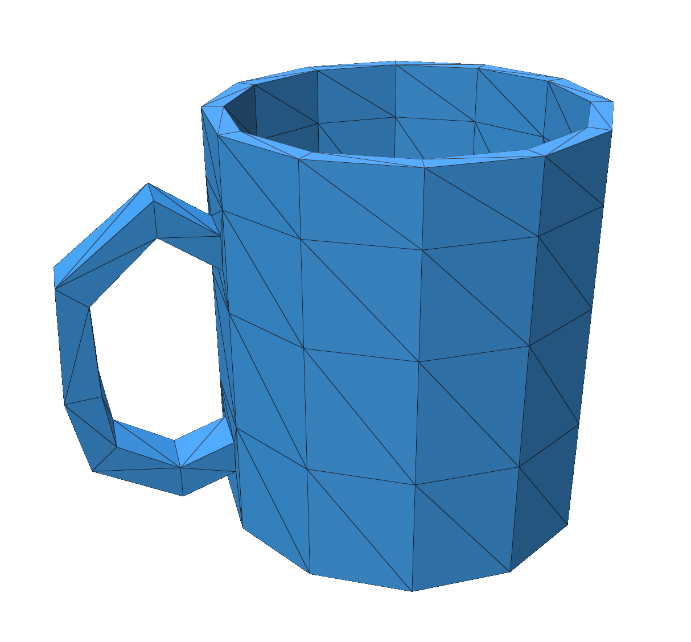

This does not look as good as it could.
While it might be advantageous to design and compute things on coarse meshes,
once we display, we usually want to display a fine, dense and smooth mesh.
One way to do this is to replace each triangle with four triangles.
That way we add more fidelity and detail to our mesh:

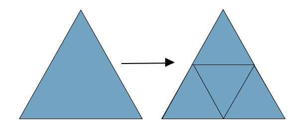

This is how this looks for our mug, applied three times, and displayed below
with edges and without:

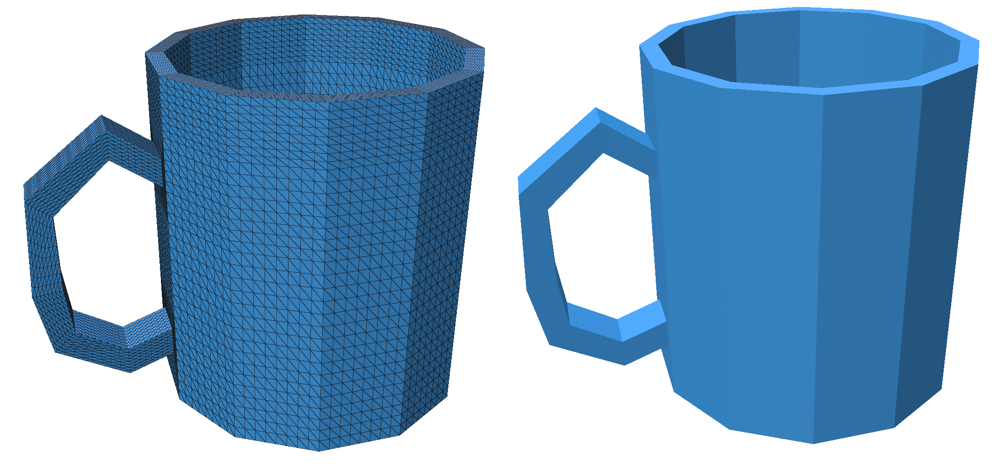

We can see that, even though we have added more vertices, faces, and edges to
our surface (and it is now computationally more complex), we have not actually
added any more visual detail.
In order to add visual detail during the subdivision process, we need to use a
smooth subdivision algorithm.


## One-dimensional subdivision

Let us first consider a one-dimensional curve that we want to upsample and
smooth at the same time, resulting in a smooth, high-dimensional surface.
The red vertices are the initial coarse vertices of the curve that are
supplied to us.

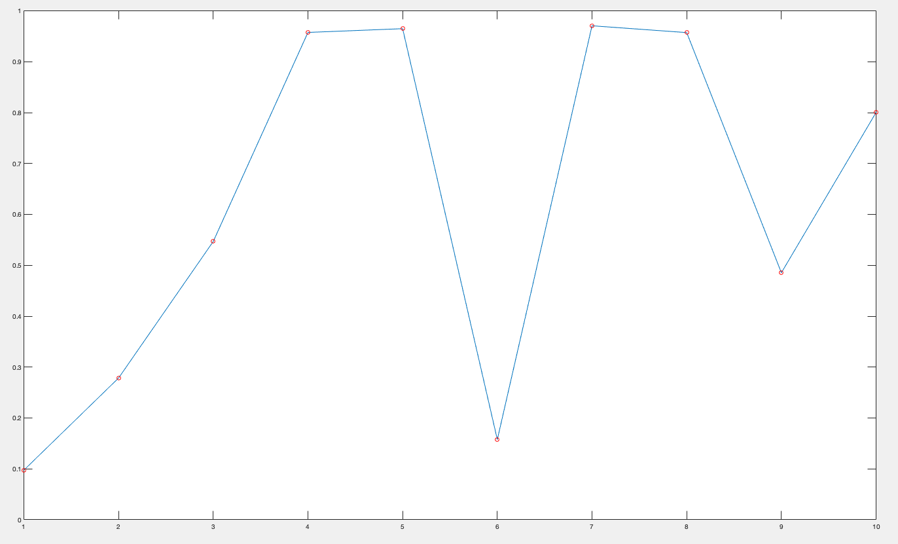

As a first step in our subdivision process, let's add a new vertex in the middle
of each line segment (like with our naive upsampling earlier).
This is how that looks like, with the added points in green:

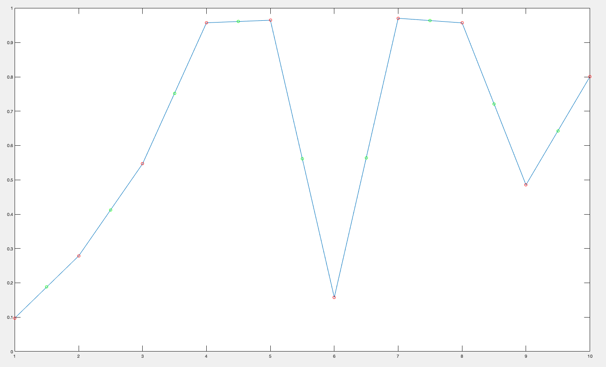

This is not enough, as we have seen above.
If one continues doing just that, then complexity is added, but without any
gained smoothness.
So, let's try to make this curve a little bit smoother.
A standard technique for smoothing everything is to average data.
So, let us try to smooth this curve by moving the line vertices which used to
be at the red points to the averages of their green neighbors:

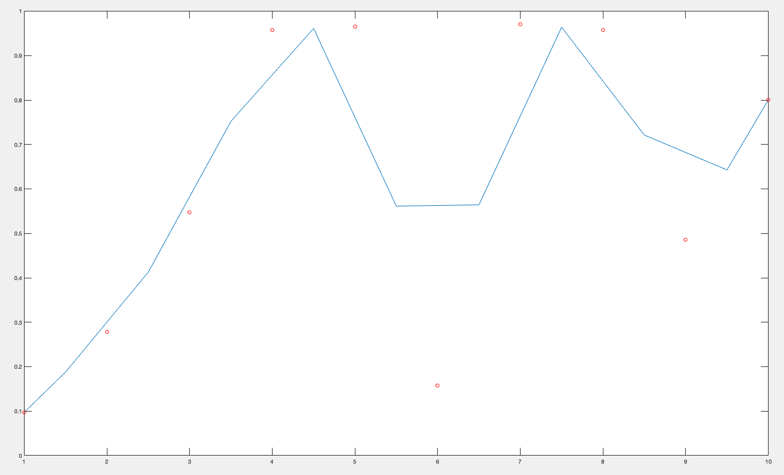

The curve already has higher detail, and is smoothed a bit.
If we repeat this process for three more times, we get:

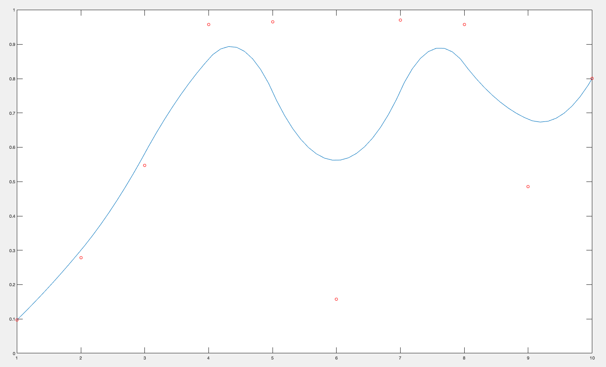

The red dots, which are still plotted here, are called the _control points_.
They are the original, coarse curve's vertices.
While the smooth curve does not exactly pass through them, their position does
control the ultimate position of the smooth, high-resolution curve.
In an interactive editor, you might be able to move around these control points
and observe the smooth curve transform in real time.


## Loop subdivision

Let's now return to our coarse surface.
We can not use the same naive averaging strategy for triangles as we did for
1-dimensional line segments.
For triangle meshes, we move the vertices after upsampling using an algorithm
called _Loop subdivision_, named after its inventor
[Charles Loop](https://www.microsoft.com/en-us/research/publication/smooth-subdivision-surfaces-based-on-triangles/).

A step of loop subdivision is based on the same concept as the naive subdivision
above.
Every triangle is replaced by four new triangles.
As in the 1-dimensional example, we mark the old vertices in red, and the new
vertices in green:

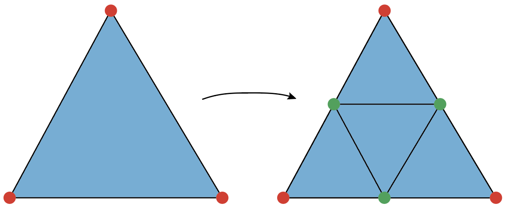

The first question is, where do we place the new, green vertices.
Every green vertex in the interior of the mesh is contained in exactly two old
triangles.
The position of such vertices is the average of all the positions of the old
vertices with the following weights:

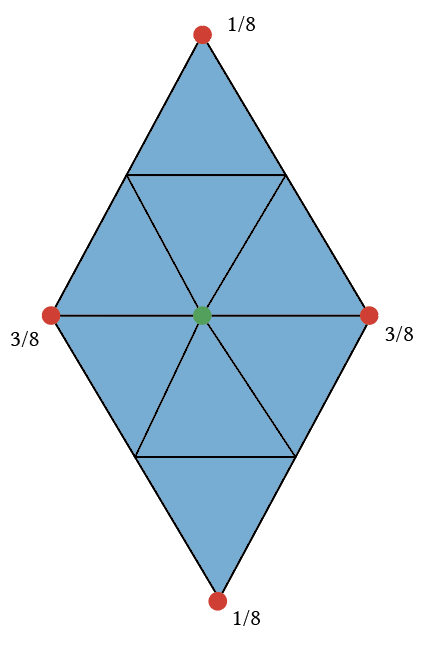

If the new green vertex is on the boundary of the mesh, it is simply inserted in
the exact middle of the old edge:

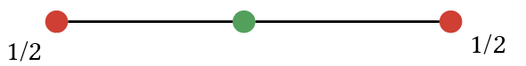

Now that we have placed the new, green vertices, we need to move the old, red
vertices to produce a smooth subdivision scheme.
Remember, if we do not do this, our subdivision is a simple upsampling
procedure that adds vertices to our surface without actually changing its
appearance.
We move an interior red vertex to the following weighted average of its own
position, as well as the position of all of its new green neighbors:

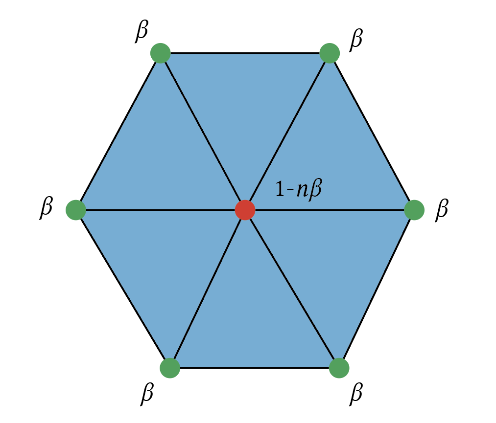

What exactly is the coefficient β?
gptoolbox uses
, where n is the number
of green neighbors of the moved red vertex
(even though the image above shows only six neighbors, in practice there
can be an arbitrary number of neighbors ≥3).
There are, however, other choices for β.
[Matthew Fisher](https://graphics.stanford.edu/~mdfisher/subdivision.html),
for example, uses 
(Warren's coefficient, see
[this lecture](https://www.cs.princeton.edu/courses/archive/fall06/cos526/lectures/subdivision.pdf)).

The only remaining rule is the rule for the old, red vertices on the boundary.
We use the following weighted average:


The resulting Loop subdivision algorithm offers a cheap and simple way to get
a smooth, high-resolution surface that looks pleasing from very coarse meshes.
Loop subdivision has a variety of interesting mathematical properties that make
it particularly desirable, see, for example,
[this article](https://www.dgp.toronto.edu/public_user/stam/reality/Research/pdf/loop.pdf)
for a discussion.

In gptoolbox, Loop subdivision is implemented in the `loop(V,F,k)` command,
which will subdivide the surface `V,F` `k` times.
For example, the following command will give us a smooth, high-resolution, fine
version of our mug, ready to drink from:
```MATLAB
>> [Vu,Fu] = loop(V,F,4);
```

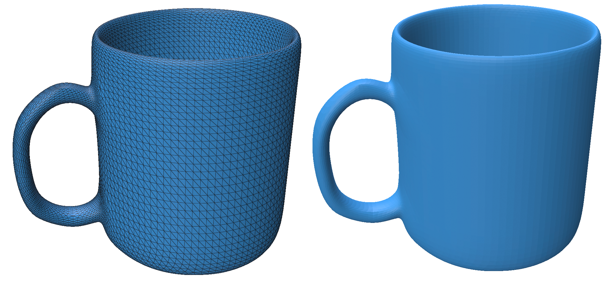


## Subdivision as a linear map

You might have noticed that, at each step, the vertex averaging process was
a completely linear operation.
This means that there is a linear map `Si` such that `Vip1 = Si*Vi`,
where `Vi` is the matrix of vertex positions, and `Vip1` are the vertex
positions after one step of subdivision.
gptoolbox provides this matrix via the third output argument of `loop`:
```MATLAB
>> [Vip1,Fip1,Si] = loop(Vi,Fi);
```

`Si` is a sparse matrix (as described in
[this exercise](../010_sparse_matrices/010_sparse_matrices.m)), and therefore
does not use much storage space or much computational power to multiply.
It holds that `Vip1` is equal to `Si*Vi`.
This property can be used to take any per-vertex quantity on the coarse
mesh and obtain a corresponding quantity on the fine mesh.
That process is smooth, just like the subdivision itself:
```MATLAB
>> uip1 = Si*ui;
```

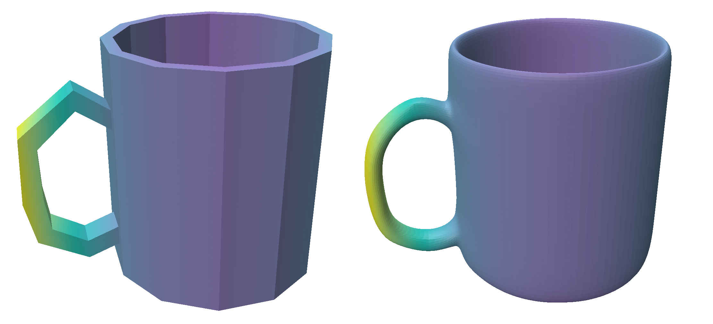


## Exercises

If you are learning geometry processing, try writing the following functions:
* `my_upsample`, which matches the behavior of `gptoolbox`'s `upsample` function.
* `my_loop`, which matches the behavior of `gptoolbox`'s `loop` function.

If you already know geometry processing well and are familiar with the concept
of subdivision (or have already completed above exercise),
try writing the following functions which tests your mastery of subdivision:
* `plot_subdivided`, which takes a coarse mesh plus a function on that mesh,
and plots a subdivided, fine version.
* `reverse_subdivision`, which takes a function on a subdivided mesh and finds
a corresponding function on the coarse mesh.
HINT: try to find the closest subdividable function in the
[least-squares sense](https://en.wikipedia.org/wiki/Least_squares).

As usual, the skeleton for these functions, ready for you to fill in, can be
found in `exercise/`.
