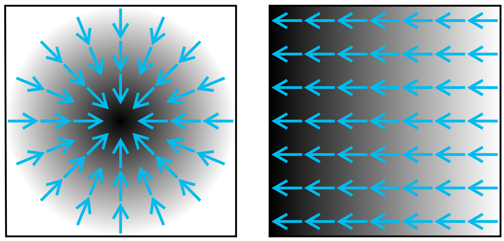
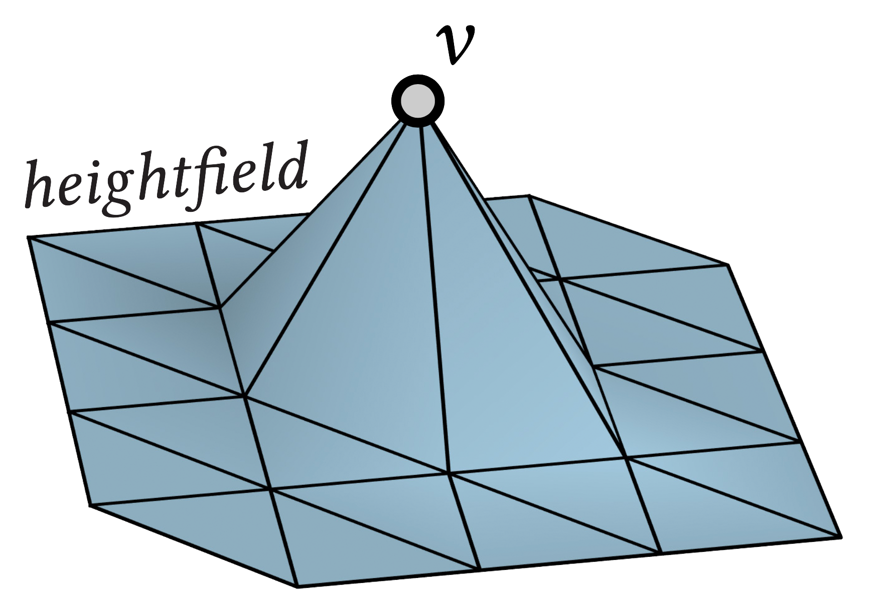
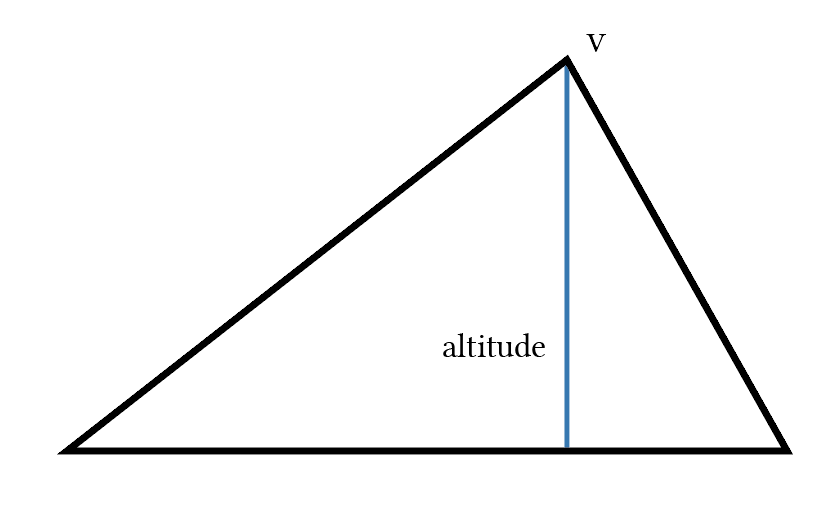
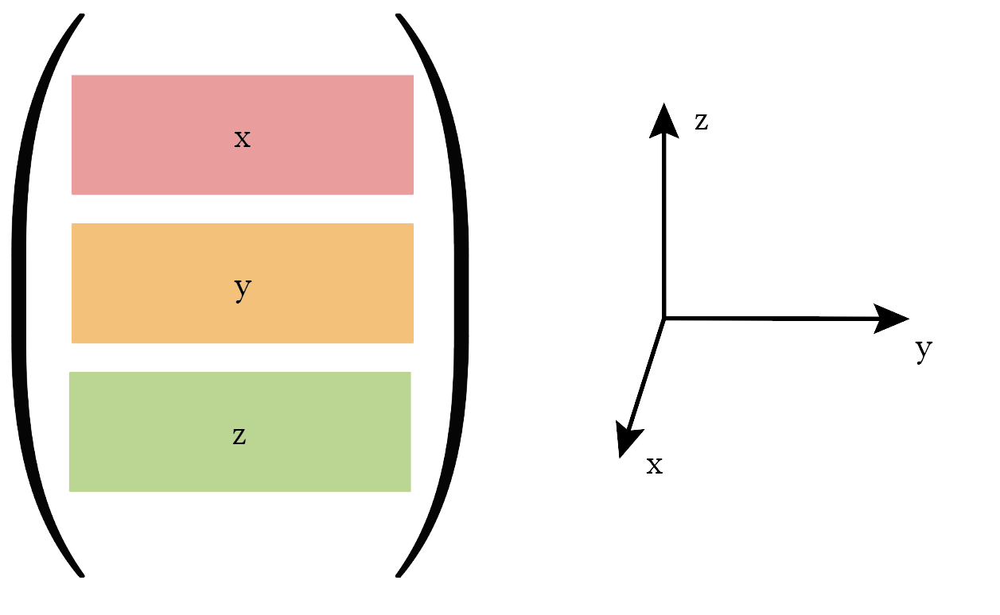
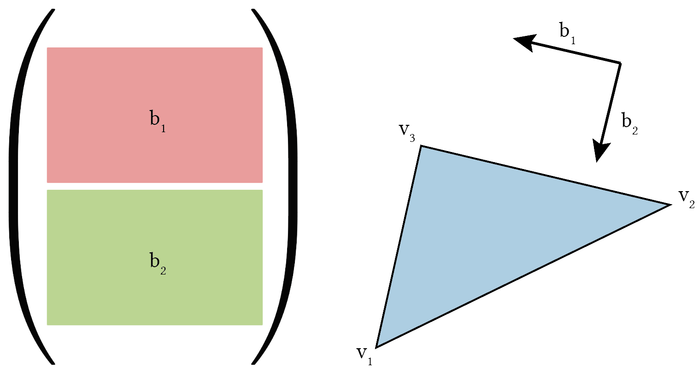

# Gradient
In this exercise we will learn how to create a basic finite element gradient
matrix.

This is not an introduction to finite elements or even the gradient of a
function.
[This course](https://www.cs.cmu.edu/~kmcrane/Projects/DDG/) presents a good
introduction into the topic from the point of view of geometry.
[This book](https://www.cambridge.org/core/books/finite-elements/34A43DA98EBDB25FF9B34691B8A639FD)
offers a thorough introduction to the finite element method.
[This book](https://link.springer.com/book/10.1007/978-1-4419-9982-5) offers a
good introduction into smooth manifolds and gradients in particular.


## Gradient

The [gradient](https://en.wikipedia.org/wiki/Gradient) of a function _f_ on a
surface _Ω_, ∇_f_, is a vector field that points in the direction of, locally,
the function's greatest increase, and whose norm is the magnitude of the
increase.
The gradient generalizes the notion of a derivative of a function 

to a function
.

The gradient vector field is tangent to the surface and is the _linearization_
of the function there.
On flat surfaces, the gradient is given by its partial derivatives in each
coordinate direction,
.
On curved surfaces, this is more elaborate.
However, since we will, in this exercise, only compute the gradient in the
interior of the faces of triangle meshes, this will not matter - the faces are
flat, so we can just compute a flat gradient there as if the triangle was
a subset of the plane, and then rotate it in place.

The following image shows a scalar function in black-and-white, and
the associated gradient vector field in blue [^gradimage][].



The points of a function where it has zero gradient are special: they are the
_critical points_.
Such points can be either minima, maxima, or saddle points, and they have many
applications.


## Finite elements

There are many, many functions that can be defined on a triangle mesh.
In order to be able to perform computations on computers with finite memory,
we usually restrict ourselves to certain sub-sets of functions which can be
represented with finite memory.

Throughout this tutorial we have already dealt with one kind of discrete
function:
a function that is specified for each vertex on the mesh.
But what does it mean when we want to take derivatives of a function that is
only given on each vertex?
For calculus, we need a smooth function defined on the entire surface.
One way to extend the per-vertex data given on each vertex to an entire face is
to _linearly interpolate_ the function from the vertices to each point on the
face.

In the language of
[finite elements](https://en.wikipedia.org/wiki/Finite_element_method), this
means that we associate to every vertex a _hat function_ that is 1 at that
vertex, zero at all other vertices, and linear on each face (but only
continuous on edges)



Multiplying the value of a function at each vertex with its respective hat
function and then summing over all vertices is equivalent to linear
interpolation of function values.

This finite element framework now allows us to easily take the gradient of
per-vertex functions by taking the gradient of each hat function.
Since every per-vertex function is a sum of hat functions, the gradient will
be a sum of the gradients of the hat functions.

The gradient of a hat function on a triangle is very straightforward:
it points in the direction of the altitude away from the vertex, and its
length is one divided by the altitude of the triangle at that vertex.



Since hat functions are linear on each triangle, the gradient is a single
constant vector on each triangle (and the gradient vector field is thus a
piecewise constant vector field).


## The sparse gradient matrix

Like the derivative of a function in 1d, the gradient of a function on a surface
is linear.
This means there is a sparse matrix _G_ such that, for a per-vertex function
_u_, _Gu_  is the piecewise constant gradient for each face.
So, if there are _n_ vertices and _m_ faces, the sparse gradient matrix
has dimensions _3m x n_, since each face stores three coordinates for each
face: _x_, _y_, and _z_.

There is some freedom in how to exactly lay out the coordinates per face.
gptoolbox chooses to first lay out all _x_-coordinates for each face, one after
the other, then all _y_-coordinates, and then all _z_-coordinates, like so:



That way, if we want to know the gradient on the _j_-th face, we have to look
at the rows _j_, _j+m_ and _j+2m_ of the sparse gradient matrix.

As the gradient on each face depends only on the function falue of its vertices,
the resulting matrix is very sparse.
The gptoolbox command to compute this sparse gradient matrix for a mesh `V,F` is
called `grad`:
```MATLAB
>> G = grad(V,F);
```


## Intrinsic grad

Since the gradient of a per-vetex function on each triangle face is given by
a vector that is tangential to that face, it is technically not necessary to
specify it using _x_, _y_, and _z_ coordinates in 3D.
We can represent it using only two coordinates using two orthogonal tangent
vectors to the triangle that span the plane of the triangle.

The gptoolbox funtion `grad_intrinsic` achieves this:
it computes the same gradient operator as gptoolbox's `grad` function, but
instead of its rows representing _x_-, _y_-, and _z_-coordinates, it returns
only two sets of rows:
* The first set of rows determines, for each triangle,
the part of the gradient along the direction of the triangle edge that goes
from the 2nd to the 3rd vertex.
* The second set of rows determines, for each triangle, the part of the gradient
along the direction orthogonal to the edge that goes from the 2nd to the 3rd
vertex (but so that the coordinate system is oriented the same way as the
triangle).



```MATLAB
>> G = grad_intrinsic(V,F);
```


## Exercises

If you are learning geometry processing, try writing the following function:
* `my_grad`, which matches the behavior of `gptoolbox`'s `grad` function.

If you already know geometry processing well and are familiar with the concept
of gradients (or have already completed above exercise),
try writing the following function which tests your mastery of gradients:
* `critical_points`, which identifies the faces of a triangle mesh where, for
a given input functions, a critical point occurs.
HINT: investigate what the MATLAB function `find` might be able to do for you!

As usual, the skeleton for these functions, ready for you to fill in, can be
found in `exercise/`.


## References
[^gradimage]
Image credit for gradient image: https://en.wikipedia.org/wiki/File:Gradient2.svg, CC BY-SA 2.5
