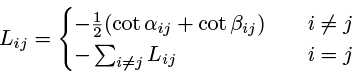

# Laplacian
In this exercise we will learn how to create a basic finite element Laplacian
matrix.

The [Laplacian](https://mathworld.wolfram.com/Laplacian.html) is an essential
part of PDE theory and geometry, and this simple exercise does not do all of it
justice.
For further reading, I recommend you start with
[this presentation](https://people.csail.mit.edu/jsolomon/assets/laplacian_for_ml_tutorial.pdf)
as an introduction into the Laplacian in geometry processing, and with
[this book](http://www.ams.org/publications/authors/books/postpub/gsm-19-R)
as an introduction to the Laplacian's rich mathematical theory.


## Definition of the Laplacian

The Laplacian is a differential operator for scalar functions that is integral
for many applications.
For flat surfaces in the plane, the Laplacian of a function _u_ is defined as


Since this definition does not generalize well to curved surfaces, we sometimes
also see the equivalent definition as the _divergence of the gradient_,


The Laplacian appears in many places in physics and Geometry.
It appears, for example, in Poisson's equation
,
which describes the electrical potential of a collection of charges, or the
heat equation
,
which describes the time-evolution of a temperature (where _u_ depends on time
and space).


## The Weak Laplacian

We will discretize the Laplacian Δ using the finite element method discussed
in [exercise 012](../012_gradient/012_gradient.md).
However, Poisson's equation can be reformulated as an equivalent weak functional
equation.
_u_ solves the Poisson equation, if, for all functions _v_,

 (\*)

(This is a simplification - boundary conditions might apply on surfaces with
boundaries, and this is ignoring the derivation.
I suggest study of the sources mentioned in the beginning for a more in-depth
overview.)

This weak Poisson equation can now be discretized using finite elements, as
it only contains one derivative - the gradient - for each variable.


## Discretizing the Laplacian

Using the weak Poisson equation (\*), there are two ways to derive the same
discrete Laplacian matrix.

We can use the gradient computed in
[exercise 012](../012_gradient/012_gradient.md).
The gradient of any scalar function is a vector field that is constant on each
face.
In order to integrate the weak Poisson equation (\*), we simply have to multiply
the (constant) dot product of each pair of functions _u_, _v_ with the area of
the triangle the vector is on, and then sum over all triangles.
So, if `G` is the gradient matrix, and `A` is the matrix with triangle areas
on its diagonal, repeated three times (once _x_, _y_, and _z_ coordinates of
the gradient matrix), the Laplacian is given by `L = G'*A*G`.

Alternatively, one can directly compute the formula in (\*) exactly, for each
triangle, and then sum over all triangles.
This gives the famous _cotangent formula_ for the Laplacian,



where _αij_ and _βij_ are the angles opposite the edge form _i_ to _j_ (if such
an edge exists, otherwise the term is not computed).
This results in a sparse matrix, since the matrix entry `Lij` is only ever
nonzero if there is an edge from _i_ to _j_, and most vertices in the mesh are
only connected to very few other vertices.

The discretization of the right-hand side of the Poisson equation is called the
_mass matrix_.
It can be computed exactly, like the Laplacian cotangent matrix, but one can
also often get away with the easier, simplified, lumped mass matrix

,

which is easier to work with, as it is a diagonal matrix.

In gptoolbox, the Laplacian can be constructed by calling the function
`cotmatrix` (namead after the _cotangent formula_ with which it is
constructed):
```MATLAB
>> L = -cotmatrix(V,F);
```

The mass matrix is constructed using `massmatrix`
```MATLAB
>> M = massmatrix(V,F);
```
`massmatrix` accepts a third argument specifying which kind of mass matrix to
compute, see the documentation of the function for more detail.

See
[Section 2 in this document](https://www.cs.toronto.edu/~jacobson/images/alec-jacobson-thesis-2013.pdf)
for more detail on the entries of the different matrices.

The Laplacian can now be used, for example, to smooth a noisy function by
performing a small time-step of the heat equation:
```MATLAB
>> un = noisy_function();
>> L = -cotmatrix(V,F);
>> M = massmatrix(V,F);
>> u = (1e-2*L + M) \ (M*un);
>> tsurf(F,V, 'CData',u);
```


## Exercises

If you are learning geometry processing, try writing the following functions:
* `cotmatrix_from_grad`, which produces the Laplacian matrix using the gradient
matrix.
* `cotmatrix_from_entries`, which produces the Laplacian matrix using the
cotangent formula.

As usual, the skeleton for these functions, ready for you to fill in, can be
found in `exercise/`.
Compare your solution with gptoolbox's `cotmatrix` to see whether you have
computed the correct solution.

