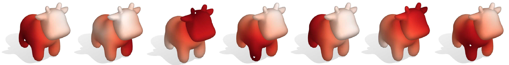

# Matrix Decomposition

Matrix decomposition (or factorization) is a process of splitting a matrix into a product of matrices, such as the LU decomposition, Cholesky factorization, QR decomposition and more. For instance, when solving a linear system $Ax = b$, by using LU decomposition the system matrix $A$ can be decomposed into a lower triangular matrix $L$ and an upper triangular matrix $U$ s.t. $A = LU$. Factorizing a matrix would require some time, but after the factorization, it enables one to solve linear systems $Ax=b$ with the same $A$ much faster. In the case of LU decomposition, the two systems $L(Ux) = b$ and $Ux = L^{-1}b$ require fewer additions and multiplications to solve compared with the original system $Ax = b$ and the pre-factorized matrices $L$ and $U$ can be reused given different $b$.


In MATLAB, a built-in function [decomposition](https://www.mathworks.com/help/matlab/ref/decomposition.html) is designed exactly for doing this matrix decomposition. In the context of geometry processing, we often encounter applications that require solving linear systems with the same left-hand-side $A$, but with a different right-hand-side $b$. For example, computing geodesic distances from different source points



The `decomposition` function is easy to use. Typically, we solve a linear system $Ax = b$ without using `decomposition` by typing
```MATLAB
>> x = A \ b;
```

If we want to use `decomposition`, we can simply do
```MATLAB
>> dA = decomposition(A);
```
to decompose $A$ first, where the decomposition type is automatically chosen based on the properties of the input matrix. Then solve the linear system by typing
```MATLAB
>> x = dA \ b; % much faster
```
This process will give us the same output $x$ as doing `A \ b`, but the actual solve part of doing `dA \ b` will be much more efficient. Hence it is particurly suitable for cases where $b$ is frequently changing while $A$ is fixed.