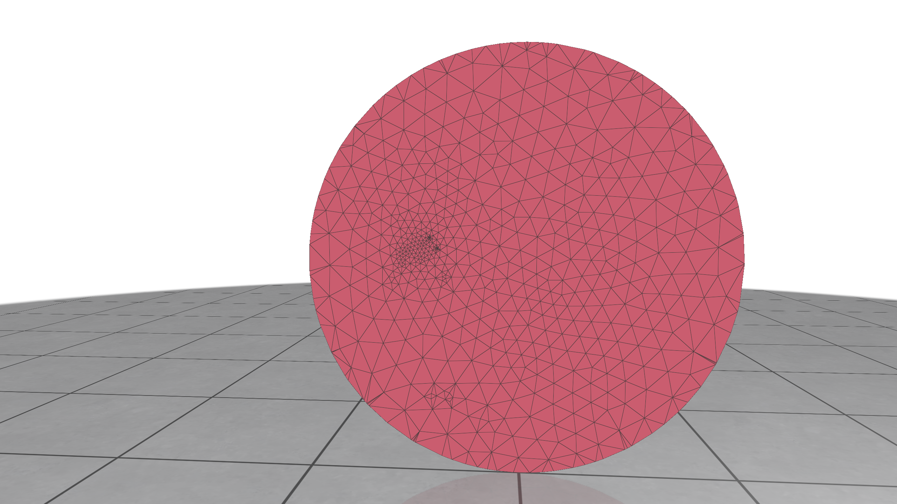
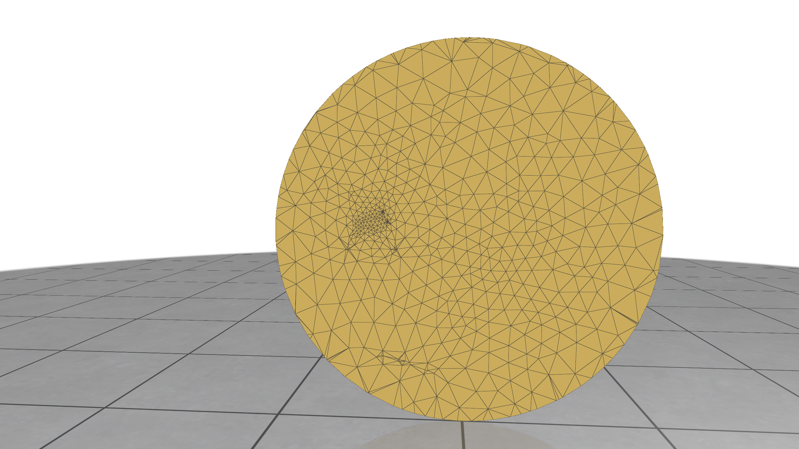
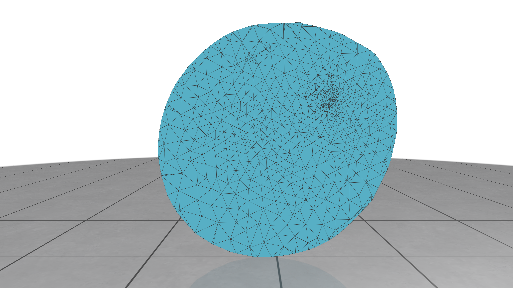
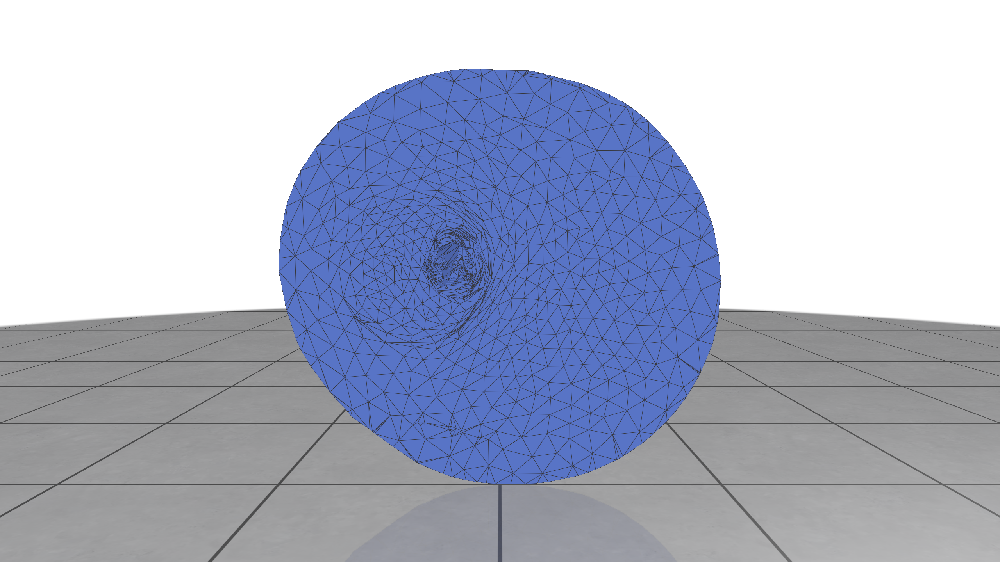
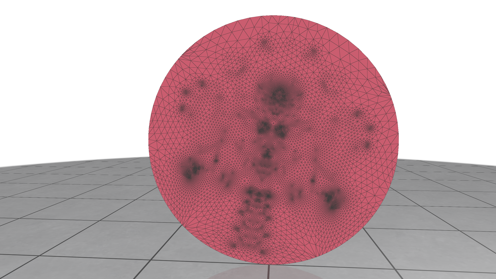
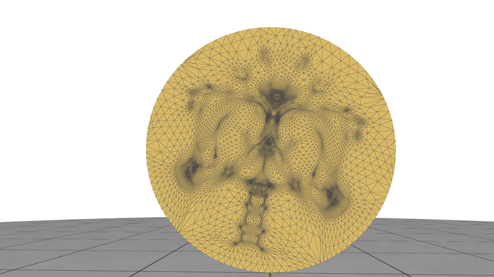
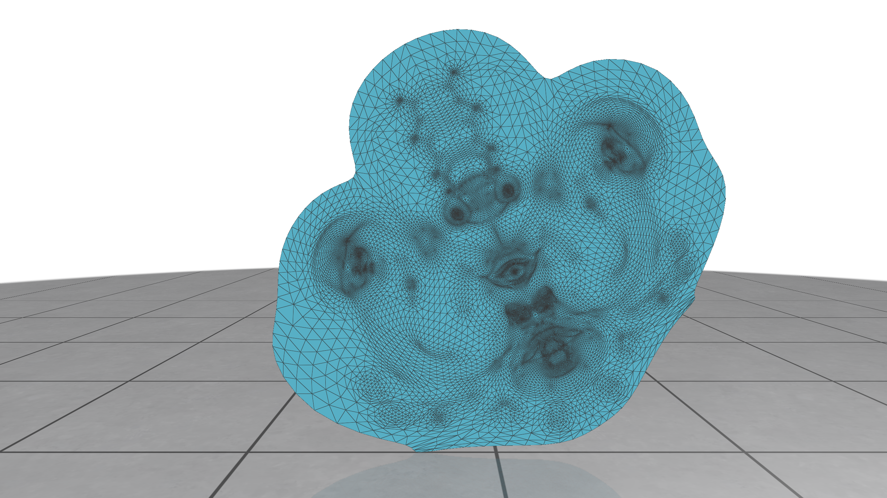

# Parameterization Exercises

Exercise 102 consists of the Python notebook [102_parameterization_fundamentals.ipynb](102_parameterization_fundamentals.ipynb), in which you will reproduce the analyses done in exercise 101 with more complex meshes, as well as try your hand at more advanced parameterization methods.

You can spot-check your calculations by referring to the saved .npy files containing the correct parameterization values for the Tutte, mean value, LSCM, and ARAP parameterizations for the two meshes (./solution/x_tutte.npy, ./solution/x_meanvalue.npy, ./solution/x_lscm.npy, ./solution/x_arap.npy respectively.)

Below are screenshots of the parameterizations, which can also use to visually debug your calculations.

#### halfbunny.obj

*Tutte*

*Mean Value*

*LSCM*

*ARAP*

#### ogre.obj
*Tutte*

*Mean Value*

*LSCM*

*ARAP*

