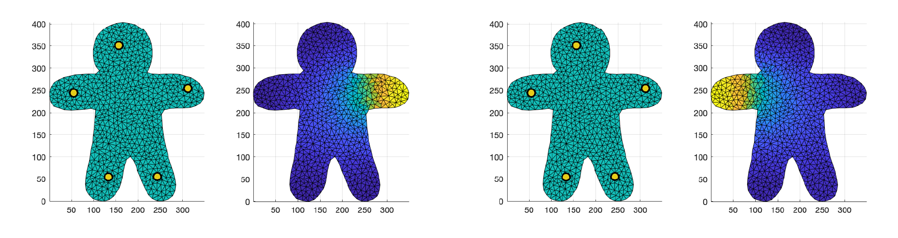

# Skinning


(_image source: Alec Jacobson_)

Hello everyone, are you ready to implement a widely used technique in industries for shape deformation!? This method is called **linear blend skinning**. In practice, given a 3D character, artists often build a set of handles (e.g., skeletons) in order to control the character. This way of controlling a digital character is called _rigging_. Rigging is so important that you can even find a job as a professional _3D Rigger_. Linear blend skinning is the backbone of rigging, it studies how to transfer the handle movement back to deforming the 3D character. 

In this exercise, we are going to implement a handle-based linear blend skinning in 2D. Roughly speaking, linear blend skinning expresses the output deformed vertex locations as a linear combination of input vertex locations, which can be written as

<p align="center"></p>

where 
-  is the deformed location of vertex , 
-  is the location of the input vertex  (in the homogeneous coordinates), 
-  is a scalar of the skinning weight, and 
-  is a 2-by-3 transformation matrix for handle  (2-by-3 is because we are implementing a 2D version).

To implement this, you need to (1) the linear blend skinning formula mentioned above and (2) compute skinning weights  for each pair of the vertex and the handle. We already provide a skeleton code so that you only need to complete two scripts `linear_blend_skinning.m` and `computing_skinning_weights.m`.

## Task 1: implement linear blend skinning
In this exercise, you are going to implement a 2D version of the linear blend skinning (`linear_blend_skinning.m`), which is basically an implementation of Equation (1). In the case of 2D,  is a column vector of length 2, containing the  location of the deformed vertex,  is the weight computed in Task 2,  is a 2-by-3 transformation matrix associated to handle , and  is a column vector of **length 3** (`vi_x, vi_y, 1`) because we represent the input vertex in the [homogeneous coordinates](https://en.wikipedia.org/wiki/Homogeneous_coordinates).
<p align="center"></p>

**Optional Challenge**
Simply implementing linear blend skinning using Equation (1) works fine, but this will result in a slower runtime in MATLAB. This is because a direct implementation of that involves double for loops (one for the vertices, one for the handles). A rule of thumb in MATLAB programming is to avoid for/while loops as much as possible. And, actually, we can implement a (faster) linear blend skinning without any loops at all, but with only matrix multiplications. Specifically, 

<p align="center"></p>

where  is a 2-by-#vertices matrix (since we are working on 2D) of deformed vertex locations,  concatenates all the  as different columns `T = [T1, T2, ...]`, and the  is a matrix that encodes . If you are interested in making it even faster, you can pre-compute the matrix  (because it only depends on the weights and the input shape) and reuse it whenever the user specify a different handle transformations .

## Task 2: Computing Skinning Weights
In this part, you will code up a solver (`computing_skinning_weights.m`) to compute the skinning weights. This will lead to solve the following optimization problem  
```svg
minimize_x   x’ * Q * x
subject to   x(b) = bc
```
where `x, b, bc` are vectors and `Q` is a symmetric matrix. The optimal `x` can be obtained by solving a single linear system (see the lecture note).

To use the above solver for computing skinning weights  for vertex `i` and handle `j`. We first collect all the entries  and assemble them into a matrix  of size #vertices by #handles such that `w_ij = W(i,j)`. Then for each handle `b(j)`, we can apply the solver to compute the skinning weights for all the vertices with respect to handle `j`. Specifically, we want to solve
```svg
minimize_W   W(:,j)' * Q * W(:,j)
subject to   W(b,j) = bc(:,j)
```
where 
- `Q` is a #vertices by #vertices matrix of the _BiLaplacian_ operator, 
- `b` is a vector of indices that contain all the handle indices, and 
- `bc` is a #handles by #handles matrix of the constraints on the skinning weights. 

The goal is to solve for a vector of weights `W(:,j)` associate to each handle `b(j)`. As we want the weights to be 1 on the handle `W(b(j),j) = 1` and 0 on the other handles. This gives us the constraints that `bc(:,j) = [0, ..., 0, 1, 0, ... ,0]`, where the 1 lies at the location `bc(j,j) = 1`. Then, we can follow the derivation in Task 1 to solve for `W(:,j)` for each handle `b(j)` as
```MATLAB
for j = 1:length(b)
  W(:,j) = ...; % results of the optimization
end
```

In the above optimization problem, the BiLaplacian `Q` is the square of the Laplace operator . Practically, if we want to implement this BiLaplacian, one way is to use the _mixed finite element methods_ which will result in the following formula
```svg
Q = L * inv(M) * L
```
where `M` is the lumped mass matrix and `L` is the cotangent matrix. If your memory on `M, L` has faded, please visit `013_laplacian` for more details. You may wonder where does this formula come from or why is this a good choice, right? A very detailed answer is provided in this [write-up](http://odedstein.com/projects/sgp-2021-lap-bilap-course/sgp-2021-lap-bilap-course.pdf) by another of our lecturers [Oded Stein](http://odedstein.com). (Hint: inverting the lumped mass matrix `inv(M)` should be trivial and efficient without using `inv` function in MATLAB, but how?)


After your implementation, you should see resulting weights (right) of each handle (left, yellow dots) like this


**After Thoughts**
The above implementation still need one addition modification. Would you like to guess what is that based on your experience playing with the tool? 

## For Fun
After you finish implementing the above tasks, you now have your first 2D shape deformer!!! Instead of using our default `woody.obj` mesh, you can now follow the instructions in `201_polylines` to use the `get_pencil_curves.m` function to draw your favorite 2D shapes, follow the instructions in `202_wrappers` to triangulate the mesh using the function `triangle.m`, and then you can pass your 2D shape into your implemented shape deformer to create an animation of your drawings. PLEASE share your results with us, we are super super interested in knowing what you have created!