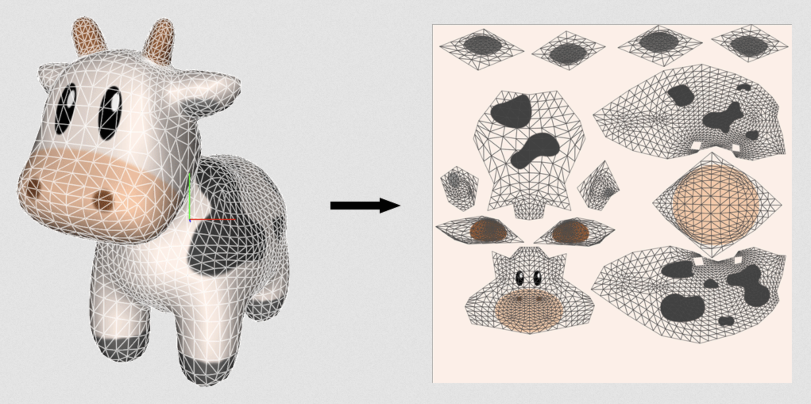
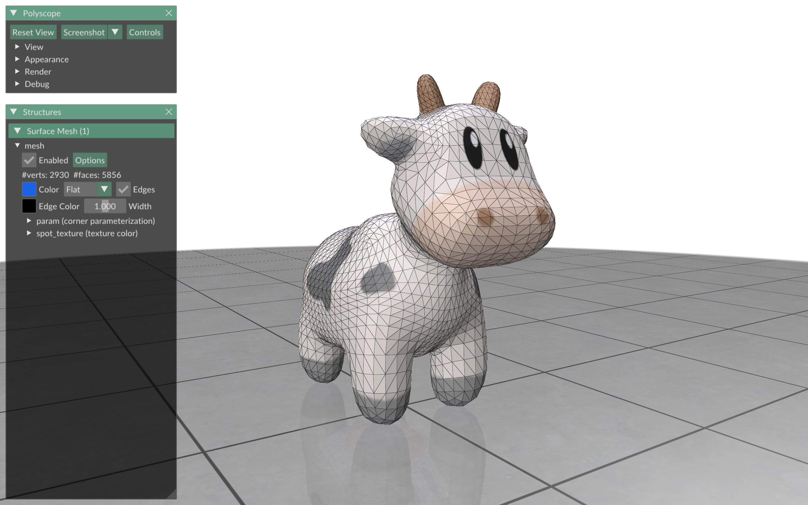
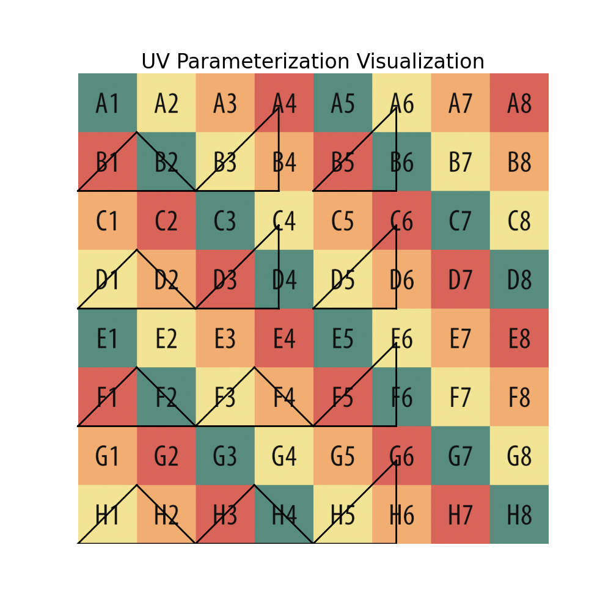
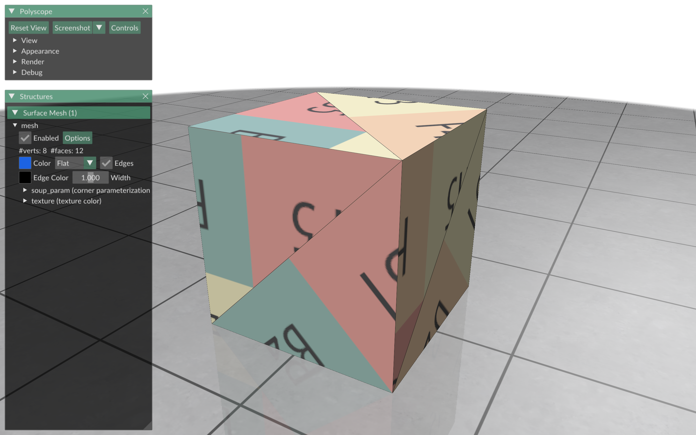

# Texture Maps
In this module, we will learn about texture maps, how to visualize them, and how to create parameterizations for them.

### Quick Texture Map Review
Texture maps are a way to map features (in our case colors) onto the surface of a mesh. One of the main benefits of using texture maps to color meshes is that the feature resolution is entirely independent from the mesh resolution. Thus, we can use a low resolution mesh that is computationally efficient and easy to work with while applying a high resolution texture map to obtain high frequency colors on the mesh surface.


Source: https://metalbyexample.com/textures-and-samplers/

### Additional Installations
Before we start, let's install Matplotlib to help us visualize our parameterizations. Make sure your SGI environment is activated before installing.
<!-- ```
python -m pip install numpy==1.26.4 scipy==1.13.1 gpytoolbox==0.2.0 polyscope==2.2.1
pip install torch==2.1.1 torchvision==0.16.1 torchaudio==2.1.1
pip install libigl==2.5.1
pip install matplotlib==3.9.1
``` -->
```
pip install matplotlib==3.9.1
```

## Task 1: Visualize a Texture Map in Polyscope
The first task in this module is to visualize a texture map on a mesh using Polyscope. You don't have to write any code for this part, just read and run the code in the file [texture_map_demo.py](texture_map_demo.py).

This file consists a few steps. First, we import the necessary packages.
```
import polyscope as ps
import numpy as np
from src.mesh import Mesh
from PIL import Image
```

Next, we initialize Polyscope, load in our mesh, and register our mesh in Polyscope.
```
ps.init()
mesh = Mesh("data/spot.obj")
ps_mesh = ps.register_surface_mesh(
    "mesh",
    mesh.vertices,
    mesh.faces,
    edge_width=1,
    material='clay',
)
```

Then, we add the UV parameterization in polyscope. In Polyscope, we can add a parameterization with the `add_parameterization_quantity()` method.
```
ps_mesh.add_parameterization_quantity("param", mesh.uv, defined_on='corners')
```

Note that we specify that this parameterization is defined on "corners". This refers to the fact that we have a UV coordinate for each vertex in each face. Thus, if a vertex belongs to two faces, that position will be associated with two (potentially) distinct UV coordinates (one for each face). So if we have `V` vertices and `F` faces in our mesh, we should have `3*F` UV coordinates in our parameterization if it is defined on corners.

After this, we can load in our texture map.
```
texture_map = Image.open("data/spot_texture.png")
texture_map = np.asarray(texture_map) / 255
```
Note, we need to rescale the RGB values to the range [0, 1] from its original range [0, 255] since that is what Polyscope expects.

Finally, we can add our texture map to Polyscope with the `add_color_quantity()` method.
```
ps_mesh.add_color_quantity("spot_texture", texture_map, defined_on='texture', param_name="param", enabled=True)
```
Importantly, we specify the texture map itself (`texture_map`) and that the parameterization for this texture map is the one we defined earlier (`"param"`).

Once we have done all this, we visualize this textured mesh in Polyscope with `ps.show()`.
```
ps.show()
```

The result should look something like this:


Notice how the texure is higher resolution than the mesh resolution in many places!

## Task 2: Triangle Soup Parameterization
The second task in this module involves coding a triangle soup parameterization that can be used for texture mapping. The goal is to arrange the faces (triangles) on the UV plane such that they are contained within the unit square and do not overlap.

### Suggested approach
1) Independently flatten all triangles to the plane. Hint: use the approach in exercise 101. See the function [trivial_parameterization()](src/trivial_parameterization.py).
2) Use [pack_triangles()](exercise/pack_triangles.py) to rescale and arrange all of the triangles in the unit square

There are three files that you will need to populate: [triangle_soup_parameterization](exercise/triangle_soup_parameterization.py), [pack_triangles](exercise/pack_triangles), and [transform_triangles](exercise/transform_triangles). The main function to complete this task is `triangle_soup_parameterization()`. Both `pack_triangles()` and `transform_triangle()` are helper functions.

See the individual files for more detailed instructions/suggestions/hints.

### Running/Debugging
To run the task 2 code, run [main.py](main.py) from this `104_texture_maps` directory.
```
python main.py
```
This will generate an image `soup_param.png` in the exercise directory visualizing your parameterization overlaid on a UV grid. If done correctly, it should look something like this:



Notice how there is a lot of unused space. That is OK, this is by no means an optimal packing, but it will be sufficent for the purposes of this exercise and more complex packings are beyong the scope of this module.

In addition to this parameterization visualization, running `main.py` will run an assertion that all singular values of all triangles equal c where c is some global constant. If we recall from the lecture, the singular values of the Jacobian of the parameterization tell us everything we need to know about the distortion of the parameterization. This check ensures that the parameterization is angle preserving and preserves areas up to some global constant c. These properties are important for ensuring that our surface is uniformly sampled by our texture map.

Finally, `main.py` will visualize the cube mesh in Polyscope with a texture map using your parameterization. If the parameterization is correct, the result should look something like this:


