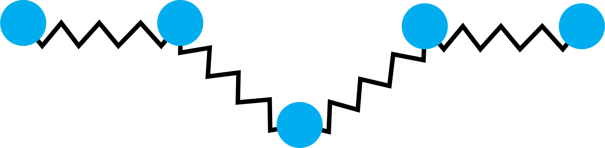
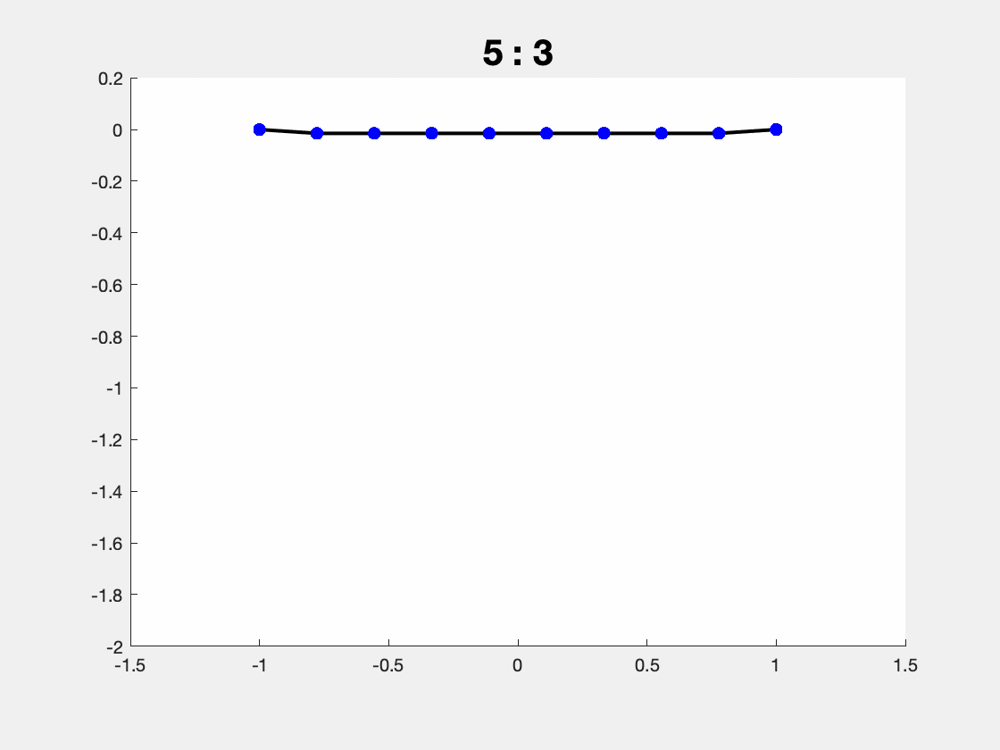

# Mass-Spring Systems
It's happening! We're finally making compelling animations with the help of physics. In the real world, physics is deterministic: if we know the current state, we can be sure of what the next state will be (at least at the scales we're considering). This is also true for our physical simulation: given initial conditions e.g. each material point's starting position and velocity, we'll be able to create an animation of rigid and deformable objects following the laws of physics forward in time, and reproduce a wide variety of real-world phenomena.

Physics-based animation leverages techniques from classical mechanics, numerical solutions of ordinary and partial differential equations (and many more!!). In this exercise, to make our life easier, we consider a 2-dimensional mass-spring system to model the shape's physical behavior. Thus, we can think of our shape as a curve living in 2d where each vertex is a point mass, and each edge is a spring.

    

To consider a shape's dynamical behavior, we always start from Newton's second law i.e. $\mathbf{f} = m\mathbf{a}$ where $f \in \mathbf{R}^2$ is the force acting on a body, $m \in \mathbf{R}$ is the shape's mass and $a \in \mathbf{R}^2$ is the acceleration. A single spring is defined by its stiffness $k>0$, rest length $r_{ij} \in \mathbf{R}$ and the current mass positions $p_{i}, p_{j} \in \mathbf{R}^2$. Its potential energy measures the squared difference of the current length and the rest length times the stiffness (Well the mighty Hooke's Law from high shcool physics):

$$ V(\mathbf{p}_i,\mathbf{p}_j) = \frac12 k( || \mathbf{p}_i - \mathbf{p}_j|| - r_{ij} )^2. $$

The force exerted by the spring on each mass is the partial derivative of the elastic potential energy $V$ with respect to the corresponding mass position. For example, for $\mathbf{p}_i$ we have

$$ \mathbf{f}_{ij} = -\frac{\partial V}{\partial \mathbf{p}_i} \in \mathbf{R}^2. $$

We'll assume we know the current positions for each mass $\mathbf{p}^t_i\in \mathbf{R}^2$ at the current time ($t$) and the current velocities $\dot{\mathbf{p}}^t_i = \partial \mathbf{p}_i(t)/\partial t \in \mathbf{R}^2$. When $t=0$ then we call these the initial conditions of the entire simulation. For $t\ge 0$, we can still think of these values as the initial conditions for the remaining time.

In the real world, the trajectory of an object follows a continuous curve as a function of time. In our simulation, we only need to know the position of each pass at discrete moments in time. We use this to build discrete approximation of the time derivatives (velocities and accelerations) that we encounter. Immediately, we can replace the current velocties $\dot{\mathbf{p}}^t_i$ with a backward finite difference of the positions over the small time step:

$$ \dot{\mathbf{p}}^t_i = \frac{\mathbf{p}^t_i - \mathbf{p}^{t-\Delta t}_i}{\Delta t} $$

where $\mathbf{p}^{t-\Delta t}_i \in \mathbf{R}^2$ is the vertex position at the previous time step.

Similarly, we can also use a central finite difference to define the acceleration at time $t$:

$$ \mathbf{a}_i^t = \ddot{\mathbf{p}}^t_i = \frac{\partial ^2 \mathbf{p}_i(t)}{\partial t^2 } = \frac{\dot{\mathbf{p}}^{t+\Delta t}_i - \dot{\mathbf{p}}^{t}_i}{\Delta t} = \frac{\mathbf{p}^{t+\Delta t}_i - \mathbf{p}^{t}_i}{\Delta t^2} -\frac{\mathbf{p}^t_i - \mathbf{p}^{t-\Delta t}_i}{\Delta t^2}= \frac{\mathbf{p}^{t+\Delta t}_i - 2 \mathbf{p}^{t}_i + \mathbf{p}_{i}^{t-\Delta t}}{\Delta t^2 }. $$

This expression mentions our unknown variables $\mathbf{p}^{t+\Delta t}_i$ for the first time. Based on the previous time steps solving unknown variables $\mathbf{p}^{t+\Delta t}_i$ for the next step becomes our goal and we'll soon show how these can be solved by casting physics simulation into an energy optimization problem.

### Time integration as energy optimization
Solving for the unknown variables $\mathbf{p}^{t+\Delta t}_i$ of the next time step boils down to solving the equation $\mathbf{f} = m \mathbf{a}$. Although the acceleration term $\mathbf{a}$ depends linearly on the unknowns $\mathbf{p}^{t+\Delta t}$, unfortunately even for a simple spring the forces $\mathbf{f} = \partial V/\partial \mathbf{p}^{t+\Delta t}$ depend non-linearly on $\mathbf{p}^{t+\Delta t}$. This means we have a non-linear system of equations, which can be tricky to solve directly.

Alternatively, in this exercise we will take a variational perspective i.e. view physics simulation as an optimization problem. We will define an energy that will be minimized by the value of $\mathbf{p}^{t+\Delta t}$ that satisfies $\mathbf{f} = m \mathbf{a}$. You will probably find this familiar if you have taken a variational mechanics class. The minimizer $\mathbf{p}$ of some function $E(\mathbf{p})$ will satisfy $\partial E/\partial \mathbf{p} = \mathbf{0}$. So we construct an energy $E$ such that $\partial E/\partial \mathbf{p} = \mathbf{f} - m\mathbf{a} = \mathbf{0}$:

$$ \mathbf{p}^{t+\Delta t} = \arg\min_{\mathbf{p}} \left(\sum\limits_{ij} \frac12 k( || \mathbf{p}_i-\mathbf{p}_j|| - r_{ij})^2\right) - \Delta t^2 \left(\sum\limits_i \frac{1}{2} m_i \left(\frac{\mathbf{p}_i - 2 \mathbf{p}^{t}_i + \mathbf{p}_i^{t-\Delta t}}{\Delta t^2 }\right)^2 \right) + \left(\sum\limits_i \mathbf{p}_i^\top \mathbf{f}^\text{ext}_{i} \right) $$

where, in our case, $\mathbf{f}^\text{ext} = m\mathbf{g}$ is the gravity exerted on all the masses ang $\mathbf{g} \in \mathbf{R}^2$ is the gravitational acceleration. Keen observers will identify that the first term is our elastic potential energy $V$, the second term resembles kinetic energy and the last term is the gravitational potential energy.

Alright, now we have our objective function to optimize. But still, it looks somewhat messy and hard to deal with. Before looking for ways to solve it computationally, we leverage the matrix notation to convert the above function into a more compact form. We will stack up all of the $n$ unknown mass positions $\mathbf{p}_i \in \mathbf{R}^2$ as a column vector $\mathbf{p}\in \mathbf{R}^{2n}$ such that

$$ \mathbf{p} = \begin{bmatrix} x_0 \\ x_1 \\ x_2 \\ \vdots \\ x_n   \\ y_0 \\ y_1 \\ y_2 \\ \vdots \\ y_n \end{bmatrix}.$$

 We can do the same for the known previous time steps' positions $\mathbf{p}^{t},\mathbf{p}^{t-\Delta t}\in \mathbf{R}^{2n}$.

 We can then, for example, express the inertial term using matrices:

\begin{align*}
\Delta t^2 \left(\sum\limits_i \frac{1}{2} m_i \left(\frac{\mathbf{p}_i - 2 \mathbf{p}^{t}_i + \mathbf{p}_i^{t-\Delta t}}{\Delta t^2 }\right)^2 \right) &= \frac{1}{\Delta t^2} \left(\sum\limits_i \frac{1}{2} \left(\mathbf{p}_i - 2 \mathbf{p}^{t}_i + \mathbf{p}_i^{t-\Delta t}\right)^\top m_i \left(\mathbf{p}_i - 2 \mathbf{p}^{t}_i + \mathbf{p}_i^{t-\Delta t}\right) \right) \ \\
&= \frac{1}{2} { \left(\mathbf{p} - 2\mathbf{p}^{t} + \mathbf{p}^{t-\Delta t}\right)^\top \frac{\mathbf{M}}{\Delta t^2} \left(\mathbf{p} - 2\mathbf{p}^{t} + \mathbf{p}^{t-\Delta t}\right) },
\end{align*}

where $M \in \mathbf{R}^{2n \times 2n}$ is a diagonal matrix with the diagonal entries being the corresponging point mass $m$ i.e. $M_{ii} = m_{i}$. $M$ is often called the mass matrix.

## Task 1: Derivation
In this task, express the gravitational potential energy using matrices, similar to the inertial term. (Notice that the matrix form for the elastic potential energy can be too complicated to write down so we simply leave it as $V(p)$ for now.)

## Task 2: Newton's method
Now we have our objective function in hand. To solve this energy minimization problem, there are many effective optimization techniques that can be applied. Following what we learned from the lecture, we use Newton's method to compute the local minimum of our objective function by solving a sequence of quadratic functions. At the $i$th Newton iteration, we solve for the newton update ${\Delta \mathbf{p}}_{i}$ s.t. $\mathbf{p}_{i} = \mathbf{p}_{i-1} + {\Delta \mathbf{p}}_{i}$ by doing Taylor expansion of our objective around $\mathbf{p}_{i-1}$ up to the second order:

$$ \Delta \mathbf{p}_{i} = \arg\min_{\Delta \mathbf{p}} \frac{1}{2} {\Delta \mathbf{p}}^{^\top} \frac{\mathbf{M}}{\Delta t^{2}} \Delta \mathbf{p} + {\Delta \mathbf{p}}^{^\top} \frac{\mathbf{M}}{\Delta t^{2}} \left(\mathbf{p}_{i-1} - 2\mathbf{p}^{t} + \mathbf{p}^{t-\Delta t} \right) + {\Delta \mathbf{p}}^{^\top} \mathbf{G}(\mathbf{p}_{i-1}) + \frac{1}{2} {\Delta \mathbf{p}}^{^\top} \mathbf{K}(\mathbf{p}_{i-1}) \Delta \mathbf{p} + {\Delta \mathbf{p}}^{^\top} \mathbf{f}_{\text{ext}}.$$

where $\mathbf{G}(\mathbf{p}_{i-1})$ and $\mathbf{K}(\mathbf{p}_{i-1})$ are the gradient and hessian of the elastic potential energy $V$ evaluated at $\mathbf{p}_{i-1}$.

The solution to this minimization problem is found by solving

$$ \mathbf{H} \Delta \mathbf{p}_{i} = -\mathbf{g}.$$

where $\mathbf{H}$ and $\mathbf{g}$ are the hessian and gradient of the above quadratic energy respectively.

Hint: Write down $\mathbf{H}$ and $\mathbf{g}$ first. Also the helper function `mass_spring_hessian_gradient.m` gives you the gradient and hessian of the elastic potential energy evaluated at $p$.

To get interesting dynamics, we also need some certain boundary conditions. For example, fix some of the masses such that the whole system doesn't immediately fall off because of the gravity. Hint: in `102_min_quad_with_fixed` you have learned how to solve a quadratic problem with fixed value constraint. How could it be helpful here?

Once it is sucessfully implemented, you will get a fun mass-spring system!

    

## Fun Challenge
Convert an arbitrary 2D mesh into a graph of point masses and springs and make it wiggle! Furthermore, extend the current framework to 3D and get a waving flag as shown below :D

    

(image source: Alec Jacobson)

