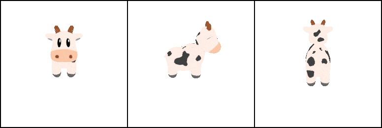
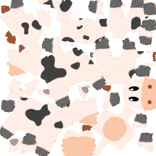
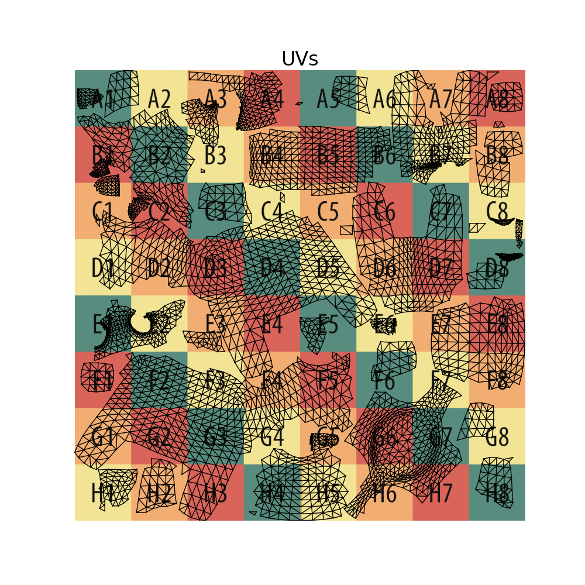
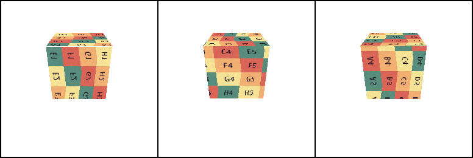
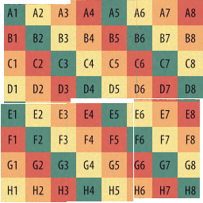
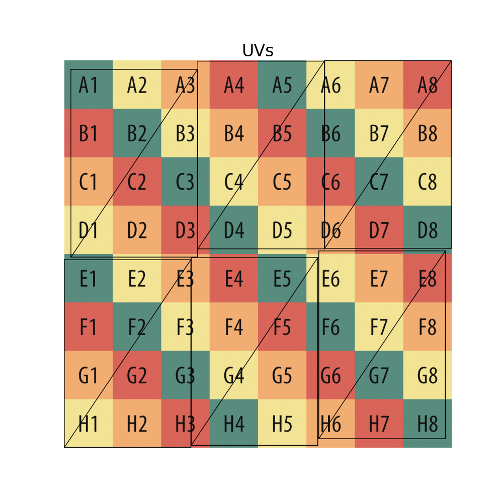

# Texture Optimization
In this module we will optimize a texture map to match existing images of a textured mesh.

## Task 1: Barycentric Coordinates
Complete `compute_barycentric_coords()` in [compute_barycentric_coords.py](exercise/compute_barycentric_coords.py).

This function is meant to compute the barycentric coordinates for all combinations of triangles and points. For more information on how to compute barycentric coordinates see this [link](https://ceng2.ktu.edu.tr/~cakir/files/grafikler/Texture_Mapping.pdf).

## Task 2: Inverse Map
Complete `inverse_map()` in [inverse_map.py](exercise/inverse_map.py). This function maps texels to points on the 3D surface. See [inverse_map.py](exercise/inverse_map.py) for more detailed instructions.

## Task 3: Setup Google Colab
If you have a GPU on your computer, you can skip this step. Instead run `install_environment.sh` and `main.py`. Otherwise...
- Ensure you have a Google account (we will need this to run google colab). If not, make one [here](https://support.google.com/accounts/answer/27441?hl=en).
- Open the google colab notebook ([link](https://colab.research.google.com/drive/1uA6erR70cLtrrwliq2MpJH6XfoBnhNJJ?usp=sharing))
- You will not have editing permissions so navigate to `file` --> `save a copy in drive`.
- If the copy does not open automatically, click "open in new tab" on the popup window. If no popup appears, you may also search up `"Copy of texture_optimization.ipynb"` in your gogole drive and access it from there. Alternatively you can upload [texture_optimization.ipynb](texture_optimization.ipynb) to Colab yourself.
- Upload your completed `105_texture_optimization` directory to your google drive. Make sure that this `105_texture_optimization` folder is at the top level of your Google Drive.
<!-- - Within Drive, navigate to this folder and create a folder titled `parameterization`. Upload the src and exercise directories from `104_texture_maps` to google drive under this `parameterization folder` within the `105_texture_optimization` folder. At this point your Google drive file structure should look something like the following: -->

## Step 4: Running Code
Instructions for running the code:
- In the Colab top menu bar, navigate to `Runtime` --> `Change runtime type` --> select `T4 GPU` --> click `save`
- Run the first cell to install all the required packages
- Run the second cell to mount your google drive to this colab session
    - this will spawn a popup window, click continue/allow for all questions
    - When it finishes, if it was sucessful, you should see a green check mark next to the cell and the cell output should say:
    ```
    Mounted at /content/drive
    ```
- Run the third cell to import all required packages and functions
- Run the fourth cell to perform the texture optimization
    - As this cell runs, it should print out loading bars at the bottom of the cell. These will tell you what iteration the optimization is on.
- You can also navigate to the `files` tab on the left Colab menu bar to view the results of this optimization. Navigate to `files` --> `drive` --> `My Drive` --> `105_texture_optimization`.
As the texture is being optimized, you can view intermediate results within the `results` folder. Once the optimization finishes, it will save a final renders image and texture image to the `105_texture_optimization` folder. Double click a file to view it in Colab.

Once you are familiar with the Colab notebook, you can try out swapping in different meshes in cell three. The default mesh is spot, but we also provide the cube mesh. To optimize the cube mesh, switch the `MESH_PATH` to `"/content/drive/My Drive/105_texture_optimization/data/spot.obj"`, the `TEXTURE_IMAGE_PATH` to `"/content/drive/My Drive/105_texture_optimization/data/spot_texture.png"`, `TARGET_UVS` to `"None"`, and `TOLERANCE` to `1e-6`.

## Step 5: Testing/Debugging
To see if your optimization ran as expected, you can compare your results to those shown below.

### Spot:
<p align="left">
  
  
  
</p>

### Cube:
<p align="left">
  
  
  
</p>
