# Shapes in two dimensions!

In code, *polylines* are often represented by a matrix of sorted *vertex* coordinates $V\in\mathbb{R}^{n\times 2}$. Each row contains the coordinates of a single vertex $v_i$, and the $i$-th edge is obtained by connecting the $i$-th vertex to the $i+1$-th vertex.

To make a simple polyline of a circle, `gpytoolbox` provides a simple wrapper:


```python
import numpy as np
from gpytoolbox import regular_circle_polyline
vertices, _ = regular_circle_polyline(20) # 20 vertices
```


```python
# We can plot our polyline using matplotlib
import matplotlib.pyplot as plt
_ = plt.plot(vertices[:, 0], vertices[:, 1], 'o-')
_ = plt.axis('equal')
```


    
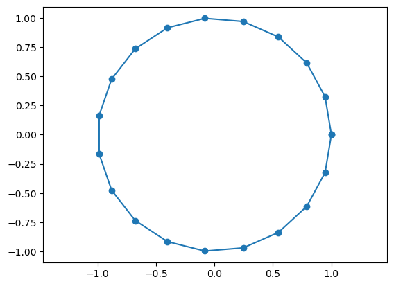
    


...but circles are a very special class of shapes, which are very simple and have a high degree of symmetry. Also, they are very boring to look at. We can get more interesting geometry by using my favourite Gpytoolbox function, [`png2poly`](https://gpytoolbox.org/0.1.0/png2poly/), which reads polylines from `.png` files you can draw yourself or download from the internet. For example, I drew [this picture](https://github.com/sgsellan/gpytoolbox/blob/main/test/unit_tests_data/illustrator.png) on Adobe Illustrator. I can easily load it into Python using `png2poly`.


```python
from gpytoolbox import png2poly
poly = png2poly("illustrator.png")
```

`poly` now contains a list with every connected polyline in the png file. In our case, this list has four entries:


```python
print(len(poly))
```

    4


This may seem counterintuitive, but it makes sense if you think about it for a bit. Since the lines in our png file are so thick, `png2poly` is duplicating them: it finds one line for the transition from white to red and another one for the one from red to white; then again for white to blue and blue to white. We can visualize all of them:


```python
plt.plot(poly[0][:, 0], poly[0][:, 1], '-')
plt.plot(poly[1][:, 0], poly[1][:, 1], '-')
plt.plot(poly[2][:, 0], poly[2][:, 1], '-')
plt.plot(poly[3][:, 0], poly[3][:, 1], '-')
_ = plt.axis('equal')
```


    
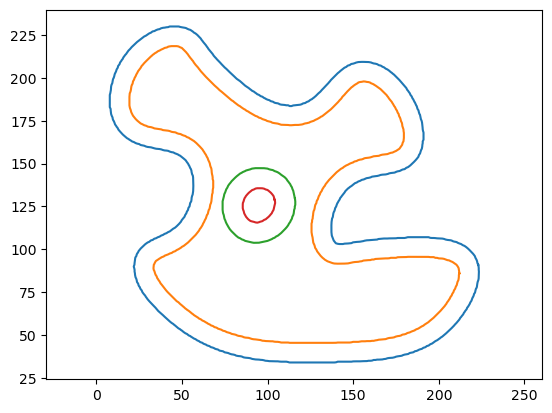
    


Often, we are interested in only one of these components, so let's just make our vertex matrix be the first entry in the list:


```python
vertices = poly[0]
_ = plt.plot(vertices[:, 0], vertices[:, 1], '-')
_ = plt.axis('equal')
```


    
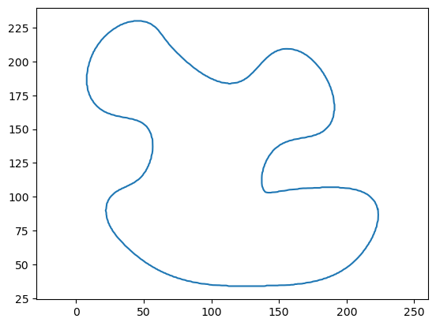
    


A really rich source of interesting 2D geometry that I really like to use is maps. For example, in many of my papers you'll find this Vietnam polyline that comes from [this](https://github.com/sgsellan/gpytoolbox/blob/main/test/unit_tests_data/vietnam.png) png file:


```python
poly = png2poly("vietnam.png")
plt.plot(poly[0][:, 0], poly[0][:, 1], '-b')
plt.plot(poly[1][:, 0], poly[1][:, 1], '-b')
_ = plt.axis('equal')
```


    
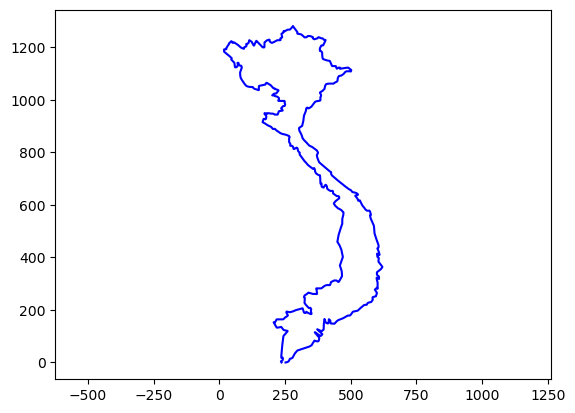
    


You might be wondering: what happens if I want a shape with more than one connected component? For example, consider this map of Hawaii:


```python
poly = png2poly("hawaii.png")
print("There are ", str(len(poly)), " connected polylines in the image.")
# We can plot them in a loop
for i in range(len(poly)):
    plt.plot(poly[i][:, 0], poly[i][:, 1], '-')
_ = plt.axis('equal')
```

    There are  8  connected polylines in the image.


    
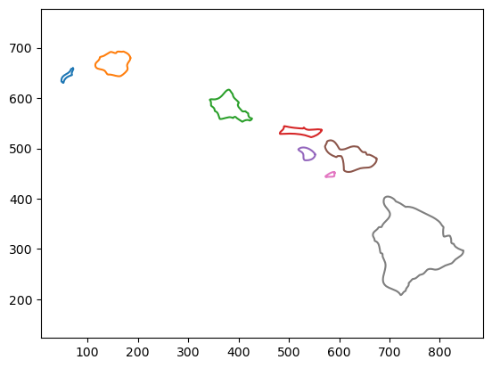
    


To combine all the islands into a single polyline, we can can concatenate all the vertices and use an edge list `EC` that stores which vertices are connected. For a single connected component, this edge list is simple: the first vertex connects to the second vertex, the second vertex connects to the third, etc. 


```python
# Consider the first island
first_island_vertices = poly[0]
# Edge indices
from gpytoolbox import edge_indices
first_island_edges = edge_indices(first_island_vertices.shape[0], closed=True) # The 'closed' argument tells the function to connect the last vertex to the first one
print(first_island_edges)
```

    [[  0   1]
     [  1   2]
     [  2   3]
     [  3   4]
     [  4   5]
     [  5   6]
     [  6   7]
     [  7   8]
     [  8   9]
     [  9  10]
     [ 10  11]
     [ 11  12]
     [ 12  13]
     [ 13  14]
     [ 14  15]
     [ 15  16]
     [ 16  17]
     [ 17  18]
     [ 18  19]
     [ 19  20]
     [ 20  21]
     [ 21  22]
     [ 22  23]
     [ 23  24]
     [ 24  25]
     [ 25  26]
     [ 26  27]
     [ 27  28]
     [ 28  29]
     [ 29  30]
     [ 30  31]
     [ 31  32]
     [ 32  33]
     [ 33  34]
     [ 34  35]
     [ 35  36]
     [ 36  37]
     [ 37  38]
     [ 38  39]
     [ 39  40]
     [ 40  41]
     [ 41  42]
     [ 42  43]
     [ 43  44]
     [ 44  45]
     [ 45  46]
     [ 46  47]
     [ 47  48]
     [ 48  49]
     [ 49  50]
     [ 50  51]
     [ 51  52]
     [ 52  53]
     [ 53  54]
     [ 54  55]
     [ 55  56]
     [ 56  57]
     [ 57  58]
     [ 58  59]
     [ 59  60]
     [ 60  61]
     [ 61  62]
     [ 62  63]
     [ 63  64]
     [ 64  65]
     [ 65  66]
     [ 66  67]
     [ 67  68]
     [ 68  69]
     [ 69  70]
     [ 70  71]
     [ 71  72]
     [ 72  73]
     [ 73  74]
     [ 74  75]
     [ 75  76]
     [ 76  77]
     [ 77  78]
     [ 78  79]
     [ 79  80]
     [ 80  81]
     [ 81  82]
     [ 82  83]
     [ 83  84]
     [ 84  85]
     [ 85  86]
     [ 86  87]
     [ 87  88]
     [ 88  89]
     [ 89  90]
     [ 90  91]
     [ 91  92]
     [ 92  93]
     [ 93  94]
     [ 94  95]
     [ 95  96]
     [ 96  97]
     [ 97  98]
     [ 98  99]
     [ 99 100]
     [100 101]
     [101 102]
     [102 103]
     [103 104]
     [104 105]
     [105 106]
     [106   0]]


```python
# We can plot the island by looping over the edges:
for edge in first_island_edges:
    plt.plot(first_island_vertices[edge, 0], first_island_vertices[edge, 1], '-k')
_ = plt.axis('equal')
```


    
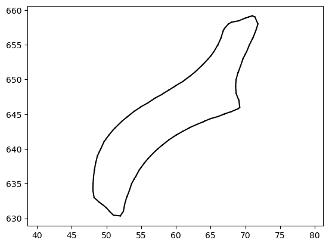
    


We can now combine all the islands into a single polyline, while specifying the edges:


```python
vertices = first_island_vertices
edges = first_island_edges
# Loop over all islands
for i in range(1,len(poly)):
    vertices_i = poly[i]
    edges_i = edge_indices(vertices_i.shape[0], closed=True)
    # Concatenate the vertices and edges
    edges = np.concatenate((edges, edges_i + vertices.shape[0]))
    vertices = np.concatenate((vertices, vertices_i))
    
```


```python
# Plot the result, edge by edge
for edge in edges:
    plt.plot(vertices[edge, 0], vertices[edge, 1], '-k')
_ = plt.axis('equal')
```


    
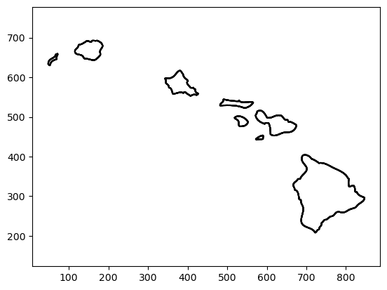
    


The reason for using polylines as a shape representation is that they are the 2D equivalent to the very common 3D representation of triangle meshes. However, meshes are not the only way we represent geometry. In the next tutorials, we will see how to convert our 2D polylines into other representations.

One very common shape representation is *point clouds*, or unordered sets of points in space. This is the format in which most real-world geometry is captured; for example, by the scanner on an autonomous car. If we are testing a research idea that will work on point clouds, we may want a good way of generating 2D point clouds. We can do this by sampling random points on a polyline using Gpytoolbox's `random_points_on_mesh`:


```python
# Let's begin by loading the image into a polyline
from gpytoolbox import png2poly, edge_indices
poly = png2poly("switzerland.png")
vertices = poly[0]
edges = edge_indices(vertices.shape[0], closed=True)
_ = plt.plot(vertices[:, 0], vertices[:, 1], '-k')
_ = plt.axis('equal')
```


    
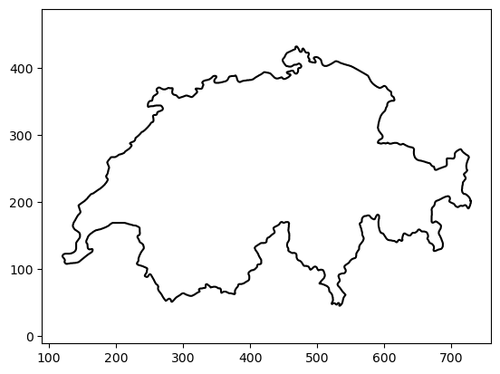
    


```python
# Now, call random_points_on_mesh to generate a point cloud
from gpytoolbox import random_points_on_mesh
point_cloud = random_points_on_mesh(vertices, edges, 100)
_ = plt.plot(point_cloud[:, 0], point_cloud[:, 1], 'o')
```


    
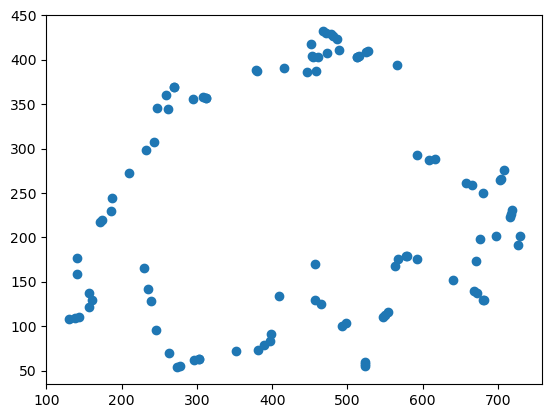
    


Et voilà! A beautifully neutral point cloud. For some applications, we may not be content with a point cloud; instead, we may want to generate an *oriented* point cloud where each point is also endowed with a direction perpendicular to the surface at that point. This is also an easy representation to get using gpytoolbox: since all the points fall on some flat edge, we need only know *which* edge and rotate it by ninety degrees. This is what the `return_indices` parameter in `random_points_on_mesh` is for: 


```python
point_cloud, I, _ = random_points_on_mesh(vertices, edges, 100, return_indices=True)
# What are the edges that the points are on?
edge_vectors = vertices[edges[I,0],:] - vertices[edges[I,1],:]
# Rotate the edge vectors by 90 degrees
edge_vectors = np.array([[-edge_vectors[:,1], edge_vectors[:,0]]]).squeeze().T
# Normalize the edge vectors so they have unit norm
normal_vectors = edge_vectors / np.linalg.norm(edge_vectors, axis=1)[:,None]
# Plot the point cloud and normals
_ = plt.plot(point_cloud[:, 0], point_cloud[:, 1], 'o')
_ = plt.quiver(point_cloud[:, 0], point_cloud[:, 1], normal_vectors[:,0], normal_vectors[:,1],)
```


    
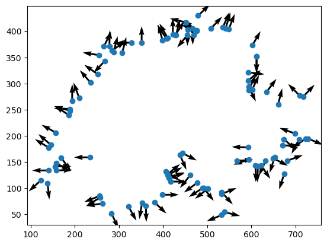
    

looking at how to compute distances to 2D polylines.

There are many reasons why you may want to compute the minimum distance from a given point in 2D to a polyline: for example, to guide sampling or as a stopping criterion in iterative algorithms. Gpytoolbox provides a breadth of tools for computing distances to fit different needs.

Let's start by loading a polyline and computing a single point's distance to it:


```python
# load polyline
from gpytoolbox import png2poly, edge_indices
poly = png2poly("illustrator.png")
vertices = poly[0]
# Downsample the polyline for simplicity
vertices = vertices[::10,:]
edges = edge_indices(vertices.shape[0], closed=True)
import matplotlib.pyplot as plt
_ = plt.plot(vertices[:, 0], vertices[:, 1], '-k')
_ = plt.axis('equal')
```


    
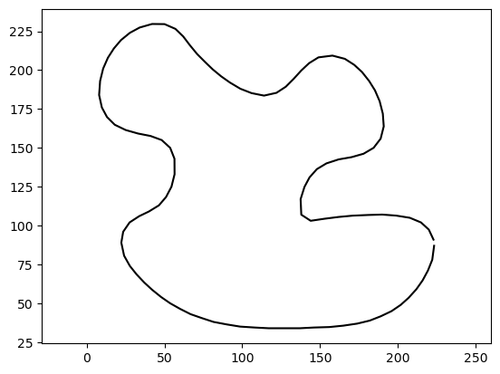
    


```python
# Consider a poing in space
point = np.array([200,100])
# Visualize it
_ = plt.plot(point[0], point[1], 'o')
_ = plt.plot(vertices[:, 0], vertices[:, 1], '-k')
_ = plt.axis('equal')
```


    
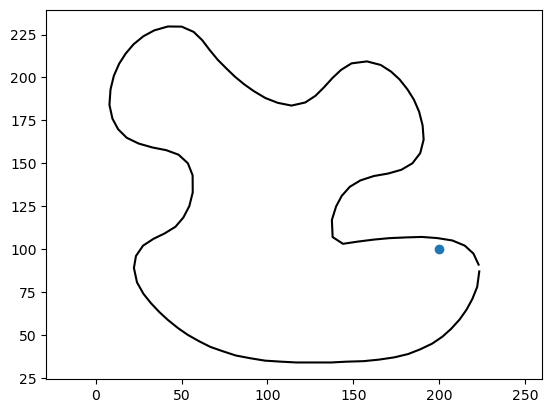
    


```python
# Now, we call the function that computes its squared distance to the polyline
from gpytoolbox import squared_distance
sqrd, ind, t = squared_distance(point, vertices, F=edges)
print("The distance is ", float(np.sqrt(sqrd)))
```

    The distance is  6.1621198369606835


`squared_distance` not only returns the value of the distance, it also includes very useful information. For example, it tells us the polyline edge that is the closest to our point:


```python
# Plot the polyline and the closest edge
_ = plt.plot(vertices[:, 0], vertices[:, 1], '-k')
# Get the vertices of the closest edge
vertices_of_closest_edge = vertices[edges[ind,:],:].squeeze()
_ = plt.plot(vertices_of_closest_edge[:,0], vertices_of_closest_edge[:,1], '-r', linewidth=3)
_ = plt.plot(point[0], point[1], 'o')
_ = plt.axis('equal')
```


    
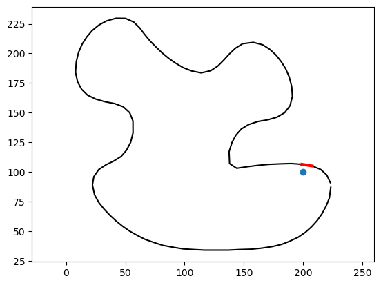
    


It also includes a parameter `t`, that tells us where along that edge the closest polyline point lays. We can use it to calculate said closest point:


```python
# Find the closest point on the polyline
closest_point = vertices[edges[ind,0],:] + (1-t) * (vertices[edges[ind,1],:] - vertices[edges[ind,0],:])
closest_point = closest_point.squeeze()
print("The closest point is ", closest_point)
# Plot the polyline and the closest point
_ = plt.plot(vertices[:, 0], vertices[:, 1], '-k')
_ = plt.plot(point[0], point[1], 'o')
_ = plt.plot(vertices_of_closest_edge[:,0], vertices_of_closest_edge[:,1], '-r', linewidth=3)
_ = plt.plot(closest_point[0], closest_point[1], 'o')
_ = plt.axis('equal')
```

    The closest point is  [200.97159662 105.31480424]


    
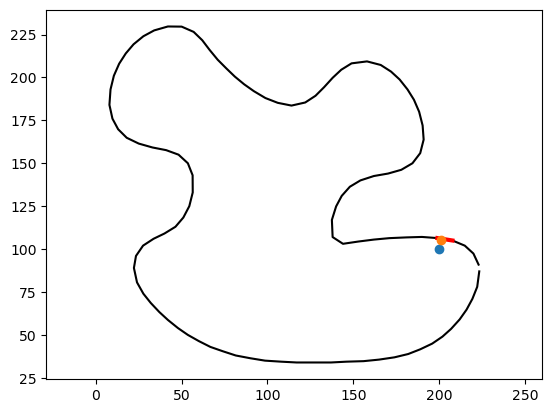
    


Using `squared_distance` we can find the distance of many points to the polyline at the same time:


```python
# Often, it helps to normalize the polyline
from gpytoolbox import normalize_points
vertices = normalize_points(vertices)
# Generate many random points
points = np.random.rand(1000,2)-0.5
# Compute the squared distance to the polyline
sqrd, ind, t = squared_distance(points, vertices, F=edges)
# Plot the polyline and the points
_ = plt.plot(vertices[:, 0], vertices[:, 1], '-k')
# Plot points with sqrd as color
_ = plt.scatter(points[:,0], points[:,1], c=sqrd)
_ = plt.colorbar()
_ = plt.axis('equal')
```


    

    


You may have noticed that computation took some time. That's because, for each point in the set, `squared_distance` is going through every single edge in the polyline to check if it's the closest. This performance hit will be significant, especially if the shape is very complex:


```python
# Let's begin by loading the image into a polyline
from gpytoolbox import png2poly, edge_indices
poly = png2poly("switzerland.png")
vertices = poly[0]
# Normalize the polyline
vertices = normalize_points(vertices)
edges = edge_indices(vertices.shape[0])

# Compute the squared distance to the polyline
sqrd, ind, t = squared_distance(points, vertices, F=edges)
# Plot the polyline and the points
_ = plt.plot(vertices[:, 0], vertices[:, 1], '-k', linewidth=3)
# Plot points with sqrd as color
_ = plt.scatter(points[:,0], points[:,1], c=sqrd)
_ = plt.colorbar()
_ = plt.axis('equal')
```


    

    


A way of getting around this bad performance without resorting to approximations is to use an AABB tree to represent the polyline. An AABB tree a hierarchical data structure that tells `squared_distance` not to waste time checking edges that are very far from the query point. We can tell `squared_distance` to do this by passing the argument `use_aabb`.


```python
# Compute the squared distance to the polyline
sqrd, ind, t = squared_distance(points, vertices, F=edges, use_aabb=True)
# Plot the polyline and the points
_ = plt.plot(vertices[:, 0], vertices[:, 1], '-k', linewidth=3)
# Plot points with sqrd as color
_ = plt.scatter(points[:,0], points[:,1], c=sqrd)
_ = plt.colorbar()
_ = plt.axis('equal')
```


    
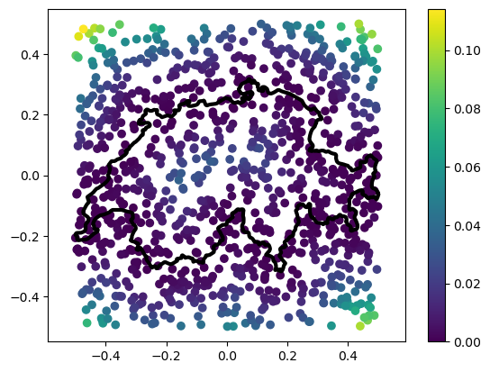
    


That was much faster, wasn't it? We'll cover hierarchical data structures in another tutorial. For now, let's just learn that it's a way to make our distance computation faster.

However, some times, distances on their own are not enough. A very common representation used today is *Signed Distance Functions*. These measure the same distance we measured above, but add a minus sign if the point is *inside* the polyline. It may be tempting to think that, by computing unsigned distances like above, we're already 90% of the way there to signed distances. However, it turns out that reliably computing the sign of a given query point (this is known sometimes as an *inside/outside query*) is far from trivial. Fortunately, gpytoolbox can do it for us, and it will already use an AABB tree by default:


```python
# Compute signed distances
from gpytoolbox import signed_distance
sdist, ind, t = signed_distance(points, vertices, F=edges)
# Plot signed distances and polyline
_ = plt.plot(vertices[:, 0], vertices[:, 1], '-k', linewidth=3)
_ = plt.scatter(points[:,0], points[:,1], c=sdist, cmap = 'RdBu', vmin = - np.abs(sdist).pyax(), vmax = np.abs(sdist).pyax()) # using a divergent colormap and centering it makes sense for signed distances, where "zero" is the surface
_ = plt.colorbar()
_ = plt.axis('equal')
```


    
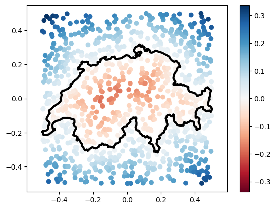
    


Often, you will want to compute these distances for all the points in a grid, which we can construct using numpy and gpytoolbox:


```python
# Build a grid
x = np.linspace(-0.5, 0.5, 100)
y = np.linspace(-0.5, 0.5, 100)
X, Y = np.pyeshgrid(x, y)
points = np.array([X.flatten(), Y.flatten()]).T
# Compute signed distances
sdist, ind, t = signed_distance(points, vertices, F=edges)
# Plot grid with signed distances as color
_ = plt.pcolormesh(X, Y, sdist.reshape(X.shape), cmap = 'RdBu', vmin = - np.abs(sdist).pyax(), vmax = np.abs(sdist).pyax())
# Add polyline
_ = plt.plot(vertices[:, 0], vertices[:, 1], '-k', linewidth=3)
_ = plt.colorbar()
_ = plt.axis('equal')
```


    
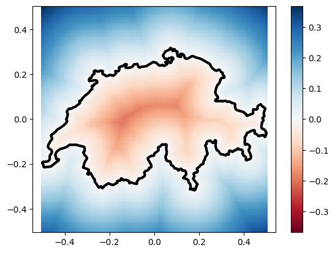
    

## Exercises

Now it's time for you to get used to these functions. Why don't you use the skeleton scripts in `exercise/` to make polylines of shapes you like? You can start with `png_from_the_internet.py` to warm-up. It uses the same `png2poly` function, but with a different png and shape. Once you've done those two, you can move on to our main goal: drawing our very own first spline, following what we saw in the lecture earlier today.

Let us consider two points 


and two vectors 


A [cubic Hermite polynomial](https://en.wikipedia.org/wiki/Cubic_Hermite_spline) is a function of the form

 

which satisfies


where the derivatives are taken with respect to `t`. Your first two tasks are as follows:

1. By hand, figure out an expression for `a`, `b`, `c` and `d` in terms of the two points and two vectors considered (if you get stuck here, the solution is in the wikipedia link above, but try to work it out yourself!).

2. Fill out the funcionality of `exercises/cubic_hermite.py` to find, given two points and two vectors and a value of `t`, the value `P(t)` of the cubic Hermite polynomial they define at time `t`.

Please keep reading only after you've completed both tasks. Some of these tasks may be tricky! You aren't expected to be able to do them all in a minute like this was your undergraduate homework. Feel free to ask for help to your colleagues in the program, speak amongst yourselves and reach out to me and the TAs. Also feel free to google or look stuff up by any other means. To test if your formula and your code is right, you can choose arbitrary points, tangents and a time between 0 and 1, and you should get the same result I did.
```python
import numpy as np
p0 = np.array([0, 0])
p1 = np.array([1, 0])
m0 = np.array([0, 1])
m1 = np.array([0, -1])
t = 0.5
Pt = cubic_hermite(p0, p1, m0, m1, t)
print(Pt)

# Expected Output:
# [0.5 0.25]
```
Sometimes it is more useful to visually debug your code rather than just checking whether two numbers coincide. So, for example, you could write
```python
import numpy as np
import matplotlib.pyplot as plt

p0 = np.array([0, 0])
p1 = np.array([1, 0])
m0 = np.array([0, 1])
m1 = np.array([0, -1])
curve = []  # Initialize your curve to nothing
t = np.linspace(0, 1, 100)  # t is a vector of 100 values between 0 and 1

for ti in t:
    curve.append(cubic_hermite(p0, p1, m0, m1, ti))  # add new point to the curve

curve = np.array(curve)
plt.plot(curve[:, 0], curve[:, 1])
plt.axis('equal')
plt.show()
```

You should see a beautifully curved line appear:

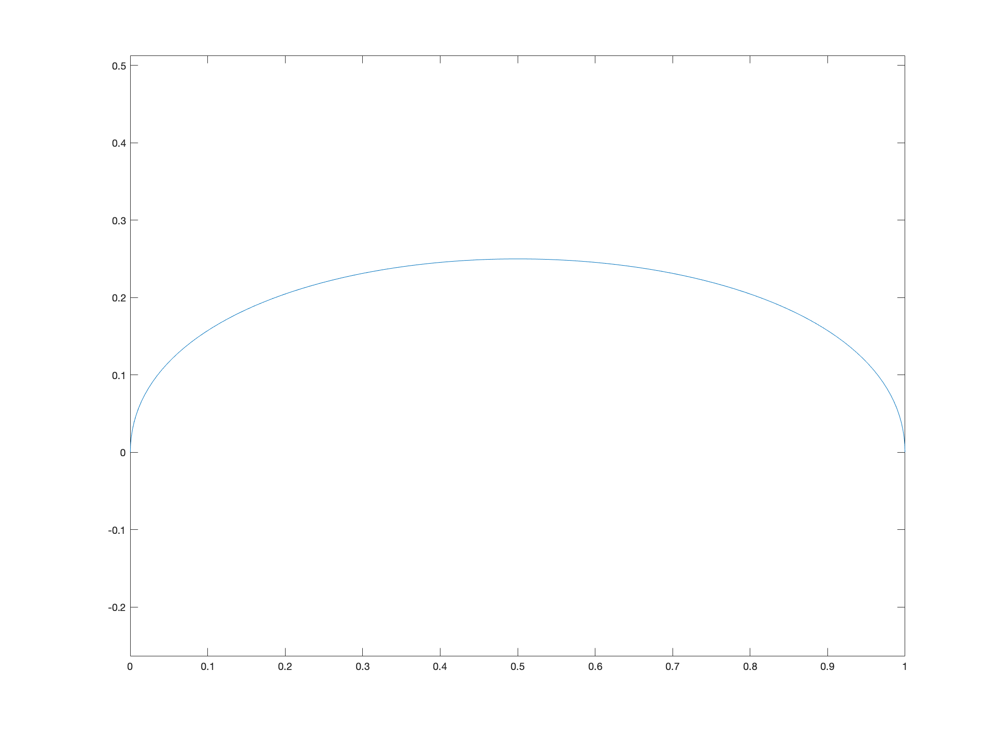

Great! But, in practice, we will not be given two vectors `m_0` and `m_1` that specify the derivatives. The specific type of Hermite spline we learned about in class is called a Catmull-Rom splinen (again, see Wikipedia link above), and in it the derivatives at a given point `p_i` are calculated by looking at the (half of the) difference between the points `p_i+1` and `p_i-1`. So, your next task is

3. Fill out the function `exercises/estimate_derivatives_catmull_rom.py` which, given a set of points which we assume are ordered (point 1 is connected to point 2, point 2 is connected to point 3, etc.) and closed (the final point is connected to the first point), returns a set of derivatives; for each point `p_i`, its prescribed derivative is calculated by deducting `0.5*(p_i+1 - p_i-1)`.

A way of evaluating that you've coded step 3 correctly is by using the `gptoolbox` command `qvr`, that you covered with Oded in day 1. Let's start by creating an arbitrary shape; for example, a circle:

```python
import numpy as np
import matplotlib.pyplot as plt

th = np.linspace(0, 2*np.pi, 20)
th = th[:-1]
V = np.column_stack((np.cos(th), np.sin(th)))
```
Now, let's call our new function to estimate the derivatives at every point of the circle
```python
M = estimate_derivatives_catmull_rom(V)
```
If we now use the `quiver` command, we should see arrows coming from every point in the circle roughly in the direction tangent to the circle at each point:
```python
import matplotlib.pyplot as plt
plt.quiver(V[:,0], V[:,1], M[:,0], M[:,1])
plt.axis('equal')
plt.show()
```
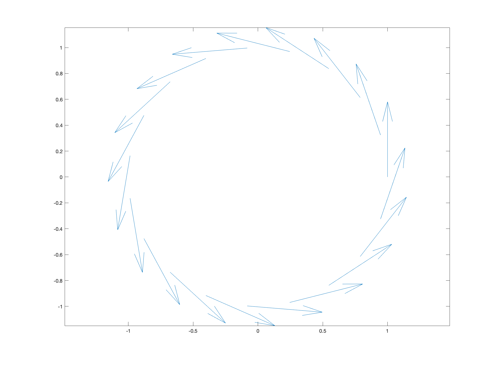

Your next task is putting it all together:

4. Fill out `exercises/catmull_rom_interpolation.py` which, given a set of ordered points (same conditions as task 3) which are assumed to be equally spaced in time between 0 and 1 and a time value `t`, uses `cubic_hermite.py` and `estimate_derivatives_catmull_rom.py` to return `P(t)`, the value of the Catmull-Rom spline that interpolates all given points, at time `t`.
5. Fill out `exercises/upsample_spline.py` which, given a set of ordered points (same conditions as task 3) which are assumed to be equally spaced in time between 0 and 1, outputs `n` equally spaced (fine) points on the Catmull-Rom spline that interpolates them. 

A way of evaluating that your implementation so far is working is to create a very coarse circumference in python:
```python
import numpy as np
import matplotlib.pyplot as plt

th = np.linspace(0, 2*np.pi, 8)
th = th[:-1]
V = np.column_stack((np.cos(th), np.sin(th)))
plt.plot(V[:, 0], V[:, 1], linewidth=3)
plt.axis('equal')
plt.axis('off')
plt.show()

```
A very visibly coarse open polyline should show:
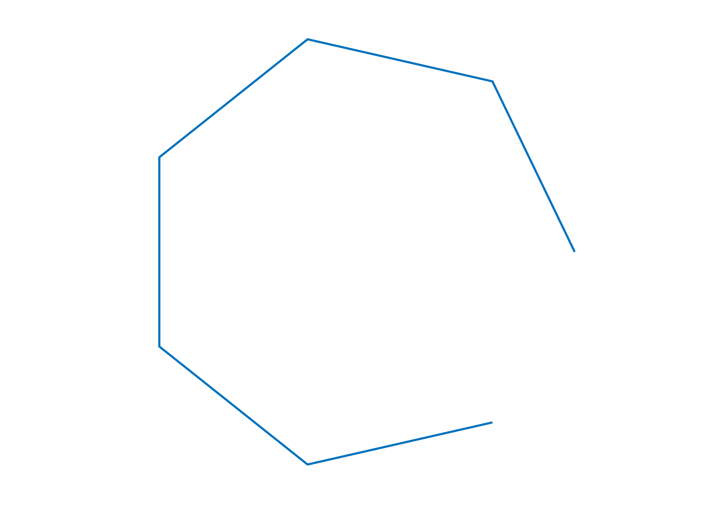

Now, if you run your spline upsampler
```python
U = upsample_spline(V, 100)
plt.plot(U[:, 0], U[:, 1], linewidth=3)
plt.axis('equal')
plt.axis('off')
plt.show()

```
a smooth, circle-looking shape should appear.

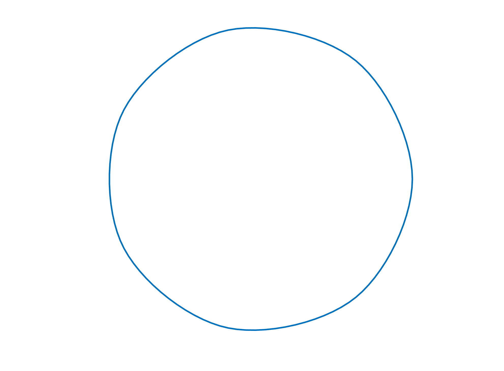

By the way! It won't be *exactly* a circle. If you want to learn more about why and what other splines one can define that can interpolate circumferences perfectly, please see [Cem Yuksel's talk](https://youtu.be/pK4zy5OKbHs) that I brought up during the lecture.

And finally, just to make it nicer

6. Write your own very coarse polyline into a fine polyline where points are sampled from a catmull-rom spline. You can find it on a png from the internet, or write it yourself by hand. You should call `catmull_rom_interpolation.py`. Be creative!

Good luck!

P.S.: If this topic seems interesting to you, here's other cool stuff you could try (in no particular order):

* What happens if the curve is not closed? What could we do to still impose derivatives at the first and last point?
* How could we specify the points that we want to be *sharp* instead of smooth?
* Do all of this... in 3D! 3D Catmull-Rom splines are defined in the same way as 2D ones, and they are mostly used to interpolate between trajectory keyframes for objects that move in videogames or movie scenes. How about you add to these functions 3D functionality?
* Catmull-Rom splines are just one type of Hermite splines. Could you try to do the same for other derivative rules (see[here](https://en.wikipedia.org/wiki/Cubic_Hermite_spline)) ?


