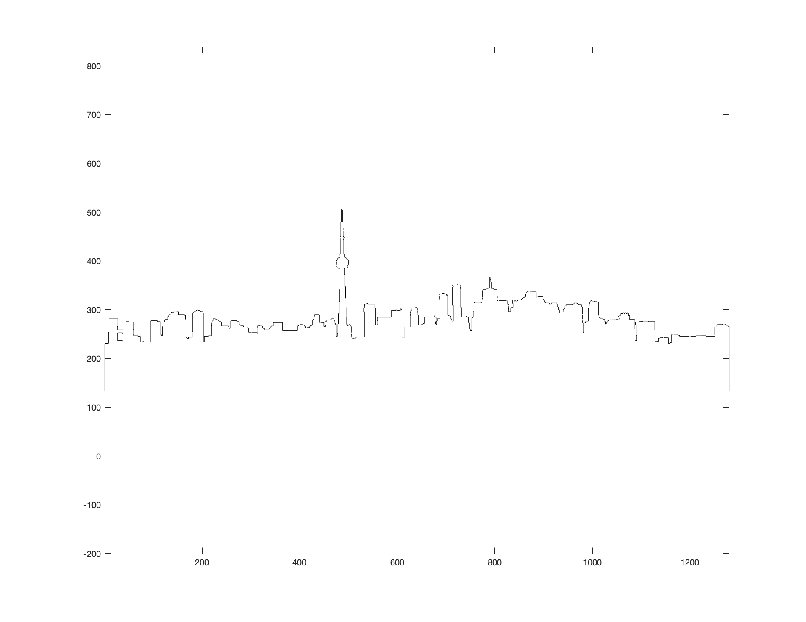
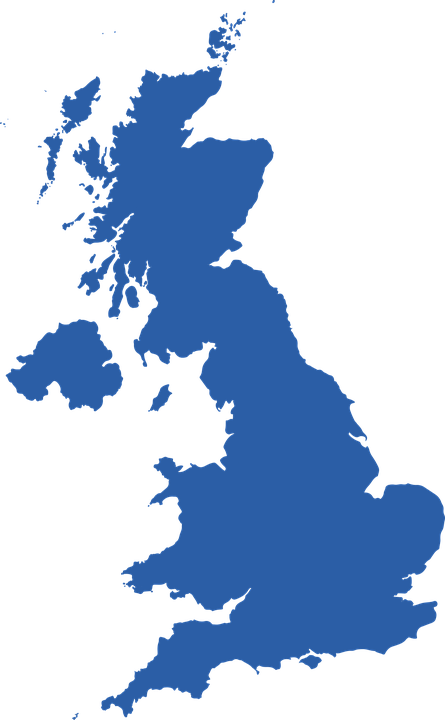
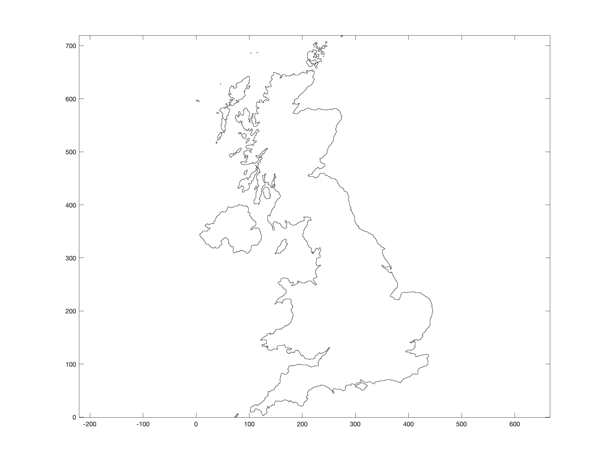
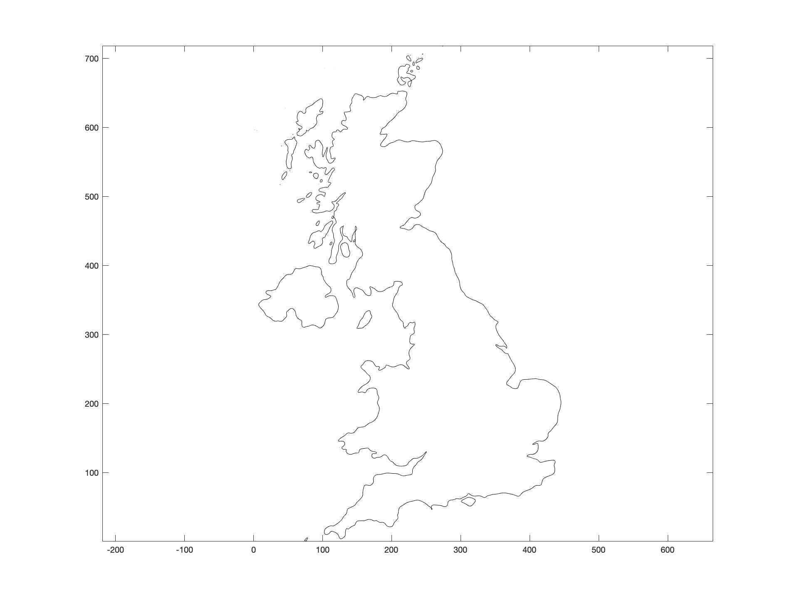
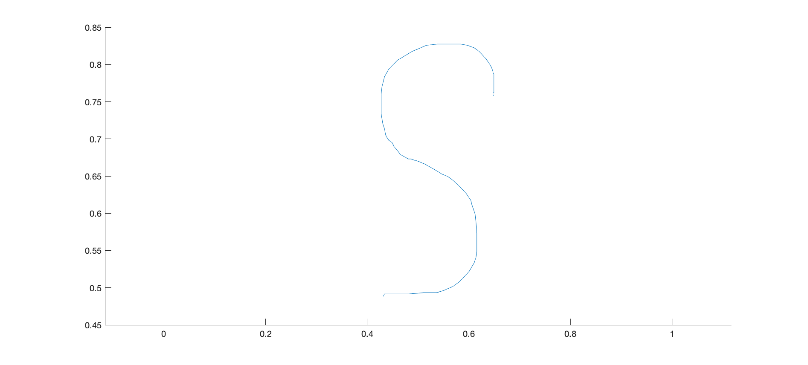
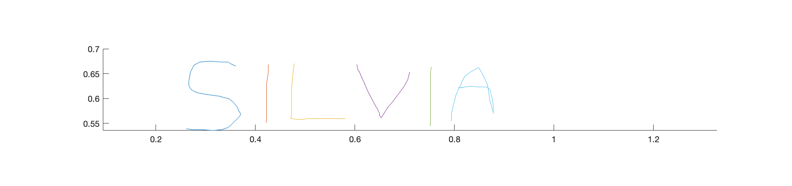
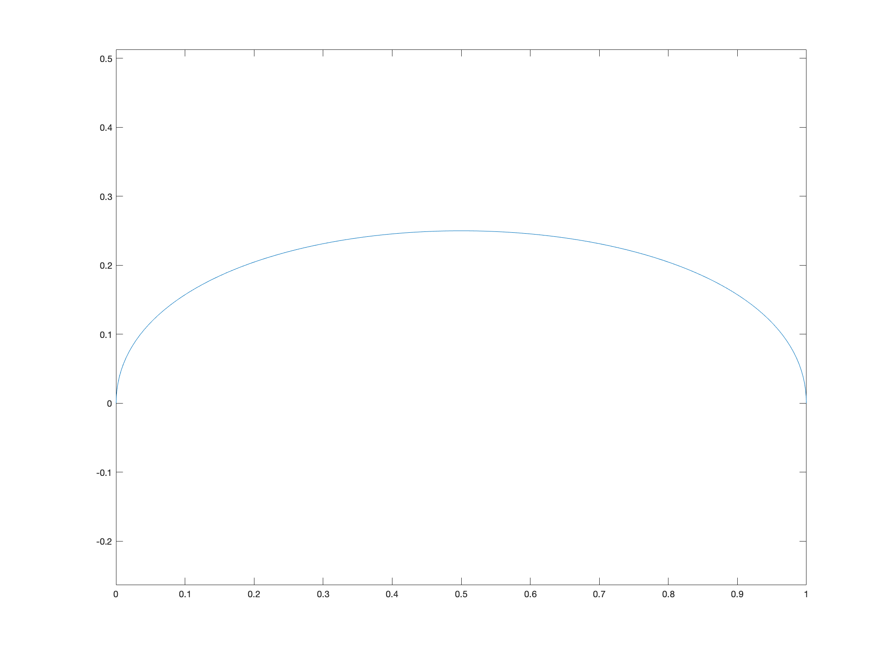
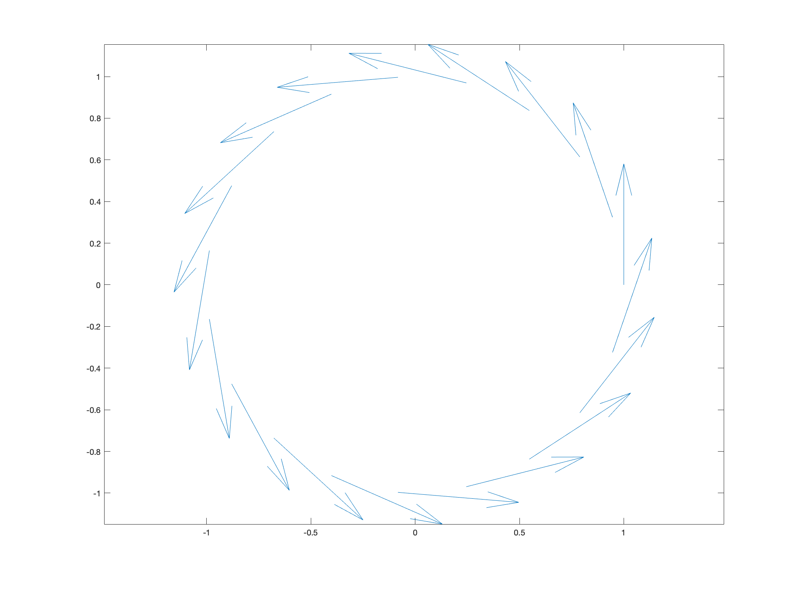
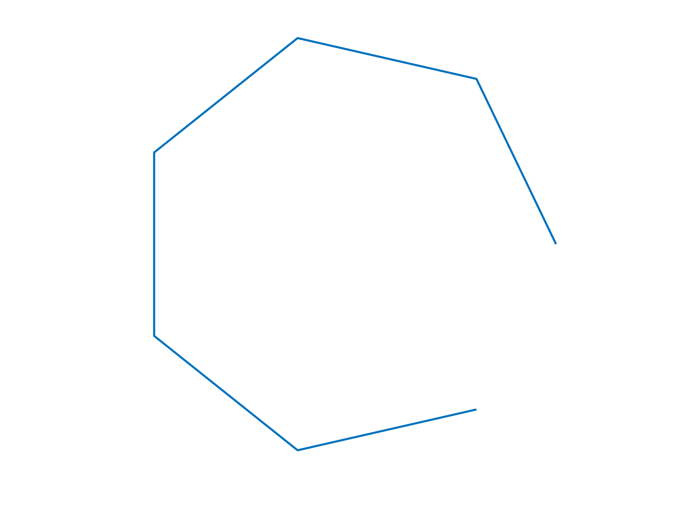
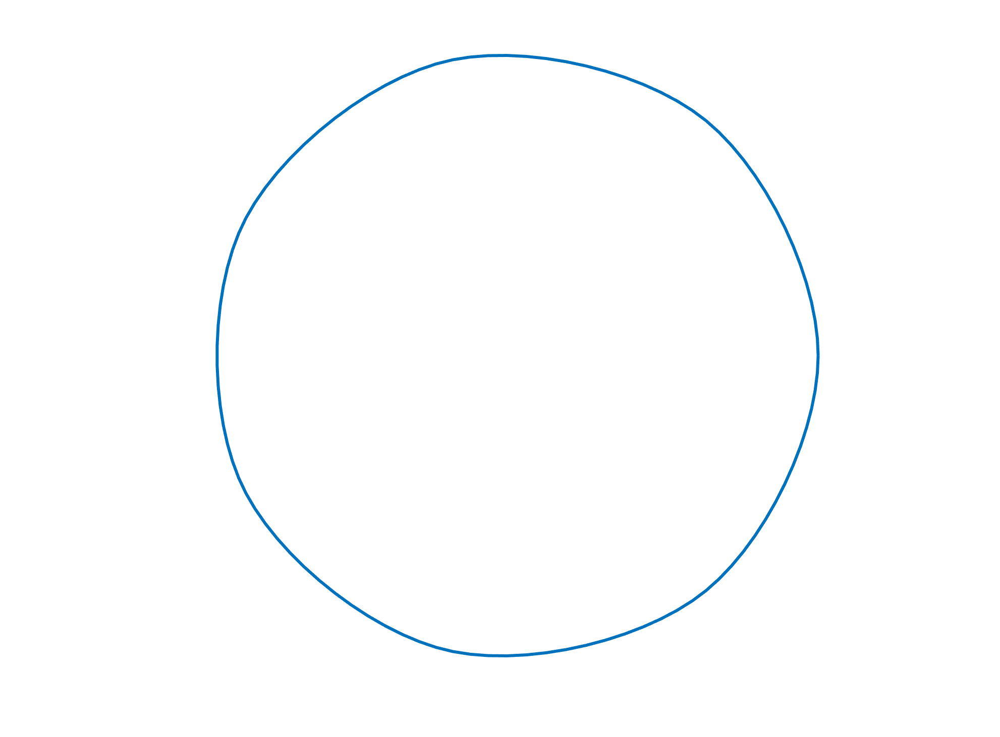

# Polylines

Often, we prototype our code in 2D before taking it to 3D, since it is usually faster and easier to debug. Therefore, it is very useful that our geometry processing toolbox contains enough 2D functionality to make quick prototyping easy. Furthermore, we want said functionality to be similar enough to the 3D one in the same toolboox that the leap from 2D to 3D can be done as seamlessly as possible. `gptoolbox` aims to satisfy these two needs.

When prototyping in 2D, however, it is useful to keep Alec Jacobson's words in mind, "what works in 3D must work in 2D, but what works in 2D does not necessarily work in 3D".

## Get examples from the internet

Sometimes we just want to find a diverse set of shapes to try things on in 2D. Fortunately, `gptoolbox` allows us to get polyline curves from general png files. For example, here' an image of the beautiful Toronto skyline:


Tracing its polygonal outline in `gptoolbox` is as easy as running a one-liner:

```MATLAB
>> [V,E] = png2poly('data/toronto.png',0,Inf);
```

The output is in the form of a set of vertices `V` and a set of edges `E`, which is perfect for prototyping code we intend to ship later to 3D, since it matches the usual `V,F` format for triangle meshes. We can check that we have indeed obtained the right polyline by plotting the edges:
```MATLAB
>> p = plot([V(E(:,1),1) V(E(:,2),1)]',[V(E(:,1),2) V(E(:,2),2)]');
```
These vectorized expressions can be hard to remember and come up with on the spot, so `gptoolbox` also provides a wrapper that we can call in a similar way to `tsurf`:
```MATLAB
>> plot_edges(V,E,'-k')
```
In both cases, we indeed obtain a polygonal representation of Toronto's skyline, which I can save, as usual, by running
```MATLAB
>> figpng('toronto.png')
```
to get this:


Note how there are no restrictions imposed on the topology of the output; `png2poly` traces all the boundary components of the png file.

You may also notice that our newly-acquired polyline has the same resolution that our original input image had. This is great, but it may not be desirable. For example, say I want a polyline of the silhouette of the United Kingdom, and I decide to use this image:



Then, calling
```MATLAB
>> [V,E] = png2poly('data/uk.png',0,Inf);
>> plot_edges(V,E,'-k')
```
will result in this:



It works like a charm! However, since this was a high-resolution input image, we can see there is a lot of detail in the polyline, which has over seven thousand vertices. If I am looking to prototype with this shape, I probably want to start with something simpler which has less of the noise and irregularities of this image. `gptoolbox` knows this, and that's why `png2poly` can accept a number of smoothing iterations as its second argument:
```MATLAB
>> [V,E] = png2poly('data/uk.png',10,Inf);
>> plot_edges(V,E,'-k')
```
which gives me a much simpler shape to test things on, with less irregularities:


This smoothing step is also useful when using very low resolution pngs, where the rasterization can include visible artifacts in the traced polyline. One or two smoothing iterations usually resolves this.

## Draw your own examples

Getting examples from the internet can be a really fun way to create a diverse set of shapes in which to test your 2D code. However, the particular details of your project often means you or your collaborators have a very concrete idea of the key examples one would neeed to test a particular assumption or functionality. For these cases, `gptoolbox` allows you to directly draw a polyline inside a matlab figure.

Run
```MATLAB
>> V = get_pencil_curve();
```
A figure window will appear (if it wasn't open already). Left-click and drag your cursor slowly on the figure window and you should start to see a curve appear, following your stroke. Stop holding the mouse button when you're happy with your curve. 



As you may have noticed, `get_pencil_curve` only allows us to draw single component curves; meaning curves we can draw without lifting the pencil. Often, we want to create more complicated shapes. For that, `gptoolbox` provides us with `get_pencil_curves` (note the final `s`). Simply run
```MATLAB
>> [V,E,cid] = get_pencil_curves(1e-6);
```
and, every type you end a stroke, type "y" into the matlab console to continue with another one. To end, type "n". That way, I can get something like this:

 

## Exercises

Now it's time for you to get used to these functions. Why don't you use the skeleton scripts in `exercise/` to make polylines of shapes you like? You can start with `draw_something.m` and `png_from_the_internet.m` to warm-up. Use the same `png2poly` function, but with a different png and shape. Once you've done those two, you can move on to our main goal: drawing our very own first spline, following what we saw in the lecture earlier today.

Let us consider two points 


and two vectors 


A [cubic Hermite polynomial](https://en.wikipedia.org/wiki/Cubic_Hermite_spline) is a function of the form

 

which satisfies


where the derivatives are taken with respect to `t`. Your first two tasks are as follows:

1. By hand, figure out an expression for `a`, `b`, `c` and `d` in terms of the two points and two vectors considered (if you get stuck here, the solution is in the wikipedia link above, but try to work it out yourself!).

2. Fill out the funcionality of `exercises/cubic_hermite.m` to find, given two points and two vectors and a value of `t`, the value `P(t)` of the cubic Hermite polynomial they define at time `t`.

Please keep reading only after you've completed both tasks. Some of these tasks may be tricky! You aren't expected to be able to do them all in a minute like this was your undergraduate homework. Feel free to ask for help to your colleagues in the program, speak amongst yourselves and reach out to me and the TAs. Also feel free to google or look stuff up by any other means. To test if your formula and your code is right, you can choose arbitrary points, tangents and a time between 0 and 1, and you should get the same result I did.
```MATLAB
>> p0 = [0 0];
>> p1 = [1 0];
>> m0 = [0 1];
>> m1 = [0 -1];
>> t = 0.5;
>> Pt = cubic_hermite(p0,p1,m0,m1,t);
>> Pt

Pt =

    0.5000    0.2500
```
Sometimes it is more useful to visually debug your code rather than just checking whether two numbers coincide. So, for example, you could write
```MATLAB
>> p0 = [0 0];
>> p1 = [1 0];
>> m0 = [0 1];
>> m1 = [0 -1];
>> curve = []; % Initialize your curve to nothing
>> t = linspace(0,1,100); % t is a vector of 100 values between 0 and 1
>> for i = 1:length(t)
curve = [curve; cubic_hermite(p0,p1,m0,m1,t(i))]; % add new point to the curve
end
>> plot(curve(:,1),curve(:,2));axis equal;
```
You should see a beautifully curved line appear:



Great! But, in practice, we will not be given two vectors `m_0` and `m_1` that specify the derivatives. The specific type of Hermite spline we learned about in class is called a Catmull-Rom splinen (again, see Wikipedia link above), and in it the derivatives at a given point `p_i` are calculated by looking at the (half of the) difference between the points `p_i+1` and `p_i-1`. So, your next task is

3. Fill out the function `exercises/estimate_derivatives_catmull_rom.m` which, given a set of points which we assume are ordered (point 1 is connected to point 2, point 2 is connected to point 3, etc.) and closed (the final point is connected to the first point), returns a set of derivatives; for each point `p_i`, its prescribed derivative is calculated by deducting `0.5*(p_i+1 - p_i-1)`.

A way of evaluating that you've coded step 3 correctly is by using the `gptoolbox` command `qvr`, that you covered with Oded in day 1. Let's start by creating an arbitrary shape; for example, a circle:

```MATLAB
>> th = linspace(0,2*pi,20);
>> th = th(1:end-1);
>> V = [cos(th)',sin(th)'];
```
Now, let's call our new function to estimate the derivatives at every point of the circle
```MATLAB
>> M = estimate_derivatives_catmull_rom(V);
```
If we now use the `qvr` command, we should see arrows coming from every point in the circle roughly in the direction tangent to the circle at each point:
```MATLAB
>> qvr(V,M); axis equal;
```


Your next task is putting it all together:

4. Fill out `exercises/catmull_rom_interpolation.m` which, given a set of ordered points (same conditions as task 3) which are assumed to be equally spaced in time between 0 and 1 and a time value `t`, uses `cubic_hermite.m` and `estimate_derivatives_catmull_rom.m` to return `P(t)`, the value of the Catmull-Rom spline that interpolates all given points, at time `t`.
5. Fill out `exercises/upsample_spline.m` which, given a set of ordered points (same conditions as task 3) which are assumed to be equally spaced in time between 0 and 1, outputs `n` equally spaced (fine) points on the Catmull-Rom spline that interpolates them. 

A way of evaluating that your implementation so far is working is to create a very coarse circumference in MATLAB:
```MATLAB
>> th = linspace(0,2*pi,8);
>> th = th(1:end-1);
>> V = [cos(th)',sin(th)'];
>> plot(V(:,1),V(:,2),'LineWidth',3);axis equal;axis off;
```
A very visibly coarse open polyline should show:


Now, if you run your spline upsampler
```MATLAB
>> U = upsample_spline(V,100);
>> plot(V(:,1),V(:,2),'LineWidth',3);axis equal;axis off;
```
a smooth, circle-looking shape should appear.



By the way! It won't be *exactly* a circle. If you want to learn more about why and what other splines one can define that can interpolate circumferences perfectly, please see [Cem Yuksel's talk](https://youtu.be/pK4zy5OKbHs) that I brought up during the lecture.

And finally, just to make it nicer

6. Fill out `exercises/get_pencil_spline.m` to turn a very coarse polyline into a fine polyline where points are sampled from a catmull-rom spline. You should call `catmull_rom_interpolation.m`.

Good luck!

P.S.: If this topic seems interesting to you, here's other cool stuff you could try (in no particular order):

* What happens if the curve is not closed? What could we do to still impose derivatives at the first and last point?
* How could we specify the points that we want to be *sharp* instead of smooth?
* Do all of this... in 3D! 3D Catmull-Rom splines are defined in the same way as 2D ones, and they are mostly used to interpolate between trajectory keyframes for objects that move in videogames or movie scenes. How about you add to these functions 3D functionality?
* Catmull-Rom splines are just one type of Hermite splines. Could you try to do the same for other derivative rules (see[here](https://en.wikipedia.org/wiki/Cubic_Hermite_spline)) ?


