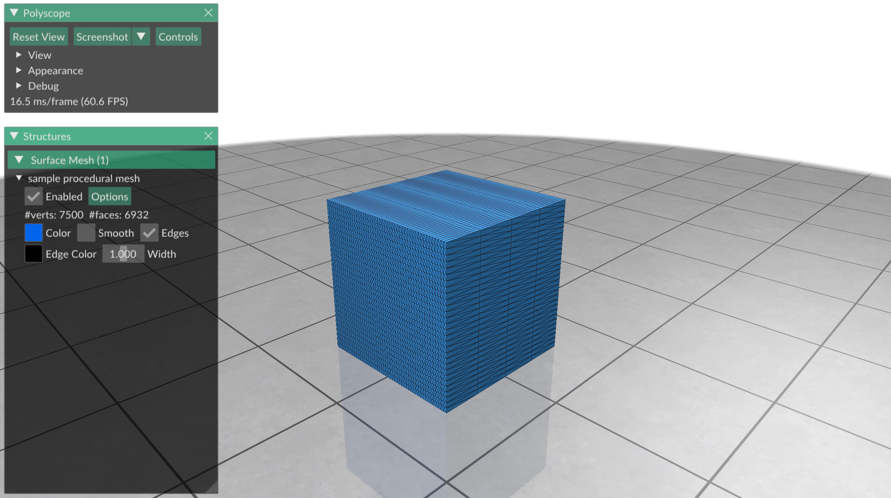

# Basic Mesh Modeling

There are many [websites](https://www.thingiverse.com) and [datasets](https://ten-thousand-models.appspot.com) dedicated to real-world 3D objects you can test your final algorithms on. However, earlier in the prototyping process, we often want to test our code on simpler, synthetic meshes whose parameters we can control. `gpytoolbox` includes functionality to procedurally create meshes of simple 3D objects.

## Basic procedural meshes

There are some simple geometric shapes we want to be able to quickly and reliably generate, according to clear parameters we can tune. For example, with `gpytoolbox`, we can create a triangle mesh of a sphere by running
```python
import gpytoolbox as gpy
v, f = gpy.icosphere(5)
```
which subdivides an icosahedron (by a number of times in the function argument) to approximate a sphere. We can visualize this mesh with polyscope:
```python
import polyscope as ps
ps.init()
ps_mesh = ps.register_surface_mesh("sample procedural mesh", v, f)
ps.show()
```


Similarly, using `gpytoolbox` you can quickly generate a cube, with the arguments determining the number of vertices on each dimension:
```python
v, t = gpy.regular_cube_mesh(5) # optionally specify the number of vertices on each dimension with arguments ny, nz.
# This creates a tetrahedral mesh (a cube is a volume), but we can extract the surface triangles
f = gpy.boundary_faces(t)
ps.init()
ps_mesh = ps.register_surface_mesh("sample procedural mesh", v, f)
ps.show()
```


Note how if we increase the number of vertices on only two dimensions of the cube, for example, the mesh will become increasingly fine but also increasingly low quality:
```python
v, t = gpy.regular_cube_mesh(5, ny=30, nz=50)
f = gpy.boundary_faces(t)
ps.init()
ps_mesh = ps.register_surface_mesh("sample procedural mesh", v, f)
ps.show()
```


Other meshes we can generate procedurally include a cone
```python
v, f = gpy.cone(5, 10) # number of vertices along the base (first argument) and along the height (second argument).
ps.init()
ps_mesh = ps.register_surface_mesh("sample procedural mesh", v, f)
ps.show()
```


and a cylinder
```python
v, f = gpy.cylinder(5, 10) # number of vertices along the equator (first argument) and along the vertical axis (second argument).
ps.init()
ps_mesh = ps.register_surface_mesh("sample procedural mesh", v, f)
ps.show()
```


# Exercises

The cylinder and cone meshes from above are open: they are missing the bases. Your exercise is to fill out the functions `closed_cylinder` and `closed_cone` in `exercise/` to generate *closed* versions of these shapes. This may be harder than you think! I recommend you do it in two steps:

1. First, you can try to generate a cylinder/cone that is *geometrically* closed, by writing down the vertices and faces of the top and bottom faces of the cylinder/cone, calling `gpy.cone` and `gpy.cylinder` to generate the sides, and then concatenating the vertices and faces of the sides with the vertices and faces of the top and bottom faces. This will give you a mesh that is *closed* in the sense that the surface it describes is a closed manifold, but the vertices and faces of the top and bottom faces will not be shared with the vertices and faces of the sides: we call this type of surface *geometrically* closed but *topologically* open.
   1. Here's an interesting question: how can you *check* that a surface is geometrically closed? If your friend gave you a mesh of a cylinder and they said it was closed, how could you verify that they were telling the truth? What if you didn't have access to a visualization tool like polyscope, or you needed to check this in an automated way for many shapes?
   
2. Once you're done with the previous exercise, you can try to generate a cylinder/cone that is *topologically* closed, by ensuring that the vertices and faces of the top and bottom faces are shared with the vertices and faces of the sides. This will give you a mesh that is *closed* in the sense that the surface it describes is a closed manifold, and the vertices and faces of the top and bottom faces will be shared with the vertices and faces of the sides: we call this type of surface *topologically* closed. To do this, you will no longer be able to just call `gpy.cone` and `gpy.cylinder` to generate the sides, but you will have to generate the sides yourself. Feel free to take a look at the implementations of [`gpy.cone`](https://github.com/sgsellan/gpytoolbox/blob/main/src/gpytoolbox/cone.py) and [`gpy.cylinder`](https://github.com/sgsellan/gpytoolbox/blob/main/src/gpytoolbox/cylinder.py) to get an idea of how to generate the sides of the cylinder/cone. You can validate that you've done it correctly if the shape is geometrically closed (see step 1 above) *and* has no boundary edges; i.e., `gpy.boundary_edges(f)` returns an empty list.


<!-- 


With `gptoolbox`, we can create a triangle mesh of a sphere by running
```MATLAB
>> [V,F] = subdivided_sphere(5);
>> tsurf(F,V,fsoft,fphong)
>> axis equal
```
which subdivides an icosahedron (by a number of times in the function argument) and pastes vertex positions to a sphere:


Similarly, using `gptoolbox` you can quickly generate a cube, with the arguments determining the number of vertices on each dimension:
```MATLAB
>> [V,F] = cube(2,5,10);
>> tsurf(F,V,fsoft,fphong)
>> axis equal
```


Note how if we increase the number of vertices on only two dimensions of the cube, for example, the mesh will become increasingly fine but also increasingly low quality: 


This makes this shape a good choice to test the robustness of differential geometry operators, since we often know anayltical groundtruths for a shape as simple as a cube but we can make the triangulation arbitrarily bad. In the same vein, `gptoolbox` can generate a [Schwarz's lantern](https://en.wikipedia.org/wiki/Schwarz_lantern), a specific way of triangulating a cylinder which serves as an example of the unintuitive convergence of some geometric quantities when discretized:
```MATLAB
>> [V,F] = schwarz_lantern(10,5);
>> tsurf(F,V,fsoft,fphong)
>> axis equal
```


If, on the other hand, we just want a reliable mesh of a 3D cylinder, we could just call `cylinder_mesh`.

## Exercises

Now it's time for you to get used to these functions. Why don't you use the skeleton scripts in `exercise/` to create a more general framework for 3D modeling that you can use in your own research projects, as well as to test the fascinating convergence properties of the Schwarz lantern. -->
