# Wrappers

Be it because they are particularly useful for a specific application or because we want to compare our results to theirs, we often need to run third-party software that wasn't written in Matlab originally. Usually, this means we must either call this code outside of Matlab, which can be unconfortable if all our pipeline is inside Matlab; or re-implementing said software in Matlab with the time investment that would entail. To circunvent this, `gptoolbox` includes wrappers to some well-known, much-used libraries, like *Tetgen, Triangle, Meshfix, Qslim* and others. All these wrappers rely on the original software being installed in your system; usually, in `/usr/local/bin`, although you can specify the paths for each executable in the corresponding `/wrappers/path_to_*.m` gptoolbox functions.

## Triangle

[Triangle](https://www.cs.cmu.edu/~quake/triangle.html) is a two-dimensional quality mesh generator and Delaunay triangulator designed by Jonathan Richard Shewchuk (UC Berkeley) as a command-line app. Despite its latest update dating from 2005, it is extremely useful and flexible for generating 2D triangle meshes.

If triangle is properly [installed](https://dgptimbits.wordpress.com/2017/07/20/installing-the-triangle-package-for-gptoolbox/) in your machine, you can use it inside Matlab just by calling `gptoolbox`'s wrapper `triangle`. For example, let us create a polyline bounding a circle:
```MATLAB
>> th = linspace(0,2*pi,100);
>> th = th(1:end-1);
>> V = [cos(th)',sin(th)'];
```
If we run `plot(V(:,1),V(:,2),'-k')`, we should see a circle:
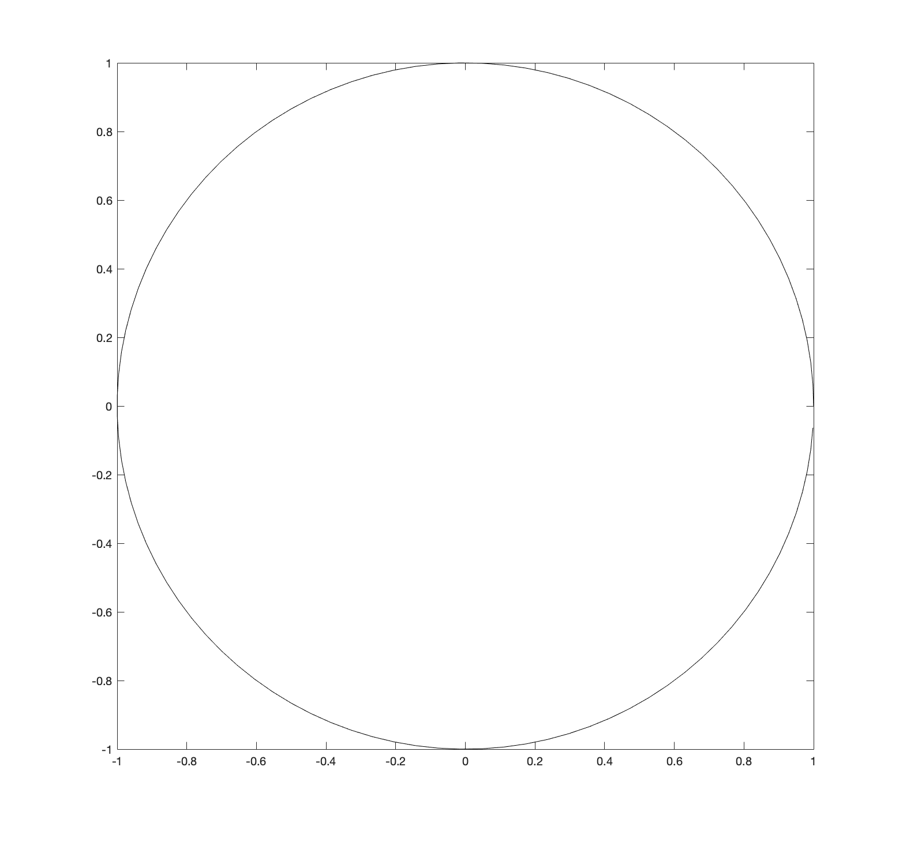

To now obtain a triangle mesh of the circle, we could call `triangle`:
```MATLAB
>> [U,G] = triangle(V);
```
and if we plot the surface
```MATLAB
>> tsurf(G,U)
```
we'll see something like this:
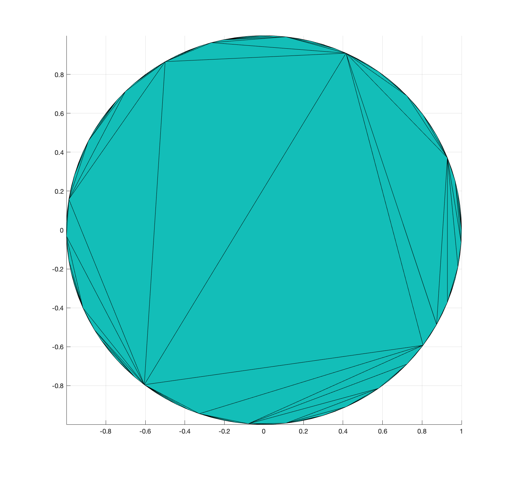
This is certainly a mesh, but it is probably not a really good one for most applications, since many triangles are close to being degenerate and have very very small angles, which can result in very bad approximations of differential geometric quantities and operators. If we want to ask `triangle` to give us a better mesh, we can pass *flags* like "Quality", which corresponds to the minimum triangle angle allowed in the mesh. 
```MATLAB
>> [U,G] = triangle(V,'Flags','-q20');
>> tsurf(G,U)
```
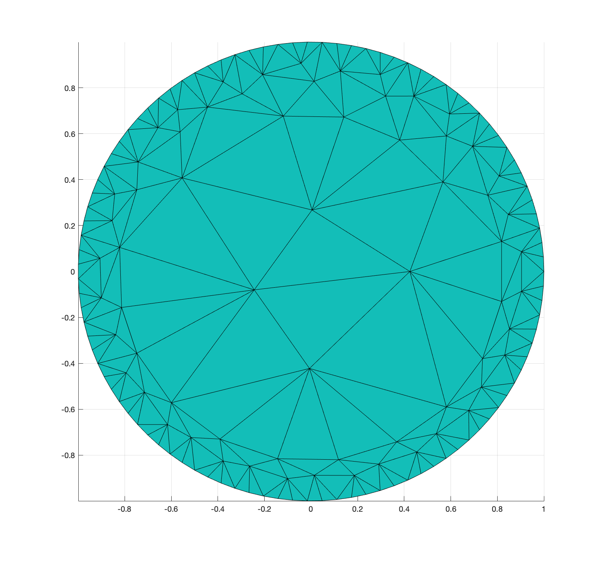
Much better! Still, the mesh's triangle sizes are irregular, and that can be problematic for some applications where we want to test convergence against edge length or similar quantities. If we want to set a target area size, we can do so by adding another flag:
```MATLAB
>> [U,G] = triangle(V,'Flags','-q20a0.01');
>> tsurf(G,U)
```
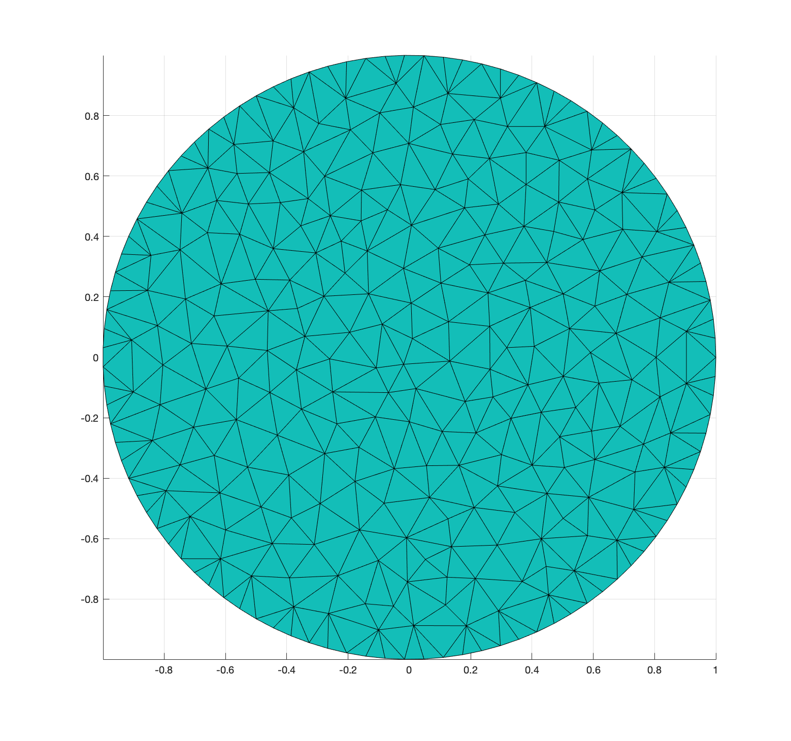
A full list of available flags can be found [here](https://www.cs.cmu.edu/~quake/triangle.switch.html).


Awesome! There's a small catch to what I have said though. It may *look* like `triangle` is triangulating the circle; in fact, it is triangulating *the convex hull* of the circle (which, of  course, is the same thing in thise case). Let's take a look at what I mean by loading a slightly more complicated polyline (see [tutorial item 201](../201_polylines/) for how to generate these cool polylines):
```MATLAB
>> load('data/lamp.mat')
>> plot(V(:,1),V(:,2),'-k','LineWidth',5)
```
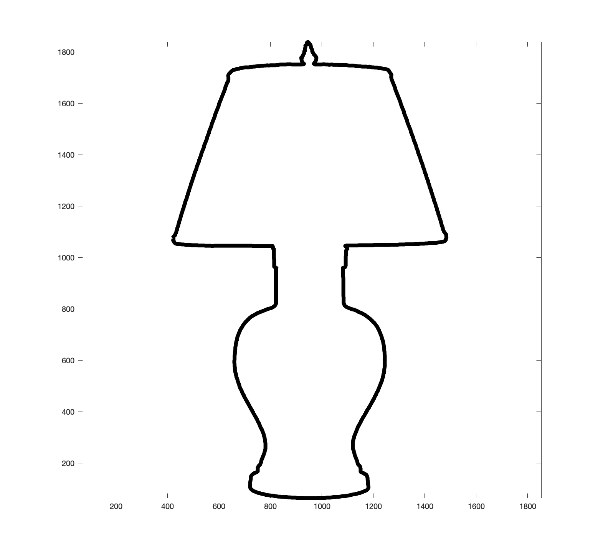
If we now call `triangle` like we did before
```MATLAB
>> [U,G] = triangle(V,'Flags','-q20');
>> tsurf(G,U)
```
we see that what has been meshed is V's convex hull, not the inside of the polyline:
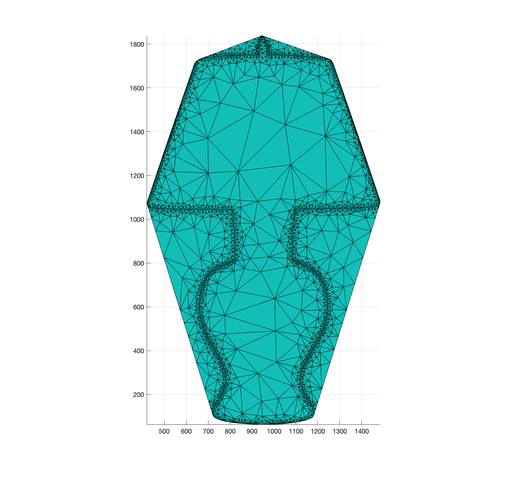

To solve this, we need to pass to triangle not just the vertex information but the edge information too:
```MATLAB
>> E = [(1:size(V,1))',[(2:size(V,1)';1]];
>> [U,G] = triangle(V,E,[],'Flags','-q20');
>> tsurf(G,U)
```
will produce
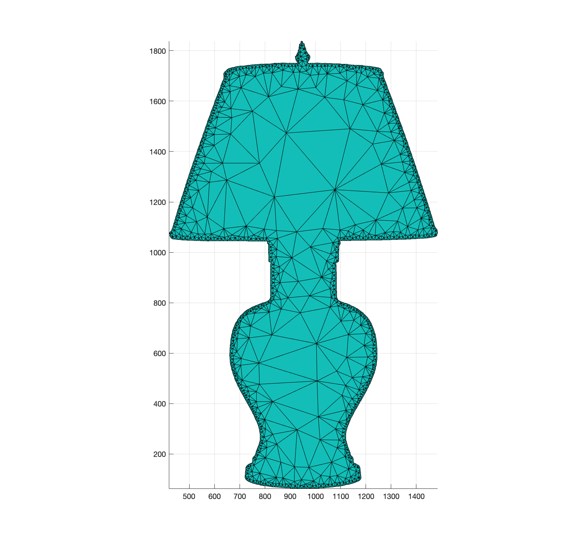

Great! One last thing: sometimes the region of space we want to mesh has more than one boundary component; for example, an annulus. Let's construct one:

```MATLAB
>> th = linspace(0,2*pi,100);
>> th = th(1:end-1);
>> V = [cos(th)',sin(th)'];
>> E = [(1:size(V,1))',[(2:size(V,1))';1]];
>> E = [E;E+size(V,1)]
>> V = [V;0.4.*V];
>> plot_edges(V,E,'-k','LineWidth',5)
```
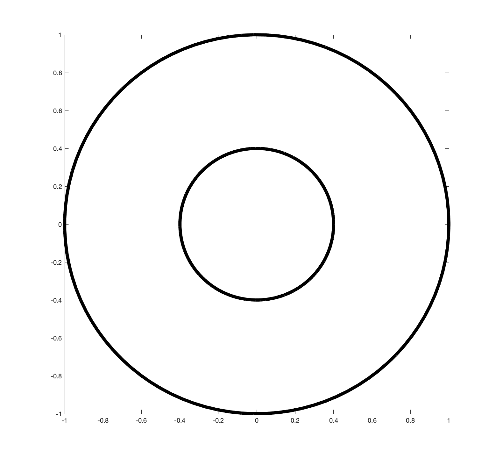

If we ran either of
```MATLAB
>> [U,G] = triangle(V,E,[],'Flags','-q20');
>> tsurf(G,U)
```
or
```MATLAB
>> [U,G] = triangle(V,'Flags','-q20');
>> tsurf(G,U)
```
we would obtain
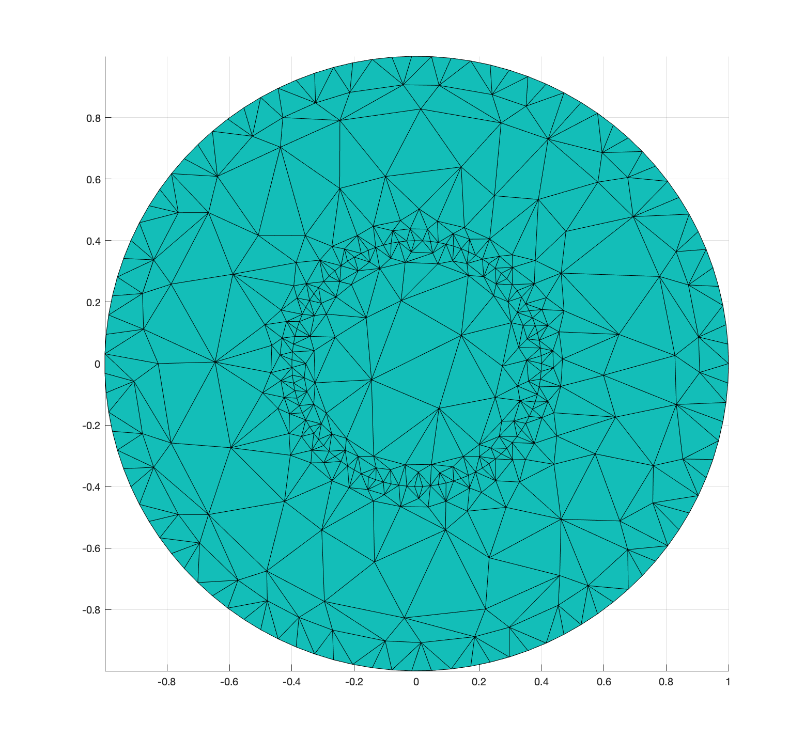

This is because, while our vertex and edge set describes a partition of space into regions, `triangle` does not know which regions count as *inside* (i.e., to be triangulated) and which regions count as *outside* (i.e., not to be triangulated). We must tell it, by giving it as a third argument one point contained in each region that is a "hole". In this case, the region containing `[0,0]` is a hole, so by doing

```MATLAB
>> [U,G] = triangle(V,E,[0,0],'Flags','-q20');
>> tsurf(G,U)
```
we finally obtain the mesh we want:
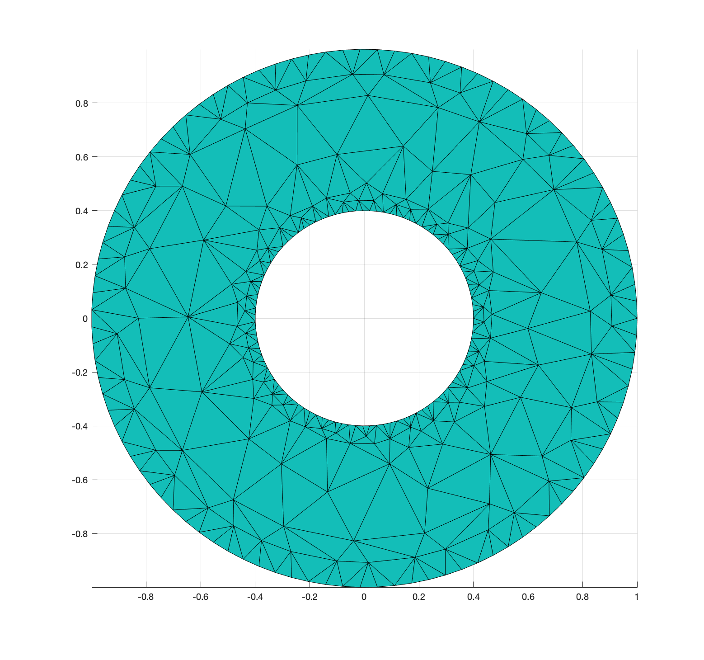

## Tetgen

Hang Si's [tetgen](http://wias-berlin.de/software/index.jsp?id=TetGen&lang=1) combines many state of the art tetrahedralization techniques to obtain tetrahedral meshes from input bounding surfaces (more information can be found [here](https://dl.acm.org/doi/10.1145/2629697)).

Its use is similar to that of `triangle`. Once we have it [installed](http://wias-berlin.de/software/tetgen/download2.jsp), we can load any closed, manifold mesh
```MATLAB
>> [SV,SF] = readOBJ("data/spot.obj");
>> tsurf(SF,SV)
```
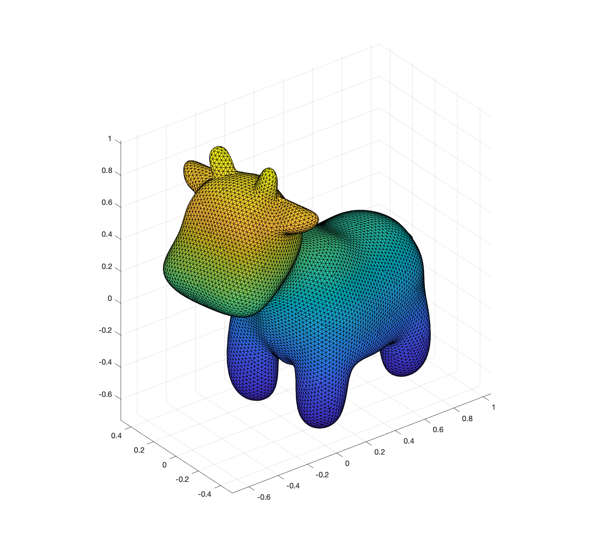

and then call tetgen to create a tetrahedral mesh with the given surface triangles untouched:
```MATLAB
>> [V,T,F] = tetgen(SV,SF);
```

Matlab isn't great at displaying tetrahedral meshes, so it may be better that you trust me on the fact that, now, we have a tetrahedral mesh in `V,T`. If you trust the prowess of your computer or have a few minutes to spare, however, you are welcome to run something like
```MATLAB
>> tsurf(T,V,falpha(0,0.3))
```
which will show you all the interior edges of the tet mesh.
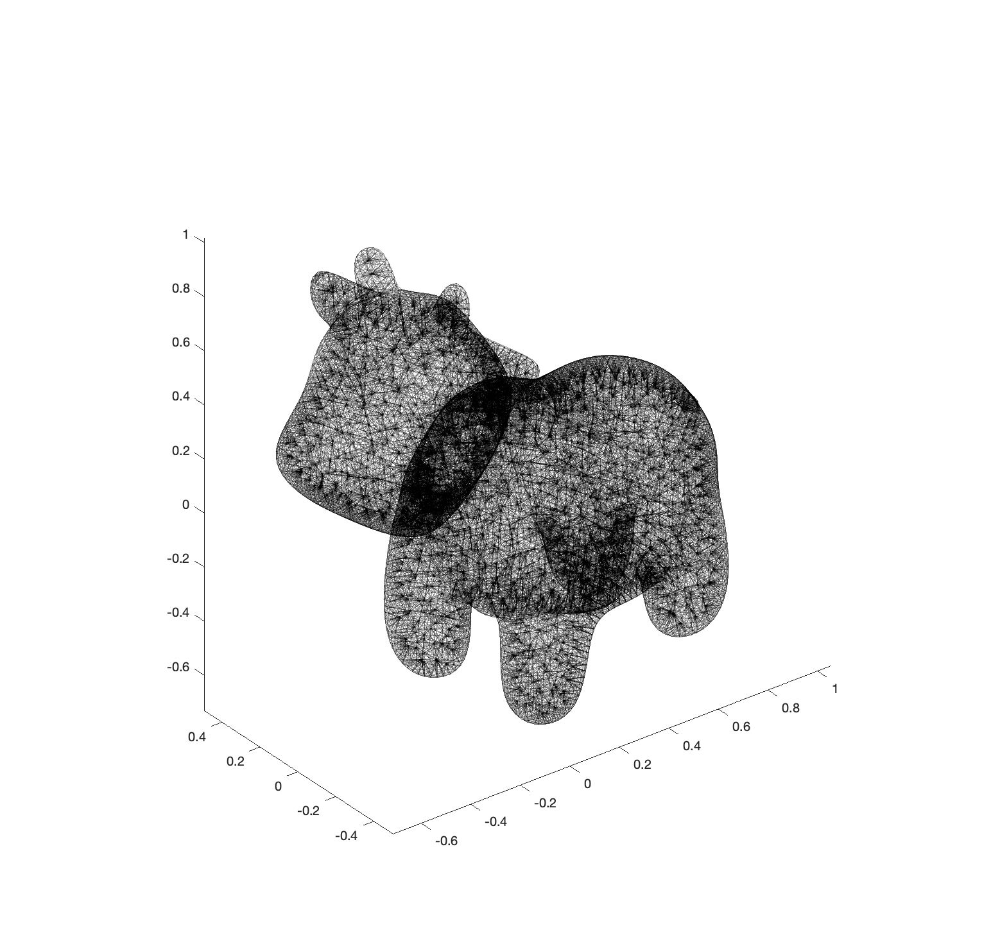

In practice, the most common way of displaying a tetrahedral mesh is by showing only its bounding surface:
```MATLAB
>> SF = boundary_faces(T);
>> tsurf(SF,V)
```
or, if we really want to see inside the shape, by cutting through it using `gptoolbox`'s  [`slice_tets`](https://github.com/alecjacobson/gptoolbox/blob/master/mesh/slice_tets.m).

## Meshfix

Marco Attene's [meshfix](https://github.com/MarcoAttene/MeshFix-V2.1) combines many mesh repair techniques to remove a set of common mesh defects one can find when obtaining triangle meshes from 3D capture software like a 3D scanner (more details can be found [here](http://saturno.ge.imati.cnr.it/ima/personal/attene/PersonalPage/pdf/TVC2010_preprint.pdf)).

A common mesh defect are holes that correspond to areas the scanner has occluded or even real holes that we want to fill because our algorithm is designed to work on closed geometry. For example, let us load the original Stanford bunny mesh:
```MATLAB
>> [V,F] = readOBJ("data/bunny_fine.obj");
>> tsurf(F,V)
```
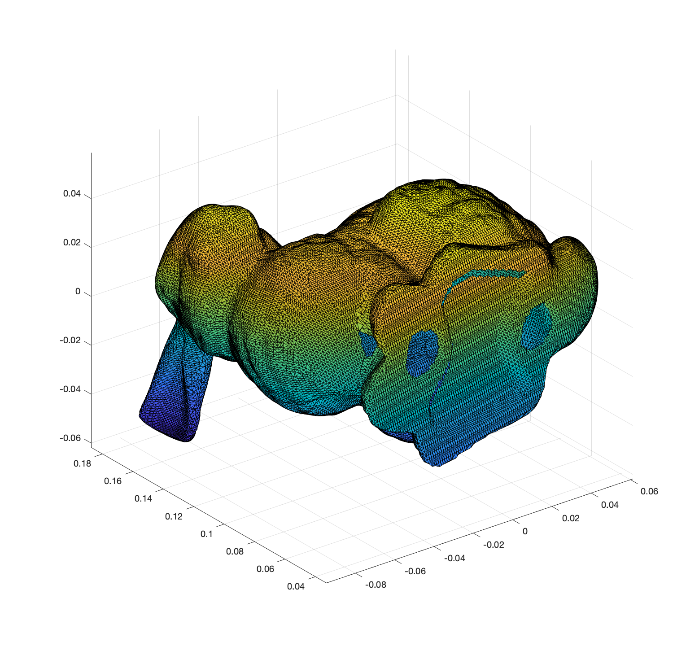

If `meshfix` is installed in our computer (their [github](https://github.com/MarcoAttene/MeshFix-V2.1) has a simple CMake installation), we need only run
```MATLAB
>> [U,G] = meshfix(V,F);
>> tsurf(G,U)
```
to fill the holes:
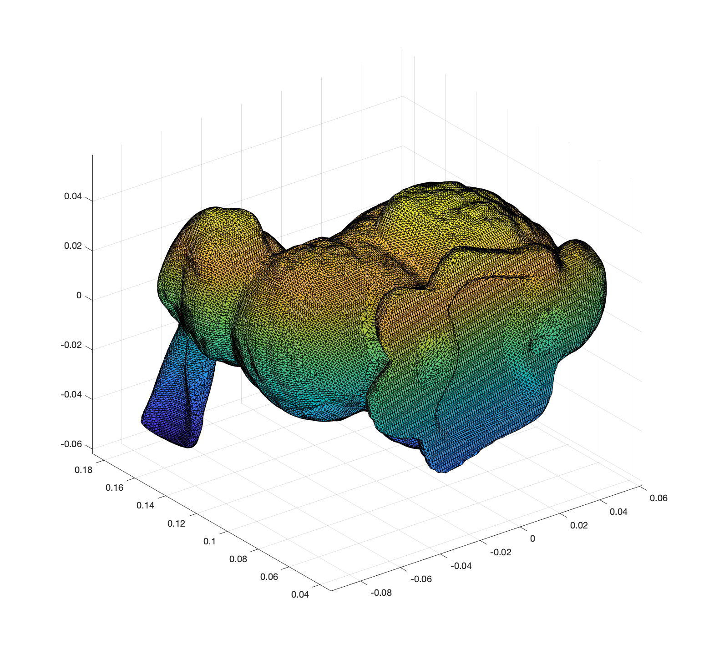

Apart from hole filling, `meshfix` also handles self-intersections, singularities, degeneracies and other possible mesh defects. While an amazingly versatile piece of software, it is important not to trust it blindly: sometimes, its way of creating a degeneracy-free or intersection-free mesh is by deleting problematic mesh components entirely, so it is good to check often that it is doing what we expect it to.

## Exercises

These three wrappers, but perhaps more than most `triangle`, will be omnipresent in your Matlab geometry processing career. In [exercise/triangle_pencil_curve](exercise/triangle_pencil_curve.m), we ask you to combine the functionality of `triangle` you just learnt about with the 2D `gptoolbox` funcionality you saw in the [previous tutorial item](../201_polylines/).
