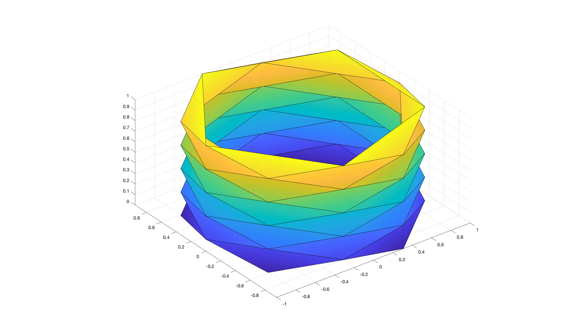

# Basic Mesh Modeling

There are many [websites](https://www.thingiverse.com) and [datasets](https://ten-thousand-models.appspot.com) dedicated to real-world 3D objects you can test your final algorithms on. However, earlier in the prototyping process, we often want to test our code on simpler, synthetic meshes whose parameters we can control. `gptoolbox` includes functionality to generate 3D geometry by extruding 2D meshes, as well as by proceduraly creating meshes of simple 3D objects.

## 2D extruded meshes

I removed this!

## Basic procedural meshes

There are some simple geometric shapes we want to be able to quickly and reliably generate, with clear parameters we can tune for convergence analysis of differential operators, for example. With `gptoolbox`, we can create a triangle mesh of a sphere by running
```MATLAB
>> [V,F] = subdivided_sphere(5);
>> tsurf(F,V,fsoft,fphong)
>> axis equal
```
which subdivides an icosahedron (by a number of times in the function argument) and pastes vertex positions to a sphere:


Similarly, using `gptoolbox` you can quickly generate a cube, with the arguments determining the number of vertices on each dimension:
```MATLAB
>> [V,F] = cube(2,5,10);
>> tsurf(F,V,fsoft,fphong)
>> axis equal
```


Note how if we increase the number of vertices on only two dimensions of the cube, for example, the mesh will become increasingly fine but also increasingly low quality: 


This makes this shape a good choice to test the robustness of differential geometry operators, since we often know anayltical groundtruths for a shape as simple as a cube but we can make the triangulation arbitrarily bad. In the same vein, `gptoolbox` can generate a [Schwarz's lantern](https://en.wikipedia.org/wiki/Schwarz_lantern), a specific way of triangulating a cylinder which serves as an example of the unintuitive convergence of some geometric quantities when discretized:
```MATLAB
>> [V,F] = schwarz_lantern(10,5);
>> tsurf(F,V,fsoft,fphong)
>> axis equal
```


If, on the other hand, we just want a reliable mesh of a 3D cylinder, we could just call `cylinder_mesh`.

## Exercises

Now it's time for you to get used to these functions. Why don't you use the skeleton scripts in `exercise/` to create a more general framework for 3D modeling that you can use in your own research projects, as well as to test the fascinating convergence properties of the Schwarz lantern.
