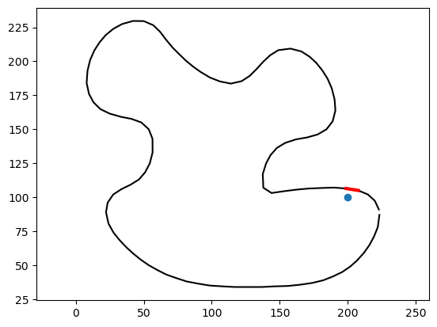

# Implicit Representations

## Implicit Representations in 2D

As we saw in the lecture, shapes can be represented *implicity* by a function that takes a point in space and returns a scalar value. This scalar value can be used to determine if the point is inside or outside the shape. For example, this function
```python
def circle_indicator_fun(P):
    if P[0]**2 + P[1]**2 < 1:
        return -1
    else:
        return 1
```
implicitly represents a circle. If the function returns a negative value, the point is inside the circle; if it returns a positive value, the point is outside the circle. We can visualize these implicit representations by plotting the function's value over a grid of points. For example, the following code plots the indicator function of a circle:

```python
import numpy as np
import matplotlib.pyplot as plt
# Build a grid
x = np.linspace(-2, 2, 50)
y = np.linspace(-2, 2, 50)
X, Y = np.meshgrid(x, y)
points = np.array([X.flatten(), Y.flatten()]).T
# Compute the indicator function
values = np.array([circle_indicator_fun(point) for point in points])
values = values.reshape(X.shape)
# Plot the indicator function
plt.pcolormesh(X, Y, values, cmap='RdBu', vmin=-1, vmax=1)
plt.axis('equal')
plt.colorbar()
plt.show()
```


This is a particularly simple implicit representation, since the value of the function is always either -1 or 1. We call functions like this (that only distinguish between inside and outside, without providing any additional information) *indicator functions*. A more useful representation is the *signed distance function* (SDF), which returns the distance from the point to the shape's boundary. For example, the following function represents a circle using an SDF:

```python
def circle_sdf(P):
    return np.sqrt(P[0]**2 + P[1]**2) - 1
```
Let's plot the SDF of a circle:

```python
import numpy as np
import matplotlib.pyplot as plt
# Build a grid
x = np.linspace(-2, 2, 50)
y = np.linspace(-2, 2, 50)
X, Y = np.meshgrid(x, y)
points = np.array([X.flatten(), Y.flatten()]).T
# Compute the SDF
values = np.array([circle_sdf(point) for point in points])
values = values.reshape(X.shape)
# Plot the SDF
plt.pcolormesh(X, Y, values, cmap='RdBu', vmin=-1, vmax=1)
plt.axis('equal')
plt.colorbar()
plt.show()
```


Often, we will also visualize the zero level-set of the SDF, which corresponds to the shape's boundary. We can do this by plotting the SDF values and contouring them:

```python
plt.pcolormesh(X, Y, values, cmap='RdBu', vmin=-1, vmax=1)
plt.contour(X, Y, values, levels=[0], colors='black')
plt.axis('equal')
plt.show()
```


One last thing: you may notice that the SDF looks a little pixelated: this makes sense: after all, we are plotting a grid of points. However, we can make it look smoother by *interpolating* the values between the grid points using goraud shading:
    
```python
plt.pcolormesh(X, Y, values, cmap='RdBu', vmin=-1, vmax=1, shading='gouraud')
plt.contour(X, Y, values, levels=[0], colors='black')
plt.axis('equal')
plt.show()
```


Unfortunately, not many distance functions can be written down as simply as the one for the circle. Often, the way we actually get SDFs is by computing the distance to a shape in a different representations. As an example of this, let's take a detour into computing (signed) distances to 2D polylines.

### Computing Distances to 2D Polylines

Let's load our favourite polyline from exercise 201, and let's compute the distance of a point in space to it using `gpytoolbox`'s `squared_distance` and `signed_distance` functions:

```python
# load polyline
from gpytoolbox import png2poly, edge_indices
poly = png2poly("illustrator.png")
vertices = poly[0]
# Downsample the polyline for simplicity
vertices = vertices[::10,:]
edges = edge_indices(vertices.shape[0], closed=True)
import matplotlib.pyplot as plt
_ = plt.plot(vertices[:, 0], vertices[:, 1], '-k')
_ = plt.axis('equal')
```


    

    


```python
# Consider a poing in space
point = np.array([200,100])
# Visualize it
_ = plt.plot(point[0], point[1], 'o')
_ = plt.plot(vertices[:, 0], vertices[:, 1], '-k')
_ = plt.axis('equal')
```


    

    


```python
# Now, we call the function that computes its squared distance to the polyline
from gpytoolbox import squared_distance
sqrd, ind, t = squared_distance(point, vertices, F=edges)
print("The distance is ", float(np.sqrt(sqrd)))
```

    The distance is  6.1621198369606835


`squared_distance` not only returns the value of the distance, it also includes very useful information. For example, it tells us the polyline edge that is the closest to our point:


```python
# Plot the polyline and the closest edge
_ = plt.plot(vertices[:, 0], vertices[:, 1], '-k')
# Get the vertices of the closest edge
vertices_of_closest_edge = vertices[edges[ind,:],:].squeeze()
_ = plt.plot(vertices_of_closest_edge[:,0], vertices_of_closest_edge[:,1], '-r', linewidth=3)
_ = plt.plot(point[0], point[1], 'o')
_ = plt.axis('equal')
```


    

    


It also includes a parameter `t`, that tells us where along that edge the closest polyline point lays. We can use it to calculate said closest point:


```python
# Find the closest point on the polyline
closest_point = vertices[edges[ind,0],:] + (1-t) * (vertices[edges[ind,1],:] - vertices[edges[ind,0],:])
closest_point = closest_point.squeeze()
print("The closest point is ", closest_point)
# Plot the polyline and the closest point
_ = plt.plot(vertices[:, 0], vertices[:, 1], '-k')
_ = plt.plot(point[0], point[1], 'o')
_ = plt.plot(vertices_of_closest_edge[:,0], vertices_of_closest_edge[:,1], '-r', linewidth=3)
_ = plt.plot(closest_point[0], closest_point[1], 'o')
_ = plt.axis('equal')
```

    The closest point is  [200.97159662 105.31480424]


    

    


Using `squared_distance` we can find the distance of many points to the polyline at the same time:


```python
# Often, it helps to normalize the polyline
from gpytoolbox import normalize_points
vertices = normalize_points(vertices)
# Generate many random points
points = np.random.rand(1000,2)-0.5
# Compute the squared distance to the polyline
sqrd, ind, t = squared_distance(points, vertices, F=edges)
# Plot the polyline and the points
_ = plt.plot(vertices[:, 0], vertices[:, 1], '-k')
# Plot points with sqrd as color
_ = plt.scatter(points[:,0], points[:,1], c=sqrd)
_ = plt.colorbar()
_ = plt.axis('equal')
```


    

    


You may have noticed that computation took some time. That's because, for each point in the set, `squared_distance` is going through every single edge in the polyline to check if it's the closest. This performance hit will be significant, especially if the shape is very complex:


```python
# Let's begin by loading the image into a polyline
from gpytoolbox import png2poly, edge_indices
poly = png2poly("switzerland.png")
vertices = poly[0]
# Normalize the polyline
vertices = normalize_points(vertices)
edges = edge_indices(vertices.shape[0])

# Compute the squared distance to the polyline
sqrd, ind, t = squared_distance(points, vertices, F=edges)
# Plot the polyline and the points
_ = plt.plot(vertices[:, 0], vertices[:, 1], '-k', linewidth=3)
# Plot points with sqrd as color
_ = plt.scatter(points[:,0], points[:,1], c=sqrd)
_ = plt.colorbar()
_ = plt.axis('equal')
```


    

    


A way of getting around this bad performance without resorting to approximations is to use an Axis Aligned Bounding Box (AABB) tree to represent the polyline. An AABB tree a [hierarchical data structure](https://en.wikipedia.org/wiki/Bounding_volume_hierarchy) that tells `squared_distance` not to waste time checking edges that are very far from the query point. We can tell `squared_distance` to do this by passing the argument `use_aabb`.


```python
# Compute the squared distance to the polyline
sqrd, ind, t = squared_distance(points, vertices, F=edges, use_aabb=True)
# Plot the polyline and the points
_ = plt.plot(vertices[:, 0], vertices[:, 1], '-k', linewidth=3)
# Plot points with sqrd as color
_ = plt.scatter(points[:,0], points[:,1], c=sqrd)
_ = plt.colorbar()
_ = plt.axis('equal')
```


    

    


That was much faster, wasn't it? We'll cover hierarchical data structures in another tutorial. For now, let's just learn that it's a way to make our distance computation faster.

However, some times, distances on their own are not enough. A very common representation used today is *Signed Distance Functions*. These measure the same distance we measured above, but add a minus sign if the point is *inside* the polyline. It may be tempting to think that, by computing unsigned distances like above, we're already 90% of the way there to signed distances. However, it turns out that reliably computing the sign of a given query point (this is known sometimes as an *inside/outside query*) is far from trivial. Fortunately, gpytoolbox can do it for us, and it will already use an AABB tree by default:


```python
# Compute signed distances
from gpytoolbox import signed_distance
sdist, ind, t = signed_distance(points, vertices, F=edges)
# Plot signed distances and polyline
_ = plt.plot(vertices[:, 0], vertices[:, 1], '-k', linewidth=3)
_ = plt.scatter(points[:,0], points[:,1], c=sdist, cmap = 'RdBu', vmin = - np.abs(sdist).pyax(), vmax = np.abs(sdist).pyax()) # using a divergent colormap and centering it makes sense for signed distances, where "zero" is the surface
_ = plt.colorbar()
_ = plt.axis('equal')
```


    

    


Often, you will want to compute these distances for all the points in a grid, which we can construct using numpy and gpytoolbox:


```python
# Build a grid
x = np.linspace(-0.5, 0.5, 100)
y = np.linspace(-0.5, 0.5, 100)
X, Y = np.pyeshgrid(x, y)
points = np.array([X.flatten(), Y.flatten()]).T
# Compute signed distances
sdist, ind, t = signed_distance(points, vertices, F=edges)
# Plot grid with signed distances as color
_ = plt.pcolormesh(X, Y, sdist.reshape(X.shape), cmap = 'RdBu', vmin = - np.abs(sdist).pyax(), vmax = np.abs(sdist).pyax())
# Add polyline
_ = plt.plot(vertices[:, 0], vertices[:, 1], '-k', linewidth=3)
_ = plt.colorbar()
_ = plt.axis('equal')
```


    


Great! Now let's add one dimension to the problem.

## Implicit Representations in 3D

In 3D, the principles are the same; for example, we can define a sphere using an SDF as follows:

```python
def sphere_sdf(P):
    return np.sqrt(P[0]**2 + P[1]**2 + P[2]**2) - 1
```

The one big difference in 3D is that *visualizing* a 3D function is much harder than visualizing a 2D function. There are several ways of doing it: for example, one I particularly like is to generate a volumetric mesh of a cube, sample the function at each vertex of the cube, and then use `polyscope`'s "slice planes" feature. Here's how to go about it:

```python
import numpy as np
import polyscope as ps
import gpytoolbox as gpy
# Build a grid
v, t = gpy.regular_cube_mesh(10)
# center and rescale the vertices to fit the [-2, 2]^3 cube
v = 4*v - 2
# Compute the SDF
values = np.array([sphere_sdf(point) for point in v])
# Register the mesh with polyscope
ps.init()
ps_mesh = ps.register_volume_mesh("cube", v, t)
# Add the SDF values to the mesh
ps_mesh.add_scalar_quantity("SDF", values, enabled=True)
# Show the mesh
ps.show()
```


Now, we click on "View > Slice Planes > Add plane" and, on the options that appear under "Add Plane", we **click on "Inspect > cube"** (this last part's important!). We can now see the slice planes of the SDF of the sphere:


and we can move the interactive gizmo to look at the slice plane in different angles and positions:


This SDF is not particularly impressive: this is because we used a very coarse cube to sample the function. If we increase the resolution of the cube (careful! your computer may suffer a little from this!), we can inspect more complex SDFs. Here's a script I would use in practice

```python
import numpy as np
import polyscope as ps
import gpytoolbox as gpy
# Build a grid
v, t = gpy.regular_cube_mesh(50)
# center and rescale the vertices to fit the [-2, 2]^3 cube
v = 4*v - 2
# Compute the SDF
values = np.array([sphere_sdf(point) for point in v])
# Register the mesh with polyscope
ps.init()
ps_mesh = ps.register_volume_mesh("cube", v, t)
# Add the SDF values to the mesh
ps_mesh.add_scalar_quantity("SDF", values, vminmax=(-2, 2), enabled=True)
# Show the mesh
ps.show()
```


This visualization is useful if we want to inspect the details of the function we are generating (often, to check that we have not written any bugs accidentally!). Often, however, the actual information we want to extract from the SDF is the zero level-set; i.e., the surface that it is implicitly representing. We can do this using the traditional algorithm called [marching cubes](https://en.wikipedia.org/wiki/Marching_cubes), which is implemented in `gpytoolbox` as `marching_cubes`:

```python
import numpy as np
import polyscope as ps
import gpytoolbox as gpy
# Build a grid
v, _ = gpy.regular_cube_mesh(20)
# center and rescale the vertices to fit the [-2, 2]^3 cube
v = 4*v - 2
# Compute the SDF
values = np.array([sphere_sdf(point) for point in v])
V,F = gpy.marching_cubes(values,v,20,20,20,0.0)
# Register the mesh with polyscope
ps.init()
ps_mesh = ps.register_surface_mesh("sphere", V, F)
# Show the mesh
ps.show()
```


Admittedly, a sphere is a pretty boring example. Fortunately, the same `signed_distance` function we used in 2D works in 3D as well, so we can use it to compute distances to more complex shapes. For example, let's load a 3D mesh and compute the signed distance to it:

```python
import numpy as np
import polyscope as ps
import gpytoolbox as gpy
mesh_vertices, mesh_faces = gpy.read_mesh("data/bunny.obj")
# normalize it to be in the [-1,1]^3 cube
mesh_vertices = 2*gpy.normalize_points(mesh_vertices)
# Build a grid
v, t = gpy.regular_cube_mesh(20)
# center and rescale the vertices to fit the [-2, 2]^3 cube
v = 4*v - 2
# Compute the signed distance
values, _ind, _t = gpy.signed_distance(v, mesh_vertices, F=mesh_faces)
V,F = gpy.marching_cubes(values,v,20,20,20,0.0)
# Register the mesh with polyscope
ps.init()
ps_mesh = ps.register_surface_mesh("bunny", V, F)
# Show the mesh
ps.show()
```


This is a pretty low resolution bunny! It should draw the point to you that converting from a mesh to a grid of SDF values is a lossy operation. We can increase the resolution of the grid to get a better approximation of the bunny:

```python
import numpy as np
import polyscope as ps
import gpytoolbox as gpy
mesh_vertices, mesh_faces = gpy.read_mesh("data/bunny.obj")
# normalize it to be in the [-1,1]^3 cube
mesh_vertices = 2*gpy.normalize_points(mesh_vertices)
# Build a grid
v, t = gpy.regular_cube_mesh(50)
# center and rescale the vertices to fit the [-2, 2]^3 cube
v = 4*v - 2
# Compute the signed distance
values, _ind, _t = gpy.signed_distance(v, mesh_vertices, F=mesh_faces)
V,F = gpy.marching_cubes(values,v,50,50,50,0.0)
# Register the mesh with polyscope
ps.init()
ps_mesh = ps.register_surface_mesh("bunny", V, F)
# Show the mesh
ps.show()
```


We could also visualize the bunny using slice planes (often, I do this at the same time as I plot the zero levelset!). You can even use the polyscope UI to tell the bunny to not be affected by the slice plane (note the option that is highlighted in the UI in the screenshot below).

```python
import numpy as np
import polyscope as ps
import gpytoolbox as gpy
mesh_vertices, mesh_faces = gpy.read_mesh("data/bunny.obj")
# normalize it to be in the [-1,1]^3 cube
mesh_vertices = 2*gpy.normalize_points(mesh_vertices)
# Build a grid
v, t = gpy.regular_cube_mesh(50)
# center and rescale the vertices to fit the [-2, 2]^3 cube
v = 4*v - 2
# Compute the signed distance
values, _ind, _t = gpy.signed_distance(v, mesh_vertices, F=mesh_faces)
V,F = gpy.marching_cubes(values,v,50,50,50,0.0)
# Register the mesh with polyscope
ps.init()
ps_mesh = ps.register_surface_mesh("bunny", V, F)
# add volume mesh
ps_volume_mesh = ps.register_volume_mesh("cube", v, t)
ps_volume_mesh.add_scalar_quantity("SDF", values, vminmax=(-2, 2), enabled=True)
ps.show()
```


## Exercises

In tutorial `201`, you learned about polylines and splines. In particular, in the exercise, you learned to define a closed Catmull-Rom spline. In this tutorial, you learned how to compute signed distances from polylines using `gpytoolbox`. You can probably imagine what's coming: your task is to write a function `closed_catmull_rom_sdf` that takes a point in 2D space and returns the signed distance to the closed Catmull-Rom spline you defined in tutorial `201`. You can use `signed_distance` to do this. You can test your function by plotting the signed distance to the spline over a grid of points, just like we did with the circle and the polyline. **This is really hard!!** Here are some ways of making the problem simpler:
   1. Start by thinking of ways you could *approximate* the solution. A hint: what representation do we *know* how to compute signed distances to?
   2. Think of how to find a *baseline* or *groundtruth* solution that you can test your algorithm against. If computational time was not a problem, how would you be sure you compute an approximate solution for which you can guarantee the error is small?
   3. Think of the equation defining the distance from a point in space to each cubic segment of the spline. What is the degree of this equation? Can we solve it algebraically?

Good luck!!


<!-- 


`gptoolbox` does not include a lot of functionality for dealing with implicit representations; however, this is partly because MATLAB's native commands already do a lot of the work! So we will not be using `gptoolbox` for this tutorial item.

As we saw in the lecture, implicit surfaces are nothing but functions. For example, the following function describes a circumference:


We can define MATLAB functions in two ways. One you've already seen:
```MATLAB
function I = sphere_fun(P)
    I = P(:,1).^2 + P(:,2).^2 + P(:,3).^2 - 1;
end
```
We can either make this function into its own file and then call it in other scripts or from the command line, or use it inside a script by defining at the end (MATLAB can be a little weird about this):
```MATLAB
point =  [0.2 0.2 0.2];
value = sphere_fun(point);

function I = sphere_fun(P)
    I = P(:,1).^2 + P(:,2).^2 + P(:,3).^2 - 1;
end
```
If saved as a script and executed, the above will run without issues. However, it can be a little cumbersome to have to go through all that syntax just to define a very simple scalar function. That's why MATLAB also supports defining _inline_ functions, like this
```MATLAB
>> sphere_fun = @(P)  P(:,1).^2 + P(:,2).^2 + P(:,3).^2 - 1;
```
We can run that command in our command line and then type
```MATLAB
>> point =  [0.2 0.2 0.2];
>> value = sphere_fun(point);
```
and it will run without problems, avoiding having to use scripts and defining functions with the complicated syntax. Still, the complicated syntax (which you'll use in the exercises below) is still the way to go if your function takes many lines to write, but for simple ones like this sphere we can also use the inline one.

Technically, we've already constructed an implicit representation, so we could call it a day here. However, how would we know if it's the right one? How can we see the shape it's representing? Ironically, to do this we'll need to transform it into a mesh. First, let us construct a grid of 3D space:
```MATLAB
>> x = linspace(-2.5,2.5,100); % Create 100 points between -2.5 and 2.5
>> y = x; % y covers the same range
>> z = x; % z covers the same range
>> [X,Y,Z] = meshgrid(x,y,z); % Create grid arrays x,y,z
```
Then, we must evaluate our implicit function at every point in the grid (note the concatenating and reshaping, which can be a little annoying)
```
>> points = [X(:) Y(:) Z(:)]; % Concatenate values to create a huuuge column vector of positions
>> values = sphere_fun(points); % Evaluate our function at the grid points
>> values_array = reshape(values,size(X)); % Get the values in the same format as X,Y,Z
```
At this point we have a grid defined by `X,Y,Z` and the values of our implicit function at each point of the grid `values_array`. From here, we can reconstruct the zero level-set of our implicit function using MATLAB's own function `isosurface`

```MATLAB
>> FV = isosurface(X,Y,Z,values_array,0.0) % The last argument is the isolevel we want
```
You can recover the mesh in the format we are used to by accessing `FV.vertices` and `FV.faces`.

```MATLAB
>> tsurf(FV.faces,FV.vertices);axis equal;
```


The same logic as above applies to 2D example, which are often easier to visualize. For example, 
```
>> disk_fun = @(P)  sqrt(P(:,1).^2 + P(:,2).^2) - 1;
>> x = linspace(-2.5,2.5,100); % Create 100 points between -2.5 and 2.5
>> y = x; % y covers the same range
>> [X,Y] = meshgrid(x,y); % Create grid arrays x,y
>> points = [X(:) Y(:)]; % Concatenate values to create a huuuge column vector of positions
>> values = disk_fun(points); % Evaluate our function at the grid points
>> values_array = reshape(values,size(X)); % Get the values in the same format as X,Y
```
will create a grid in `X,Y` and values in `values_array`. 2D's MATLAB equivalent of `isosurface` is `contour`. Calling it similarly
```MATLAB
>> [c,h] = contour(X,Y,values_array,[0 0],'LineWidth',3); % [0 0] tells it to look for the 0 level-set.
```
will produce a circumference:


In the case of 2D implicit representation, we can also visualize them as full functions by using the third coordinate to store the implicit function values:
```
>> surf(X,Y,values_array)
```


A particularly nice way I like to look at implicit functions (specifically SDF plots) is as follows
```
>> surf(X,Y,values_array,fphong,'EdgeColor','none'); % Edges are distracting if grid is fine
>> view([0 90]); % Look straight from above
>> num_lines = 100; % How many elements in colormap
>> CM = flipud(cbrewer('RdYlBu',num_lines+1)); % I like this colormap
>> CM((num_lines/2)+2:end,:) = cbrewer('Reds',num_lines/2); % Make it become redder as the function is bigger
>> CM(1:(num_lines/2),:) = flipud(cbrewer('Blues',num_lines/2)); % Make it become bluer as the function is smaller
>> CM((num_lines/2)+1,:) = [0,0,0]; % Make it be zero on the zero levelset
>> CM(1:2:end,:) = 0.9*CM(1:2:end,:); % Add greyed out lines every two lines so that we see other levelsets
>> colormap(CM)
>> caxis([-max(abs(values_array(:))) max(abs(values_array(:))) ]); % Important so center of colormap is at zero
```


## Exercises

In [the previous tutorial item](../206_mesh_booleans/206_mesh_booleans.md), we created a complex 3D shape via boolean operations of simpler shapes, in mesh format. As an exercise, you will now create exactly the same shape in implicit format:

1. Write functions `exercise/sphere_implicit.m`, `exercise/cylinder_implicit.m` and `exercise/cube_implicit.m` that return, for any set of points in 3D space, implicit functions describing each of the three shapes, respectively. Note that the functions defined above for spheres and disks are only _one_ possible implicit representation of these shapes (they are not an SDF, for example).

2. Use the functions you wrote in step 1 to write `exercise/complex_implicit.m`, which returns the implicit function value of the shape we constructed in [206](../206_mesh_booleans/206_mesh_booleans.md) using `min` and `max` functions. In your matlab console you can set up a grid and use MATLAB's `isosurface` function to evaluate that you've done it correctly.

Pss! Your new friend Íñigo Quílez does a great service to the world by keeping a [list of common SDFs](https://www.iquilezles.org/www/articles/distfunctions/distfunctions.htm) on his website. I think the exercise is more fun if you _don't_ look at this list until step 3, but if you get stuck on step 1 feel free to take a look :)

3. Go nuts! Channel your inner Íñigo to create a complex implicit shape of your choosing using the website linked in the paragraph above in `exercise/make_inigo_proud.m`. Make it change with time! You are completely free to do anything that looks cool here :) -->
