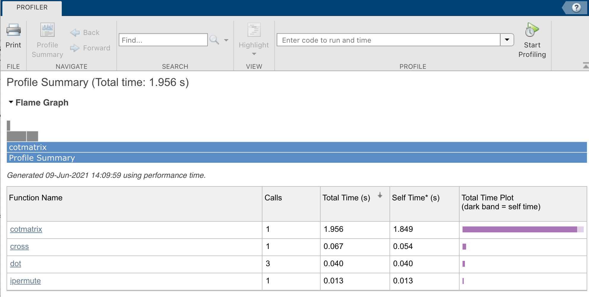
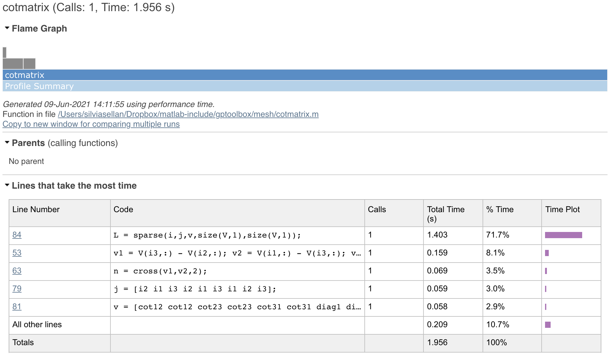
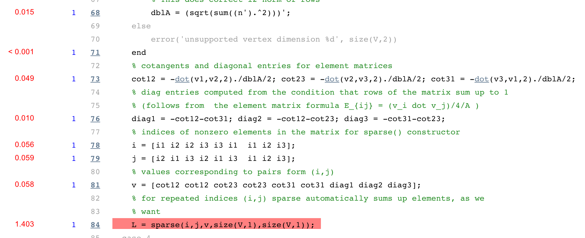

# Timing

Be it because we want to compare to other people's reported results or because we want to debug an unexpectedly slow piece of code, we often need to calculate just *how long* different parts of our program needs to run. Matlab provides us with great timing and profiling functionality which, combined with a few `gptoolbox` tricks up our sleeve, makes the timing profiling process significantly easier than in other software.

## Timing a matlab function

The `tic` and `toc` functions are Matlab's timing bread and butter. They work quite intuitively: `tic` starts a clock running, and `toc` outputs the time that has elapsed since the latest call to `tic`. For example,
```MATLAB
>>[V,F] = subdivided_sphere(5);
>> tic; L = cotmatrix(V,F); toc
Elapsed time is 0.020945 seconds.
```
building the cotangent matrix for the sphere mesh we constructed in [tutorial 203](../203_basic_mesh_modeling) takes just over 0.02 seconds. The value of `toc` can be assigned to a variable too; for example, we could run the following loop
```MATLAB
>> times = [];
>> num_verts = [];
>> for i=1:6
>>  [V,F] = subdivided_sphere(i+2);
>>  num_verts(i) = size(V,1);
>>  tic;
>>  L = cotmatrix(V,F);
>>  times(i) = toc;
>> end
```
and build a vector `times` which contains how long it took to build the cotangent Laplacian matrix for a mesh of size `num_verts`. 

Often, we not only want to know the times themselves but rather how they are related to the mesh's complexity: does the runtime of our code grow linearly with the size of the input mesh, or does it grow quadratically, or exponentially? Needless to say, this can be a critical observation that affects whether our method is viable at all at a large scale, given real-world models can easily reach the tens of millions of vertices. A good way of getting an idea for this runtime complexity is to plot the logarithms of the runtime and the mesh's complexity measure, like this:

```MATLAB
>> plot(log(num_verts),log(times),'-k','LineWidth',5)
>> axis equal
>> xlabel('number of vertices (log)')
>> ylabel('time to build cot matrix (log seconds)')
```


The `axis equal` call is critical to interpreting this plot. Since the two axis have the same scale and we are comparing the logarithms of runtime and number of vertices, we can visually get an idea for the complexity of our code just by the *slope* of this plot. If the slope is one (the plot looks like *y=x*), then the runtime grows linearly with mesh size; more generally, if the slope is n, then the runtime grows as a power of n of the mesh size.

Of course, "looking at a plot" is not the most reliable scientific tool. If we want to make sure that our code's complexity is the one we think, we can use Matlab's `polyfit` to find the closest fit degree-one polynomial on their logarithms to find the order of their relationship:
```MATLAB
>> polyfit(log(num_verts),log(times),1)

ans =

    1.0165  -13.2870
```
The first component of the answer (in this case, `1.0165`) is the complexity order.

You may be wondering: how reliable are `tic` and `toc` as timing measures? Let's test it with an experiment: I am going to run `tic; L = cotmatrix(V,F); toc` five times in a row for the largest mesh in our complexity experiment above (the one in memory now as `V,F` if you are following this tutorial item in order. In my MacBook, I get this:

```MATLAB
>> tic; L = cotmatrix(V,F); toc
Elapsed time is 2.288547 seconds.
>> tic; L = cotmatrix(V,F); toc
Elapsed time is 1.685289 seconds.
>> tic; L = cotmatrix(V,F); toc
Elapsed time is 1.725659 seconds.
>> tic; L = cotmatrix(V,F); toc
Elapsed time is 1.516023 seconds.
```

That's a pretty big variation! If I were to also run many other apps in my computer at the same time, I can even get
```MATLAB
>> tic; L = cotmatrix(V,F); toc
Elapsed time is 5.879892 seconds.
```

In other words, just running `tic` and `toc` once is not very reliable. That is why `gptoolbox` includes a function called `timeit`, which warms up your computer and finds the median computation time for many repeated tests. For our one line of code, we'll call it like this:
```MATLAB
>> g = @() cotmatrix(V,F);
>> timeit(g)

ans =

    1.4714
```
It is simple to see that this is a much more stable way of measuring runtime:
```MATLAB
>> timeit(g); timeit(g); timeit(g); timeit(g)

ans =

    1.5081


ans =

    1.4520


ans =

    1.4349


ans =

    1.5283
```


## The Matlab profiler

Often, we don't just want to know how long our code takes, we want to know exactly which parts of our code are contributing the most to our runtime so we can prioritize which parts to optimize or to look for bugs. Matlab includes a built-in `profiler` exactly for this purpose. Let's run it for the function we tested above:
```MATLAB
>> profile on
>> L = cotmatrix(V,F);
>> profile viewer
```
Something like this will appear on screen:

This lists the functions that are contributing to our total runtime, differentiating between their total runtime (including all the function calls inside of it) and their self-time (time spent executing the specific commands in the function, not including other functions). We can click on `cotmatrix`, for example, to see a summary of the lines that are taking the most time.


We can even scroll down to see the code itself colored by how long each line takes.


Running the profiler whenever something takes longer than we expect to run can be really valuable, especially considering Matlab's not-always-intuitive vectorization rules. Who knew that accessing `A(:,1)` is faster than `A(1,:)` (or maybe it's the other way around...)!


## Exercises

Now it's time for you to get used to these functions. Why don't you use the skeleton scripts in `exercise/` to test the complexity of some gptoolbox functions?
