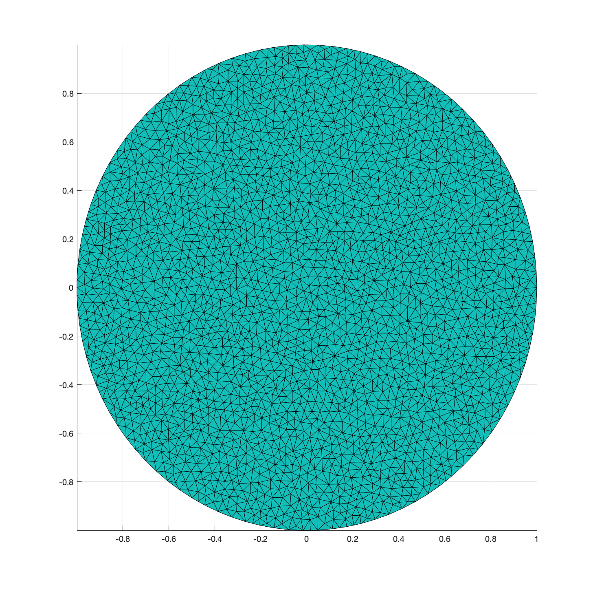
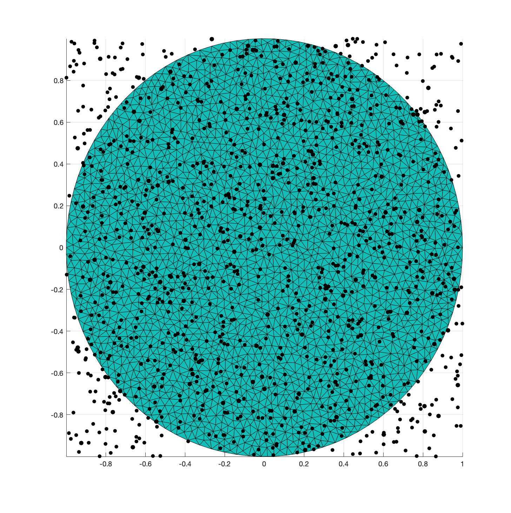

# Mex

If you made it this far into this tutorial, then you are probably convinced that Matlab and `gptoolbox` are great as tools for protoyping. Believe it or not; however, there are things even Matlab cannot do. ~~Can Matlab write code that not even Matlab could run?~~ That's why `mex` exists, Matlab's built-in way of using C++ functionality inside your Matlab programs.

## Gptoolbox's mex functions

`gptoolbox` contains many `mex` functions, all in the `mex/` directory. So far in this tutorial we have done a pretty good job of avoiding them, since using them requires *compiling* them, a step that can be far from trivial, especially if you are using a non-macOS operating system like Windows. Compilation instructions can be found [here](compilation_instructions.md) and I encourage you to at least try to compile them. Who knows, it may just work!

<!---
Update this depending on how good our new compilation instructions are
-->

If you are not able to compile it, that's fine. We will keep trying to avoid `mex` functions as much as possible in what's left of this tutorial, but we will use some to demonstrate their functionality for those that have managed to compile them. In what's left of this tutorial item, we will assume you managed to compile it; if you haven't, you can skip to the next.

To see just how powerful `mex` can be, let's consider the problem of identifying the element of a mesh that a given point is contained in. Let's generate a mesh:
```MATLAB
>> th = linspace(0,2*pi,100);
>> th = th(1:end-1);
>> V = [cos(th)',sin(th)'];
>> [V,F] = triangle(V,'Flags','-q20-a0.001');
>> tsurf(F,V)
```


Now, let's generate a thousand random points inside the [-1 1] square (Matlab generates random points between 0 and 1 so we need to rescale them and translate them):
```MATLAB
>> P = rand(100,2);
>> P = 2.*P - [1,1];
>> hold on
>> sct(P,200,'.k')
```


`gptoolbox`'s Matlab-only way of finding which triangle each black point falls in is to check, for every point, whether it falls in any of all the triangles of the mesh. It can be slow:
```MATLAB
>> tic;in_element(V,F,P);toc;
Elapsed time is 3.236591 seconds.
```

This computation can be sped up massively (from linear to logarithmic complexity) by using a [bounding volume hierarchy (BVH)](https://en.wikipedia.org/wiki/Bounding_volume_hierarchy). This is a kind of data structure that is hard to build and interact with in Matlab; however, it is relatively simple to do in C++. The `mex` implementation of `in_element_aabb`, which uses a C++ BVH, is whole orders of magnitude faster:

```MATLAB
>> tic;in_element_aabb(V,F,P);toc;
Elapsed time is 0.005728 seconds.
```

The benefits of these type of data structures are one of the main reason to use `gptoolbox`'s `mex` functionality, and the reason why most intersection and relative position handling code can be found here.


## Making your own mex function

There are times when we really want to use some C++ functionality for one very specific part of our program without losing all the benefits of a Matlab-only pipeline. For these cases, we can use the common `gptoolbox` mex skeleton to create our own `mex` functions which use `Eigen` to represent matrices and depend on the C++ library [`libigl`](https://github.com/libigl/libigl). 

The best, most principled and less bug-friendly way of creating your own `mex` function is in two steps: First, you create your regular C++ function `my_function.cpp` with header file `my_function.h` as if you were going to call them inside other C++ file: 


`my_function.h` looks like this:
```C++
#ifndef MY_FUN
#define MY_FUN
#include <Eigen/Core>
void my_function(Eigen::MatrixXd & V,Eigen::MatrixXi & F, Eigen::MatrixXd & U, Eigen::MatrixXi & G);
#endif
```

and `my_function.cpp` looks like this:
```C++
#include "my_function.h"
#include <iostream>
#include <Eigen/Core>
using namespace std;

void my_function(Eigen::MatrixXd & V,Eigen::MatrixXi & F, Eigen::MatrixXd & U, Eigen::MatrixXi & G){
    
    // This is where your real functionality should be, if you're being principled
    U = V;
    G = F;
    
}
```

Then, use the `mex` `gptoolbox` skeleton to write a new C++ file, `my_function_mex.cpp` which adds one line where you call your `my_function` function from `my_function.cpp`:

```C++
#include <iostream>
#include <fstream>
#include <iomanip>
#include <queue>
#include <list>
#include <cmath>
#include <limits>
#include <set>
// Libigl includes
#include <igl/C_STR.h>
#include <igl/matlab/mexErrMsgTxt.h>
#include <igl/matlab/MexStream.h>
#include <igl/matlab/parse_rhs.h>
#include <igl/matlab/prepare_lhs.h>
#include <igl/matlab/validate_arg.h>
// ADD ANY INCLUDES YOU NEED HERE:
#include "my_function.h"


void mexFunction(int nlhs, mxArray *plhs[], int nrhs, const mxArray *prhs[])
{
    using namespace igl;
    using namespace igl::matlab;
    using namespace Eigen;
    igl::matlab::MexStream mout;
    std::streambuf *outbuf = std::cout.rdbuf(&mout);
    
    
    // ONLY EVER TOUCH FROM HERE...
    MatrixXd V,U;
    MatrixXi F,G;
    parse_rhs_double(prhs,V); // this reads the first input argument as a matrix of doubles
    parse_rhs_index(prhs+1,F); // this reads the first input argument as a matrix of indeces (it                               // already shifts from 1-indexing to 0-indexing).
    
    // Now, we call our completely-normal cpp function
    my_function(V,F,U,G);
    

    
    switch(nlhs)
    {
        case 2:
            prepare_lhs_double(G,plhs+1); // this prepares the output G as a matlab vector of doubles 
        case 1:
            prepare_lhs_index(U,plhs+0); // this prepares the output G as a matlab index vector 
        default:break;
    }
    // ... TO HERE
    
    // Do not delete this line:
    std::cout.rdbuf(outbuf);
}
```

To compile our `mex` file in Matlab, we must issue the following in the Matlab console:

```MATLAB
mex('my_function_mex.cpp','my_function.cpp',... % Path to the mex wrapper and the original cpp function
'-I/Users/silviasellan/Dropbox/lib/libigl/include/',... % include path to libgil
'-I/Users/silviasellan/Dropbox/lib/libigl/external/eigen/') % and include path to Eigen
```

Then, a new file called something like `my_function_mex.mexmaci64` (the extension will depend on your OS) will appear. Once compiled, you can use it like any Matlab function, calling for example

```MATLAB
[U,G] = my_function_mex(V,F);
```

## Exercises

Now it's time for you to get used to these functions. Why don't you use the skeleton scripts in `exercise/` to ...
