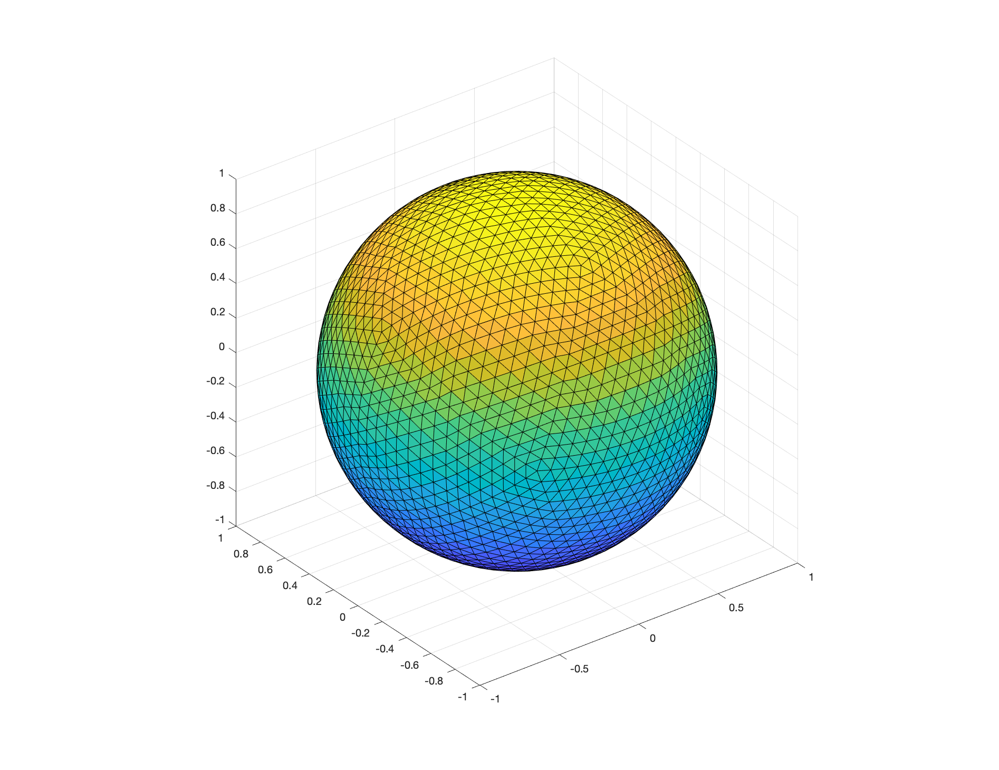
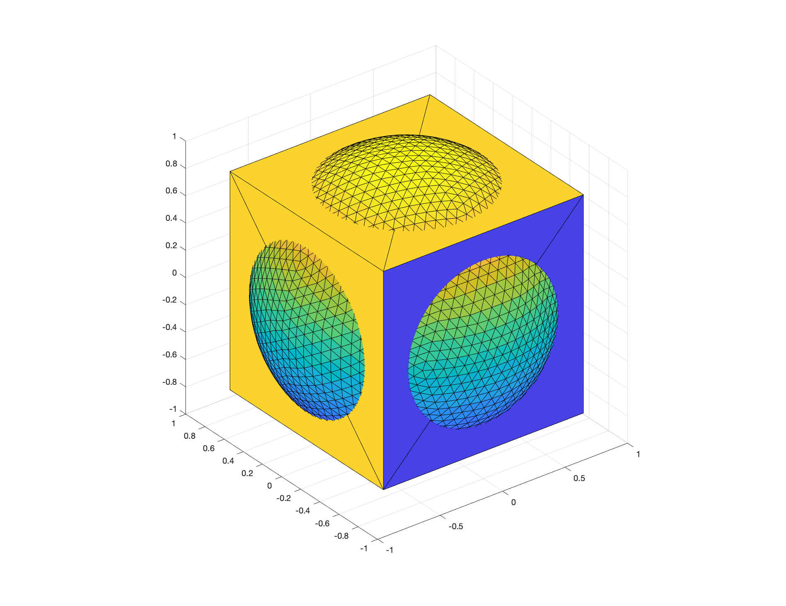
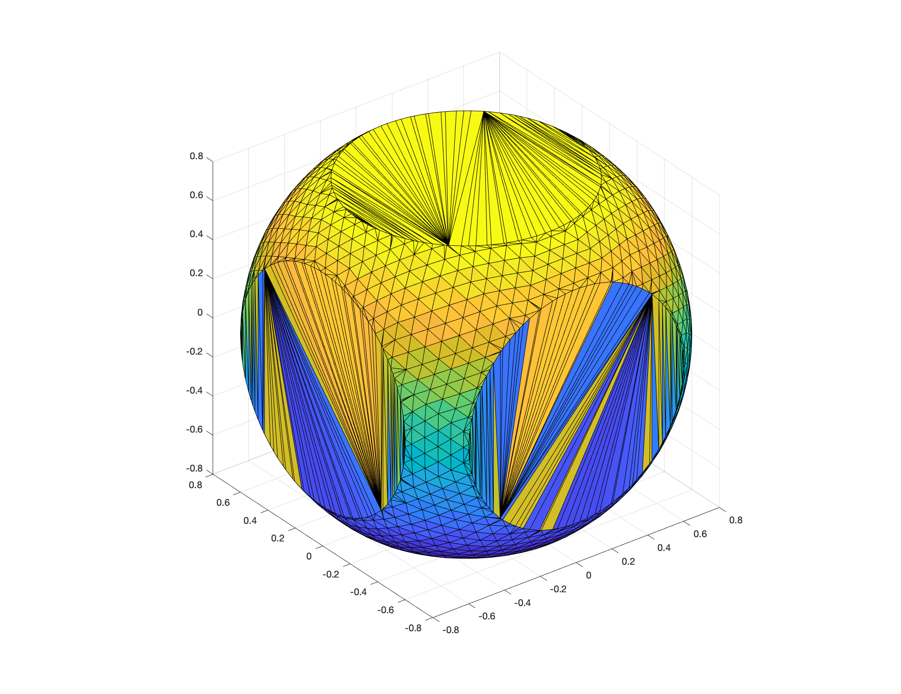
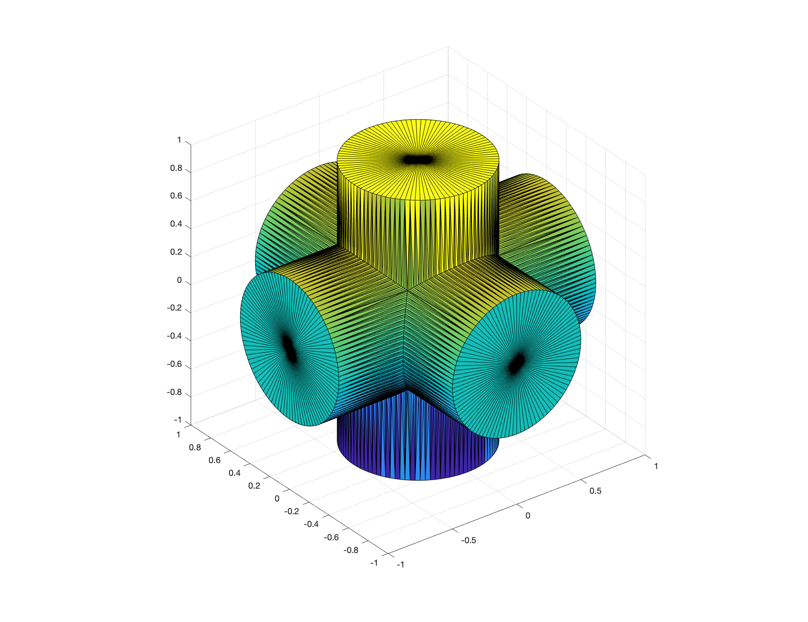
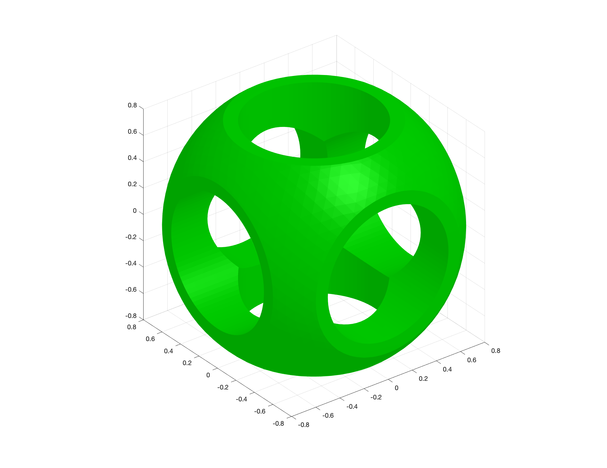

# Mesh Booleans

In [tutorial 203](../203_basic_mesh_modeling.md), we covered the basics of simple 3D modeling using `gptoolbox`. There is still a fundamental tool, though, that can only speak about now that we have covered `mex`, and that is the use of mesh booleans or Constructive Solid Geometry ( [CSG](https://en.wikipedia.org/wiki/Constructive_solid_geometry)).

The concept is simple: we can create arbitrarily complex shapes by combining set operations of much simpler primitive shapes, like cylinders, spheres and cubes. In `gptoolbox`, we do this by using the function `mesh_booleans`.

Let's begin with a simple sphere...
```MATLAB
[V1,F1] = subdivided_sphere(4);
tsurf(F1,V1); axis equal;
```


...and a cube
```MATLAB
[Vcube,Fcube] = cube(2,2,2);
```
which we can center at the origin and rescale
```MATLAB
Vcube = 1.6.*Vcube;
Vcube = Vcube - 0.8.*[1 1 1];
```
so that it has an interesting intersection with the sphere:
```MATLAB
tsurf(F1,V1); axis equal;
hold on
tsurf(Fcube,Vcube);
hold off
```


We can compute precisely that **exact** intersection with a call to `mesh_boolean` (this requires installing `mex`):
```MATLAB
[W,H] = mesh_boolean(V1,F1,Vcube,Fcube,'intersection');
tsurf(H,W); axis equal;
```


Great! Let's make this shape even more interesting by generating the union of three cylinders rotated in different directions
```MATLAB
[V2,F2] = cylinder_mesh(0.5,100,'Caps',true);
V2(:,3) = 2.*V2(:,3);
V2(:,3) = V2(:,3) - 1;
V3 = V2*[1 0 0;0 0 1;0 -1 0];
F3 = F2;
V4 = V3*[0 1 0;-1 0 0;0 0 1];
F4 = F3;
[Vcylinders,Fcylinders] = mesh_boolean({V2,V3,V4},{F2,F3,F4},'union');
tsurf(Fcylinders,Vcylinders);axis equal;
```

and let's deduct these from the cube-sphere intersection:
```MATLAB
[V,F] = mesh_boolean(W,H,Vcylinders,Fcylinders,'minus');
tsurf(F,V,fsoft,falpha(1,0),'FaceColor', [0 0.8 0])
axis equal
camlight
```

In very few lines of code, we've managed to create a relatively interesting shape with high genus in which to test our algorithms. Furthermore, we've done it proceduraly, which means we can happily tweak the radii and refinement level of every step to generate many variations of this shape. Now, why don't you go over to the `exercise/` directory and try to do an example of your own?
