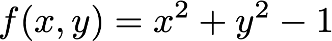
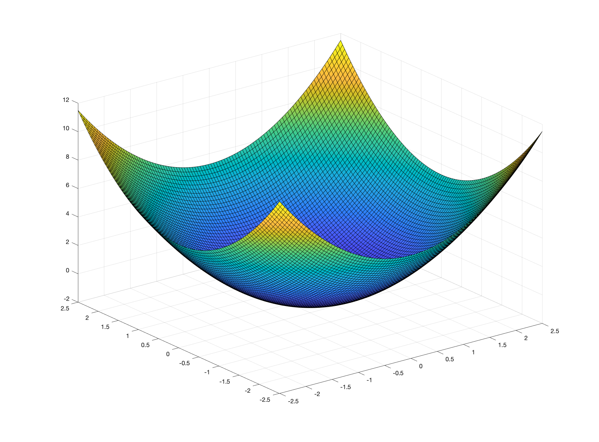

# Implicit Surfaces

`gptoolbox` does not include a lot of functionality for dealing with implicit representations; however, this is partly because MATLAB's native commands already do a lot of the work! So we will not be using `gptoolbox` for this tutorial item.

As we saw in the lecture, implicit surfaces are nothing but functions. For example, the following function describes a circumference:



We can define MATLAB functions in two ways. One you've already seen:
```MATLAB
function I = sphere_fun(P)
    I = P(:,1).^2 + P(:,2).^2 + P(:,3).^2 - 1;
end
```
We can either make this function into its own file and then call it in other scripts or from the command line, or use it inside a script by defining at the end (MATLAB can be a little weird about this):
```MATLAB
point =  [0.2 0.2 0.2];
value = sphere_fun(point);

function I = sphere_fun(P)
    I = P(:,1).^2 + P(:,2).^2 + P(:,3).^2 - 1;
end
```
If saved as a script and executed, the above will run without issues. However, it can be a little cumbersome to have to go through all that syntax just to define a very simple scalar function. That's why MATLAB also supports defining _inline_ functions, like this
```MATLAB
>> sphere_fun = @(P)  P(:,1).^2 + P(:,2).^2 + P(:,3).^2 - 1;
```
We can run that command in our command line and then type
```MATLAB
>> point =  [0.2 0.2 0.2];
>> value = sphere_fun(point);
```
and it will run without problems, avoiding having to use scripts and defining functions with the complicated syntax. Still, the complicated syntax (which you'll use in the exercises below) is still the way to go if your function takes many lines to write, but for simple ones like this sphere we can also use the inline one.

Technically, we've already constructed an implicit representation, so we could call it a day here. However, how would we know if it's the right one? How can we see the shape it's representing? Ironically, to do this we'll need to transform it into a mesh. First, let us construct a grid of 3D space:
```MATLAB
>> x = linspace(-2.5,2.5,100); % Create 100 points between -2.5 and 2.5
>> y = x; % y covers the same range
>> z = x; % z covers the same range
>> [X,Y,Z] = meshgrid(x,y,z); % Create grid arrays x,y,z
```
Then, we must evaluate our implicit function at every point in the grid (note the concatenating and reshaping, which can be a little annoying)
```
>> points = [X(:) Y(:) Z(:)]; % Concatenate values to create a huuuge column vector of positions
>> values = sphere_fun(points); % Evaluate our function at the grid points
>> values_array = reshape(values,size(X)); % Get the values in the same format as X,Y,Z
```
At this point we have a grid defined by `X,Y,Z` and the values of our implicit function at each point of the grid `values_array`. From here, we can reconstruct the zero level-set of our implicit function using MATLAB's own function `isosurface`

```MATLAB
>> FV = isosurface(X,Y,Z,values_array,0.0) % The last argument is the isolevel we want
```
You can recover the mesh in the format we are used to by accessing `FV.vertices` and `FV.faces`.

```MATLAB
>> tsurf(FV.faces,FV.vertices);axis equal;
```


The same logic as above applies to 2D example, which are often easier to visualize. For example, 
```
>> disk_fun = @(P)  sqrt(P(:,1).^2 + P(:,2).^2) - 1;
>> x = linspace(-2.5,2.5,100); % Create 100 points between -2.5 and 2.5
>> y = x; % y covers the same range
>> [X,Y] = meshgrid(x,y); % Create grid arrays x,y
>> points = [X(:) Y(:)]; % Concatenate values to create a huuuge column vector of positions
>> values = disk_fun(points); % Evaluate our function at the grid points
>> values_array = reshape(values,size(X)); % Get the values in the same format as X,Y
```
will create a grid in `X,Y` and values in `values_array`. 2D's MATLAB equivalent of `isosurface` is `contour`. Calling it similarly
```MATLAB
>> [c,h] = contour(X,Y,values_array,[0 0],'LineWidth',3); % [0 0] tells it to look for the 0 level-set.
```
will produce a circumference:


In the case of 2D implicit representation, we can also visualize them as full functions by using the third coordinate to store the implicit function values:
```
>> surf(X,Y,values_array)
```



A particularly nice way I like to look at implicit functions (specifically SDF plots) is as follows
```
>> surf(X,Y,values_array,fphong,'EdgeColor','none'); % Edges are distracting if grid is fine
>> view([0 90]); % Look straight from above
>> num_lines = 100; % How many elements in colormap
>> CM = flipud(cbrewer('RdYlBu',num_lines+1)); % I like this colormap
>> CM((num_lines/2)+2:end,:) = cbrewer('Reds',num_lines/2); % Make it become redder as the function is bigger
>> CM(1:(num_lines/2),:) = flipud(cbrewer('Blues',num_lines/2)); % Make it become bluer as the function is smaller
>> CM((num_lines/2)+1,:) = [0,0,0]; % Make it be zero on the zero levelset
>> CM(1:2:end,:) = 0.9*CM(1:2:end,:); % Add greyed out lines every two lines so that we see other levelsets
>> colormap(CM)
>> caxis([-max(abs(values_array(:))) max(abs(values_array(:))) ]); % Important so center of colormap is at zero
```


## Exercises

In [the previous tutorial item](../206_mesh_booleans/206_mesh_booleans.md), we created a complex 3D shape via boolean operations of simpler shapes, in mesh format. As an exercise, you will now create exactly the same shape in implicit format:

1. Write functions `exercise/sphere_implicit.m`, `exercise/cylinder_implicit.m` and `exercise/cube_implicit.m` that return, for any set of points in 3D space, implicit functions describing each of the three shapes, respectively. Note that the functions defined above for spheres and disks are only _one_ possible implicit representation of these shapes (they are not an SDF, for example).

2. Use the functions you wrote in step 1 to write `exercise/complex_implicit.m`, which returns the implicit function value of the shape we constructed in [206](../206_mesh_booleans/206_mesh_booleans.md) using `min` and `max` functions. In your matlab console you can set up a grid and use MATLAB's `isosurface` function to evaluate that you've done it correctly.

Pss! Your new friend Íñigo Quílez does a great service to the world by keeping a [list of common SDFs](https://www.iquilezles.org/www/articles/distfunctions/distfunctions.htm) on his website. I think the exercise is more fun if you _don't_ look at this list until step 3, but if you get stuck on step 1 feel free to take a look :)

3. Go nuts! Channel your inner Íñigo to create a complex implicit shape of your choosing using the website linked in the paragraph above in `exercise/make_inigo_proud.m`. Make it change with time! You are completely free to do anything that looks cool here :)
