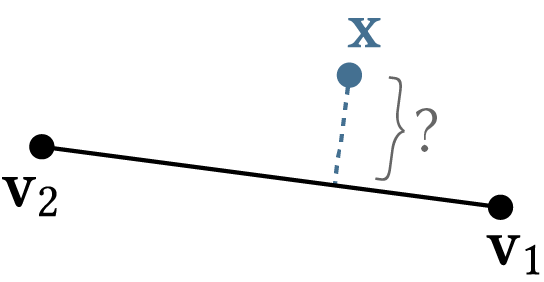

# An introduction to level of detail

Welcome! Here are the exercises that accompany the lecture presented this morning about level of detail (LOD). In case you missed the lecture, here are the [slides](). Don't hesitate to ask questions!


These exercises involve a combination of writing and coding exercises. To run the coding exercises, make sure you have Python 3 installed, and run
```
python3 lod.py --i=[path/to/input/shape]
```
where `[path/to/input/shape]` indicates the filepath to one of the shapes in the `../data/` directory.

You may be prompted to install required libraries, like `numpy` or `polyscope`. In that case, run 
```
pip install [package-name]
```
If you have any difficulty at all, reach out immediately and we would be happy to help!

If you get stuck on any exercise, either try to skip ahead to exercises that you can do without needing the answer to the exercise you're stuck on, or wait until we go over the solutions together.

If you are able to execute the program succesfully, a GUI should appear. At first, clicking in the buttons in the menu will do nothing. But they will do something interesting once you've completed the exercises below -- keep reading to find out...

**Some advice:** Don't worry about writing the most optimized code: get it right, then optimize later if needed!

Table of contents:
- [Ramer-Douglas-Peucker curve simplification](#ramer-douglas-peucker-curve-simplification)
- [Quadric error simplification of curves](#quadric-error-simplification-of-curves)
- [Quadric error simplification of surfaces](#quadric-error-simplification-of-surfaces)
- [Adaptive integration](#adaptive-integration)

These first few exercises will focus on _geometric_ level of detail, but remember that the philosopy of level of detail extends much more broadly: even geometric level of detail models are usually aimed at saving memory, compute, etc. in downstream tasks, and level of detail is about the fundamental tradeoff between accuracy and performance.

## Ramer-Douglas-Peucker curve simplification

Curvature is an important quantity to consider for geometric simplification: in particular, the _fundamental theorem of plane curves_ states that the shape of a plane curve is entirely determined by its curvature and speed of parameterization. For discrete curves -- that is, polylines -- this means that the shape of every polyline is uniquely determined by its discrete curvature and edge lengths.

So a reasonable approach to simplifying curves is to preserve the curvature of the original curve somehow. Clearly, if we're going to change the curve, we can't always preserve the curvature at every point along the curve. Naturally, this leads us to ask at which points is curvature worth preserving, and at which points it might not be so important. Intuitively, we might feel that we should preserve the "larger" curvatures more than the smaller ones. But there might be points at which the curvature is high, as defined by the second derivative of the curve's unit-speed parameterization, but actually represent a relatively small "bump" of the curve taken as a whole.

<p align="center">

</p>

Somehow we want to preserve prominent "features" of the curve, which correspond to points of large curvature, but also take into account the scale of the curve itself. One way we might do that is to imagine simplifying the curve all the way down to a straight line segment, and asking ourselves, "What is the single most important point that contributes most to the curve's shape?" A reasonable answer is the one that is furthest away from the line segment, because this characterizes the most deviation the curve has from a straight line.

<p align="center">

</p>

Having identified the most important point, we assume it should be preserved throughout simplification. Now we can form the straight-line approximations between this point and each of the endpoints, and ask the same question about each of these two sub-curves.

<p align="center">

</p>

This leads to the following recursive algorithm for simplifying a curve defined by points $\mathbf{v}_1, \mathbf{v}_1,\dots, \mathbf{v}_n$:
* Find the point $\mathbf{v}_i$ that is farthest away from the line segment connecting $\mathbf{v}_1$ and $\mathbf{v}_n$.
* If $\mathbf{v}_i$ is less than some threshold $\varepsilon$ to the line segment, this means that all points on the curve are within $\varepsilon$ of a straight-line approximation. Delete any points that we haven't explicitly decided to keep, and terminate.
	* Otherwise, recurse on the two sub-curves defined by $\mathbf{v}_1, \dots, \mathbf{v}_i$ and $\mathbf{v}_i, \dots, \mathbf{v}_n$.

This algorithm for curve simplification sometimes goes by the name _Ramer-Douglas-Peucker (RDP)_. Hopefully you see how a series of relatively few, but very reasonable, assumptions led us to a very reasonable algorithm. Given that curvature by definition measures deviation from a straight line, we see why the RDP algorithm might be good at preserving perceptually prominent features of the curve -- we are intentionally preserving the parts of the curve that "stick out".

**Exercise:** Given a point $\mathbf{x}\in \mathbb{R}^2$, derive an expression for the distance between $\mathbf{x}$ and its closest point on the line segment defined by endpoints $\mathbf{v}_1, \mathbf{v}_2\in\mathbb{R}^2$.

<p align="center">

</p>

Use your answer to implement the function `point_to_line_segment_distance` in `src/curves.py`.

**Exercise:** Implement the RDP algorithm by implmenting the recursive function `rdp_simplify_curve` in `src/curves.py`. Try out your algorithm on `../data/open-curve_*.l` to make sure your implementation works as expected. 

Now try your algorithm on the other curve examples. Are there any examples for which your algorithm works better or worse? If so, why do you think that is?

<!-- **Question:** Based on your experience, how would you change the RDP algorithm we described, to an algorithm that can work on the curves that you noticed didn't get simplified well?  -->

## Quadric error simplification of curves

In the RDP simplification algorithm, we chose points in the curve to preserve, which is equivalent to choosing points to delete. In turn, choosing points to delete is a special case of choosing edges in the curve to collapse. So more generally, a way you might simplify curves is by collapsing edges according to some error metric; collapsing edges greedily, using the so-called _quadric error metric_, yields the _quadric error simplification_ algorithm.

The _quadric error metric_ $Q: \mathbb{R}^d\to \mathbb{R}$ measures the distance from a point $\mathbf{x}\in\mathbb{R}^d$ to a set of $(d-1)$-dimensional hyperplanes. (When $d=2$, that means we measure the distance to a set of 1D lines.) Convince yourself that the distance from $\mathbf{x}$ to a plane with unit normal $\mathbf{n}$ is $\langle\mathbf{n}, \mathbf{x}-\mathbf{p}\rangle$, where $\mathbf{p}$ is any point on the plane:

<p align="center">

</p>

The quadric error of a point $\mathbf{x}$ with respect to a set of $k$ planes is then the sum of squared distances $Q(\mathbf{x}) = \sum_{i=1}^k \langle\mathbf{n}_i, \mathbf{x} - \mathbf{p}_i\rangle^2$. (Note that because we are measuring _squared_ distances, we could actually use either the positive _or_ negative normal of a hyperplane.)

**Exercise:** Given a line (or line segment) in $\mathbb{R}^2$ with tangent direction $\mathbf{t}\in\mathbb{R}^2$, what is an expression for the unit normal vector $\mathbf{n}$ to the line? In $\mathbb{R}^2$, the unit normal is usually defined as the 90-degree clockwise rotation of the tangent direction. What about if we wanted to rotate 90 degrees in the counter-clockwise direction?

<p align="center">

</p>

**Exercise:** Write $Q(\mathbf{x})$ in matrix form $Q(\mathbf{x}) = \mathbf{x}^T\mathbf{A}\mathbf{x} + \mathbf{b}^T\mathbf{x} + c$ for some $d\times d$ matrix $\mathbf{A}$, $d$-dimensional vector $\mathbf{b}$, and scalar value $c\in\mathbb{R}$.

The quadric error simplification algorithm minimizes the quadric error of vertices with respect to their adjacent faces. Take a moment to convince yourself that every vertex of the original mesh is always the global minimum of its quadric error w.r.t. its adjacent faces, since it is the unique point of intersection of all their respective planes.

<p align="center">

</p>

But when we collapse an edge and merge the edge's two vertices, we want to compute a new location for the merged vertex such that the new position minimizes the sum of squared distances to the union of planes.

Now we will derive how to actually minimize the quadric error.

**Exercise:** Assume we have a 1D quadratic function $f:\mathbb{R}\to\mathbb{R}$ defined by $f(x) = ax^2 + bx + c$. Solve for the $x$ which locally extremizes $f$ by setting the first derivative of $f(x)$, with respect to $x$, to 0. Under what conditions is $f$ guaranteed to have one global minimum?

**Exercise:** Now let $f:\mathbb{R}^d\to\mathbb{R}$ be a $d$-dimensional function defined by $f(\mathbf{x}) = \mathbf{x}^T\mathbf{A}\mathbf{x} + \mathbf{b}^T\mathbf{x} + c$, where $\mathbf{x}, \mathbf{b}\in\mathbb{R}^d$ are $d$-dimensional vectors, and $\mathbf{A}\in\mathbb{R}^{d\times d}$ is a $d\times d$ matrix. Show that setting the derivative of $f(\mathbf{x})$ w.r.t. $\mathbf{x}$ equal to 0 yields the linear system of equations $(\mathbf{A} + \mathbf{A}^T)\mathbf{x} + \mathbf{b} = \mathbf{0}$.

You can do this, for example, by writing $\mathbf{x}$, etc. in coordinates $\mathbf{x} = (x_1,x_2,\dots,x_d)$ so that $\mathbf{b}^T\mathbf{x} = \sum_{i=1}^d b_ix_i$, etc.

**Exercise:** If the matrix $\mathbf{A}$ is _positive definite_, meaning $\mathbf{x}^T\mathbf{A}\mathbf{x} > 0$ for any $\mathbf{x} \neq 0$, then $f(\mathbf{x}) = \mathbf{x}^T\mathbf{A}\mathbf{x} + \mathbf{b}^T\mathbf{x} + c$ has a global minimum. In addition, notice that if $\mathbf{A}$ is symmetric, we can simplify the derivative of $f$ to $2\mathbf{A}\mathbf{x} + \mathbf{b}$. Show or argue why the $d\times d$ matrix you derived above for the quadric error is symmetric positive (semi)definite.

**Question:** In the last exercise, we showed that minimizing quadric error involves solving a linear system like $\mathbf{A}\mathbf{x} = \frac{1}{2}\mathbf{b}$. But what happens if the matrix $\mathbf{A}$ is non-invertible (equivalently, $\mathbf{A}$ is singular)? What is the geometric significance of this?

<p align="center">

</p>

If you recall from linear algebra, when $\mathbf{A}$ is singular, this is equivalent to saying that its null space (kernel) is nonempty, meaning that there is no unique solution: the space of solutions is a subspace of dimension $d - {\rm rank}(\mathbf{A})$. This poses problems for ordinary methods of solving linear systems. We could, for example, use singular-value decomposition. Or we can also choose to pick a point that minimizes the _least-square residual_, which can be done in NumPy using the `numpy.linalg.lstsq` function.

**Question:** Can you think of any reason why we choose to minimize squared distance, rather than just distance?

**Exercise:** We can actually further simplify the expressions we've derived so far, by using _homogeneous coordinates_. In a nutshell, $d$-dimensional positions can be written using homogeneous coordinates in dimension $(d+1$), that is, we represent the position $\mathbf{x}=(x_1,\dots,x_d)\in\mathbb{R}^d$ as the $(d+1)$-dimensional vector $(x_1,\dots,x_d,1)$.

Observe that using homogeneous coordinates, the signed distance of $\mathbf{x}$ to a plane with normal $\mathbf{n}$, passing through point $\mathbf{p}$, can be written as the single inner product $\langle \mathbf{u}, \mathbf{x} \rangle$, where $\mathbf{u} := (\mathbf{n}, -\mathbf{n}^T\mathbf{p})$ (take a moment to convince yourself this is true!)

Show that using homogeneous coordinates, the quadric error w.r.t. a set of planes can be expressed using a single $(d+1)\times (d+1)$ matrix $\mathbf{K}$. That is, for any point $\mathbf{x}$ expressed in homogeneous coordinates, $Q(\mathbf{x}) = \mathbf{x}^T \mathbf{K} \mathbf{x}$.

This result is nice because it means we can store a single $(d+1)\times(d+1)$ quadric error matrix at each vertex. 

We now have all the ingredients to implement the quadric error simplification algorith, which proceeds as follows:
* Compute the $(d+1)\times (d+1)$ quadric error matrix $\mathbf{K}_i$ for each vertex $i$.
* Until the target number of vertices is reached:
	* Find the edge $ij$ with the smallest cost of collapsing to its optimal point $x$. Collapse $ij$ to $x$.
	* Assign the quadric at the new vertex (with location $x$) to $\mathbf{K} = \mathbf{K}_i + \mathbf{K}_j$.
	* Update the cost of each edge touching the new vertex.

**Exercise:** Implement the functions `all_quadrics`, `collapse_cost`, and `optimal_collapse_location` in the file `src/curves.py` needed for each step of the quadric error simplification algorithm. Afterwards, you should be able to test your implementation on the curve files `data/*.l`.

The main QES algorithm is already implemented in the function `quadric_error_simplify_curves` to save you time on finicky curve processing steps... but you'll get a chance to implement the algorithm in full for surface meshes below!

**Exercise:** Every time you implement an algorithm, you should think about how to evaluate how well it works. In this case, we might want to measure how "close" the simplified curve remains to the original curve.

There are several ways one might measure the geometric similarity between two curves. For instance, one reasonable choice of measuring approximation error is to measure an average squared distance between the approximate and the original curve, for example

$$E(C, C') = \frac{1}{|X| + |X'|}\left(\sum_{\mathbf{v}\in X} {\rm dist}^2(\mathbf{v}, C') + \sum_{\mathbf{v}'\in X'}{\rm dist}^2(\mathbf{v}', C)\right)$$

where $X$ and $X'$ are sets of points sampled on the curves $C$ and $C'$, respectively, and ${\rm dist}(\mathbf{v},C) := \min_{\mathbf{p}\in C} \|\mathbf{v}-\mathbf{p}\|$ is the minimum distance from the point $\mathbf{v}$ to any edge of $C$. For example, a reasonable choice of $X$ and $X'$ are the vertex sets of the respective curves. There are, of course, other choices of curve similarity measures, each with their own qualities. You could also measure the [_Hausdorff distance_](https://en.wikipedia.org/wiki/Hausdorff_distance)

$$H(C, C') = \max \left\lbrace\sup_{\mathbf{v}\in C} {\rm dist}(\mathbf{v}, C'), \sup_{\mathbf{v}'\in C'} {\rm dist}(\mathbf{v}', C)\right\rbrace$$

or the [_Fréchet distance_](https://en.wikipedia.org/wiki/Fr%C3%A9chet_distance), which is known to be a more accurate measure of dissimilarity between curves than either of the above options:

$$F(C, C') = \inf_{\gamma: [0,1]\to \mathbb{R}^2, \gamma': [0,1]\to \mathbb{R}^2} \max_{t\in[0,1]} \left\lbrace {\rm dist}\left(\gamma(t), \gamma'(t)\right) \right\rbrace $$

where the $\inf$ is taken over all possible parameterizations $\gamma: [0,1]\to \mathbb{R}^2$, $\gamma': [0,1]\to \mathbb{R}^2$ of the curves $C$ and $C'$.

<p align="center">

<figcaption styles="text-align: center;">This animation shows the maximum distance between two curves (blue and green) for a particular set of curve parameterizations; the Fréchet distance then takes the infimum (minimum) of this maximum distance over all parameterizations of the two curves.</figcaption>
</p>

**Question:** What are some weaknesses of the above error measures with respect to each other? Can you think of examples of two curves that may be very different, but have a low Hausdorff distance or average squared distance?

For convenience, we'll compute _discrete Frechet distance_, which only considers distances between vertices of two polygonal curves, rather than distance between any two points on each curve. The algorithm for discrete Frechet distance is described in Sections 1, 2, and 3 of this [paper](https://web.archive.org/web/20250321183913/https://www.kr.tuwien.ac.at/staff/eiter/et-archive/files/cdtr9464.pdf). Use this to implement the function `discrete_frechet_distance` in `curves.py`. 

Use this to make plots (perhaps using matplotlib) of approximation error vs. vertex count for both RDP and QES. I could also try making a [log-log plot](https://en.wikipedia.org/wiki/Log%E2%80%93log_plot), meaning each axis is scaled logarithmically -- this is useful because the slope of each line can give you an idea of each method's order of convergence, it helps visually disentangle trend lines which may be hard to tell if the y-axis spans a large range.

## Curve simplification wrap-up

**Question:** Based on your experience, 
* Can you think of some disadvantages of the RDP algorithm vs. quadric error simplification for curves? 
* Advantages? Aspects in which the two algorithms are about the same?
* These could relate to anything from computational complexity, to space complexity (memory requirements), to the input parameters allowed by each algorithm, to how faithful each simplified curve remains to the original.

**Question:** Can you think of other criteria which are _not_ well-satisfied by either of these algorithms?

**Question:** So far, we have only considered _planar_ curves: that is, curves restricted to the 2D plane $\mathbb{R}^2$. What, if anything, do we need to change in our curve simplification algorithms if we want to simplify _space_ curves, which are curves in 3D space $\mathbb{R}^3$? 

## Quadric error simplification of surfaces

The quadric error simplification algorithm you derived for curves ($d = 2$) generalizes straightforwardly to triangle meshes ($d = 3$). The only differences are
* We consider distance to plane of each triangle face, instead of distance to edges of a polyline;
* For each vertex quadric, we weight the contribution of each face by its face area.

<p align="center">

</p>

**Exercise:** Given a triangle in $\mathbb{R}^3$ defined by vertex positions $\mathbf{v}_1, \mathbf{v}_2, \mathbf{v}_3 \in \mathbb{R}^3$ given in counter-clockwise order, what is an expression for the "outward-pointing" unit normal vector $\mathbf{n}$ to the triangle? Assume the outward-pointing normal direction is defined by the right-hand rule for the oriented triangle.

<p align="center">

</p>

**Exercise:** If you want compute the _area-weighted_ normal to a triangle face -- that is, the unit normal vector to the face, multiplied by the face's area -- how can you change your answer to the previous question to do so?

Use your answer to implement the function `area_weighted_face_normal` in `src/meshes.py`, so to compute the area and unit normal to a given face, you can simply call `area_weighted_face_normal` once and take a norm after. 

**Exercise:** Implement the rest of the functions in the file `src/meshes.py` needed for each step of the quadric error simplification algorithm: `all_vertex_quadrics`, `cost`, and `edge_collapse_cost`.

Naturally, some of these steps are very similar to their 2D counterparts in `curves.py`. With a bit more code organization, we could re-use some of these functions, and possibly create a more general `QuadricErrorSimplify` class that encompasses both curves and surfaces.

**Exercise**: Finally, implement the function `quadric_error_simplify_mesh`. Feel free to also use the functions `is_face_valid` and `edges_adjacent_to_vertex`. Implementing the algorithm should be possible using just the algorithm description and the functions you've just implemented, but you can also look at `quadric_error_simplify_curves` for inspiration.

Test your implementation by trying the quadric error simplification on `../data/bunny_small.obj`. When you feel confident in your implementation, try simplifying some larger meshes in `data/` (these will take longer to simplify).

**Question:** So far we only considered meshes _without_ boundary. What do you think we should do about meshes _with_ boundary? For example, do you think we should preserve the position of the boundary at all costs, or does it ever make sense to allow the boundary to move around? Based on your answer, how might you update your algorithm to handle meshes with boundary?

**Question:** What, if anything, does the the quadric error simplification algorithm guarantee anything in terms of mesh properties? Do you think it is possible for the mesh to end up with self-intersections, or become non-manifold? Why or why not? If it is possible, how might you alleviate some of those problems?

## Adaptive integration

This exercise is a simple demonstration of the concept of level of detail beyond purely geometric fidelity. In particular, we will explore adaptive (numerical) integration! Integrating various physical quantities over different objects is very common in the simulation of physical systems, and evaluating the integral exactly is not easy for arbitrary geometry.

In this problem, we consider the 1D line integral over a curve $\gamma: [0,1]\to \mathbb{R}^2$

$$\int_0^1 \mathbf{E}(\gamma(t))\cdot \gamma'(t) \ dt$$

where $\mathbf{x} = (x_1,x_2)$, and

$$\mathbf{E}(\mathbf{x}) = \left(\exp\left(-(x_1^2+x_2^2)\right), \sin(x_1)\right).$$ 

This integral corresponds to evaluating an electric field over the curve $\gamma$, which is equal to the work done moving a charge along a curve in the (spatially-varying) electric field $\mathbf{E}(\mathbf{x})$.

<p align="center">

</p>

For simplicity, we will only consider the smooth curve 

$$\gamma(t) = (2\pi t - \pi, \sin(2\pi t))$$

and aim to add quadrature points only where integration error is high. For this particular $\gamma$, the integral to evaluate becomes

$$\int_0^1 (\exp(-(t^2 + \sin^2(t))), \sin(t)) \cdot ( 2\pi, 2\pi\cos(2\pi t)) \ dt  = 2\pi\int_0^1 \exp(-(t^2 + \sin^2(t))) + \sin(t)\cos(2\pi t) \ dt$$

In general, given a discrete approximation of $\gamma$ with vertices $\mathbf{v}_1, \mathbf{v}_2,\dots,\mathbf{v}_n$, we can approximate the above integral using the trapezoid rule as

<!-- (Need to backslash some of the underscores to prevent Markdown from treating them like italics.) -->
$$\int_0^1 \mathbf{E}(\gamma(t))\cdot \gamma'(t) \ dt \approx \sum_{i=1}^{n-1} \widetilde{I}(t_i,t\_{i+1})$$

where for our problem, 

$$\widetilde{I}(t_i,t\_{i+1}) = \frac{1}{2} \left(\mathbf{E}(\mathbf{v}_i) + \mathbf{E}(\mathbf{v}\_{i+1})\right) \cdot \left(\mathbf{v}\_{i+1} - \mathbf{v}\_{i}\right)$$

and $t_i$ is the parameter value of the curve corresponding to the i-th sample of the curve.

**Exercise**: A known error bound for approximating the integral $\int_a^b f(t)\ dt$ of a smooth function $f(t)$ using the trapezoid rule is $\frac{(b-a)^3}{12} \max_{t\in[a,b]} |f''(t)|$. That means 

$$\left| \widetilde{I}(t\_i,t\_{i+1})  - I(t\_i,t\_{i+1}) \right| \leq \frac{(t\_{i+1}-t\_i)^3}{12} \max\_{t\in[t\_i,t\_{i+1}]} |g''(t)|$$

where $I(t\_i,t\_{i+1}) := 2\pi \int\_{t\_i}^{t\_{i+1}} (\exp(-(t^2 + \sin^2(t))) + \sin(t)\cos(2\pi t)) \ dt$ is the true value of the integral, $g(t) := 2\pi (\exp(-(t^2 + \sin^2(t))) + \sin(t)\cos(2\pi t))$

<!-- For simplicity, we can use $\max_{t\in[t_i,t\_{i+1}]} |f''(t)| \leq  \max_{t\in[0,1]} |f''(t)| \approx 1.50386$ (with the tradeoff of now having a looser bound.) -->

Using this fact, propose an algorithm for sampling the curve $\gamma(t)$, given a "sampling budget" of $n$ vertices (meaning $n-1$ intervals). Alternatively, you could have your algorithm take as input an error threshold, and output the positions of the minimal number of samples needed to achieve an integration error under the given error. Your algorithm doesn't have to be perfect, or be the best algorithm, just something sensible!

**Exercise**: Implement the function `adaptive_integration()` in `curves.py`, and test your implementation by executing `python3 lod.py` and clicking "Adaptive integration" in the GUI. 

Notice how the different levels of detail do _not_ correspond to the geometry of the curve: in this case, "detail" means how well we are able to resolve the value of the integral. (But, you may realize that there still can be a geometric interpretation: We are sampling the curve according to the curvature of $g(t)$!)

<!-- **Exercise**: Make plots of integration error vs. the number of vertices for both the method implemented in this section, and for one of the previous curve simplification algorithms (either RDP or QES). You should notice that although RDP and QES excel at preserving the visual and geometric fidelity of the curve, achieving very low geometric error even with few vertices allocated, their LODs are not very efficient for this problem. -->

<!-- ## Hierarchical physics simulation
mass-spring system? -->

## Extra credit

Based on the foundations you've developed in these exercises, you can think about how you might address the following challenges:
* Other types of "detail" include view-dependent effects, or perceptual impact. We didn't really discuss the latter, but these effects can be very important depending on the application. In fact, historically the term "level of detail" specifically refers to the view-dependent methods used in rendering. How might you take view dependence into account?
* So far we've only considered "discrete" level of detail: we simplified curves or meshes into several simplified stages, but simply swapping out one LOD for another often leads to abrupt visual changes known as popping" artifacts. How would you implement continuous LOD that achieves smooth interpolation between different LODs?

# References and further reading
* Eiter & Mannila 1994, _Computing Discrete Fréchet Distance_
* Garland & Heckbert 1997, _Surface Simplification Using Quadric Error Metrics_. And beyond triangle meshes, the ideas behind quadric error simplification has been extended to quad meshes, point clouds, and more! 
* Hoppe 1996, _Progressive Meshes_
