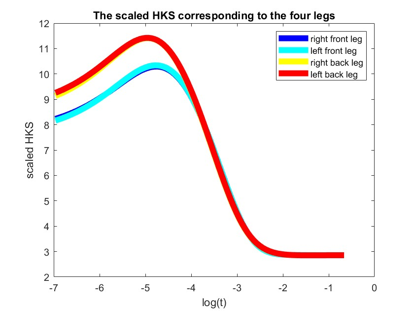
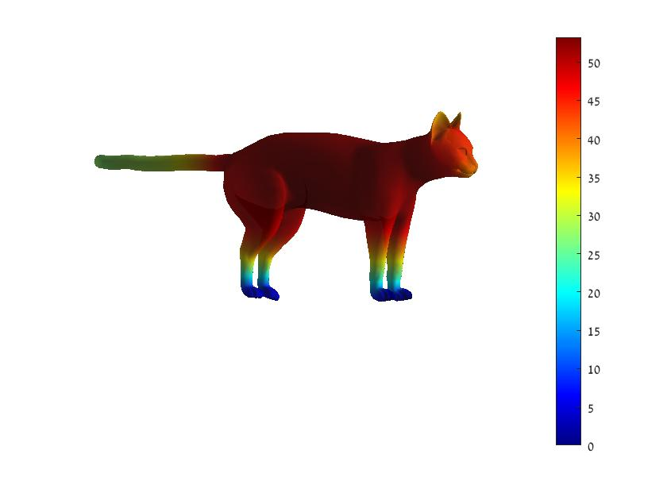

# Heat Kernel Signature (HKS)

In this section, we will use the heat kernel signature (HKS), 
suggested by Sun et al. their his paper ["A Concise and Provably Informative Multi-Scale SignatureBased on Heat Diffusion"](http://www.lix.polytechnique.fr/~maks/papers/hks.pdf)
to compute the correspondence between different shapes.

## The heat equation
The heat equation 
describes the way heat diffuses on a surface throughout time.

Assuming an initial heat distribution ), the heat distiribution at time t is given by:

=\int_M%20k_t%20(x,y)u(y,0)dy)

where ) is the heat kernel that describes the amount of heat transferred from point x to point y in time t.


## Heat Kernel Signature (HKS)


The HKS is based on the heat kernel, and describes the amount of heat that remains in a point x after time t (assuming a unit heat at x at t=0).

%20=%20k_t%20(x,x)%20)


The parameter t determines the amount of time the heat propagates. 
For small values of t, the HKS is effected only by a small neighborhood of the point and captures mostly local information,
whereas for large values of t, it contains global information.
Since we use different values of t, we get a multi-scale descriptor for each point.


In this excersice, use the function `hks` from `gptoolbox` to computes the heat kernel signature.
Complete the script `visualizeHKS` to display the HKS on a few meshes for a small fixed time t.


In the `data\` folder you can find various meshes, some from the [Sumner data-set](https://people.csail.mit.edu/sumner/research/deftransfer/data.html) 
and the [SHREC07 data-set](https://engineering.purdue.edu/PRECISE/shrec), and cameras in the `data\cams\` folder.

You should get an image like this:


Image from: "A Concise and Provably Informative Multi-Scale SignatureBased on Heat Diffusion", Sun et al. 2009, Figure 3.


Notice the relation between the HKS and Gaussian curvature. In areas with positive Gaussian curvature, the HKS has high values, meaning more heat remains in these areas,
whereas in areas with negative Gaussian curvature, the HKS has lower values, meaning more heat spreads from these areas.

 

## Matching points using the HKS:

To compute matching points, we need to compute the distance between two signatures. To facilitate this comparison for all t, we use a scaled version of the HKS, where for each t the HKS is normalized. 
Complete the first section of the script script `HKS_matching` and plot the HKS vs log(t) for the given landmarks.

For exmaple, for the cat, looking at the scaled HKS of the four legs, we get:


The 
chosen landmarks




The scaled HKS

You can see that for small t, the descriptors are similar. For larger time values, we see distinct differences and for very large values of t, the heat in all the points stays constant.


In addition, for a few landmarks on a few meshes, compute all the matching points on the shape
(points for which the distance between their HKS and the landmarks' HKS is smaller than some threshold).
Repeat this experiment for different t ranges.
Notice you don't need to recompute the HKS for each time range. You can compute it once and only use the needed range.


For the cat, for example, the distances from the right front leg to the rest of the vertices are:




Notice that the other feet are closest.


You can use the `MESH_VIS` class to display your results*.
Notice the `landmarks` option that enables you to display the landmarks on the mesh. 
You can also use the `MESH_VIS.selectLandmark` function to choose your own landmarks.


## Shape correspondence using the HKS:

Use the scaled HKS to compute matching points between different shapes.
Complete the script `HKS_shape_correspondence` to do so and visualize your results.
Notice the quality of the results when comparing between isometric or near isometric shape vs non-isometric shapes.

In your data folder, you have different shapes. The cats and lions from the [Sumner data-set](https://people.csail.mit.edu/sumner/research/deftransfer/data.html). 
Notice that the `cat-XX` shapes are near-isometric and have the same triangulation. `cat-XX_r` are still near-isometric to the `cat-XX` shapes but have a different triangulation.
The `lion-XX` shapes are non-isometric to the `cat-XX` shapes.
We added the remeshed shapes (different triangulation) since the results on shapes with the same triangulations can be biased (check for yourselves!).

You can use the `MESH_VIS` class to display your results*.


 
 
## A comment on visualization
 
Note that you can use Matlab's function `subplot` to show a few graphs in the same figure.
You can also use the given `MESH_VIS` class to display your results.
Use `MESH_VIS.mesh(F,V)` with additional inputs (according to the function documentation) to display the mesh.

For example, the option `caxis` enables you to control the colormap limits of the displayed function. 
When comparing different functions on the mesh (for example, the eigenfunctions), it is useful to set all the colorbars to the same limits.

In addition, for your convenience, you also have better initial camera positions saved at `data\cam\`. To
 use them, call `MESH_VIS` with the argument `cam` and the path to the correct camera file.
This will display the mesh with the saved camera and give you a better initial view of the mesh. 

Try calling the function with and without the cam input to see the differences.
```
[V, F] = readOFF('..\data\cat-00.off');
MESH_VIS.mesh(F,V); % does not use the saved cam
MESH_VIS.mesh(F,V,'cam','..\data\cams\cat-00_cam.mat'); % uses the saved cam
```

