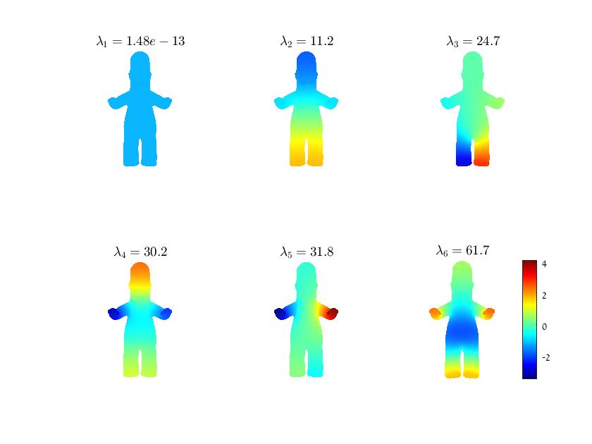
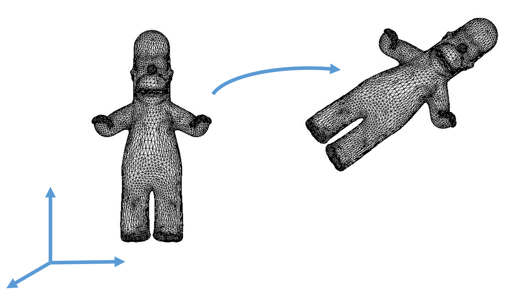
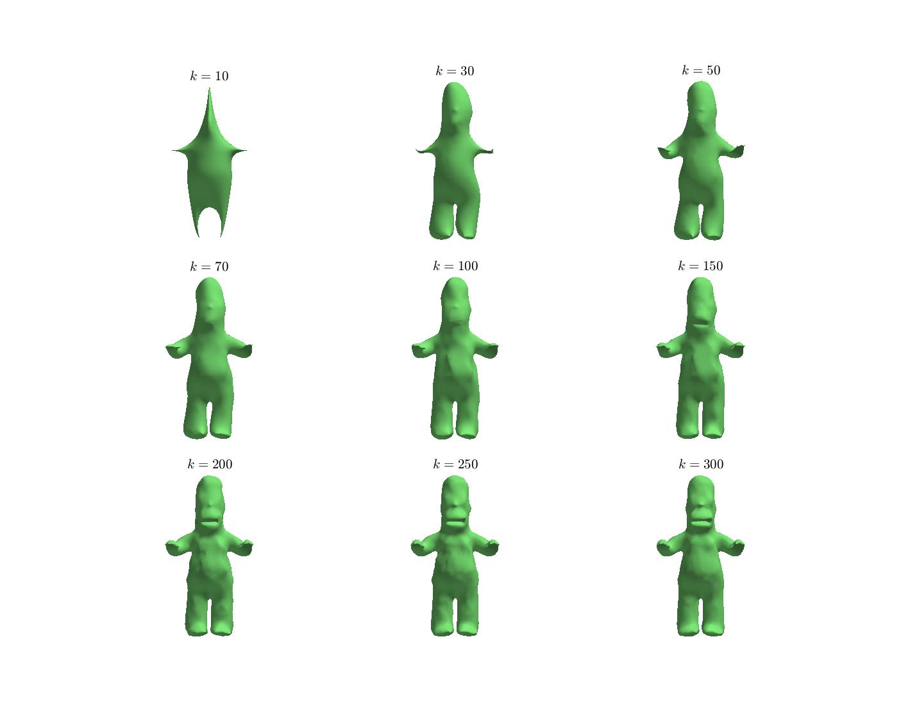

# laplacian_eigs

Based on the the cot_laplace_demo code from the course [Computing and Processing Correspondences
with Functional Maps](http://www.lix.polytechnique.fr/~maks/fmaps_SIG17_course/publications.html) by Ovsjanikov et al. 2012

# Laplacian Eigendecomposition
In this section, we want to compute and examine the eigenvalues and eigenfunctions of the cotangent laplacian operator.

As mentioned in [exercise 013]( https://github.com/odedstein/sgi-introduction-course/tree/main/013_laplacian), 
the laplacian is a differential operator who plays many roles in geometry processing. 


The laplacian has many interesting properties. One of which is isometry-invariance, which means that if we deform the mesh in a way that preserves 
distances on it, the laplacian, and as a result the eigenvalues and eigenfunctions will remain the same.
Yet, there are a few problems with eigenfunctions as well.
First, the eigenfunctions are only defined up to a sign flip, or in the case of multiplicity of eigenvalues, up to rotations of eigenspace.
Furthermore, in the case of close eigenvalues, even small deformations can make the eigenfunctions switch.  
And for non-isometric shapes, the eigenfunctions can differ greatly.


## Task 1


In this task, you will compute and visualize the eigenvalues and eigenfunctions.

You can use the laplacian you computed in [exercise 013]( https://github.com/odedstein/sgi-introduction-course/tree/main/013_laplacian) 
(or the matching function from gptoolbox), and Matlab's eigendecomposition, which you saw in 
[exercise 103]( https://github.com/odedstein/sgi-introduction-course/tree/main/103_eigs) to solve the generalized eigenvalue problem: 


where

 is the cotangent laplacian matrix

 - is a mass matrix

) - are the eigenvalue and eigenfunctions of the laplacian


and compute the first k eigenvalues and eigenfunctions of the laplacian.

Complete the function `lap_eig` and the first section of the script `laplacian_eigs` and visualize the first 6 eigenfunctions of the laplacains for a few meshes.
You should get something like this:



Notice that the first eigenvalue is 0 and the corresponding eigenfunction is constant. The rest of the eigenfunctions have higher frequencies as we continue.

*Note [a comment on the visualization below](#A-comment-on-visualization).


## Task 2

In this task, we want to see that the eigenfunctions do not change under rigid transformations, i.e., translations and rotations.



We can implement translations by adding a constant vector to all the vertices of the mesh.
For example:

```MATLAB
>> V_new = V + [0,0,1];
```
will move the mesh up in the z-axis.

Rotations can be implemented by multiplying the matrix V by [rotation matrices]{https://en.wikipedia.org/wiki/Rotation_matrix#In_three_dimensions}.
For example:

```MATLAB
>> V_new = rotMat*V; % rotMat is 3x3, assuming V is 3x|V|
```


Complete the second section of the script `laplacian_eigs` by translating and rotating the mesh, and recompute the eigen decomoposition of the new mesh.
The new spectrum should be the same as the old one (up to sign flips!).

*Note [a comment on the visualization below](#A-comment-on-visualization).


## Task 3

Next, we will take two near-isometric shape, `cat-00` and `cat-01` and two non-isometric shapes `cat-00` and `lion-02` 
from the [Sumner data-set](https://people.csail.mit.edu/sumner/research/deftransfer/data.html)
and compute their eigendecompotision.

Try to think how the these spectrum should look. Then, complete the third section of the script `laplacian_eigs` to compare the eigenfunctions and eigenvalues of both pairs.

 
*Note [a comment on the visualization below](#A-comment-on-visualization).
 
 
 
## A comment on visualization
 
Note that you can use Matlab's function `subplot` to show a few graphs in the same figure.
You can also use the given `MESH_VIS` class to display your results.
Use `MESH_VIS.mesh(F,V)` with additional inputs (according to the function documentation) to display the mesh.

For example, the option `caxis` enables you to control the colormap limits of the displayed function. 
When comparing different functions on the mesh (for example, the eigenfunctions), it is useful to set all the colorbars to the same limits.

In addition, for your convenience, you also have better initial camera positions saved at `data\cam\`. To
 use them, call `MESH_VIS` with the argument `cam` and the path to the correct camera file.
This will display the mesh with the saved camera and give you a better initial view of the mesh. 

Try calling the function with and without the cam input to see the differences.
```
[V, F] = readOFF('..\data\cat-00.off');
MESH_VIS.mesh(F,V); % does not use the saved cam
MESH_VIS.mesh(F,V,'cam','..\data\cams\cat-00_cam.mat'); % uses the saved cam
```


## Global Point Signature (GPS)

Based on the laplacian eigendecomposition, Rustamov proposed in 2007 a shape descriptor called [GPS](http://www.cs.jhu.edu/~misha/Fall07/Papers/Rustamov07.pdf).
This descriptor associated each vertex on the mesh a vector containing the scaled eigenfunctions of the laplacian at the vertex.

=\left(\frac{1}{\sqrt{\lambda_1}}\phi_1(p),\frac{1}{\sqrt{\lambda_2}}\phi_2(p),\frac{1}{\sqrt{\lambda_3}}\phi_3(p),..\right))


Note that here ) corresponds to the second eigenvalue and 
eigenfunction of the laplacian since .

An interesting property of the GPS is that if the surface has no self-intersections, neither will the GPS.
That means that for such a surface, the signatures are unique.
This shape descriptor is also isometry invariant since it is defined only using the eigenvalues and eigenfunction of the laplacian, 
but it does suffer from the same drawbacks as the eigenfunctions, i.e., sign flip and switching, which makes it harder to find the correspondene using this descriptor.


Complete the function `GlobalPointSignature` and the script 'GPS_based_segmentation` to compute segmentation based on the GPS.
We compute the segmentation using the k-means algorithm. 
If you are not familiar with this algorithm, it is completely fine, you can think of it as a black-box algorithm for 
clustering points such that each point belongs to the cluster with the closest mean.
We compute distances between points according to the distance between their GPS.


## Optional: Representation using a reduced basis: 


The eigenfunctions form a  basis similar to the Fourier basis from signal processing.
Eigenfunctions correspondings to higher eigenvalues represent higher frequencies.
Functions on the mesh can be represented as a linear combination of the eigenfunction.
Using a truncated basis will filter out higher frequencies as only the lower frequencies can be represented using the lower frequency functions.


In this section, we will represent the mesh coordinate functions using this basis and then reconstruct the mesh back, 
to investigate the approximation using a reduced smooth basis.
Projecting the mesh coordinates onto a truncated basis will smooth the mesh as higher frequencies' detail will be filtered out.

To this end, you will compute bases for functions of different sizes k and then, 
you will project the coordinate functions onto this basis and back and look at the reconstruction error.

Use your function `lap_eig` to compute the eigendecomposition of W to  eigenvectors. 
We denote the matrix containg these eigenvectors as coloumns by 
.

Note that these basis functions are orthonormal with respect to the mass matrix, i.e., .

Take the three coordinate functions  and project them onto  and back: 
this can be achieved simply by computing ),
where the parentheses are important. 

Visualize the mesh whose vertices are .
Repeat the process for various k, e.g., spanned linearly between 10 to 300 with jumps of 20.

Tip: you can precompute B for the highest k and take only some of its vectors for each computation.


You should receive a similar figure:



You can also reconstruct the mesh using different weights for different frequencies, or a band of frequencies. Try it!
