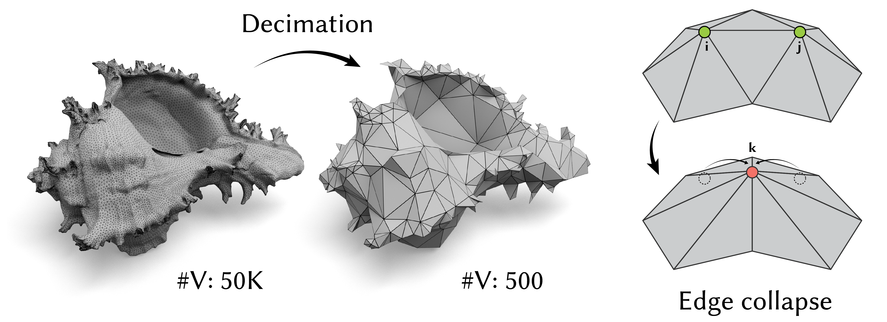
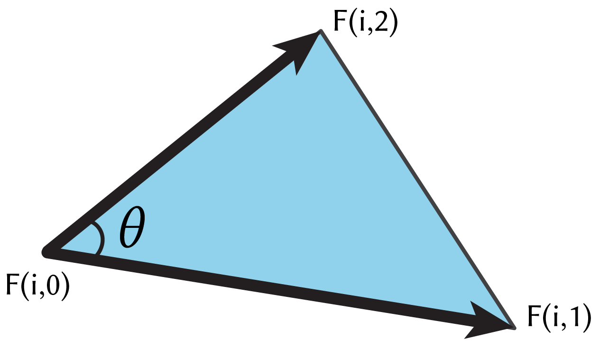
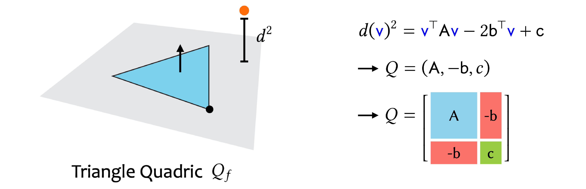
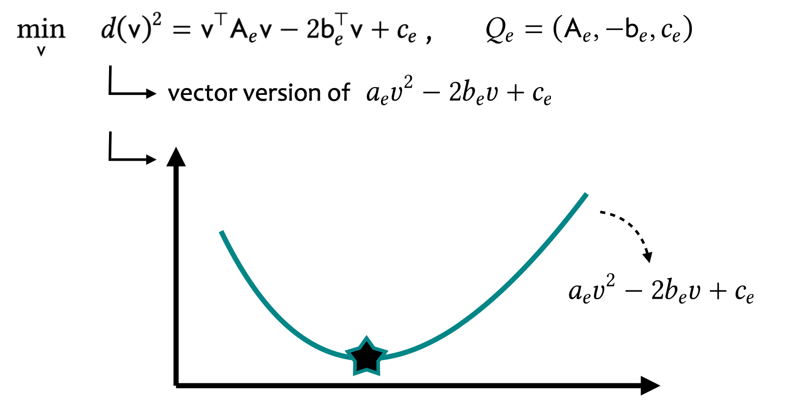

# Mesh Simplification

Mesh simplification, or mesh decimation, effectively reduces the complexity of 3D objects while aiming to preserve their visual fidelity. This process is crucial in interactive graphics, enabling the delivery of high-quality content under the constraints of limited computational budgets, such as those necessary for real-time frame rates. Although there are alternative methods and metrics that can achieve similar goals or possess more advanced features, in this exercise, we will focus on implementing a few core functionalities from [Surface Simplification Using Quadric Error Metrics](https://www.cs.cmu.edu/~./garland/Papers/quadrics.pdf) that are still broadly utilized to deepen our understanding.

From a high-level perspective, we achieve this by iteratively collapsing each edge, prioritized by a quadric error metric. This metric is designed to approximate the original surface as closely as possible, as we introduced in the first part of the lecture.

The full implementation relies on the [half-edge data structure](https://cs184.eecs.berkeley.edu/sp24/docs/half-edge-intro), which is beyond the scope of this lecture. We encourage students who are interested in this topic to learn about it independently and explore the starter code provided.

## Task 1: Triangle Areas

In the lecture, we discussed three types of quadrics: triangle quadrics, vertex quadrics, and edge quadrics. Since vertex quadrics and edge quadrics are essentially a weighted sum of triangle quadric errors, our first step is to calculate the areas of all triangles using the input vertices $V$ and faces $F$. This calculation is typically performed using the vector product.

Fill in the missing part in `face_area.py`.

## Task 2: Triangle Face Quadrics

Our next step is to compute the initial triangle quadrics for all the faces in the mesh before decimation begins. As we covered in the lecture, this process first involves computing the normal of each triangle face and then forming the triplets $(A, b, c)$ for each quadric $Q$. Note that we output a three-dimensional tensor $Q_f$ with dimensions $|F|$ by 4 by 4. For the convenience of computation, we store each quadric in a 4 by 4 matrix using the format shown below, rather than using a separate data structure to represent the triplet.

Fill in the missing part in `triangle_quadrics.py`.

## Task 3: Optimal Location and Its Cost

After obtaining the edge quadric for every edge in the mesh, we can proceed to iteratively collapse the edge with the samllest edge quadric error $E_{e}(x^\*)$, where **$x^\*$** represents the optimal location for the new vertex after the edge collapse. Let $Q_{e} = (A_{e}, -b_{e}, c_{e})$, the optimal location $x^*$ can be determined by solving a linear system derived from setting $\nabla E_{e} = 0$:

$$
A_{e} x^\* = b_{e}
$$

Fill in the missing part in `optimal_location_and_cost.py`.

