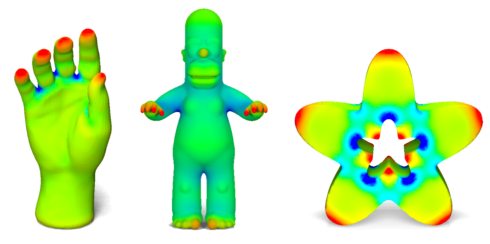
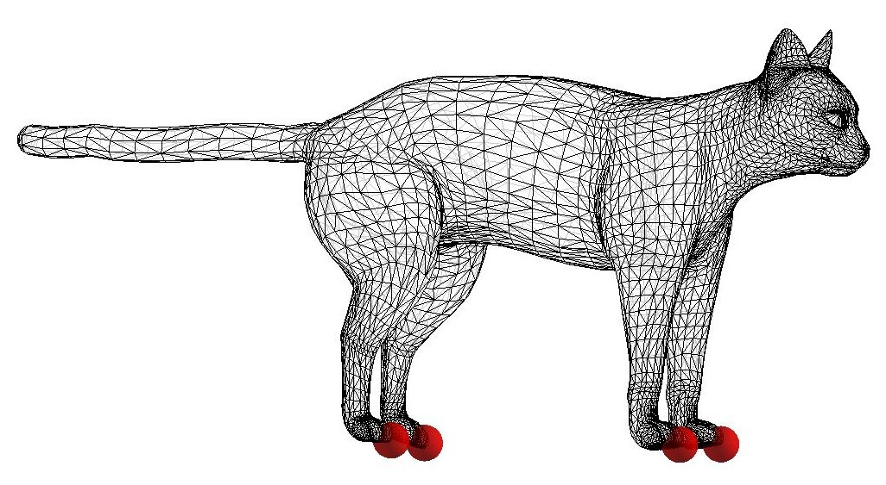
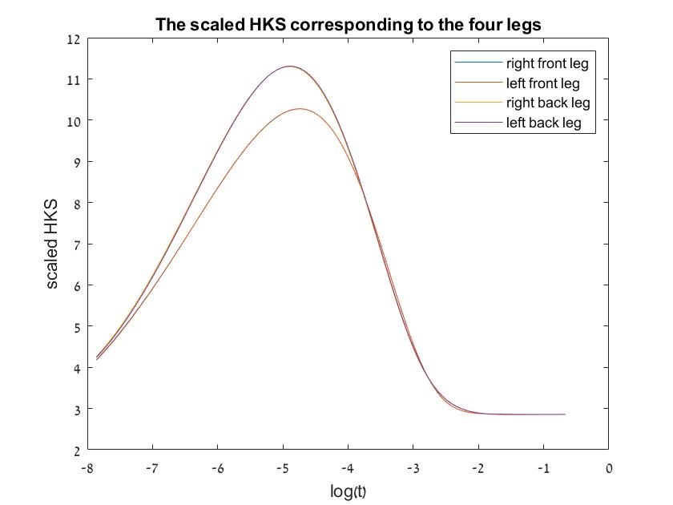

# Heat Kernel Signature (HKS)

In this section, we will compute the heat kernel signature (HKS), 
suggested by Sun et al. their his paper ["A Concise and Provably Informative Multi-Scale SignatureBased on Heat Diffusion"](http://www.lix.polytechnique.fr/~maks/papers/hks.pdf), 
for different shapes and use it to compute shape correspondence.

## The heat equation
The heat equation 
describes the way heat diffuses on a surface throughtout time.

Assuming an initial heat distribution ), the heat distiribution at time t is given by:

=\int_M%20k_t%20(x,y)u(y,0)dy)

where ) is the heat kernel that describes the amount of heat transferred from point x to point y in time t.

The heat kernel can be expressed using the eigendecomposition of the laplacian, using the following formula:

%20=%20\sum_i%20e^{-\lambda_it}%20\phi_i(x)\phi_i(y))

where

 - are points on the surface

) - are the eigenvalue and eigenfunctions of the laplacian

 - the time value

## Heat Kernel Signature (HKS)

The HKS is based on the heat kernel, and describes the amount of heat that remains in a point x after time t (assuming a unit heat at x at t=0).

%20=%20k_t%20(x,x)%20=%20\sum_i%20e^{-\lambda_it}%20\phi_i(x)^2)

and in our discrete setting:

=\left(\sum_i%20e^{-\lambda_it_1}%20\phi_i(p)^2,\sum_i%20e^{-\lambda_it_2}%20\phi_i(p)^2,...\right))

where

 - is a vertex on the mesh

) - are the eigenvalue and eigenfunctions of the laplacian

) - are the time values the HKS is evaluated at

The parameter t determines the amount of time the heat propagates. 
For small values of t, the HKS is effected only by a small neighborhood of the point and captures mostly local information,
whereas for large values of t, it contains global information.
Since we use different values of t, we get a multi-scale descriptor for each point.

Complete the function `heatKernelSignature` to compute the heat kernel signature, and the script `visualizeHKS` to display the HKS on a few meshes for a small fixed time t.

You can use the `MESH_VIS` class to display your results.

In the `data\` folder you can find various meshes, some from the [Sumner data-set](https://people.csail.mit.edu/sumner/research/deftransfer/data.html) 
or the [SHREC07 data-set](https://engineering.purdue.edu/PRECISE/shrec), and cameras in the `data\cams\` folder.

You should get an image like this:

Image from: "A Concise and Provably Informative Multi-Scale SignatureBased on Heat Diffusion", Sun et al. 2009, Figure 3.

Notice the relation between the HKS and Gaussian curvature. In areas with positive Gaussian curvature, the HKS has high values, meaning more heat is remains in these areas,
whereas in areas with negative Gaussian curvature, the HKS has lower values, meaning more heat spreads from these areas.

You can also compare your solution with gptoolbox's `hks` to see whether you have computed the correct solution.

**Bonus task:** try to implement the heat kernel signature only using matrix multiplication, without any loops.

 

## Matching points using the HKS:

To compute matching points, we need to compute the distance between two signatures. To facilitate this comparison for all t, we compute a scaled version of the HKS. 
The scaled HKS is given by:

=\frac{k_t(x,x)}{\int_Mk_t(x,x)dx})

i.e dx=1).

In our discrete setting, dx) can be computed by: 

.

The difference between two HKS at the scale  
can be computed as the L2-norm of the difference between the HKS computed for this time range.

* Modify the function `heatKernelSignature` to output the scaled HKS as well.

* Complete the first section of the script `HKS_matching` to create a graph showing the HKS vs log(t) for the given landmarks.

For exmaple, for the cat, looking at the scaled HKS of the four leg, we get:

The chosen landmarks

You can see that for small t, the descriptors are similar. For larger t, we see distinct diffrences and for very large values of t, the heat in all the point stays constant.

In addition, for a few landmarks on a few meshes, compute all the matching points on the shape
(points for which the distance between their HKS and the landmarks' HKS is under a small threshold).
Repeat this experiment for different t ranges.
Notice you don't need to recompute the HKS for each time range, only use a part of the precomputed HKS.

For the cat, for example, the distance from the right front leg, to the rest of the vertices is:

Notice that the other feet are closest.

You can use the `MESH_VIS` class to display your results.
Notice the `landmarks` option that enables you to display the landmarks on the mesh. 
You can also use the `MESH_VIS.selectLandmark` function to choose you own landmarks.

## Comparison to GPS:

Try repeating the last section using the GPS you computed in [exercise 301]( https://github.com/odedstein/sgi-introduction-course/tree/main/301_cot_lap_eigendecomposition), instead of the HKS.

Notice that the HKS is not sensitive to the eigenfunctions issue discussed in 
[exercise 301]( https://github.com/odedstein/sgi-introduction-course/tree/main/301_cot_lap_eigendecomposition), 
such as sign flips and eigenfunctions switches.

## Shape correspondence using the HKS:

Use the scaled HKS to compute matching points between different shapes.
Complete the second part of the `HKS_matching` to do so and visualize your results.
Notice the quality of the results when comparing between isometric or near isometric shape vs non-isometric shapes.

In your data folder, you have different shapes. The cats and lions from the [Sumner data-set](https://people.csail.mit.edu/sumner/research/deftransfer/data.html). 
Notice that the `cat-XX` shapes are near-isometric and have the same triangulation. `cat-XX_r' are still near-isometric to the `cat-XX` shapes but have a different triangulation.
The `lion-XX` shapes are non-isometric to the `cat-XX` shapes.
We added the remeshed shapes (different triangulation) since the results on shapes with the same triangulations can be biased (check for yourselves!).

