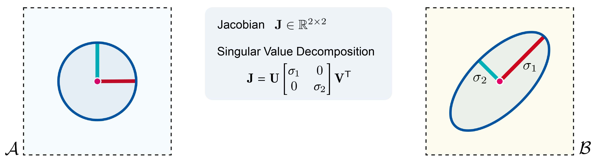
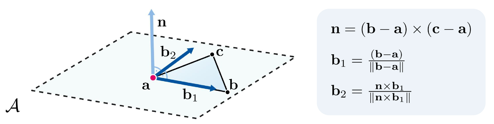
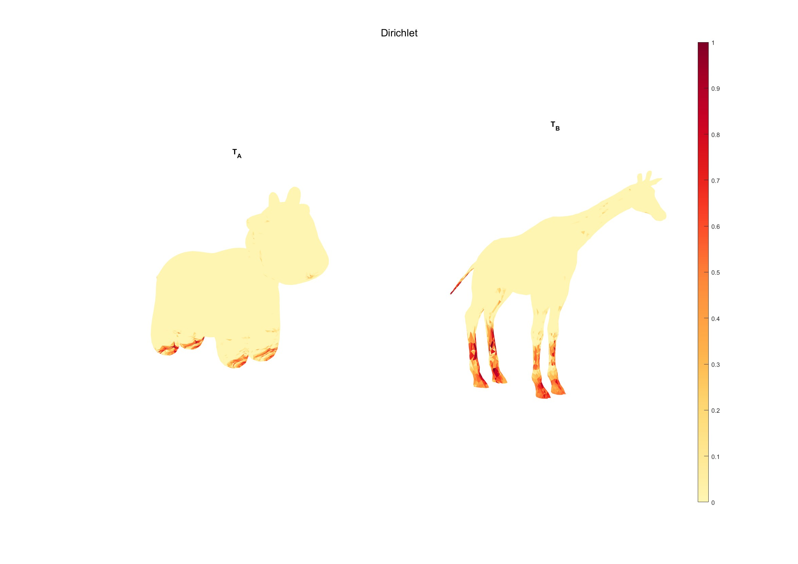
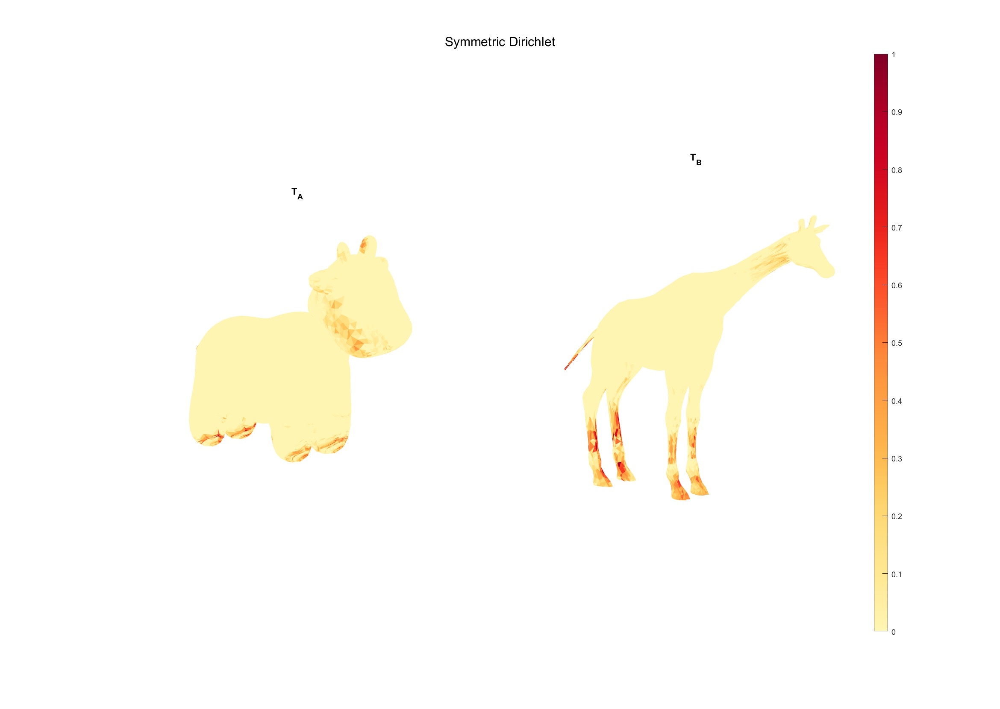
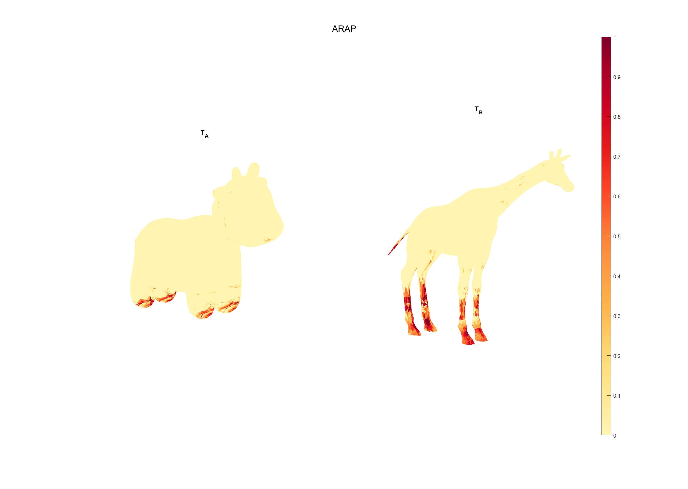

# Measuring Mapping Distortion

In this exercise, we will compute and visualize different distortion energies between two meshes.
For simplicity both meshes share the same triangulation.

## The Map Jacobian and its Singular Values

Given are two input meshes $T_A$ and $T_B$ with the same set of vertices and triangles.
This already defines a map between $T_A$ and $T_B$ via linear interpolation inside triangles.
Most distortion measures take a first-order perspective on maps, i.e., they are based on the per-triangle Jacobian $\mathbf J$ which tells us how tangent vectors change when going from $T_A$ to $T_B$.
For each triangle $t$ we set up local 2D bases for its two instances on $T_A$ and $T_B$.
The Jacobian can then be expressed as a 2-by-2 matrix $\mathbf J \in \mathbb R^{2 \times 2}$.
Multiplying a tangent vector $\mathbf v \in \mathbb R^2$ of $T_A$ with this matrix gives us its image $\mathbf J \mathbf v \in \mathbb R^2$ on $T_B$.

To investigate how all possible tangent vectors are mapped, we can imagine a circle in the tangent space of $T_A$ and its image (an ellipse) on $T_B$.
The minor and major radii of the ellipse (corresponding to the directions of minimum and maximum stretch) can be computed as the singular values $\sigma_1$ and $\sigma_2$ of $\mathbf J$.

## Distortion Energies

If $\sigma_1 = \sigma_2 = 1$, the map is isometric within triangle $t$, i.e., it has no length (and area) distortion.
Many per-triangle distortion energies measure the deviation from this ideal case in different ways.

The **Dirichlet energy**

$$ \frac{1}{2} \left(\sigma_1^2 + \sigma_2^2\right)$$

is a popular measure for map smoothness. Because minimizing this energy favors infinite shrinking ($\sigma_1=\sigma_2=0$), it is often used when further boundary conditions exist.

The **symmetric Dirichlet energy**

$$ \frac{1}{4} \left(\sigma_1^2 + \sigma_2^2 + \frac{1}{\sigma_1^2} + \frac{1}{\sigma_2^2}\right) $$

is minimal in the isometric case $\sigma_1=\sigma_2=1$. It also tends towards infinity if a triangle degenerates to a point or a line.

Another popular distortion measure is the **as-rigid-as-possible energy**

$$\left(\sigma_1-1\right)^2 + \left(\sigma_2-1\right)^2,$$

which also targets isometry but stays finite when a triangle degenerates in the target domain.

## Compute the distortion energies
In the `data\` folder you can find various pairs of meshes with the same triangulations, i.e., `T_A.obj` and `T_B.obj`, `cat-00.off` and `cat-01.off`, and more. 

Follow the steps below to compute and visualize the distortion energies between the two meshes using the script `measuring_mapping_distortion.m` found in `exercise/`.

## Task 1: Set up 2D Tangent Space Bases

For each triangle $t=(a,b,c)$ of $T_A$ (analogously for $T_B$), compute an orthonormal basis of its tangent space as a 3-by-2 matrix $\mathbf B=\begin{bmatrix}\mathbf b_1, \mathbf b_2\end{bmatrix}$.
As the first basis vector, use the normalized edge vector from $\mathbf a$ to $\mathbf b$, i.e. $\mathbf b_1 = \frac{(\mathbf b- \mathbf a)}{\|\mathbf b- \mathbf a\|} \in \mathbb R^3$.
As the second basis vector, use a $90\degree$ counter-clockwise rotation of $\mathbf b_1$.
That is, $\mathbf b_2 = \frac{\mathbf n \times \mathbf b_1}{\|\mathbf n \times \mathbf b_1\|} $, where $\mathbf n$ is the normal vector $\mathbf n = (b-a) \times (c-a)$. 

Complete the function `tangent_basis.m` to compute the basis for a single triangle.

## Task 2: Compute Triangle Jacobians

Per triangle, express the edge vectors $\mathbf{ab}$ and $\mathbf{ac}$ of $T_A$ (analogously for $T_B$) in the 2D basis by multiplying with $\mathbf B^{\mathsf T}$ from the left.
Write the resulting vectors as the columns of the matrix $\mathbf M_A \in \mathbb R^{2\times 2}$ (analogously $\mathbf M_B$).

Now, compute the Jacobian $\mathbf J = \mathbf M_B \cdot \mathbf M_A^{-1}$.

Complete the function `edge_vectors_2d.m` to compute the edge vectors in the 2D basis and the function `triangle_jacobian.m` to compute the Jacobian.

## Task 3: Compute Distortion Energies

Compute the singular values $\sigma_1$ and $\sigma_2$ of $\mathbf J$. Hint: Use the Matlab function `svd`.

Then, for each triangle evaluate (1) the Dirichlet energy, (2) the symmetric Dirichlet energy, and (3) the as-rigid-as-possible energy.

You should get an image like this:

Notice the areas with high distortion energies, e.g., the legs.

 
## Task 5: Matlab Loops - Optional Challenge
For simplicity, the script is designed to compute the distortion for each triangle of the meshes using a loop. In general, however, Matlab is not efficient when it comes to executing loops. Instead, it is much faster to "vectorize" in Matlab. Meaning performing operations directly on arrays or matrices, which can be significantly faster due to internal optimizations. For additional practice, you can try implementing all the above steps without using any loops, by computing the bases, Jacobians and distortion energies for all triangles at once using array and matrix operations. Try comparing the execution times of the two implementations. In the data folder you can find the pair `T_A_bulldog_orangutan_high` and `T_B_bulldog_orangutan_high` which have a high number of triangles, so the difference in execution time should be more noticeable.

Hint: Most of Matlab functions are designed to work on arrays and matrices. For example, the `cross` function can compute the cross product of multiple vectors at once, if they are stored in matrices, by specifying the dimension along which to operate. Similarly, functions like `svd` and `inv` can operate on 2D matrices arranged into a multidimensional array using page-wise functions such as `pagesvd` and `pageinv`.