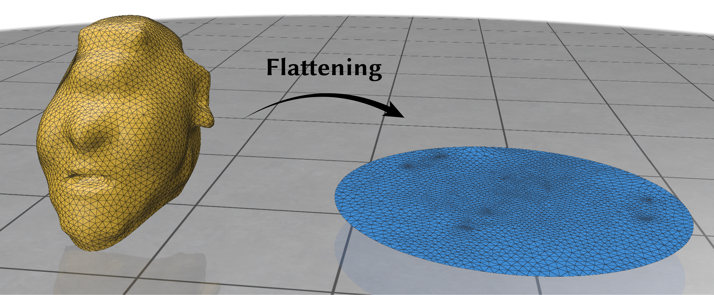
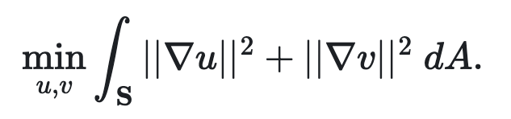
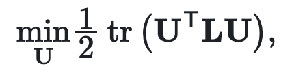

# Minimize Quadratic Energy with Fixed Values

Finding the optimal location by minimizing the quadric involves solving an unconstrained quadratic programming problem. However, in many geometry processing applications—as you have seen or will see during the tutorial week and in your upcoming research projects—it is necessary to solve a quadratic problem with linear constraints. We refer to this as `min_quad_with_fixed`.

This function `min_quad_with_fixed` is designed to minimize quadratic energy with fixed value constraints on certain variables. Specifically, this function addresses the optimization problem in the following form:
```svg
minimize_z  z’ * A * z + z’ * b + c
subject to  z(known) = d,
```
where `A` is a n-by-n symmetric matrix, `b` is an n-dimensional vector, `known` is a k-dimensional integer vector specifying the indices of the constrained variables, and `d` is another k-dimensional vector representing the constrained values. To solve this problem, we can simply execute:
```python
x = min_quad_with_fixed(A,b,known,d)
```
This command will compute and return the optimal solution `x`. 


## Reformulation

Under the hood, `min_quad_with_fixed` solves this quadratic program by reformulating the problem in terms of known and unknown variables `z = [x; y]` where `y = z(known)` are the known variables and `x = z(unknown)` are the rest of the free variables. Specifically,
```svg
E(z) = z’ * A * z + z’ * b + c
     = [x;y]' * A * [x;y] + [x;y]' * b + c
     = [x;0]' * A * [x;0] + [x;0]' * A * [0;y] + 
       [0;y]' * A * [x;0] + [0;y]' * A * [0;y] + 
       [x;0]' * b + [0;y]' * b + c
     = [x;0]' * [A(unknown, unknown), 0; 0 0] * [x;0] + [x;0]' * [0 A(unknown, known); 0 0]  * [0;y] + 
       [0;y]' * [0 0; A(known, unknown) 0] * [x;0]    + [0;y]' * [0 0; 0 A(known, known)] * [0;y]    + 
       [x;0]' * [b(unknown); 0] + [0;y]' * [0; b(known)] + c
     = x' * A(unknown, unknown) * x + x' * A(unknown, known) * y + 
       y' * A(known, unknown) * x + y' * A(known, known) * y + 
       x' * b(unknown) + y' * b(known) + c
     = x' * A(unknown, unknown) * x + x' * A(unknown, known) * y + 
       x' * A(unknown, known) * y + y' * A(known, known) * y + 
       x' * b(unknown) + y' * b(known) + c
     = x' * A(unknown, unknown) * x +
       x' * (A(unknown, known) * y + A(known, unknown)' * y + b(unknown)) +
       y' * A(known, known) * y + y' * b(known) + c
```
Therefore, we can group these terms and re-write the original energy `E(z)` using only the unknown variables as
```svg
E(x) = x' * Anew * x + x’ * bnew + cnew

where
  Anew = A(unknown, unknown)
  bnew = A(unknown, known) * y + A(known, unknown)' * y + b(unknown)
  cnew = y' * A(known, known) * y + y' * b(known) + c
```
Then minimizing this new quadratic energy `E(x)` without any constraint and be easily achieved via a single linear solve. To be more precise, we can obtain the optimal value by setting its derivative to zero as
```svg
dE(x)/dx = 2 * Anew * x + bnew = 0 
=> 2 * Anew * x = -bnew
```
This will result in a linear system with left-hand-side `2*Anew` and right-hand-side `-bnew`.

Fill in the missing part in `min_quad_with_fixed_dense.py.`

## Application: Flatten a Surface

<p>  </p>

As a quick example, a simple application of a constrained quadratic system is flattening a surface embedded in $\mathbb{R}^3$ to the flat plane (i.e. $\mathbb{R}^2$).

This process is often referred to as parameterization, as the two-dimensional coordinate system of the flattened mesh serves as a parameterization of the original 3D surface.

Consider the case where a triangle mesh of an ogre is flattened to the $uv$-plane. Here, the $u$ and $v$ coordinates can be directly interpreted as a parameterization of the surface. Generally, a 3D surface cannot be flattened onto a plane without some distortion; parts of the surface must be stretched while others are compressed. Surfaces with topological features like handles, or those without a boundary, must be cut.

In this context, one of many reasonable approaches to handle parameterization is to model it as an energy minimization problem. This involves reducing the variation in the $u$- and $v$-coordinate functions across the surface $S$:

<p>  </p>

This family energy is called the Dirichelet energy. We may discretize this problem immediately using piecewise linear functions spanned by $u$ and $v$ values at vertices. This corresponds to using the cotangent Laplacian as $L$ in the discrete minimization problem below,

<p>  </p>

where $U \in \mathbb{R}^{n \times 2}$ represents the $uv$ coordinates.

However, without additional constraints, this minimization approach could lead to a trivial solution where all vertices are mapped to a single point, such as $u_i = (0, 0)$ for all $i$. To prevent this, we can fix the mapping of certain vertices. For instance, given that the mesh has a disk topology (a manifold with a single boundary), we can map the boundary to a unit disk.

Experiment by running `main_flattening.py` and adjusting the pinned boundary values to observe how the parameterization varies.


## Additional Reads
In addition to fixed-value constraints (Dirichlet boundary conditions), this quadratic programming framework also supports general equality constraints:
```svg
minimize_z  z’ * A * z + z’ * b + c
subject to  z(known) = d;
            Aeq * z = beq
```
The derivation and implementation for handling `Aeq * z = beq` is left as an optional exercise for those interested.
