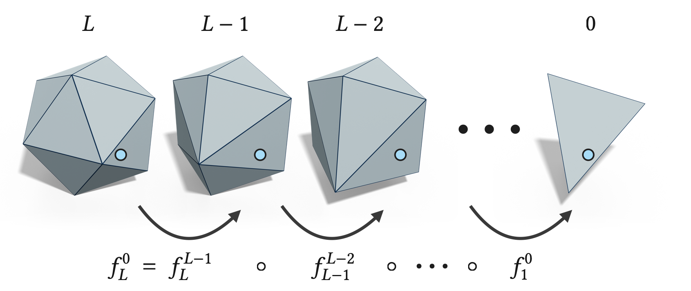
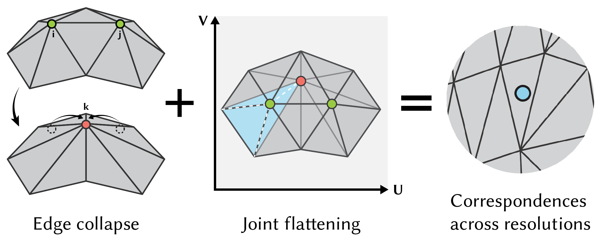
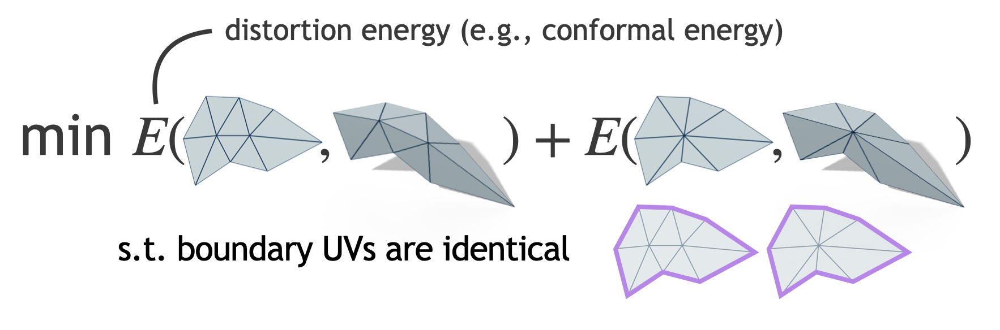
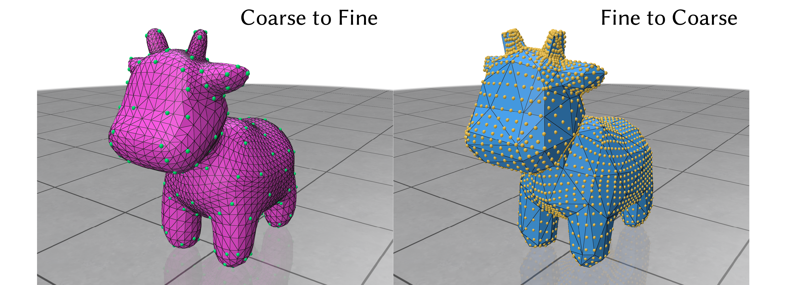

# Successive Self-Parameterization

  

In the second part of the lecture, we introduced the concept of successive self-parameterization to create a bijective map between the original fine mesh and its coarsened counterpart, which is crucial for many downstream applications. The key idea is to successively build a bijective map at each decimation step and then combine all these maps to form the full map. Let $\mathbb{M}^0$ represent the input fine mesh, with or without a boundary, which is progressively simplified into a sequence of meshes $\mathbb{M}^l$ for $0 \leq l \leq L$, until reaching the coarsest mesh $\mathbb{M}^L$. For each pair of meshes $\mathbb{M}^l$ and $\mathbb{M}^{l+1}$, we use $f^l_{l+1}$: $\mathbb{M}^{l} → \mathbb{M}^{l+1}$ to denote the bijective map between them. The main idea is to compute each $f^l_{l+1}$ on-the-fly during the decimation process and then compose all the maps across successive levels to obtain the final map $f^0_L$: $\mathbb{M}^0 \rightarrow \mathbb{M}^L$ as

$$
  f^0_L = f^{L}_{L+1} ∘ \cdots ∘ f^0_1.
$$

Thus, the problem reduces to computing the individual maps $f^l_{l+1}$ before and after each edge collapse.

For each edge collapse, the triangulation remains mostly unchanged except in the neighborhood of the collapsed edge. Therefore, computing $f^l_{l+1}$ only requires determining the mapping within the edge's 1-ring neighborhood. For full details on how this works, we encourage you to refer to the original paper [Surface Multigrid via Intrinsic Prolongation](https://www.dgp.toronto.edu/projects/intrinsic-prolongation/). Here, we only outline the key concepts to help students better understand the algorithm by confirming their understanding through `min_quad_with_fixed` while playing with the demo code.

## Joint Flattening

  

To obtain such a mapping, we compute the shared $UV$-parameterization by jointly minimizing a distortion energy $E$. This energy is defined on the edge 1-ring before the collapse and the vertex 1-ring after the collapse, ensuring consistency along boundaries while minimizing distortion for both patches (before and after). Importantly, our method of joint flattening does not rely on any specific edge collapse algorithm. For example, one could employ [Surface Simplification Using Quadric Error Metrics](https://www.cs.cmu.edu/~./garland/Papers/quadrics.pdf), as extensively discussed in our first lecture. The distortion energy $E$ acts as an additional design variable. Depending on the application, various combinations of decimation strategies and parameterization algorithms can influence performance outcomes differently.

  

This formulation may appear similar to the previous exercise, where our application was to flatten an entire surface into a flat patch with boundary constraints. Indeed, we use almost the same technique, although the distortion energy is now a different [Least Square Conformal Map (LSCM)](https://www.cs.jhu.edu/~misha/Fall09/Levy02.pdf) energy. We encourage students to review the corresponding lines of code to understand it better.

## Bijective Map
After compositing all these local maps, we will eventually obtain a one-to-one correspondence between the fine and coarse meshes. This means that for each vertex position on the fine mesh, we will be able to find its corresponding point on the surface of the coarse mesh, and vice versa. You can visualize this by running `main_coarse_to_fine.py` (which maps coarse mesh vertices onto the fine mesh and visualizes them) and `main_fine_to_coarse.py` (which maps fine mesh vertices onto the coarse mesh and visualizes them).

  

